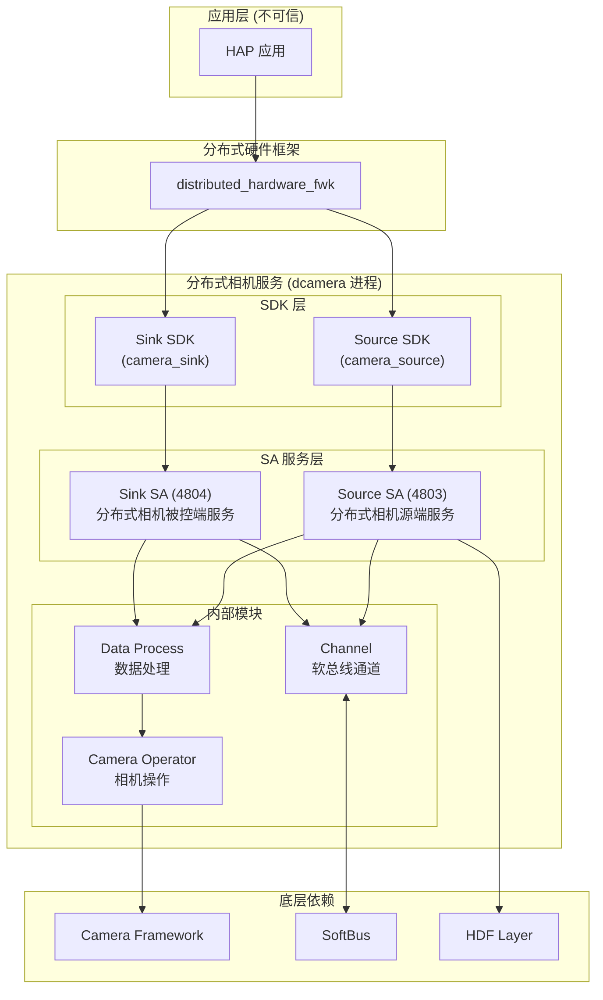
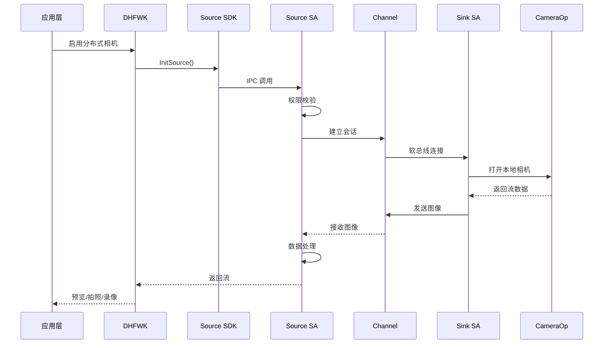
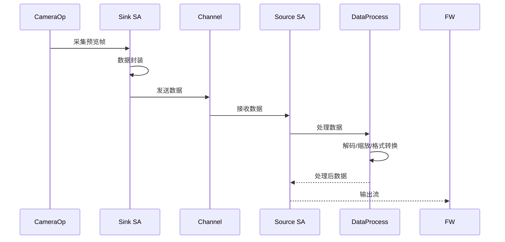
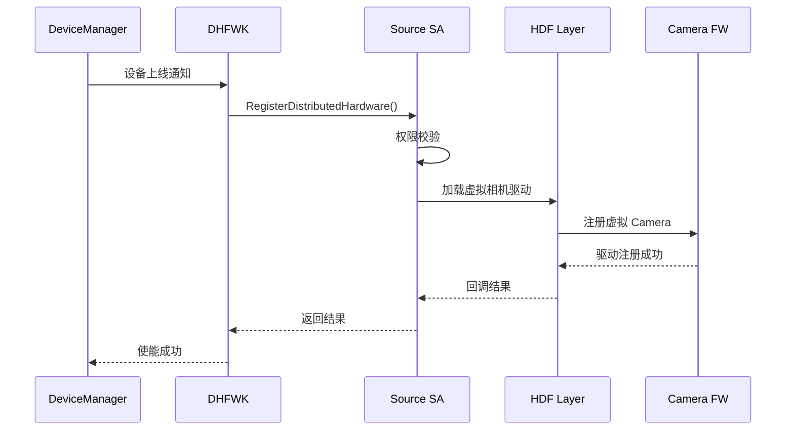
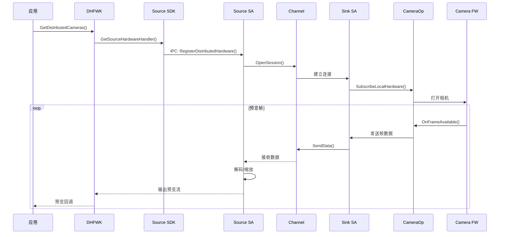

# 架构说明

## 整体架构图



## 数据流

### 主控端 → 被控端 (控制流)



### 被控端 → 主控端 (数据流)



---

## 线程模型

### Source Service 线程模型

```
┌─────────────────────────────────────────────────────────────────┐
│                        Source Service                            │
├─────────────────────────────────────────────────────────────────┤
│  主线程 (EventHandler)                                          │
│  ├── SA 生命周期管理 (OnStart/OnStop)                           │
│  ├── IPC 请求分发 (OnRemoteRequest)                             │
│  └── 状态机事件处理                                              │
├─────────────────────────────────────────────────────────────────┤
│  IPC 调用线程 (来自 Proxy 的调用线程)                             │
│  └── 直接在调用线程执行 Inner 方法                               │
├─────────────────────────────────────────────────────────────────┤
│  数据处理线程 (FFRT Task)                                       │
│  ├── 视频帧解码                                                  │
│  ├── 图像缩放                                                    │
│  └── 色彩空间转换                                                │
├─────────────────────────────────────────────────────────────────┤
│  回调通知线程 (业务回调)                                          │
│  └── 在注册的 EventHandler 上 post 任务                         │
└─────────────────────────────────────────────────────────────────┘
```

### Sink Service 线程模型

```
┌─────────────────────────────────────────────────────────────────┐
│                        Sink Service                              │
├─────────────────────────────────────────────────────────────────┤
│  主线程 (EventHandler)                                          │
│  ├── SA 生命周期管理                                             │
│  ├── IPC 请求分发                                               │
│  └── 访问控制监听                                               │
├─────────────────────────────────────────────────────────────────┤
│  数据发送线程 (FFRT Task)                                       │
│  └── 编码后数据通过 Channel 发送                                  │
├─────────────────────────────────────────────────────────────────┤
│  相机回调线程 (Camera Framework)                                  │
│  └── 预览/拍照/录像回调                                          │
└─────────────────────────────────────────────────────────────────┘
```

---

## 状态机模型

### Source 状态机

```
                    ┌────────────────────────────────────────┐
                    │         Init (初始化)                 │
                    └────────────────┬───────────────────────┘
                                     │ InitSource()
                                     ▼
                    ┌────────────────────────────────────────┐
                    │        Regist (已注册)                 │◄─────────────┐
                    │   RegisterDistributedHardware()        │              │
                    └────────────────┬───────────────────────┘              │
                                     │ UnregisterDistributedHardware()      │
                                     ▼                                    │
                    ┌────────────────────────────────────────┐              │
                    │         Open (已打开)                   │              │
                    │       OpenDistributedCamera()          │              │
                    └────────────────┬───────────────────────┘              │
                                     │ CloseDistributedCamera()            │
                                     ▼                                    │
                    ┌────────────────────────────────────────┐              │
                    │      ConfigStream (已配置流)            │──────────────┘
                    │      ConfigDistributedStreams()         │
                    └────────────────┬───────────────────────┘
                                     │ ReleaseSource()
                                     ▼
                    ┌────────────────────────────────────────┐
                    │         Release (已释放)                 │
                    └────────────────────────────────────────┘
```

### Sink 状态机

```
                    ┌────────────────────────────────────────┐
                    │         Init (初始化)                   │
                    └────────────────┬───────────────────────┘
                                     │ InitSink()
                                     ▼
                    ┌────────────────────────────────────────┐
                    │        Ready (就绪)                     │◄─────────────┐
                    │  SubscribeLocalHardware()               │              │
                    └────────────────┬───────────────────────┘              │
                                     │ UnsubscribeLocalHardware()          │
                                     ▼                                    │
                    ┌────────────────────────────────────────┐              │
                    │         Open (已打开)                   │──────────────┤
                    │       OpenChannel()                    │              │
                    └────────────────┬───────────────────────┘              │
                                     │ CloseChannel()                      │
                                     ▼                                    │
                    ┌────────────────────────────────────────┐              │
                    │      Capture (采集中)                   │──────────────┘
                    │       StartCapture()                   │
                    └────────────────┬───────────────────────┘
                                     │ StopCapture() / ReleaseSink()
                                     ▼
                    ┌────────────────────────────────────────┐
                    │         Release (已释放)                 │
                    └────────────────────────────────────────┘
```

---

## 时序图：设备上线流程



## 时序图：主控端预览流程



---

## 模块协作模式

### 1. IPC 调用模式

```
Client (Proxy)                          Server (Stub)
    │                                      │
    │───── IPC Request ──────────────────►│
    │     (binder transact)               │
    │                                      │
    │                                      │─► Validate Token
    │                                      │─► Check Permission
    │                                      │─► Execute Inner()
    │                                      │
    │◄──── IPC Response ───────────────────│
    │     (return value)                   │
```

### 2. 回调模式

```
Server (Callback Proxy)              Client (Callback Stub)
    │                                      │
    │───── OnXXX() ──────────────────────►│
    │                                      │─► Process Event
    │◄──── ACK ───────────────────────────│
```

### 3. 异步事件模式

```
Event Source                         Event Handler
    │                                      │
    │───── Post Task ────────────────────►│
    │     (EventHandler)                  │
    │                                      │─► Process Async
```

---

## 安全边界

| 边界 | 描述 | 防护措施 |
|------|------|----------|
| **IPC 边界** | Proxy ↔ Stub | InterfaceToken 校验 + AccessToken 权限校验 |
| **进程边界** | dcamera 进程 | SELinux (u:r:dcamera:s0) + uid/gid 隔离 |
| **网络边界** | 软总线传输 | 数据包校验 + 传输层加密 |
| **权限边界** | API 访问 | ENABLE_DISTRIBUTED_HARDWARE / ACCESS_DISTRIBUTED_HARDWARE |
