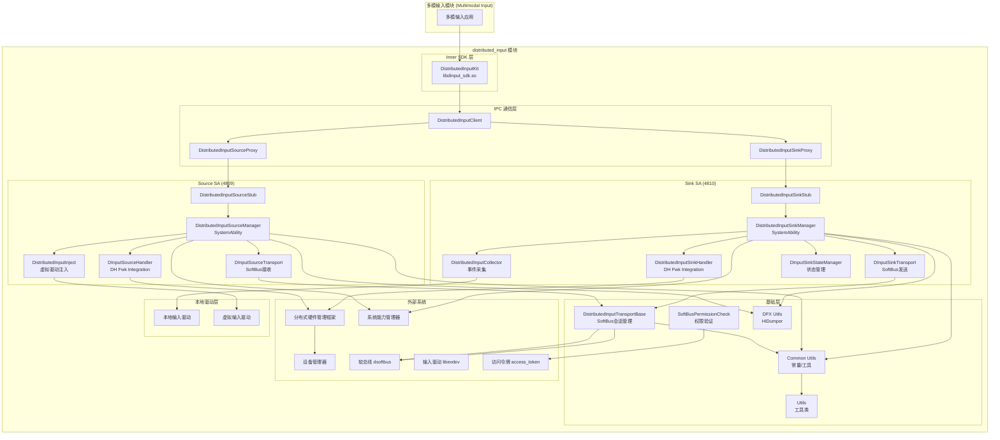
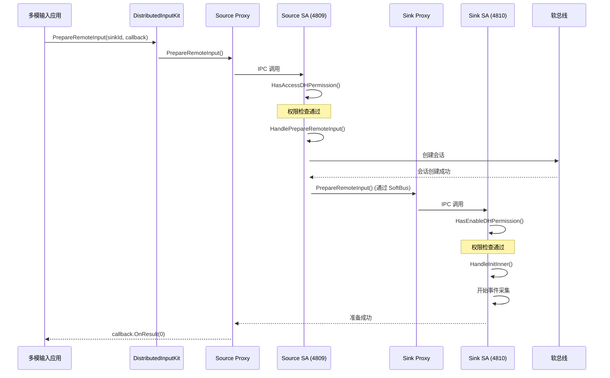
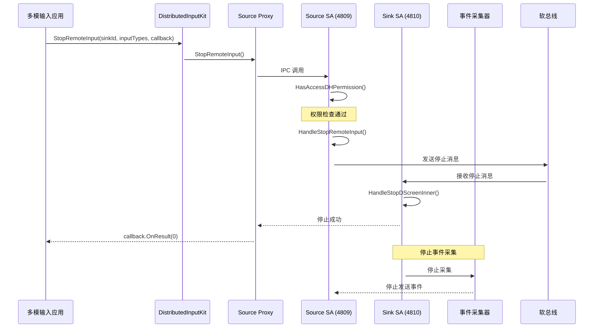

# 架构设计 (Architecture)

## 目的

本文档描述 distributed_input 模块的架构设计，包括组件关系、数据流、线程模型和关键时序。

## 适用范围

本文档适用于以下场景：
- 理解分布式输入的架构设计
- 了解组件间的交互关系
- 掌握数据流向和事件处理流程
- 分析系统启动和运行时序

## 关键结论

1. **双 SA 架构**: Source SA (4809) 和 Sink SA (4810) 独立运行
2. **IPC 通信**: 基于 OpenHarmony IPC 和 SoftBus 的跨进程通信
3. **分层设计**: 基础层 → 传输层 → 服务层 → 接口层清晰分层
4. **事件流**: Sink 采集 → SoftBus 传输 → Source 接收 → 虚拟驱动注入
5. **权限边界**: IPC Stub 层进行权限检查，保护敏感操作

## 组件架构图

### 整体架构



## 数据流设计

### Source 侧数据流

```
[多模输入应用]
      │
      ▼
[DistributedInputKit.PrepareRemoteInput()]
      │
      ▼
[DistributedInputClient]
      │
      ├───────────────────────────────┐
      ▼                           │
[DistributedInputSourceProxy]        │
      │                           │
      ├────────────────────────────────┐
      ▼                           │
[分布式输入 Source SA (4809)]      │
      │                           │
      ├──────────────────────────────┐  │
      ▼                           │  │
[权限检查]                      │  │
HasAccessDHPermission()          │  │
      │                           │  │
      ├───────────────┐              │  │
      ▼            │              │  │
[DistributedInputSourceManager]   │              │
      │            │              │  │
      ├────────────┼──────────────┘              │
      │            │                            │
      ├────────────▼────────────────────────────┐ │
      │                                    │ ▼
[DInputSourceTransport]                    │ [SoftBus会话]
- CreateSession()                      │
- OnDataReceived()                      │
      │                                    │
      ├────────────────────────────────────────────┘
      ▼
[通过 SoftBus 连接到 Sink SA]
```

### Sink 侧数据流

```
[本地输入驱动]
      │
      ▼
[原始输入事件]
      │
      ▼
[DistributedInputCollector]
- StartCollectionThread()
- 读取 libevdev 设备节点
      │
      ├─────────────────────────────┐
      ▼                           │
[事件过滤]                       │
- IsNeedFilterOut()              │
- 白名单检查                   │
      │                           │
      ├─────────────────────────────┐  │
      ▼                           │  │
[DistributedInputSinkManager]    │  │
      │                           │  │
      ├────────────┼────────────────┘  │
      │            │                   │
      ├────────────▼───────────────────┐ │
      │                               │ ▼
[DInputSinkTransport]                │ [SoftBus会话]
- SendMessage()                    │
      │                               │
      ├──────────────────────────────────────┘
      ▼
[通过 SoftBus 发送到 Source SA]
```

### 事件注入流

```
[Source SA 接收到远程事件]
      │
      ▼
[DInputSourceTransport.OnDataReceived()]
      │
      ▼
[DistributedInputSourceManager]
      │
      ├─────────────────────┐
      ▼                   │
[DistributedInputInject]
      │                   │
      ├─────────────────────┐  │
      ▼                  │  │
[RegisterDistributedEvent]  │  │
      │                  │  │
      ├─────────────────────┘  │
      ▼                    │
[虚拟输入驱动节点]        │
      │                    │
      ▼                    ▼
[多模输入子系统]    [用户应用]
```

## 线程模型

### 主线程

| 组件 | 线程类型 | 说明 |
|------|---------|------|
| **DistributedInputSourceManager** | 主线程 + EventHandler | SystemAbility 主线程 + AppExecFwk::EventHandler |
| **DistributedInputSinkManager** | 主线程 + EventHandler | SystemAbility 主线程 + AppExecFwk::EventHandler |
| **DistributedInputClient** | 主线程 | 静态类，无独立线程 |

### 工作线程

| 组件 | 线程类型 | 说明 |
|------|---------|------|
| **DistributedInputCollector** | 独立采集线程 | StartCollectionThread() 创建独立线程持续读取输入事件 |
| **DInputSourceTransport** | SoftBus 回调线程 | OnDataReceived() 在 SoftBus 回调线程中执行 |
| **DInputSinkTransport** | SoftBus 回调线程 | SendMessage() 在 SoftBus 回调线程中执行 |

### 事件处理流程

```
[IPC 客户端调用]           [IPC Stub 接收]
     │                             │
     ▼                             ▼
[Proxy.SendRequest()]        [Stub.OnRemoteRequest()]
     │                             │
     ├────────────┐                  ├────────────┐
     ▼            │                  ▼            │
[MessageParcel]        [权限检查]         [MessageParcel]
     │            │                  │            │
     ├────────────┐  │                  ├────────────┤
     ▼            ▼  ▼                  ▼            ▼
[通过 Binder]  [IPC处理]          [通过 Binder]
     │            │                  │            │
     ├────────────┐  │                  ├────────────┤
     ▼            ▼  ▼                  ▼            ▼
[Stub 接收]  [方法实现]          [Proxy 接收]
     │            │                  │            │
     ├────────────┐  │                  ├────────────┤
     ▼            ▼  ▼                  ▼            ▼
[回调执行]    [返回结果]          [结果解析]
     │            │                  │            │
     └────────────┘  └──────────────────────────┘
```

## 关键时序

### 时序 1: 设备上线与虚拟驱动注册

```mermaid
sequenceDiagram
    participant DeviceManager as 设备管理器
    participant SourceHandler as Source Handler
    participant SourceSA as Source SA (4809)
    participant VirtualDriver as 虚拟驱动
    participant MultiModalInput as 多模输入

    DeviceManager->>SourceHandler: 设备上线通知
    activate SourceHandler

    SourceHandler->>SourceSA: InitSource()
    activate SourceSA

    SourceSA->>SourceSA: OnStart()
    activate SourceSA

    SourceSA->>MultiModalInput: 注册虚拟驱动回调
    Note over SourceSA,MultiModalInput: libdinput_inject.so

    SourceSA->>SourceSA: PrepareRemoteInput() (准备虚拟驱动)
    activate SourceSA

    SourceSA->>VirtualDriver: 创建虚拟输入驱动节点
    Note right of SourceSA,VirtualDriver: /dev/input/eventX

    VirtualDriver-->>MultiModalInput: 虚拟设备就绪
    Note right of VirtualDriver,MultiModalInput: 多模输入自动发现
```

### 时序 2: 准备分布式输入（Prepare）



### 时序 3: 启动远程输入（Start）

```mermaid
sequenceDiagram
    participant App as 多模输入应用
    participant SDK as DistributedInputKit
    participant SourceProxy as Source Proxy
    participant SourceSA as Source SA (4809)
    participant SinkSA as Sink SA (4810)
    participant Collector as 事件采集器
    participant SoftBus as 软总线
    participant Inject as 事件注入器
    participant VirtualDriver as 虚拟驱动

    App->>SDK: StartRemoteInput(sinkId, inputTypes, callback)
    activate SDK

    SDK->>SourceProxy: StartRemoteInput()
    activate SourceProxy

    SourceProxy->>SourceSA: IPC 调用
    activate SourceSA

    SourceSA->>SourceSA: HasAccessDHPermission()
    activate SourceSA

    Note over SourceSA: 权限检查通过

    SourceSA->>SourceSA: HandleStartRemoteInput()
    activate SourceSA

    SourceSA->>SoftBus: 发送启动消息
    activate SoftBus

    SoftBus->>SinkSA: 接收启动消息
    activate SinkSA

    SinkSA->>SinkSA: HandleStartDScreenInner()
    activate SinkSA

    SinkSA-->>SourceProxy: 启动成功
    activate SourceProxy

    SourceProxy-->>App: callback.OnResult(0)
    activate App

    Note over SinkSA,Collector: 开始事件采集

    SinkSA->>Collector: SetSharingTypes(inputTypes)
    activate Collector

    Collector->>Collector: 采集本地输入事件
    activate Collector

    Collector->>SoftBus: 发送原始事件
    activate SoftBus

    SoftBus->>SourceSA: 接收远程事件
    activate SourceSA

    SourceSA->>Inject: RegisterDistributedEvent(event)
    activate Inject

    Inject->>VirtualDriver: 注入事件到虚拟驱动
    activate VirtualDriver

    VirtualDriver-->>App: 输入事件在 Source 端生效
    Note right of VirtualDriver,App: 虚拟设备输入生效
```

### 时序 4: 停止远程输入（Stop）



## 组件间接口

### Inner SDK → SA 接口

| SDK 方法 | Source SA 方法 | Sink SA 方法 | 说明 |
|---------|------------|------------|------|
| `PrepareRemoteInput()` | `PrepareRemoteInput()` | - | 准备跨设备输入 |
| `StartRemoteInput()` | `StartRemoteInput()` | - | 启动跨设备输入 |
| `StopRemoteInput()` | `StopRemoteInput()` | - | 停止跨设备输入 |
| `UnprepareRemoteInput()` | `UnprepareRemoteInput()` | - | 取消准备 |
| `RegisterDistributedHardware()` | - | - | 注册分布式硬件（框架调用） |
| `UnregisterDistributedHardware()` | - | - | 注销分布式硬件（框架调用） |

### SA → Transport 接口

| Source SA 方法 | Transport 方法 | 说明 |
|------------|--------------|------|
| `PrepareRemoteInput()` | `CreateSession()` | 创建 SoftBus 会话 |
| 接收远程事件 | `OnDataReceived()` | 处理来自 Sink 的事件 |

| Sink SA 方法 | Transport 方法 | 说明 |
|----------|--------------|------|
| `Init()` | `CreateSession()` | 创建 SoftBus 会话 |
| 采集本地事件 | `SendMessage()` | 发送事件到 Source |

### Transport → SoftBus 接口

基于 [distributed_input_transport_base.h](../services/transportbase/include/distributed_input_transport_base.h:1-105):

| 方法 | 说明 | 证据 |
|------|------|------|
| `CreateSession()` | 创建 SoftBus 会话 | [distributed_input_transport_base.cpp](../services/transportbase/src/distributed_input_transport_base.cpp) |
| `CloseSession()` | 关闭 SoftBus 会话 | - |
| `SendMessage()` | 发送消息到远程设备 | - |
| `OnSessionOpened()` | 会话打开回调 | - |
| `OnBytesReceived()` | 数据接收回调 | - |
| `OnSessionClosed()` | 会话关闭回调 | - |

## 状态机

### 设备状态机

根据 [dinput_sink_state.h](../services/state/include/dinput_sink_state.h:32-39)：

```mermaid
stateDiagram-v2
    [*] --> THROUGH_OUT: 初始状态
    THROUGH_OUT --> THROUGH_IN: StartRemoteInput
    THROUGH_IN --> THROUGH_OUT: StopRemoteInput

    note right of THROUGH_OUT
        设备在本地生效状态
        事件在本地处理

    note right of THROUGH_IN
        设备在跨设备输入状态
        事件穿透到远程 Source 端
```

### 会话状态机

根据 [constants_dinput.h](../common/include/constants_dinput.h:262-270)：

```
SESSION_STATE_INIT (0)
      │
      ▼ 准备成功
SESSION_STATE_PREPARED (1)
      │
      ▼ 启动成功
SESSION_STATE_STARTED (2)
      │
      ▼ 停止成功
SESSION_STATE_STOPPED (3)
      │
      ▼ 取消准备
SESSION_STATE_UNPREPARED (4)
      │
      ▼
[销毁会话]
```

## 关键常量定义

### 输入设备类型

根据 [constants_dinput.h:44-76](../common/include/constants_dinput.h:44-76)：

| 常量 | 值 | 说明 |
|------|-----|------|
| `MOUSE` | 0x1 | 鼠标输入 |
| `KEYBOARD` | 0x2 | 键盘输入 |
| `TOUCHSCREEN` | 0x4 | 触摸屏输入 |

### 会话状态

根据 [constants_dinput.h:262-270](../common/include/constants_dinput.h:262-270)：

| 常量 | 值 | 说明 |
|------|-----|------|
| `SESSION_STATE_INIT` | 0 | 会话初始化中 |
| `SESSION_STATE_PREPARED` | 1 | 会话已准备 |
| `SESSION_STATE_STARTED` | 2 | 会话已启动 |
| `SESSION_STATE_STOPPED` | 3 | 会话已停止 |
| `SESSION_STATE_UNPREPARED` | 4 | 会话已取消准备 |

### IPC 接口命令码

根据 [dinput_ipc_interface_code.h](../common/include/dinput_ipc_interface_code.h):

**Source 接口码** (IDInputSourceInterfaceCode):

| 命令 | 值 | 方法 |
|------|-----|------|
| `INIT` | 0xf001 | InitDistributedHardware |
| `RELEASE` | 0xf002 | ReleaseDistributedHardware |
| `REGISTER_REMOTE_INPUT` | 0xf003 | RegisterDistributedHardware |
| `UNREGISTER_REMOTE_INPUT` | 0xf004 | UnregisterDistributedHardware |
| `PREPARE_REMOTE_INPUT` | 0xf005 | PrepareRemoteInput |
| `UNPREPARE_REMOTE_INPUT` | 0xf006 | UnprepareRemoteInput |
| `START_REMOTE_INPUT` | 0xf007 | StartRemoteInput |
| `STOP_REMOTE_INPUT` | 0xf008 | StopRemoteInput |

**Sink 接口码** (IDInputSinkInterfaceCode):

| 命令 | 值 | 方法 |
|------|-----|------|
| `INIT` | 0xf011 | Init |
| `RELEASE` | 0xf012 | Release |
| `NOTIFY_START_DSCREEN` | 0xf013 | NotifyStartDScreen |
| `NOTIFY_STOP_DSCREEN` | 0xf014 | NotifyStopDScreen |

## 安全边界

### 信任边界

```
┌──────────────────────────────────────────────────────────────────┐
│                   [应用进程]                             │
│                                                        │
│              ┌───────────────────▼─────────────────┐          │
│              │  Inner SDK API              │          │
│              │  (libdinput_sdk.so)          │          │
│              └────────────────┬──────────────────┘          │
│                             │                         │
│              ┌──────────────▼──────────────────────┐            │
│              │  IPC 接口                    │            │
│              └────────────┬──────────────────────┘            │
│                             │                            │
│              ┌──────────────▼───────────────────────┐           │
│              │  [权限检查]                   │           │
│              │  - VerifyAccessToken         │           │
│              └────────────┬───────────────────────┘           │
│                             │                            │
│              ┌──────────────▼───────────────────────┐           │
│              │  System Ability (SA)             │           │
│              │  - Source SA (4809)             │           │
│              │  - Sink SA (4810)              │           │
│              └────────────┬───────────────────────┘           │
│                             │                            │
┌────────────────────┼────────────────────────────────────┐    │
│              │                                     │    │
│              │                                     │    │
│         ┌────▼──────────┐                      ┌────▼────┐
│         │  SoftBus     │                      │  本地驱动  │
│         │  - 会话管理  │                      │  (libevdev)│
│         │  - 跨设备    │                      └───────────┘
│         └───────────────┘                            │
└───────────────────────────────────────────────────────────────────┘
```

**信任边界说明**：

1. **应用进程 → SA**: 需要权限检查（ENABLE_DISTRIBUTED_HARDWARE、ACCESS_DISTRIBUTED_HARDWARE）
2. **Source SA ↔ Sink SA**: 通过 SoftBus 通信，需要权限验证（SoftBusPermissionCheck）
3. **SA → 本地驱动**: Sink 侧直接读取 libevdev，Source 侧写入虚拟驱动节点
4. **SA → 虚拟驱动**: 通过 libevdev 注入事件，需要驱动节点权限

## 相关跳转

- [公共 API](04_Public_API.md) - Inner SDK 接口详细说明
- [内部 API](05_Inner_API.md) - 模块间接口和稳定性
- [安全评审](08_Security_Review.md) - 详细的权限和安全机制

---

*更新时间: 2026-02-06 15:08:55*
