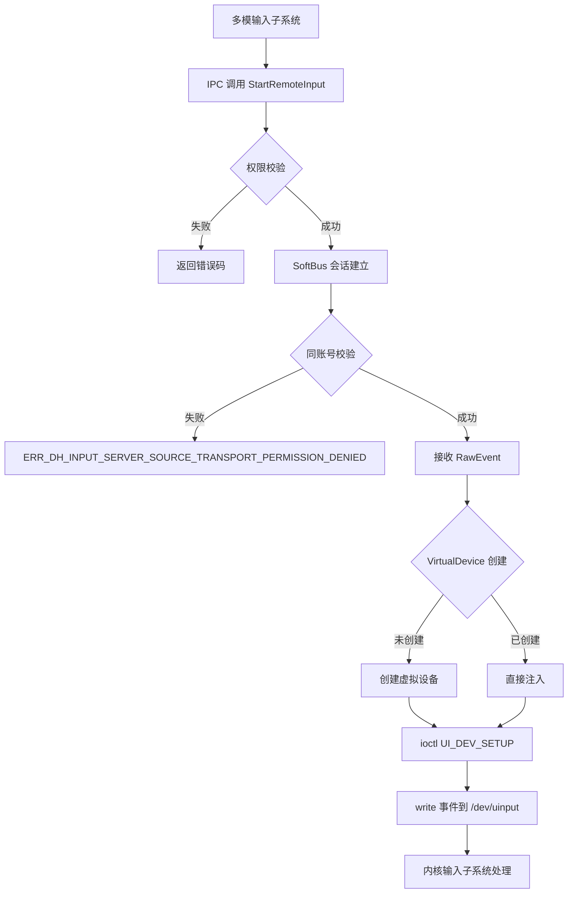

# 攻击面分析

**文档版本**: v1.0  
**分析日期**: 2025-02-07  
**模块版本**: 3.2

---

## 目录

- [1. 分析概述](#1-分析概述)
- [2. 外部输入入口](#2-外部输入入口)
- [3. 敏感操作清单](#3-敏感操作清单)
- [4. 信任边界图](#4-信任边界图)
- [5. 数据流分析](#5-数据流分析)
- [6. 攻击面汇总](#6-攻击面汇总)

---

## 1. 分析概述

### 1.1 分析目标

本章节旨在识别 `distributed_input` 模块的所有外部输入入口、敏感操作和信任边界，为安全研究员提供清晰的攻击面视图。

### 1.2 分析范围

| 范围 | 说明 |
|------|------|
| **模块** | `foundation/distributedhardware/distributed_input` |
| **版本** | 3.2 |
| **入口类型** | IPC 接口、跨设备传输、配置文件 |
| **排除范围** | 测试代码、内核驱动层 |

### 1.3 攻击面概览

```
┌─────────────────────────────────────────────────────────────────────────────┐
│                           攻击面概览                                        │
├─────────────────────────────────────────────────────────────────────────────┤
│                                                                          │
│   ┌─────────────────────────────────────────────────────────────────┐    │
│   │                     跨设备传输层 (SoftBus)                        │    │
│   │         ◄──────── 输入事件数据 ────────►                          │    │
│   └─────────────────────────────────────────────────────────────────┘    │
│                    ▲                          ▲                         │
│                    │                          │                         │
│   ┌────────────────┴────────────────────────┴────────────────────────┐ │
│   │                      IPC 接口层                                    │ │
│   │  Source SA (4809) ◄──────────► Sink SA (4810)                    │ │
│   └──────────────────────────────────────────────────────────────────┘ │
│                    ▲                          ▲                         │
│                    │                          │                         │
│   ┌────────────────┴────────────────────────┴────────────────────────┐ │
│   │                     上层调用 (多模输入子系统)                       │ │
│   └──────────────────────────────────────────────────────────────────┘ │
│                                                                          │
│   ┌────────────────┬────────────────────────┬────────────────────────┐   │
│   │  配置文件       │  设备节点             │  虚拟设备              │   │
│   │  (/etc/)       │  (/dev/input)         │  (/dev/uinput)        │   │
│   └────────────────┴────────────────────────┴────────────────────────┘   │
│                                                                          │
└─────────────────────────────────────────────────────────────────────────────┘
```

---

## 2. 外部输入入口

### 2.1 IPC 命令注入

#### 2.1.1 Source SA (4809) IPC 接口

**服务定义**: `sa_profile/4809.json`

```json
{
    "name": 4809,
    "libpath": "libdinput_source.z.so",
    "run-on-create": false
}
```

**命令码定义**: `common/include/dinput_ipc_interface_code.h:24-48`

| 命令码 | 值 | 输入参数 | 风险等级 |
|--------|-----|---------|---------|
| `INIT` | 0xf001 | 无 | 低 |
| `RELEASE` | 0xf002 | 无 | 低 |
| `REGISTER_REMOTE_INPUT` | 0xf003 | devId, dhId, parameters | **中** |
| `UNREGISTER_REMOTE_INPUT` | 0xf004 | devId, dhId | 低 |
| `PREPARE_REMOTE_INPUT` | 0xf005 | deviceId | **中** |
| `UNPREPARE_REMOTE_INPUT` | 0xf006 | deviceId | 低 |
| `START_REMOTE_INPUT` | 0xf007 | deviceId, inputTypes | **中** |
| `STOP_REMOTE_INPUT` | 0xf008 | deviceId, inputTypes | 低 |
| `PREPARE_RELAY_REMOTE_INPUT` | 0xf00a | srcId, sinkId | **高** |
| `START_RELAY_REMOTE_INPUT` | 0xf00c | srcId, sinkId, inputTypes | **高** |
| `START_DHID_REMOTE_INPUT` | 0xf00e | srcId, sinkId, dhIds[] | **高** |

**关键代码**: `interfaces/ipc/src/distributed_input_source_stub.cpp:36-52`

```cpp
bool DistributedInputSourceStub::HasEnableDHPermission()
{
    Security::AccessToken::AccessTokenID callerToken = IPCSkeleton::GetCallingTokenID();
    const std::string permissionName = "ohos.permission.ENABLE_DISTRIBUTED_HARDWARE";
    int32_t result = Security::AccessToken::AccessTokenKit::VerifyAccessToken(callerToken, permissionName);
    return (result == Security::AccessToken::PERMISSION_GRANTED);
}
```

#### 2.1.2 Sink SA (4810) IPC 接口

**服务定义**: `sa_profile/4810.json`

```json
{
    "name": 4810,
    "libpath": "libdinput_sink.z.so",
    "run-on-create": false
}
```

**命令码定义**: `common/include/dinput_ipc_interface_code.h:51-58`

| 命令码 | 值 | 输入参数 | 风险等级 |
|--------|-----|---------|---------|
| `INIT` | 0xf011 | 无 | 低 |
| `RELEASE` | 0xf012 | 无 | 低 |
| `NOTIFY_START_DSCREEN` | 0xf013 | srcScreenInfo | **中** |
| `NOTIFY_STOP_DSCREEN` | 0xf014 | srcScreenInfoKey | 低 |
| `REGISTER_SHARING_DHID_LISTENER` | 0xf015 | listener | 低 |
| `GET_SINK_SCREEN_INFOS` | 0xf016 | 无 | 低 |

### 2.2 跨设备事件传输

#### 2.2.1 事件数据结构

**RawEvent 定义**: `common/include/constants_dinput.h:248-261`

```cpp
struct RawEvent {
    int64_t when;           // 时间戳 (8字节)
    uint32_t type;          // 事件类型 (4字节)
    uint32_t code;          // 事件代码 (4字节)
    int32_t value;          // 事件值 (4字节)
    std::string descriptor; // 设备描述符 (最大256字节)
    std::string path;       // 设备路径 (最大256字节)
};
```

**消息大小限制**: `services/common/include/dinput_softbus_define.h`

| 限制 | 值 | 用途 |
|------|------|------|
| `MSG_MAX_SIZE` | 32KB | 单次传输消息最大长度 |
| `ENCRYPT_TAG_LEN` | 32B | 加密标签长度 |

#### 2.2.2 事件传输流程

```
┌─────────────────────────────────────────────────────────────────────────────┐
│                          跨设备事件传输流程                                    │
├─────────────────────────────────────────────────────────────────────────────┤
│                                                                          │
│   Sink 设备                              Source 设备                       │
│   ┌─────────────┐                        ┌─────────────┐                │
│   │ InputHub    │  RawEvent[]            │ VirtualDevice│               │
│   │ 采集原始事件 │───────────────────────►│ 注入事件     │               │
│   └─────────────┘                        └─────────────┘                │
│         ▲                                       │                        │
│         │                                       ▼                        │
│   ┌─────────────┐                        ┌─────────────┐                │
│   │ /dev/input  │                        │ /dev/uinput │               │
│   │ 读取设备    │                        │ 创建虚拟设备 │               │
│   └─────────────┘                        └─────────────┘                │
│                                                                          │
│   ┌───────────────────────────────────────────┐                          │
│   │              SoftBus 传输层                │                          │
│   │  - 同账号校验                              │                          │
│   │  - ACL 访问控制                            │                          │
│   │  - Socket 访问信息绑定                      │                          │
│   └───────────────────────────────────────────┘                          │
│                                                                          │
└─────────────────────────────────────────────────────────────────────────────┘
```

### 2.3 配置文件输入

#### 2.3.1 白名单配置文件

**配置文件路径**: `/etc/minidp_dinput_whitelist.cfg`

**解析代码**: `common/include/white_list_util.cpp`

```cpp
// 安全限制
const int32_t MAX_LINE_NUM = 100;           // 最大行数
const int32_t MAX_CHAR_PER_LINE_NUM = 100;  // 每行最大字符数
const int32_t MAX_SPLIT_COMMA_NUM = 4;      // 最大逗号分隔数
const int32_t MAX_KEY_CODE_NUM = 4;         // 每个键的最大代码数

// 路径规范化
char path[PATH_MAX + 1] = {0x00};
if (strlen(whiteListFilePath) == 0 || strlen(whiteListFilePath) > PATH_MAX ||
    realpath(whiteListFilePath, path) == nullptr) {
    DHLOGE("File connicailization failed.");
    return false;
}
```

#### 2.3.2 参数限制

**参数限制定义**: `common/include/constants_dinput.h`

| 参数 | 限制值 | 文件位置 |
|------|--------|---------|
| `DEV_ID_LENGTH_MAX` | 256 | `:33` |
| `DH_ID_LENGTH_MAX` | 256 | `:32` |
| `IPC_VECTOR_MAX_SIZE` | 32 | `:36` |
| `STRING_MAX_SIZE` | 40MB | `:38` |

---

## 3. 敏感操作清单

### 3.1 系统调用操作

| 操作 | 文件 | 权限要求 | 风险等级 |
|------|------|---------|---------|
| `open("/dev/uinput")` | `virtual_device.cpp:127` | uhid 组 | **高** |
| `ioctl(UI_DEV_CREATE)` | `virtual_device.cpp` | uhid 组 | **高** |
| `ioctl(UI_SET_EVBIT)` | `virtual_device.cpp` | uhid 组 | **高** |
| `write()` 虚拟设备 | `virtual_device.cpp` | uhid 组 | **高** |
| `open("/dev/input/*")` | `input_hub.cpp` | input 组 | **高** |
| `ioctl(EVIOCGRAB)` | `input_hub.cpp` | input 组 | **中** |

**关键代码**: `services/source/inputinject/src/virtual_device.cpp:127`

```cpp
fd_ = open("/dev/uinput", O_WRONLY | O_NONBLOCK);
if (fd_ < 0) {
    DHLOGE("open /dev/uinput failed, errno: %{public}d", errno);
    return false;
}

// 配置虚拟设备
struct uinput_setup dev {};
dev.uapi = &uapi_;
if (ioctl(fd_, UI_DEV_SETUP, &dev) < 0) {
    DHLOGE("ioctl UI_DEV_SETUP failed");
    return false;
}
```

### 3.2 网络通信操作

| 操作 | 文件 | 加密 | 认证 |
|------|------|------|------|
| `Socket()` 创建会话 | `distributed_input_transport_base.cpp` | SoftBus 提供 | 同账号校验 |
| `SendBytes()` 发送 | `distributed_input_transport_base.cpp` | SoftBus 提供 | 会话绑定 |
| `SetAccessInfo()` | `softbus_permission_check.cpp` | - | tokenId 绑定 |

**关键代码**: `services/transportbase/src/softbus_permission_check.cpp:206-233`

```cpp
bool SoftBusPermissionCheck::SetAccessInfoToSocket(const int32_t sessionId)
{
    AccountInfo accountInfo;
    if (!GetLocalAccountInfo(accountInfo)) {
        return false;
    }
    SocketAccessInfo accessInfo;
    accessInfo.userId = accountInfo.userId_;
    accessInfo.localTokenId = accountInfo.tokenId_;
    // ...
    if (SetAccessInfo(sessionId, accessInfo) != 0) {
        return false;
    }
}
```

### 3.3 IPC 操作

| 操作 | 文件 | 权限要求 |
|------|------|---------|
| IPC 方法调用 | `distributed_input_source_stub.cpp` | AccessToken 校验 |
| 接口令牌验证 | 所有 Stub 文件 | 描述符校验 |
| 参数长度校验 | `input_check_param.cpp` | 长度限制 |

---

## 4. 信任边界图

### 4.1 边界定义

```
┌─────────────────────────────────────────────────────────────────────────────┐
│                           信任边界图                                          │
├─────────────────────────────────────────────────────────────────────────────┤
│                                                                          │
│  ╔═══════════════════════════════════════════════════════════════════╗   │
│  ║                     TCB (可信计算基)                                ║   │
│  ║  ┌─────────────────────────────────────────────────────────────┐  ║   │
│  ║  │              dinput 进程 (UID: dinput)                       │  ║   │
│  ║  │  ┌───────────┐  ┌───────────┐  ┌───────────┐              │  ║   │
│  ║  │  │ Source SA │  │ Sink SA   │  │ Transport │              │  ║   │
│  ║  │  │  (4809)   │  │  (4810)   │  │   Base    │              │  ║   │
│  ║  │  └─────┬─────┘  └─────┬─────┘  └─────┬─────┘              │  ║   │
│  ║  │        │              │              │                      │  ║   │
│  ║  │        ▼              ▼              ▼                      │  ║   │
│  ║  │  ┌─────────────────────────────────────────────────────┐  │  ║   │
│  ║  │  │         OpenHarmony 内核 (SELinux: u:r:dinput:s0)    │  │  ║   │
│  ║  │  └─────────────────────────────────────────────────────┘  │  ║   │
│  ║  └─────────────────────────────────────────────────────────────┘  ║   │
│  ╠═══════════════════════════════════════════════════════════════════╣   │
│  ║                    BB1: 多模输入子系统边界                          ║   │
│  ║    (多模输入 → distributed_input: IPC 调用，需权限校验)            ║   │
│  ╠═══════════════════════════════════════════════════════════════════╣   │
│  ║                    BB2: 跨设备传输边界                              ║   │
│  ║      (Source ↔ Sink: SoftBus 传输，需同账号校验)                   ║   │
│  ╠═══════════════════════════════════════════════════════════════════╣   │
│  ║                    BB3: 设备驱动边界                                ║   │
│  ║   (dinput → /dev/uinput, /dev/input: 组权限校验)                  ║   │
│  ╚═══════════════════════════════════════════════════════════════════╝   │
│                                                                          │
└─────────────────────────────────────────────────────────────────────────────┘
```

### 4.2 边界跨越点

| 边界 | 跨越方向 | 校验机制 | 失效后果 |
|------|---------|---------|---------|
| BB1 | 多模输入 → Source | AccessToken | 未授权调用 |
| BB1 | 多模输入 → Sink | AccessToken | 未授权调用 |
| BB2 | Sink → Source | 同账号 + ACL | 跨账号注入 |
| BB3 | dinput → /dev/uinput | uhid 组 | 权限提升 |
| BB3 | dinput → /dev/input | input 组 | 设备劫持 |

---

## 5. 数据流分析

### 5.1 完整数据流

```
┌─────────────────────────────────────────────────────────────────────────────┐
│                          完整数据流图                                        │
├─────────────────────────────────────────────────────────────────────────────┤
│                                                                          │
│  1. 设备上线阶段                                                          │
│  ┌───────────────┐     ┌───────────────────┐     ┌───────────────────┐  │
│  │ device_manager │────►│ distributed_hardware│───►│ dinput (Source)  │  │
│  │  设备发现      │     │    fwk             │     │  SA 初始化        │  │
│  └───────────────┘     └───────────────────┘     └───────────────────┘  │
│                                                                      │     │
│                                                                      ▼     │
│  2. 设备注册阶段                                              ┌───────────┐│
│  ┌───────────────┐     ┌───────────────────┐                 │ /dev/uinput││
│  │   Sink 设备    │────►│ distributed_input │────────────────►│ 虚拟设备   ││
│  │   上报设备     │     │   (Source)        │   Register()    │  注册      ││
│  └───────────────┘     └───────────────────┘                 └───────────┘│
│                                                                      │     │
│                                                                      ▼     │
│  3. 跨设备输入阶段                                              ┌───────────┐│
│  ┌───────────────┐     ┌───────────────────┐                 │ 上层应用   ││
│  │   Sink 设备    │────►│  SoftBus          │────────────────►│ 接收输入   ││
│  │   采集事件     │     │  加密传输         │   事件数据      │  事件      ││
│  └───────────────┘     └───────────────────┘                 └───────────┘│
│                                                                          │
│  4. 事件注入阶段                                                          │
│  ┌───────────────┐     ┌───────────────────┐     ┌───────────────────┐  │
│  │ SoftBus       │────►│ VirtualDevice     │────►│ /dev/input       │  │
│  │ 接收事件      │     │  事件注入         │     │  内核处理        │  │
│  └───────────────┘     └───────────────────┘     └───────────────────┘  │
│                                                                          │
└─────────────────────────────────────────────────────────────────────────────┘
```

### 5.2 数据流详情

#### 5.2.1 Source 侧数据流



#### 5.2.2 Sink 侧数据流

```mermaid
flowchart TD
    A[/dev/input 设备] --> B[InputHub 读取事件]
    B --> C[RawEvent 封装]
    C --> D{白名单过滤}
    D -->|命中| E[跳过事件]
    D -->|未命中| F[SoftBus 发送]
    F --> G{同账号校验}
    G -->|失败| H[丢弃事件]
    G -->|成功| I[加密传输到 Source]
```

---

## 6. 攻击面汇总

### 6.1 攻击面矩阵

| 攻击面 | 入口类型 | 输入数据 | 现有防护 | 风险等级 |
|--------|---------|---------|---------|---------|
| **IPC REGISTER** | IPC 命令 | devId, dhId | AccessToken 校验 | **中** |
| **IPC PREPARE** | IPC 命令 | deviceId | AccessToken 校验 | **中** |
| **IPC START** | IPC 命令 | inputTypes | AccessToken 校验 | **中** |
| **IPC Relay** | IPC 命令 | srcId, sinkId | AccessToken + ACL | **高** |
| **跨设备事件** | SoftBus | RawEvent[] | 同账号 + 加密 | **中** |
| **设备描述符** | 事件数据 | string | 长度限制 | **低** |
| **白名单配置** | 文件 | 文本 | realpath 规范化 | **低** |
| **虚拟设备创建** | 系统调用 | ioctl | uhid 组权限 | **高** |
| **事件注入** | 系统调用 | write | uhid 组权限 | **高** |

### 6.2 高风险入口详解

#### 6.2.1 Relay 操作 (高危)

**命令码**: 0xf00a - 0xf011

**风险原因**: 支持中继模式，允许跨多个设备转发输入事件

**触发路径**:
```
攻击者 → IPC HandleStartRelayRemoteInput()
  → HasAccessDHPermission() 校验
  → SoftBus 建立到 srcId 的会话
  → 接收来自 srcId 的事件
  → 注入到 sinkId 对应的虚拟设备
```

**关键代码**: `interfaces/ipc/src/distributed_input_source_stub.cpp:221`

```cpp
int32_t DistributedInputSourceStub::HandleStartRelayRemoteInput(MessageParcel &data, MessageParcel &reply)
{
    if (!HasAccessDHPermission()) {
        DHLOGE("HandleStartRelayRemoteInput permission check fail");
        return ERR_DH_INPUT_SRC_ACCESS_PERMISSION_CHECK_FAIL;
    }
    // ... 后续处理
}
```

#### 6.2.2 虚拟设备创建 (高危)

**操作**: `/dev/uinput` ioctl

**风险原因**: 可创建任意规格的输入设备

**触发路径**:
```
攻击者 → DistributedInputInject::CreateVirtualDevice()
  → open /dev/uinput (需 uhid 组)
  → ioctl UI_DEV_SETUP 配置设备
  → ioctl UI_SET_EVBIT 设置支持的事件类型
  → write 注入任意输入事件
```

**关键代码**: `services/source/inputinject/src/virtual_device.cpp:127-180`

```cpp
fd_ = open("/dev/uinput", O_WRONLY | O_NONBLOCK);
if (fd_ < 0) {
    DHLOGE("open /dev/uinput failed, errno: %{public}d", errno);
    return false;
}

struct uinput_setup dev {};
dev.uapi = &uapi_;
dev.name = name_.c_str();
dev.id = {BUS_VIRTUAL, 1, 1, 0};

// 无设备属性白名单校验
if (ioctl(fd_, UI_DEV_SETUP, &dev) < 0) {
    DHLOGE("ioctl UI_DEV_SETUP failed");
    return false;
}
```

### 6.3 攻击路径示例

#### 路径 1: 未授权远程事件注入

```
攻击者获取 ACCESS_DISTRIBUTED_HARDWARE 权限
    │
    ▼
调用 StartRemoteInput(srcId=恶意设备, inputTypes=KEYBOARD)
    │
    ▼
权限校验通过
    │
    ▼
建立到恶意设备的 SoftBus 会话
    │
    ▼
接收恶意构造的 RawEvent
    │
    ▼
注入到系统 (/dev/uinput)
    │
    ▼
效果：注入任意键盘事件
```

#### 路径 2: 虚拟设备权限提升

```
攻击者获取 dinput 进程权限 (uhid 组)
    │
    ▼
调用 CreateVirtualDevice()
    │
    ▼
open /dev/uinput 成功
    │
    ▼
配置虚拟设备 (ioctl UI_DEV_SETUP)
    │
    ▼
write 任意输入事件
    │
    ▼
效果：绕过输入子系统安全检查
```

---

## 附录

### A. 相关文件索引

| 文件 | 说明 | 攻击面相关内容 |
|------|------|---------------|
| `interfaces/ipc/src/distributed_input_source_stub.cpp` | Source IPC | 所有 IPC 入口 |
| `interfaces/ipc/src/distributed_input_sink_stub.cpp` | Sink IPC | 所有 IPC 入口 |
| `services/transportbase/src/softbus_permission_check.cpp` | 传输权限 | 跨设备校验 |
| `services/source/inputinject/src/virtual_device.cpp` | 虚拟设备 | 设备创建/注入 |
| `common/include/white_list_util.cpp` | 白名单 | 配置解析 |
| `common/include/input_check_param.cpp` | 参数校验 | 输入验证 |

### B. 调试技巧

| 场景 | 日志标签 | 查看命令 |
|------|---------|---------|
| IPC 权限校验 | `DHLOGE` | `hilog | grep -i dinput` |
| SoftBus 传输 | `DHLOGD` | `hilog | grep -i softbus` |
| 虚拟设备创建 | `DHLOGD` | `hilog | grep -i uinput` |
| 白名单过滤 | `DHLOGD` | `hilog | grep -i whitelist` |

---

**文档版本**: v1.0  
**分析人**: OpenHarmony Security Wiki Generator  
**下次更新**: 建议每次代码变更后更新
