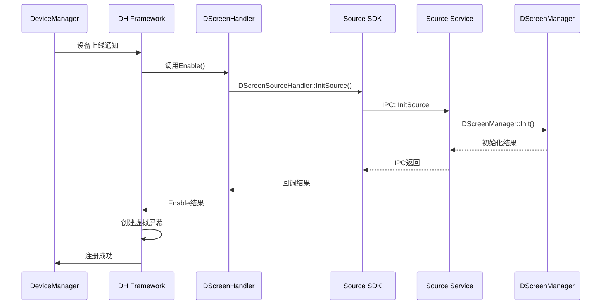
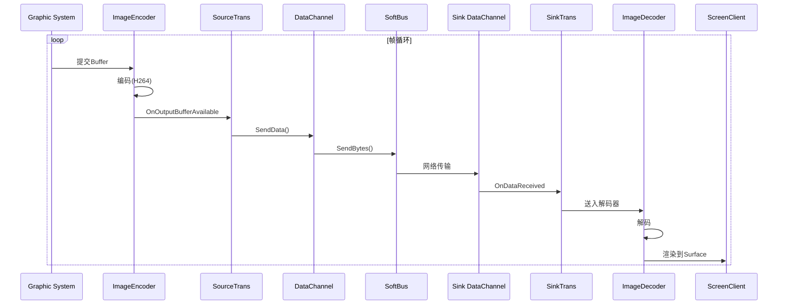

# 架构设计

## 目的与适用范围

本文档详细描述分布式屏幕的架构设计，包括组件图、数据流、线程模型和关键时序。

**适用范围**: 系统架构师、模块开发者、代码审查人员

---

## 架构总览

### 组件架构图

```
┌─────────────────────────────────────────────────────────────────────────────────────┐
│                           分布式屏幕架构 (distributed_screen)                          │
├─────────────────────────────────────────────────────────────────────────────────────┤
│                                                                                     │
│  ┌─────────────────────────────────────────────────────────────────────────────┐   │
│  │                         Distributed Hardware Framework                       │   │
│  │                         (分布式硬件管理框架)                                   │   │
│  └────────────────────────┬────────────────────────────────────────────────────┘   │
│                           │ 调用                                                    │
│           ┌───────────────┴───────────────┐                                        │
│           ▼                               ▼                                        │
│  ┌─────────────────────┐      ┌─────────────────────┐                              │
│  │   Source SDK        │      │   Sink SDK          │                              │
│  │   (libdistributed_  │      │   (libdistributed_  │                              │
│  │    screen_source_   │      │    screen_sink_     │                              │
│  │    sdk.z.so)        │      │    sdk.z.so)        │                              │
│  │                     │      │                     │                              │
│  │  - Handler          │      │  - Handler          │                              │
│  │  - Proxy            │      │  - Proxy            │                              │
│  └─────────┬───────────┘      └─────────┬───────────┘                              │
│            │ IPC                         │ IPC                                      │
│            ▼                             ▼                                          │
│  ┌─────────────────────────────────────────────────────────────────────────────┐   │
│  │                              IPC 通信层 (Binder)                               │   │
│  │  ┌─────────────────────┐                      ┌─────────────────────┐        │   │
│  │  │  Source Service     │◄────────────────────►│  Sink Service       │        │   │
│  │  │  (SA 4807)          │                      │  (SA 4808)          │        │   │
│  │  │  ┌───────────────┐  │                      │  ┌───────────────┐  │        │   │
│  │  │  │DScreenManager │  │                      │  │ScreenRegionMgr│  │        │   │
│  │  │  │  - v1.0       │  │                      │  │  - v1.0       │  │        │   │
│  │  │  │  - v2.0 (AV)  │  │                      │  │  - v2.0 (AV)  │  │        │   │
│  │  │  └───────────────┘  │                      │  └───────────────┘  │        │   │
│  │  └──────────┬──────────┘                      └──────────┬──────────┘        │   │
│  └─────────────┼────────────────────────────────────────────┼───────────────────┘   │
│                │                                            │                       │
│                ▼                                            ▼                       │
│  ┌──────────────────────────┐              ┌──────────────────────────┐            │
│  │   Source Transport       │              │   Sink Transport         │            │
│  │   (screensourcetrans)    │              │   (screensinktrans)      │            │
│  │                          │              │                          │            │
│  │  ┌──────────────────┐    │              │    ┌──────────────────┐  │            │
│  │  │ SourceProcessor  │    │              │    │ SinkProcessor    │  │            │
│  │  │  - 编码器管理     │    │   屏幕数据    │    │  - 解码器管理     │  │            │
│  │  │  - Surface获取   │    │◄────────────►│    │  - Surface渲染   │  │            │
│  │  └──────────────────┘    │   (软总线)    │    └──────────────────┘  │            │
│  └──────────┬───────────────┘              └───────────────┬──────────┘            │
│             │                                              │                        │
│             ▼                                              ▼                        │
│  ┌─────────────────────────────────────────────────────────────────────────────┐   │
│  │                          SoftBus Adapter (软总线适配)                         │   │
│  │                          - 权限检查 (same account)                             │   │
│  │                          - 数据通道管理                                       │   │
│  └─────────────────────────────────────────────────────────────────────────────┘   │
│                                                                                     │
│  ┌─────────────────────────────────────────────────────────────────────────────┐   │
│  │                          Screen Client (显示客户端)                           │   │
│  │                          - 代理显示窗口管理                                    │   │
│  │                          - Surface Buffer管理                                │   │
│  └─────────────────────────────────────────────────────────────────────────────┘   │
│                                                                                     │
│  ┌─────────────────────────────────────────────────────────────────────────────┐   │
│  │                          Common Utils (公共工具)                              │   │
│  │                          - 日志/事件/错误码                                    │   │
│  │                          - JSON工具                                          │   │
│  └─────────────────────────────────────────────────────────────────────────────┘   │
│                                                                                     │
└─────────────────────────────────────────────────────────────────────────────────────┘
```

### 模块职责

| 模块 | 职责 | 关键类 |
|------|------|--------|
| **SDK层** | 对外提供Native接口 | `DScreenSourceHandler`, `DScreenSinkHandler` |
| **Service层** | SystemAbility服务实现 | `DScreenSourceService`, `DScreenSinkService` |
| **Manager层** | 屏幕/区域管理 | `DScreenManager`, `ScreenRegionManager` |
| **Transport层** | 编解码和数据传输 | `ScreenSourceTrans`, `ScreenSinkTrans` |
| **Adapter层** | 软总线适配 | `SoftBusAdapter` |
| **Client层** | 显示客户端 | `ScreenClient` |

---

## IPC架构

### Proxy-Stub模式

**证据**: `interfaces/innerkits/native_cpp/screen_source/include/idscreen_source.h:25-40`

```cpp
class IDScreenSource : public OHOS::IRemoteBroker {
public:
    DECLARE_INTERFACE_DESCRIPTOR(u"ohos.distributedhardware.distributedscreensource");
    
    virtual int32_t InitSource(const std::string &params, const sptr<IDScreenSourceCallback> &callback) = 0;
    virtual int32_t RegisterDistributedHardware(const std::string &devId, const std::string &dhId,
        const EnableParam &param, const std::string &reqId) = 0;
    virtual int32_t UnregisterDistributedHardware(...) = 0;
    virtual int32_t ConfigDistributedHardware(...) = 0;
    virtual void DScreenNotify(...) = 0;
};
```

**IPC调用链**:

```
Client App
    │
    ▼
DScreenSourceHandler::GetInstance()
    │
    ▼
DScreenSourceProxy::InitSource() ──IPC──► DScreenSourceStub::OnRemoteRequest()
    │                                        │
    │                                        ▼
    │                              DScreenSourceService::InitSource()
    │                                        │
    │                                        ▼
    │                              DScreenManager::Init()
    │
    ◄────────────────────Callback────────────────────┘
```

### IPC命令码

**证据**: `common/include/dscreen_ipc_interface_code.h:21-40`

```cpp
/* SAID: 4807 - Source端 */
enum class IDScreenSourceInterfaceCode : uint32_t {
    INIT_SOURCE = 0,
    RELEASE_SOURCE = 1,
    REGISTER_DISTRIBUTED_HARDWARE = 2,
    UNREGISTER_DISTRIBUTED_HARDWARE = 3,
    CONFIG_DISTRIBUTED_HARDWARE = 4,
    DSCREEN_NOTIFY = 5,
};

/* SAID: 4808 - Sink端 */
enum class IDScreenSinkInterfaceCode : uint32_t {
    INIT_SINK = 0,
    RELEASE_SINK = 1,
    SUBSCRIBE_DISTRIBUTED_HARDWARE = 2,
    UNSUBSCRIBE_DISTRIBUTED_HARDWARE = 3,
    DSCREEN_NOTIFY = 4,
};
```

---

## 数据流

### 屏幕数据传输流程

```
┌──────────────────────────────────────────────────────────────────────────────────────┐
│                              屏幕数据流 (Source → Sink)                               │
├──────────────────────────────────────────────────────────────────────────────────────┤
│                                                                                      │
│  Source端 (主控)                                                        Sink端 (被控)  │
│                                                                                      │
│  ┌──────────────┐                                                       ┌──────────┐  │
│  │  图形子系统   │                                                       │  显示窗口 │  │
│  │  (Surface)   │                                                       │ (Surface)│  │
│  └──────┬───────┘                                                       └────┬─────┘  │
│         │                                                                    │        │
│         │ 1. 获取Buffer                                                       │        │
│         ▼                                                                    │        │
│  ┌──────────────┐     2. 编码                                                  │        │
│  │ ImageSource  │◄────────────────────────────────────────────────────────────│        │
│  │  Processor   │    ┌─────────────┐                                          │        │
│  │              │───►│ ImageEncoder│                                          │        │
│  └──────┬───────┘    └──────┬──────┘                                          │        │
│         │                   │                                                 │        │
│         │ 3. 编码后数据      │                                                 │        │
│         ▼                   │                                                 │        │
│  ┌──────────────┐          │                                                 │        │
│  │ ScreenSource │◄─────────┘                                                 │        │
│  │   Trans      │                                                            │        │
│  └──────┬───────┘                                                            │        │
│         │                                                                    │        │
│         │ 4. 封装数据包                                                       │        │
│         ▼                                                                    │        │
│  ┌──────────────┐     5. 发送        网络传输      6. 接收                   │        │
│  │  DataChannel │────────────────────────────────────────►┌──────────────┐   │        │
│  └──────┬───────┘                                        │   DataChannel│───┘        │
│         │                                                └──────┬───────┘            │
│         │                                                       │                    │
│         │                                                       │ 7. 解封装            │
│         │                                                       ▼                    │
│         │                                                ┌──────────────┐           │
│         │                                                │  ScreenSink  │           │
│         │                                                │    Trans     │           │
│         │                                                └──────┬───────┘           │
│         │                                                       │                    │
│         │                                                       │ 8. 解码             │
│         │                                                       ▼                    │
│         │                                                ┌──────────────┐           │
│         │                                                │ ImageSink    │           │
│         │                                                │  Processor   │           │
│         │                                                │  - Decoder   │           │
│         │                                                └──────┬───────┘           │
│         │                                                       │                    │
│         │                                                       │ 9. 渲染             │
│         │                                                       ▼                    │
│         │                                                ┌──────────────┐           │
│         └────────────────────────────────────────────────│ ScreenClient │───────────┘
│                                                          │  (Window)    │
│                                                          └──────────────┘
│
└──────────────────────────────────────────────────────────────────────────────────────┘
```

### 数据格式

**证据**: `common/include/dscreen_constants.h:47-64`

```cpp
enum CodecType : uint8_t {
    VIDEO_CODEC_TYPE_VIDEO_H264 = 0,
    VIDEO_CODEC_TYPE_VIDEO_H265 = 1,
    VIDEO_CODEC_TYPE_VIDEO_MPEG4 = 2,
};

enum VideoFormat : uint8_t {
    VIDEO_DATA_FORMAT_YUVI420 = 0,
    VIDEO_DATA_FORMAT_NV12 = 1,
    VIDEO_DATA_FORMAT_NV21 = 2,
    VIDEO_DATA_FORMAT_RGBA8888 = 3,
};

enum DataType : uint8_t {
    VIDEO_FULL_SCREEN_DATA = 0,
    VIDEO_PART_SCREEN_DATA = 1,
};
```

### 传输会话

**证据**: `common/include/dscreen_constants.h:89-91`

```cpp
const std::string DATA_SESSION_NAME = "ohos.dhardware.dscreen.data";
const std::string JPEG_SESSION_NAME = "ohos.dhardware.dscreen.jpeg";
```

---

## 线程模型

### Service线程模型

**证据**: `services/screenservice/sourceservice/dscreenservice/src/dscreen_source_service.cpp`

```cpp
void DScreenSourceService::OnStart() {
    // 在独立线程中运行SA服务
    // 通过EventHandler处理异步任务
}
```

### 传输层线程模型

```
┌──────────────────────────────────────────────────────────────┐
│                    传输层线程结构                              │
├──────────────────────────────────────────────────────────────┤
│                                                              │
│  ┌───────────────────────────────────────────────────────┐  │
│  │              主线程 (Main Thread)                      │  │
│  │  - Service消息处理                                      │  │
│  │  - IPC请求响应                                          │  │
│  └───────────────────────────────────────────────────────┘  │
│                          │                                   │
│                          ▼                                   │
│  ┌───────────────────────────────────────────────────────┐  │
│  │           编码线程 (Encoder Thread)                    │  │
│  │  - 视频编码 (H264/H265)                                │  │
│  │  - 回调: OnInputBufferAvailable                        │  │
│  │  - 回调: OnOutputBufferAvailable                       │  │
│  └───────────────────────────────────────────────────────┘  │
│                          │                                   │
│                          ▼                                   │
│  ┌───────────────────────────────────────────────────────┐  │
│  │           软总线回调线程 (SoftBus CB Thread)            │  │
│  │  - 数据发送完成回调                                     │  │
│  │  - 连接状态变化回调                                     │  │
│  └───────────────────────────────────────────────────────┘  │
│                          │                                   │
│                          ▼                                   │
│  ┌───────────────────────────────────────────────────────┐  │
│  │           解码线程 (Decoder Thread, Sink)              │  │
│  │  - 视频解码                                            │  │
│  │  - 渲染到Surface                                       │  │
│  └───────────────────────────────────────────────────────┘  │
│                                                              │
└──────────────────────────────────────────────────────────────┘
```

---

## 关键时序

### 设备上线使能时序



### 屏幕数据传输时序



---

## 版本演进

### DScreenManager 版本

**v1.0** (`services/screenservice/sourceservice/dscreenmgr/1.0/`):
- 基础屏幕管理
- 软总线直接传输

**v2.0** (`services/screenservice/sourceservice/dscreenmgr/2.0/`):
- 新增AV传输引擎适配 (`AVSenderEngineAdapter`)
- 支持更高效的媒体传输

### ScreenRegionManager 版本

**v1.0** (`services/screenservice/sinkservice/screenregionmgr/1.0/`):
- 基础区域管理

**v2.0** (`services/screenservice/sinkservice/screenregionmgr/2.0/`):
- 新增AV接收引擎适配 (`AVReceiverEngineAdapter`)

---

## 相关跳转

- [项目概览](00_Overview.md) - 项目基本信息
- [目录结构](02_Directory_Structure.md) - 文件组织
- [对外接口](03_Interfaces.md) - SDK接口定义