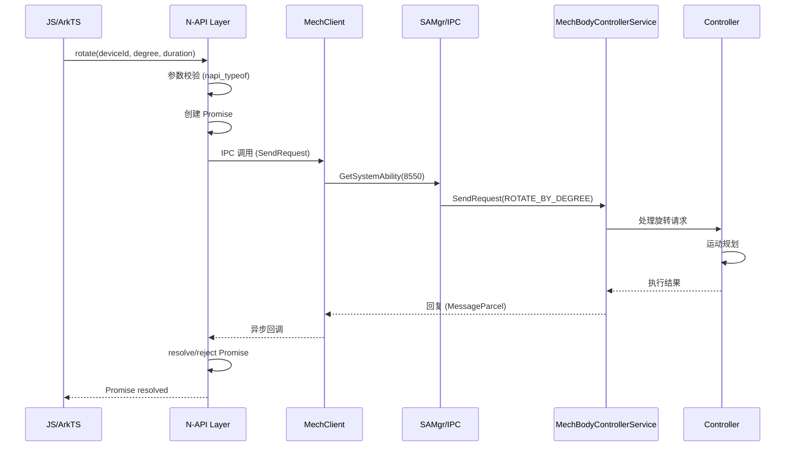
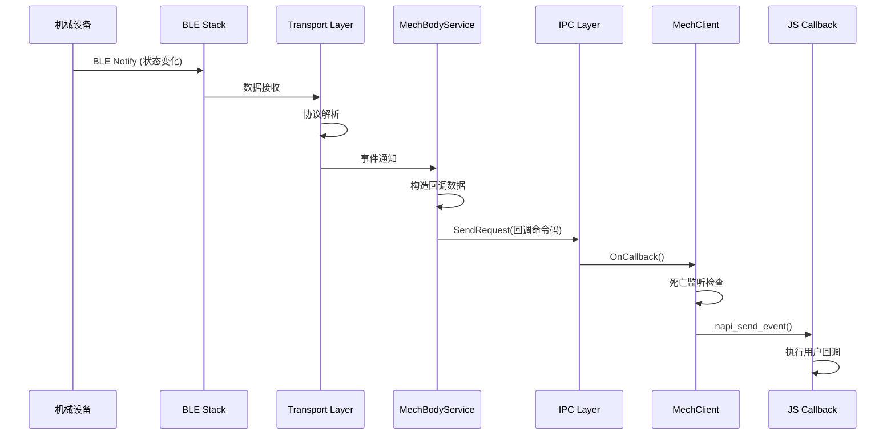

# 架构说明

## 系统架构图

```
┌─────────────────────────────────────────────────────────────────────┐
│                          应用层 (Applications)                        │
├─────────────────────────────────────────────────────────────────────┤
│   ┌──────────────────────┐    ┌──────────────────────┐              │
│   │   系统应用            │    │   第三方应用           │              │
│   │  (System Apps)       │    │  (3rd Party Apps)    │              │
│   │  - 完整 API 访问      │    │  - 有限 API 访问      │              │
│   │  - 权限: CONNECT_    │    │  - 需要权限检查        │              │
│   │    MECHANIC_HARDWARE │    │                      │              │
│   └──────────┬───────────┘    └──────────┬───────────┘              │
└──────────────┼─────────────────────────────┼────────────────────────┘
               │                             │
               ▼                             ▼
┌─────────────────────────────────────────────────────────────────────┐
│                      接口层 (Interface Layer)                        │
├────────────────────────────┬────────────────────────────────────────┤
│        N-API              │              ANI/ETS                     │
│  @ohos.mechbodyController │          TypeScript 接口                 │
│  (JavaScript/ArkTS)       │                                        │
├────────────────────────────┴────────────────────────────────────────┤
│                                                                    │
│  ┌──────────────────────────────────────────────────────────────┐  │
│  │                    MechClient                                │  │
│  │            (IPC 客户端代理, js_mech_manager_client.cpp)       │  │
│  └────────────────────────┬─────────────────────────────────────┘  │
│                           │ IPC 调用                                │
└───────────────────────────┼────────────────────────────────────────┘
                            │
┌───────────────────────────▼────────────────────────────────────────┐
│                    IPC/SystemAbility 层                              │
│                                                                    │
│  ┌──────────────────────────────────────────────────────────────┐  │
│  │              MechBodyControllerService                        │  │
│  │              (SystemAbility 8550)                            │  │
│  │              services/src/mechbody_controller_service.cpp    │  │
│  └────────────────────────┬─────────────────────────────────────┘  │
│                           │                                        │
│  ┌────────────────────────▼─────────────────────────────────────┐  │
│  │              MechBodyControllerStub                           │  │
│  │              (IPC Stub, 命令分发)                             │  │
│  │              services/src/mechbody_controller_stub.cpp       │  │
│  └────────────────────────┬─────────────────────────────────────┘  │
└───────────────────────────┼────────────────────────────────────────┘
                            │
┌───────────────────────────▼────────────────────────────────────────┐
│                       服务核心层 (Service Core)                      │
│                                                                    │
│  ┌─────────────┐ ┌─────────────┐ ┌─────────────┐ ┌─────────────┐ │
│  │  Controller │ │   Connect   │ │   Motion    │ │  Transport  │ │
│  │  控制器     │ │   连接管理   │ │   运动控制   │ │   协议传输   │ │
│  └──────┬──────┘ └──────┬──────┘ └──────┬──────┘ └──────┬──────┘ │
│         │               │               │               │          │
│         └───────────────┴───────┬───────┴───────────────┘          │
│                                 │                                    │
│  ┌─────────────────────────────▼──────────────────────────────────┐  │
│  │              McControllerManager                              │  │
│  │              (控制器协调器)                                     │  │
│  └─────────────────────────────┬──────────────────────────────────┘  │
└───────────────────────────────┼─────────────────────────────────────┘
                                │
┌───────────────────────────────▼────────────────────────────────────┐
│                        通信与硬件层                                   │
│                                                                    │
│  ┌─────────────────────┐      ┌─────────────────────┐              │
│  │   蓝牙通信服务       │      │    相机服务          │              │
│  │   (SA 1130)        │      │   (Camera HDI)     │              │
│  └──────────┬──────────┘      └──────────┬──────────┘              │
│             │ BLE GATT                     │ 人脸检测/元数据            │
│             ▼                             ▼                         │
│  ┌──────────────────────────────────────────────────────────────┐  │
│  │                   南向协议 (Vendor Specific)                  │  │
│  │               /system/lib*/libmech_adapter.z.so               │  │
│  └──────────────────────────────────────────────────────────────┘  │
│                                                                    │
└─────────────────────────────────────────────────────────────────────┘
```

## 数据流

### API 调用数据流

```
JS/ArkTS 应用
    │
    ▼
┌───────────────────┐
│  N-API (JS)       │  js_mech_manager.cpp
│  MechManager::*   │
└─────────┬─────────┘
          │
          ▼
┌───────────────────┐
│  MechClient       │  js_mech_manager_client.cpp
│  IPC 调用         │
└─────────┬─────────┘
          │
          ▼ (IPC: MessageParcel)
┌───────────────────┐
│  IPC/SAMgr       │  获取 SA 8550 代理
│  LoadSystemAbility│
└─────────┬─────────┘
          │
          ▼
┌───────────────────┐
│  MechBodyService  │  mechbody_controller_service.cpp
│  处理请求         │
└─────────┬─────────┘
          │
          ▼
┌───────────────────┐
│  Controller 模块  │
│  McController*    │
└─────────┬─────────┘
          │
          ▼
┌───────────────────┐
│  Transport 模块   │
│  BLE Send/Cmd    │
└─────────┬─────────┘
          │
          ▼
┌───────────────────┐
│  南向协议适配层    │  libmech_adapter.z.so
│  Vendor 硬件交互  │
└───────────────────┘
```

### 事件回调数据流

```
南向协议 (Vendor)
     │
     │ BLE 通知
     ▼
┌───────────────────┐
│  BLE Receive     │
│  蓝牙数据接收     │
└─────────┬─────────┘
          │
          ▼
┌───────────────────┐
│  Transport 模块   │
│  命令解析/分发     │
└─────────┬─────────┘
          │
          ▼ (回调注册: IRemoteObject)
┌───────────────────┐
│  Subscription    │
│  事件订阅中心     │
└─────────┬─────────┘
          │
          ▼
┌───────────────────┐
│  MechBodyStub    │
│  IPC 回调处理    │
└─────────┬─────────┘
          │ (IPC 回调)
          ▼
┌───────────────────┐
│  MechClient      │
│  接收 IPC 回调   │
└─────────┬─────────┘
          │
          ▼
┌───────────────────┐
│  N-API 回调      │
│  napi_send_event │
└─────────┬─────────┘
          │
          ▼
┌───────────────────┐
│  JS 回调函数      │
│  on() 注册的回调  │
└───────────────────┘
```

## 线程模型

### 线程划分

| 线程 | 职责 | 代码位置 |
|------|------|----------|
| **Main (App) Thread** | JS 执行、Promise resolution | js_mech_manager.cpp |
| **SA Main Thread** | SystemAbility 生命周期 | mechbody_controller_service.cpp |
| **IPC Thread** | IPC 请求处理 | mechbody_controller_stub.cpp |
| **JSNAPI Thread** | N-API 事件循环 | napi_send_event |
| **BLE I/O Thread** | 蓝牙数据收发 | ble_send_manager.cpp |

### 线程安全机制

| 机制 | 用途 | 实现 |
|------|------|------|
| **std::mutex** | 回调映射保护 | deviceAttachCallbackMutex |
| **std::lock_guard** | RAII 锁管理 | 各回调注册/注销 |
| **IRemoteObject::DeathRecipient** | 客户端死亡检测 | MechControllerIpcDeathListener |
| **napi_handle_scope** | JS 资源管理 | js_mech_manager_service.cpp |

### 关键时序

#### API 调用时序



#### 事件回调时序



## 模块职责

### Interface Layer（接口层）

| 模块 | 职责 | 关键文件 |
|------|------|----------|
| **N-API** | JS/ArkTS API 绑定 | js_mech_manager.cpp |
| **ANI/ETS** | TypeScript API 绑定 | ani_mech_manager.cpp |
| **Client** | IPC 客户端代理 | js_mech_manager_client.cpp |

### Service Core（服务核心）

| 模块 | 职责 | 关键文件 |
|------|------|----------|
| **Controller** | 高层控制逻辑、相机追踪协调 | mc_controller_manager.cpp |
| **Connect** | 蓝牙连接管理、状态监听 | mc_connect_manager.cpp |
| **Motion** | 运动规划、轨迹计算 | mc_motion_manager.cpp |
| **Transport** | 协议编码、命令构建、事件订阅 | mc_send_adapter.cpp |

### Configuration（配置）

| 配置 | 用途 | 文件 |
|------|------|------|
| **SA Profile** | SA 8550 注册 | sa_profile/8550.json |
| **Init Config** | 服务初始化、权限 | etc/init/mechbody.cfg |

## 依赖方向

```
┌────────────────────────────────────────────────────────────┐
│                     Interface Layer                        │
│         (无内部依赖，仅 external_deps)                      │
└────────────────────────┬─────────────────────────────────┘
                         │
                         ▼
┌────────────────────────────────────────────────────────────┐
│                     Service Core                           │
│                                                            │
│  ┌──────────────┐    ┌──────────────┐                    │
│  │  Controller  │◄───│    Motion    │                    │
│  └──────┬───────┘    └──────────────┘                    │
│         │                                                │
│         ▼                                                │
│  ┌──────────────┐    ┌──────────────┐                    │
│  │  Connect     │───►│  Transport   │                    │
│  └──────────────┘    └──────────────┘                    │
└────────────────────────────────────────────────────────────┘
                         │
                         ▼ (南向协议)
┌────────────────────────────────────────────────────────────┐
│                  Vendor Adapter (libmech_adapter)         │
│                                                            │
└────────────────────────────────────────────────────────────┘
```

## 稳定性标注

| 接口 | 稳定性 | 依据 |
|------|--------|------|
| **N-API (js_mech_manager)** | 稳定 | public/interface/napi/ 目录，标准化 API |
| **ANI (ani_mech_manager)** | 稳定 | public/interface/ets/ 目录，标准化 API |
| **IPC 接口** | 稳定 | DECLARE_INTERFACE_DESURATION 版本化 |
| **内部模块** | 不稳定 | internal/ 目录，可能变更 |

## 相关文档

- [N-API 参考](03_NAPI_Reference.md) → API 详细说明
- [内部 API](04_Inner_API.md) → 模块接口详情
- [安全评审](06_Security_Review.md) → 安全机制
