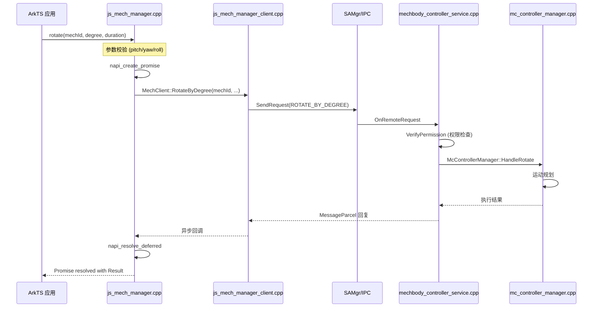
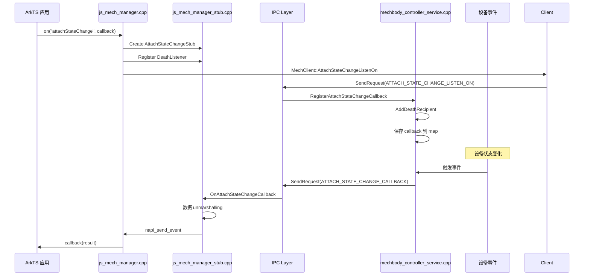

# N-API 接口参考

## 模块信息

| 属性 | 值 |
|------|-----|
| **模块名** | `distributedHardware.mechanicManager` |
| **入口文件** | `interface/napi/mech_manager/js_mech_manager.cpp` |
| **库文件** | `libmechanicmanager_napi.so` |
| **注册方式** | `napi_module_register` |

## API 清单

### 事件监听

| JS API | 方法 | 参数 | 返回值 | 同步/异步 | C++ 实现 |
|--------|------|------|--------|----------|----------|
| `on` | MechManager.On | `(event: string, callback: AsyncCallback<T>)` | void | 异步 | js_mech_manager.cpp:67 |
| `off` | MechManager.Off | `(event: string)` | void | 同步 | js_mech_manager.cpp:307 |

### 设备管理

| JS API | 方法 | 参数 | 返回值 | 同步/异步 | C++ 实现 |
|--------|------|------|--------|----------|----------|
| `getAttachedMechDevices` | GetAttachedDevices | `()` | `Array<MechInfo>` | 异步 | js_mech_manager.cpp:514 |
| `setUserOperation` | SetUserOperation | `(operation: Operation, mac: string, param: string)` | void | 异步 | js_mech_manager.cpp:563 |

### 相机追踪控制

| JS API | 方法 | 参数 | 返回值 | 同步/异步 | C++ 实现 |
|--------|------|------|--------|----------|----------|
| `setCameraTrackingEnabled` | SetCameraTrackingEnabled | `(enabled: boolean)` | void | 异步 | js_mech_manager.cpp:630 |
| `getCameraTrackingEnabled` | GetCameraTrackingEnabled | `()` | `boolean` | 异步 | js_mech_manager.cpp:677 |
| `setCameraTrackingLayout` | SetCameraTrackingLayout | `(layout: CameraTrackingLayout)` | void | 异步 | js_mech_manager.cpp:703 |
| `getCameraTrackingLayout` | GetCameraTrackingLayout | `()` | `CameraTrackingLayout` | 异步 | js_mech_manager.cpp:757 |

### 运动控制

| JS API | 方法 | 参数 | 返回值 | 同步/异步 | C++ 实现 |
|--------|------|------|--------|----------|----------|
| `rotate` | Rotate | `(mechId: number, degree: RotateByDegreeParam, duration: number)` | `Result` | 异步 (Promise) | js_mech_manager.cpp:784 |
| `rotateToEulerAngles` | RotateToEulerAngles | `(mechId: number, angle: EulerAngle, duration: number)` | `Result` | 异步 (Promise) | js_mech_manager.cpp:910 |
| `getMaxRotationTime` | GetMaxRotationTime | `(mechId: number)` | `number` | 异步 | js_mech_manager.cpp:1012 |
| `getMaxRotationSpeed` | GetMaxRotationSpeed | `(mechId: number)` | `number` | 异步 | js_mech_manager.cpp:1059 |
| `rotateBySpeed` | RotateBySpeed | `(mechId: number, speed: RotateBySpeedParam)` | `Result` | 异步 (Promise) | js_mech_manager.cpp:1134 |
| `stopMoving` | StopMoving | `(mechId: number)` | void | 异步 | js_mech_manager.cpp:1237 |

### 状态查询

| JS API | 方法 | 参数 | 返回值 | 同步/异步 | C++ 实现 |
|--------|------|------|--------|----------|----------|
| `getCurrentAngles` | GetCurrentAngles | `(mechId: number)` | `EulerAngle` | 异步 | js_mech_manager.cpp:1290 |
| `getRotationLimits` | GetRotationLimits | `(mechId: number)` | `RotationLimit` | 异步 | js_mech_manager.cpp:1341 |
| `getRotationAxesStatus` | GetRotationAxesStatus | `(mechId: number)` | `RotationAxesStatus` | 异步 | js_mech_manager.cpp:1382 |
| `searchTarget` | SearchTarget | `(mechId: number, type: TargetType, direction: SearchDirection)` | void | 异步 (Promise) | js_mech_manager.cpp:1424 |

## 枚举定义

### RotationAxisLimited

```typescript
enum RotationAxisLimited {
    NOT_LIMITED = 0,       // 无限制
    NEGATIVE_LIMITED = 1,  // 负向限制
    POSITIVE_LIMITED = 2,  // 正向限制
}
```

### Operation

```typescript
enum Operation {
    CONNECT = 0,     // 连接
    DISCONNECT = 1,  // 断开
}
```

### TrackingEvent

相机追踪状态变化事件类型。

### Result

```typescript
enum Result {
    COMPLETED = 0,    // 操作完成
    INTERRUPTED = 1, // 操作中断
    LIMITED = 2,      // 受限制
    TIMEOUT = 3,      // 超时
    SYSTEM_ERROR = 100, // 系统错误
}
```

### MechDeviceType

```typescript
enum MechDeviceType {
    GIMBAL_DEVICE = 0,  // 云台设备
}
```

### AttachState

```typescript
enum AttachState {
    ATTACHED = 0,   // 已连接
    DETACHED = 1,   // 已断开
}
```

### CameraTrackingLayout

```typescript
enum CameraTrackingLayout {
    DEFAULT = 0,  // 默认布局
    LEFT = 1,     // 左侧追踪
    MIDDLE = 2,   // 中间追踪
    RIGHT = 3,    // 右侧追踪
}
```

### TargetType

```typescript
enum TargetType {
    HUMAN_FACE = 0,  // 人脸
}
```

### SearchDirection

```typescript
enum SearchDirection {
    DEFAULT = 0,    // 默认方向
    LEFTWARD = 1,   // 向左搜索
    RIGHTWARD = 2,  // 向右搜索
}
```

## 接口定义

### MechInfo

```typescript
interface MechInfo {
    mechId: number;          // 设备 ID
    name: string;            // 设备名称
    type: MechDeviceType;    // 设备类型
    mac: string;             // MAC 地址
    attachState: AttachState; // 连接状态
}
```

### RotateByDegreeParam

```typescript
interface RotateByDegreeParam {
    pitch: number;   // Pitch 角度
    yaw: number;     // Yaw 角度
    roll: number;    // Roll 角度
}
```

### EulerAngle

```typescript
interface EulerAngle {
    pitch: number;   // Pitch 角度
    yaw: number;     // Yaw 角度
    roll: number;    // Roll 角度
}
```

### RotateBySpeedParam

```typescript
interface RotateBySpeedParam {
    pitch: number;   // Pitch 速度
    yaw: number;     // Yaw 速度
    roll: number;    // Roll 速度
}
```

### RotationLimit

```typescript
interface RotationLimit {
    pitch: RotationAxisLimited;
    yaw: RotationAxisLimited;
    roll: RotationAxisLimited;
}
```

### RotationAxesStatus

```typescript
interface RotationAxesStatus {
    pitch: number;   // Pitch 当前状态
    yaw: number;     // Yaw 当前状态
    roll: number;    // Roll 当前状态
}
```

## 参数校验规则

### 通用规则

| 参数类型 | 校验方式 | 错误码 | 文件:行 |
|----------|----------|--------|---------|
| 参数数量 | `argc < PARAM_COUNT_*` | PARAMETER_CHECK_FAILED | js_mech_manager.cpp:76 |
| 字符串 | `napi_typeof == napi_string` | PARAMETER_CHECK_FAILED | js_mech_manager.cpp:84 |
| 函数 | `napi_typeof == napi_function` | PARAMETER_CHECK_FAILED | js_mech_manager.cpp:102 |
| 整数 | `napi_get_value_int32` | PARAMETER_CHECK_FAILED | js_mech_manager.cpp:580 |
| 布尔 | `napi_get_value_bool` | PARAMETER_CHECK_FAILED | js_mech_manager.cpp:647 |
| 浮点数 | `napi_get_value_double` | PARAMETER_CHECK_FAILED | js_mech_manager.cpp:896 |
| 对象属性 | `napi_get_named_property` | PARAMETER_CHECK_FAILED | js_mech_manager.cpp:895 |

### 设备 ID 校验

```cpp
// services/src/mechbody_controller_service.cpp:515
if (mechId < 0) {
    return MECH_ID_INVALID;
}
```

### 持续时间校验

```cpp
// services/src/mechbody_controller_service.cpp:523
if (duration < 0) {
    return PARAMETER_CHECK_FAILED;
}
```

## 错误码

| 错误码 | 值 | 说明 |
|--------|-----|------|
| PARAMETER_CHECK_FAILED | -1 | 参数校验失败 |
| PERMISSION_DENIED | 202 | 权限拒绝 |
| SYSTEM_WORK_ABNORMALLY | -1 | 系统异常 |
| DEVICE_NOT_CONNECTED | -1 | 设备未连接 |
| DEVICE_NOT_SUPPORTED | -1 | 设备不支持 |
| MECH_ID_INVALID | -1 | 无效设备 ID |
| IPC_TOKEN_DOES_NOT_MATCH | 96468997 | IPC Token 不匹配 |
| INVALID_PID | 96468999 | 无效 PID |

## 权限要求

### 敏感 API（需要系统权限）

| API | 权限要求 | 验证方式 |
|-----|----------|----------|
| `rotate` | `ohos.permission.CONNECT_MECHANIC_HARDWARE` | AccessTokenKit::VerifyAccessToken |
| `rotateToEulerAngles` | `ohos.permission.CONNECT_MECHANIC_HARDWARE` | AccessTokenKit::VerifyAccessToken |
| `rotateBySpeed` | `ohos.permission.CONNECT_MECHANIC_HARDWARE` | AccessTokenKit::VerifyAccessToken |
| `stopMoving` | `ohos.permission.CONNECT_MECHANIC_HARDWARE` | AccessTokenKit::VerifyAccessToken |
| `getCurrentAngles` | `ohos.permission.CONNECT_MECHANIC_HARDWARE` | AccessTokenKit::VerifyAccessToken |

### 系统应用检查

```cpp
// js_mech_manager.cpp:1598-1600
uint32_t tokenId = IPCSkeleton::GetCallingTokenID();
if (!TokenIdKit::IsSystemAppByFullTokenID(tokenId)) {
    // 仅系统应用可用
}
```

## 调用链示例

### rotate() 调用链



### on() 事件监听调用链



## 异步模式

### Promise 模式（旋转操作）

```typescript
import { mechManager } from '@ohos.mechbodyController';

try {
    const result = await mechManager.rotate(mechId, degreeParam, duration);
    if (result === Result.COMPLETED) {
        console.log('旋转完成');
    }
} catch (error) {
    console.error('旋转失败:', error);
}
```

### Callback 模式（事件监听）

```typescript
import { mechManager } from '@ohos.mechbodyController';

mechManager.on('attachStateChange', (state: AttachState) => {
    if (state === AttachState.ATTACHED) {
        console.log('设备已连接');
    } else {
        console.log('设备已断开');
    }
});
```

### 异步 void 模式

```typescript
import { mechManager } from '@ohos.mechbodyController';

mechManager.setCameraTrackingEnabled(true).then(() => {
    console.log('相机追踪已开启');
}).catch((error) => {
    console.error('开启失败:', error);
});
```

## 相关文档

- [架构说明](02_Architecture.md) → 系统架构
- [安全评审](06_Security_Review.md) → API 安全
- [问题排查](07_Troubleshooting.md) → API 错误定位
