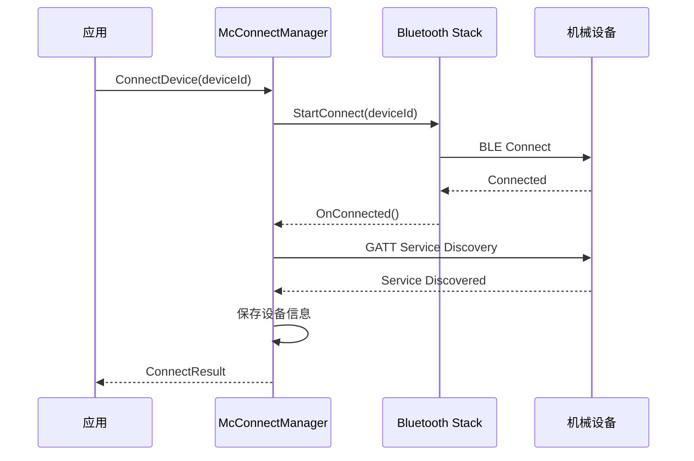

# 内部模块接口

## 模块概览

| 模块 | 职责 | 关键类 | 头文件 |
|------|------|--------|--------|
| **Controller** | 高层控制逻辑、相机追踪协调 | McControllerManager | controller/mc_controller_manager.h |
| **Connect** | 蓝牙连接管理、状态监听 | McConnectManager | connect/mc_connect_manager.h |
| **Motion** | 运动规划、轨迹计算 | McMotionManager | motion/mc_motion_manager.h |
| **Transport** | 协议编码、事件订阅 | McSendAdapter, McSubscriptionCenter | transport/mc_send_adapter.h |

## Controller 模块

### McControllerManager

**职责**：
- 协调各子控制器
- 处理高层控制命令
- 管理相机追踪

**头文件**：`services/include/controller/mc_controller_manager.h`

**关键方法**：

| 方法 | 参数 | 返回值 | 说明 |
|------|------|--------|------|
| `GetInstance()` | - | McControllerManager& | 单例获取 |
| `Initialize()` | - | int32_t | 初始化 |
| `Uninitialize()` | - | int32_t | 反初始化 |
| `HandleRotate` | mechId, params, callback | int32_t | 处理旋转请求 |
| `HandleCameraTracking` | enabled, layout | int32_t | 处理追踪请求 |

**依赖模块**：
- Motion 模块（运动控制）
- Connect 模块（设备状态）
- Transport 模块（协议发送）

### McCameraTrackingController

**职责**：
- 相机追踪逻辑协调
- 目标检测协调
- 追踪状态管理

**头文件**：`services/include/controller/mc_camera_tracking_controller.h`

**关键方法**：

| 方法 | 参数 | 返回值 | 说明 |
|------|------|--------|------|
| `GetInstance()` | - | McCameraTrackingController& | 单例 |
| `SetTrackingEnabled` | enabled, tokenId | int32_t | 设置追踪开关 |
| `GetTrackingEnabled` | tokenId | bool | 获取追踪状态 |
| `SetTrackingLayout` | layout, tokenId | int32_t | 设置追踪布局 |
| `GetTrackingLayout` | tokenId | CameraTrackingLayout | 获取追踪布局 |
| `OnTargetDetected` | targetInfo | void | 目标检测回调 |

## Connect 模块

### McConnectManager

**职责**：
- 蓝牙设备发现
- 设备连接管理
- 连接状态维护

**头文件**：`services/include/connect/mc_connect_manager.h`

**关键方法**：

| 方法 | 参数 | 返回值 | 说明 |
|------|------|--------|------|
| `GetInstance()` | - | McConnectManager& | 单例 |
| `StartDiscovery` | - | int32_t | 开始发现设备 |
| `StopDiscovery` | - | int32_t | 停止发现 |
| `ConnectDevice` | deviceId | int32_t | 连接设备 |
| `DisconnectDevice` | deviceId | int32_t | 断开连接 |
| `GetConnectedDevices` | - | std::vector<std::shared_ptr<MechInfo>> | 获取已连接设备 |
| `RegisterStateCallback` | callback | int32_t | 注册状态回调 |

### BluetoothStateAdapter

**职责**：
- 蓝牙状态适配
- 状态机管理

**头文件**：`services/include/connect/bluetooth_state_adapter.h`

**关键方法**：

| 方法 | 参数 | 返回值 | 说明 |
|------|------|--------|------|
| `GetInstance()` | - | BluetoothStateAdapter& | 单例 |
| `IsEnabled()` | - | bool | 蓝牙是否开启 |
| `RegisterStateListener` | listener | int32_t | 注册状态监听 |
| `UnregisterStateListener` | listener | int32_t | 注销监听 |

### BluetoothServiceStatusChangeListener

**职责**：监听蓝牙 SA 状态变化。

**头文件**：`services/include/ble_send_manager.h:141-146`

## Motion 模块

### McMotionManager

**职责**：
- 运动轨迹规划
- 速度计算
- 运动参数管理

**头文件**：`services/include/motion/mc_motion_manager.h`

**关键方法**：

| 方法 | 参数 | 返回值 | 说明 |
|------|------|--------|------|
| `GetInstance()` | - | McMotionManager& | 单例 |
| `CalculateTrajectory` | target, duration | std::shared_ptr<Trajectory> | 计算轨迹 |
| `GetMaxRotationTime` | mechId | int32_t | 获取最大旋转时间 |
| `GetMaxRotationSpeed` | mechId | int32_t | 获取最大旋转速度 |
| `ValidateRotation` | angle, limits | bool | 校验旋转范围 |

## Transport 模块

### McSendAdapter

**职责**：
- BLE 数据发送
- 协议命令封装
- 数据分片与重组

**头文件**：`services/include/transport/mc_send_adapter.h`

**关键方法**：

| 方法 | 参数 | 返回值 | 说明 |
|------|------|--------|------|
| `SendCommand` | deviceId, command | int32_t | 发送命令 |
| `SendData` | deviceId, data, length | int32_t | 发送数据 |
| `SetSendCallback` | callback | void | 设置发送回调 |

### McProtocolConvertor

**职责**：
- 协议编码/解码
- 命令与参数序列化

**头文件**：`services/include/transport/mc_protocol_convertor.h`

### McSubscriptionCenter

**职责**：
- 事件订阅管理
- 事件分发

**头文件**：`services/include/transport/mc_subscription_center.h`

**关键方法**：

| 方法 | 参数 | 返回值 | 说明 |
|------|------|--------|------|
| `Subscribe` | eventType, callback | int32_t | 订阅事件 |
| `Unsubscribe` | subscriptionId | int32_t | 取消订阅 |
| `Publish` | event | int32_t | 发布事件 |
| `GetSubscriberCount` | eventType | int32_t | 获取订阅者数量 |

### McEventListener

**职责**：事件监听接口。

**头文件**：`services/include/transport/mc_event_listener.h`

## 命令实现（Transport/Command）

### 协议版本

| 版本 | 目录 | 说明 |
|------|------|------|
| **0x01** | `transport/command/0x01/` | 基础命令集 |
| **0x02** | `transport/command/0x02/` | 扩展命令集 |
| **v1** | `transport/command/v1/` | v1 版本 |
| **v2** | `transport/command/v2/` | v2 版本 |

### 关键命令类

| 命令类 | 版本 | 用途 |
|--------|------|------|
| McCommandBase | 所有 | 命令基类 |
| McRotateCommand | 0x01/0x02 | 旋转命令 |
| McCameraTrackingCommand | 0x01 | 相机追踪命令 |
| McConfigCommand | 0x02 | 配置命令 |
| McStatusCommand | v1/v2 | 状态查询命令 |

## IPC 接口

### IMechBodyController

**职责**：IPC 远程接口定义。

**头文件**：`services/include/mechbody_controller_interface.h`

**关键方法**：

| 方法 | 命令码 | 用途 |
|------|--------|------|
| `RegisterAttachStateChangeCallback` | ATTACH_STATE_CHANGE_LISTEN_ON | 注册连接状态回调 |
| `UnregisterAttachStateChangeCallback` | ATTACH_STATE_CHANGE_LISTEN_OFF | 注销连接状态回调 |
| `GetAttachedDevices` | GET_ATTACHED_DEVICES | 获取设备列表 |
| `SetUserOperation` | SET_USER_OPERATION | 设置用户操作 |
| `SetCameraTrackingEnabled` | SET_CAMERA_TRACKING_ENABLED | 设置追踪开关 |
| `GetCameraTrackingEnabled` | GET_CAMERA_TRACKING_ENABLED | 获取追踪状态 |
| `RegisterTrackingEventCallback` | TRACKING_EVENT_LISTEN_ON | 注册追踪事件回调 |
| `RegisterCmdChannel` | REGISTER_CMD_CHANNEL | 注册命令通道 |
| `RotateByDegree` | ROTATE_BY_DEGREE | 角度旋转 |
| `RotateBySpeed` | ROTATE_BY_SPEED | 速度旋转 |
| `StopMoving` | STOP_MOVING | 停止移动 |
| `GetCurrentAngle` | GET_CURRENT_ANGLE | 获取当前角度 |
| `GetRotationLimit` | GET_ROTATION_LIMIT | 获取旋转限制 |

### MechBodyControllerStub

**职责**：IPC Stub 实现，命令分发。

**头文件**：`services/include/mechbody_controller_stub.h`

**关键方法**：

| 方法 | 参数 | 返回值 | 说明 |
|------|------|--------|------|
| `OnRemoteRequest` | code, data, reply, option | int32_t | IPC 请求分发 |
| `AttachStateChangeListenOnInner` | data, reply | int32_t | 连接状态监听 |
| `GetAttachedDevicesInner` | data, reply | int32_t | 获取设备 |
| `RotateByDegreeInner` | data, reply | int32_t | 旋转处理 |

### MechBodyControllerService

**职责**：SystemAbility + IPC Stub。

**头文件**：`services/include/mechbody_controller_service.h`

**关键方法**：

| 方法 | 参数 | 返回值 | 说明 |
|------|------|--------|------|
| `GetInstance()` | - | MechBodyControllerService& | 单例 |
| `OnStart` | startReason | void | SA 启动 |
| `OnStop` | - | void | SA 停止 |
| `RegisterAttachStateChangeCallback` | callback | int32_t | 注册回调 |
| `RegisterRotationAxesStatusChangeCallback` | callback | int32_t | 注册轴状态回调 |

## 数据类型

### MechInfo

```cpp
struct MechInfo {
    int32_t mechId;                    // 设备 ID
    std::string name;                  // 设备名称
    MechDeviceType type;                // 设备类型
    std::string mac;                   // MAC 地址
    AttachState attachState;           // 连接状态
    std::shared_ptr<DeviceCapability> capability; // 设备能力
};
```

### RotateByDegreeParam

```cpp
struct RotateByDegreeParam {
    double pitch;                      // Pitch 角度
    double yaw;                        // Yaw 角度
    double roll;                       // Roll 角度
};
```

### EulerAngle

```cpp
struct EulerAngle {
    double pitch;                      // Pitch
    double yaw;                        // Yaw
    double roll;                       // Roll
};
```

### RotationLimit

```cpp
struct RotationLimit {
    RotationAxisLimited pitch;        // Pitch 限制
    RotationAxisLimited yaw;           // Yaw 限制
    RotationAxisLimited roll;         // Roll 限制
};
```

### RotationAxesStatus

```cpp
struct RotationAxesStatus {
    int32_t pitch;                     // Pitch 状态
    int32_t yaw;                      // Yaw 状态
    int32_t roll;                     // Roll 状态
};
```

## 生命周期

### 服务初始化

```mermaid
stateDiagram
    [*] --> Uninitialized: 模块加载
    Uninitialized --> Init: Initialize()
    Init --> Ready: McControllerManager::Initialize()
    Init --> Failed: 初始化失败
    Ready --> Running: OnStart()
    Running --> Stopped: OnStop()
    Stopped --> Uninitialized: Uninitialize()
    Running --> Failed: 严重错误
    Failed --> [*]
```

### 设备连接流程



## 依赖关系

```
Interface Layer (N-API/ANI)
         │
         ▼
┌────────────────────────┐
│   MechBodyController   │
│   (Service + Stub)     │
└───────────┬────────────┘
            │
    ┌───────┴───────┐
    │               │
    ▼               ▼
┌─────────┐   ┌─────────────────┐
│Controller│   │   Transport    │
│          │   │   (Protocol)   │
└────┬─────┘   └────────┬────────┘
     │                  │
     │           ┌──────┴──────┐
     │           │             │
     ▼           ▼             ▼
┌─────────┐ ┌─────────┐ ┌─────────┐
│  Motion │ │ Connect │ │   BLE   │
│         │ │         │ │ Stack   │
└─────────┘ └─────────┘ └─────────┘
```

## 稳定性标注

| 接口/模块 | 稳定性 | 依据 |
|-----------|--------|------|
| **IMechBodyController** | 稳定 | DECLARE_INTERFACE_DESCRIPTOR |
| **MechBodyControllerStub** | 稳定 | IPC Stub 实现 |
| **McControllerManager** | 稳定 | internal 目录，但对外接口稳定 |
| **McConnectManager** | 稳定 | internal 目录 |
| **McMotionManager** | 稳定 | internal 目录 |
| **McSendAdapter** | 稳定 | internal 目录 |
| **Transport/Command/\*** | 不稳定 | 协议实现，可能变更 |

## 相关文档

- [架构说明](02_Architecture.md) → 模块交互
- [N-API 参考](03_NAPI_Reference.md) → 接口使用
- [安全评审](06_Security_Review.md) → 接口安全
