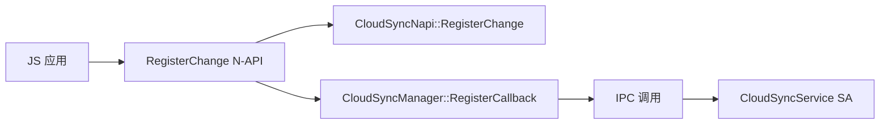

# 对外 N-API 接口

## 文档信息

| 项目 | 内容 |
|------|------|
| 目标读者 | 应用开发者、NDK 开发者 |
| 目的 | 理解对外暴露的 JavaScript / NDK 接口 |
| 前置知识 | OpenHarmony N-API 机制 |
| 代码证据 | `interfaces/kits/js/cloudfilesync/cloud_sync_n_exporter.cpp` |

## 接口概览

本服务提供三层对外接口：

| 接口类型 | 位置 | 使用场景 |
|----------|------|----------|
| JS N-API | `interfaces/kits/js/` | ArkTS / JavaScript 应用 |
| NDK C | `interfaces/kits/ndk/` | 原生应用（C / C++） |
| ANI | `interfaces/kits/js/ani/` | ArkTS Native Interface（新一代） |

---

## JS N-API 模块：file.cloudSync

### 模块注册信息

| 项目 | 内容 |
|------|------|
| 模块名 | `file.cloudSync` |
| 注册文件 | `interfaces/kits/js/cloudfilesync/cloud_sync_n_exporter.cpp:256-259` |
| 注册函数 | `CloudSyncExport` |
| N-API 版本 | 1 |

**注册代码**：

```cpp
// interfaces/kits/js/cloudfilesync/cloud_sync_n_exporter.cpp:246-259
static napi_module _module = {
    .nm_version = 1,
    .nm_flags = 0,
    .nm_filename = nullptr,
    .nm_register_func = CloudSyncExport,
    .nm_modname = "file.cloudSync",
    .nm_priv = ((void *)0),
    .reserved = {0}
};

extern "C" __attribute__((constructor)) void RegisterModule(void)
{
    napi_module_register(&_module);
}
```

### 导出函数清单

| 函数名 | 绑定文件 | 实现类 | 说明 |
|--------|----------|--------|------|
| `getFileSyncState` | `cloud_sync_n_exporter.cpp:199` | `CloudSyncNapi` | 获取文件同步状态 |
| `getCoreFileSyncState` | `cloud_sync_n_exporter.cpp:200` | `CloudSyncNapi` | 获取核心文件同步状态 |
| `optimizeStorage` | `cloud_sync_n_exporter.cpp:201` | `CloudSyncNapi` | 优化存储空间 |
| `startOptimizeSpace` | `cloud_sync_n_exporter.cpp:202` | `CloudSyncNapi` | 开始优化空间 |
| `stopOptimizeSpace` | `cloud_sync_n_exporter.cpp:203` | `CloudSyncNapi` | 停止优化空间 |
| `registerChange` | `cloud_sync_n_exporter.cpp:226` | `CloudSyncNapi` | 注册变更监听 |
| `unregisterChange` | `cloud_sync_n_exporter.cpp:227` | `CloudSyncNapi` | 注销变更监听 |

### 导出类清单

| 类名 | 实现文件 | 说明 |
|------|----------|------|
| `MultiDlProgressNapi` | `multi_download_progress_napi.cpp` | 多文件下载进度 |
| `CloudFileCacheNapi` | `cloud_file_cache_napi.cpp` | 云文件缓存 |
| `CloudFileDownloadNapi` | `cloud_file_napi.cpp` | 云文件下载 |
| `GallerySyncNapi` | `gallery_sync_napi.cpp` | 图库同步 |
| `FileSyncNapi` | `file_sync_napi.cpp` | 文件同步 |
| `FileVersionNapi` | `cloud_file_version_napi.cpp` | 文件版本 |

### 导出枚举清单

#### SyncState（同步状态）

| 枚举值 | 值 | 说明 |
|--------|-------|------|
| `UPLOADING` | - | 上传中 |
| `UPLOAD_FAILED` | - | 上传失败 |
| `DOWNLOADING` | - | 下载中 |
| `DOWNLOAD_FAILED` | - | 下载失败 |
| `COMPLETED` | - | 完成 |
| `STOPPED` | - | 已停止 |

**定义位置**：`cloud_sync_n_exporter.cpp:85-100`

#### OptimizeState（优化状态）

| 枚举值 | 值 | 说明 |
|--------|-------|------|
| `RUNNING` | - | 运行中 |
| `COMPLETED` | - | 完成 |
| `FAILED` | - | 失败 |
| `STOPPED` | - | 已停止 |

**定义位置**：`cloud_sync_n_exporter.cpp:102-115`

#### FileSyncState（文件同步状态）

| 枚举值 | 值 | 说明 |
|--------|-------|------|
| `UPLOADING` | - | 上传中 |
| `DOWNLOADING` | - | 下载中 |
| `COMPLETED` | - | 完成 |
| `STOPPED` | - | 已停止 |
| `TO_BE_UPLOADED` | - | 待上传 |
| `UPLOAD_FAILURE` | - | 上传失败 |
| `UPLOAD_SUCCESS` | - | 上传成功 |

**定义位置**：`cloud_sync_n_exporter.cpp:117-133`

#### FileState（文件状态）

| 枚举值 | 值 | 说明 |
|--------|-------|------|
| `INITIAL_AFTER_DOWNLOAD` | - | 下载后初始化 |
| `UPLOADING` | - | 上传中 |
| `STOPPED` | - | 已停止 |
| `TO_BE_UPLOADED` | - | 待上传 |
| `UPLOAD_SUCCESS` | - | 上传成功 |
| `UPLOAD_FAILURE` | - | 上传失败 |

**定义位置**：`cloud_sync_n_exporter.cpp:135-151`

#### ErrorType（错误类型）

| 枚举值 | 值 | 说明 |
|--------|-------|------|
| `NO_ERROR` | - | 无错误 |
| `NETWORK_UNAVAILABLE` | - | 网络不可用 |
| `WIFI_UNAVAILABLE` | - | WiFi 不可用 |
| `BATTERY_LEVEL_LOW` | - | 电量低 |
| `BATTERY_LEVEL_WARNING` | - | 电量警告 |
| `CLOUD_STORAGE_FULL` | - | 云存储满 |
| `LOCAL_STORAGE_FULL` | - | 本地存储满 |
| `DEVICE_TEMPERATURE_TOO_HIGH` | - | 设备温度过高 |
| `REMOTE_SERVER_ABNORMAL` | - | 远端服务器异常 |

**定义位置**：`cloud_sync_n_exporter.cpp:153-172`

#### DownloadErrorType（下载错误类型）

| 枚举值 | 值 | 说明 |
|--------|-------|------|
| `NO_ERROR` | - | 无错误 |
| `UNKNOWN_ERROR` | - | 未知错误 |
| `NETWORK_UNAVAILABLE` | - | 网络不可用 |
| `LOCAL_STORAGE_FULL` | - | 本地存储满 |
| `CONTENT_NOT_FOUND` | - | 内容未找到 |
| `FREQUENT_USER_REQUESTS` | - | 用户请求过于频繁 |

**定义位置**：`cloud_sync_n_exporter.cpp:174-194`

#### NotifyType（通知类型）

| 枚举值 | 值 | 说明 |
|--------|-------|------|
| `NOTIFY_ADDED` | - | 新增 |
| `NOTIFY_MODIFIED` | - | 修改 |
| `NOTIFY_DELETED` | - | 删除 |
| `NOTIFY_RENAMED` | - | 重命名 |

**定义位置**：`cloud_sync_n_exporter.cpp:208-221`

#### DownloadFileType（下载文件类型）

| 枚举值 | 值 | 说明 |
|--------|-------|------|
| `CONTENT` | - | 文件内容 |
| `THUMBNAIL` | - | 缩略图 |
| `LCD` | - | LCD 图 |

**定义位置**：`cloud_sync_n_exporter.cpp:232-244`

---

## CloudSyncNapi 类详细接口

### 类定义

**头文件**：`interfaces/kits/js/cloudfilesync/cloud_sync_napi.h`

**命名空间**：`OHOS::FileManagement::CloudSync`

### 静态方法清单

| 方法名 | 参数 | 返回值 | 同步/异步 | 说明 |
|--------|------|--------|----------|------|
| `GetFileSyncState` | `env, info` | `napi_value` | 异步（Promise/Callback） | 获取文件同步状态 |
| `GetCoreFileSyncState` | `env, info` | `napi_value` | 异步 | 获取核心文件同步状态 |
| `OptimizeStorage` | `env, info` | `napi_value` | 异步 | 优化存储空间 |
| `StartOptimizeStorage` | `env, info` | `napi_value` | 异步 | 开始优化空间 |
| `StopOptimizeStorage` | `env, info` | `napi_value` | 异步 | 停止优化空间 |
| `RegisterChange` | `env, info` | `napi_value` | 异步 | 注册变更监听 |
| `UnregisterChange` | `env, info` | `napi_value` | 异步 | 注销变更监听 |
| `Start` | `env, info` | `napi_value` | 异步 | 启动同步 |
| `Stop` | `env, info` | `napi_value` | 异步 | 停止同步 |
| `OnCallback` | `env, info` | `napi_value` | 异步 | 注册回调 |
| `OffCallback` | `env, info` | `napi_value` | 异步 | 注销回调 |

### GetFileSyncState 详细说明

| 项目 | 内容 |
|------|------|
| 原型 | `static napi_value GetFileSyncState(napi_env env, napi_callback_info info)` |
| 实现文件 | `cloud_sync_napi.cpp` |
| 调用类 | `CloudSyncManager` |
| 实现行 | `cloud_sync_napi.cpp:78` |
| 支持模式 | Promise / Callback |

### RegisterChange 详细说明

| 项目 | 内容 |
|------|------|
| 原型 | `static napi_value RegisterChange(napi_env env, napi_callback_info info)` |
| 实现文件 | `cloud_sync_napi.cpp` |
| 调用文件 | `cloud_sync_napi.cpp:80` |
| 权限要求 | `ohos.permission.CLOUDFILE_SYNC` |
| 回调参数 | `progress` 事件类型 |

**调用链**：



---

## FileSyncNapi 类详细接口

### 类定义

**头文件**：`interfaces/kits/js/cloudfilesync/file_sync_napi.h`

**继承**：`CloudSyncNapi`

### 方法清单

| 方法名 | 参数 | 返回值 | 说明 |
|--------|------|--------|------|
| `GetLastSyncTime` | `env, info` | `napi_value` | 获取最后同步时间 |
| `Start` | `env, info` | `napi_value` | 启动文件同步 |
| `Stop` | `env, info` | `napi_value` | 停止文件同步 |
| `OnCallback` | `env, info` | `napi_value` | 注册同步回调 |
| `OffCallback` | `env, info` | `napi_value` | 注销同步回调 |

### GetLastSyncTime 详细说明

| 项目 | 内容 |
|------|------|
| 原型 | `static napi_value GetLastSyncTime(napi_env env, napi_callback_info info)` |
| 实现文件 | `file_sync_napi.cpp` |
| 实现行 | `file_sync_napi.cpp:36-82` |
| 返回类型 | `int64_t`（时间戳） |
| 支持模式 | Promise / Callback |

---

## CloudFileCacheNapi 类详细接口

### 类定义

**头文件**：`interfaces/kits/js/cloudfilesync/cloud_file_cache_napi.h`

### 方法清单

| 方法名 | 参数 | 返回值 | 说明 |
|--------|------|--------|------|
| `StartFileCache` | `env, info` | `napi_value` | 开始文件缓存 |
| `StartBatchFileCache` | `env, info` | `napi_value` | 开始批量文件缓存 |
| `StopFileCache` | `env, info` | `napi_value` | 停止文件缓存 |
| `StopBatchFileCache` | `env, info` | `napi_value` | 停止批量文件缓存 |
| `On` | `env, info` | `napi_value` | 注册进度监听 |
| `Off` | `env, info` | `napi_value` | 注销进度监听 |
| `CleanCloudFileCache` | `env, info` | `napi_value` | 清理云文件缓存 |
| `CleanFileCache` | `env, info` | `napi_value` | 清理文件缓存 |

---

## FileVersionNapi 类详细接口

### 类定义

**头文件**：`interfaces/kits/js/cloudfilesync/cloud_file_version_napi.h`

### 方法清单

| 方法名 | 参数 | 返回值 | 说明 |
|--------|------|--------|------|
| `GetHistoryVersionList` | `env, info` | `napi_value` | 获取历史版本列表 |
| `DownloadHistoryVersion` | `env, info` | `napi_value` | 下载历史版本 |
| `ReplaceFileWithHistoryVersion` | `env, info` | `napi_value` | 用历史版本替换文件 |
| `IsConflict` | `env, info` | `napi_value` | 检查冲突 |
| `ClearFileConflict` | `env, info` | `napi_value` | 清除文件冲突 |

---

## MultiDlProgressNapi 类详细接口

### 类定义

**头文件**：`interfaces/kits/js/cloudfilesync/multi_download_progress_napi.h`

### 方法清单

| 方法名 | 参数 | 返回值 | 说明 |
|--------|------|--------|------|
| `GetStatus` | `env, info` | `napi_value` | 获取状态 |
| `GetTaskId` | `env, info` | `napi_value` | 获取任务 ID |
| `GetDownloadedNum` | `env, info` | `napi_value` | 获取已下载数量 |
| `GetFailedNum` | `env, info` | `napi_value` | 获取失败数量 |
| `GetTotalNum` | `env, info` | `napi_value` | 获取总数量 |
| `GetDownloadedSize` | `env, info` | `napi_value` | 获取已下载大小 |
| `GetTotalSize` | `env, info` | `napi_value` | 获取总大小 |
| `GetErrorType` | `env, info` | `napi_value` | 获取错误类型 |
| `GetFailedFileList` | `env, info` | `napi_value` | 获取失败文件列表 |
| `GetDownloadedFileList` | `env, info` | `napi_value` | 获取已下载文件列表 |

---

## NDK C 接口

### 云盘管理模块

**定义文件**：`interfaces/kits/ndk/clouddiskmanager/liboh_cloud_disk_manager.ndk.json`

**头文件**：`interfaces/kits/ndk/clouddiskmanager/include/oh_cloud_disk_manager.h`

**API 版本**：21

#### API 清单

| API 名 | 首次引入版本 | 说明 |
|--------|-------------|------|
| `OH_CloudDisk_RegisterSyncFolderChanges` | 21 | 注册同步文件夹变更监听 |
| `OH_CloudDisk_UnregisterSyncFolderChanges` | 21 | 注销同步文件夹变更监听 |
| `OH_CloudDisk_GetSyncFolderChanges` | 21 | 获取同步文件夹变更 |
| `OH_CloudDisk_SetFileSyncStates` | 21 | 设置文件同步状态 |
| `OH_CloudDisk_GetFileSyncStates` | 21 | 获取文件同步状态 |
| `OH_CloudDisk_RegisterSyncFolder` | 21 | 注册同步文件夹 |
| `OH_CloudDisk_UnregisterSyncFolder` | 21 | 注销同步文件夹 |
| `OH_CloudDisk_ActiveSyncFolder` | 21 | 激活同步文件夹 |
| `OH_CloudDisk_DeactiveSyncFolder` | 21 | 停用同步文件夹 |
| `OH_CloudDisk_GetSyncFolders` | 21 | 获取同步文件夹列表 |
| `OH_CloudDisk_UpdateCustomAlias` | 21 | 更新自定义别名 |

---

## ANI 接口（新一代）

### 文件云同步

**位置**：`interfaces/kits/js/ani/file_cloud_sync/`

| 头文件 | 职责 |
|--------|------|
| `cloud_sync_ani.h` | 云同步 ANI |
| `file_sync_ani.h` | 文件同步 ANI |
| `cloud_download_ani.h` | 云下载 ANI |
| `file_version_ani.h` | 文件版本 ANI |

### 云同步管理

**位置**：`interfaces/kits/js/ani/file_cloud_sync_manager/`

| 头文件 | 职责 |
|--------|------|
| `cloud_sync_manager_ani.h` | 云同步管理 ANI |

---

## 权限要求

### JS N-API 权限

| 模块 | 权限 | 说明 |
|------|------|------|
| file.cloudSync | `ohos.permission.CLOUDFILE_SYNC` | 云文件同步 |
| cloudSyncManager | `ohos.permission.CLOUDFILE_SYNC_MANAGER` | 云同步管理 |

### 权限校验入口

| 文件 | 行号 | 方法 |
|------|------|------|
| `cloud_sync_napi.cpp` | 1112-1131 | `CheckPermissions` |
| `downgrade_download_napi.cpp` | 30-36 | `CheckPermissions` |

**权限校验代码**：

```cpp
// cloud_sync_napi.cpp:1112-1131
static int32_t CheckPermissions(const string &permission, bool isSystemApp)
{
    if (!permission.empty() && !DfsuAccessTokenHelper::CheckCallerPermission(permission)) {
        LOGE("permission denied");
        return E_PERMISSION_DENIED;
    }
    if (isSystemApp && !DfsuAccessTokenHelper::IsSystemApp()) {
        // ...
    }
}
```

---

## 相关跳转

- 架构设计：[01_Architecture.md](./01_Architecture.md)
- 内部接口：[03_Inner-API.md](./03_Inner-API.md)
- 安全评审：[06_Security.md](./06_Security.md)
- 关键调用链：[appendix/Callgraphs.md](./appendix/Callgraphs.md)
