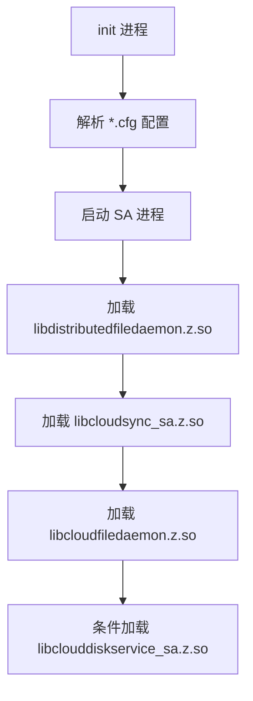

# 编译产物

## 文档信息

| 项目 | 内容 |
|------|------|
| 目标读者 | 系统集成者、测试工程师 |
| 目的 | 了解编译产物的清单、安装路径和加载关系 |
| 前置知识 | GN 构建系统 |
| 代码证据 | `BUILD.gn`、`services/BUILD.gn` |

## 产物清单

### 共享库（.so）

| 产物名 | 源目录 | 目标类型 | 安装路径 | 职责 |
|--------|--------|----------|----------|------|
| `libdistributedfiledaemon.z.so` | services/distributedfiledaemon | shared_library | `/system/lib/` | 分布式文件守护主库 |
| `libcloudsync_sa.z.so` | services/cloudsyncservice | shared_library | `/system/lib/` | 云同步服务 |
| `libcloudfiledaemon.z.so` | services/cloudfiledaemon | shared_library | `/system/lib/` | 云文件守护 |
| `libclouddiskservice_sa.z.so` | services/clouddiskservice | shared_library | `/system/lib/` | 云盘服务 |
| `libcloudsync.ndk.so` | interfaces/kits/js/cloudfilesync | shared_library | `/system/lib/module/file/` | JS 云同步 N-API |
| `libohclouddiskmanager.z.so` | interfaces/kits/ndk/clouddiskmanager | shared_library | `/system/lib/` | NDK 云盘接口 |
| `distributed_file_daemon_kit_inner` | services/distributedfiledaemon | shared_library | `/system/lib/` | Inner API 库 |

### Inner API 库

| 产物名 | 源目录 | 安装路径 | 职责 |
|--------|--------|----------|------|
| `cloudsync_kit_inner` | interfaces/inner_api/native/cloudsync_kit_inner | - | 云同步 Inner Kit |
| `cloud_daemon_kit_inner` | interfaces/inner_api/native/cloud_daemon_kit_inner | - | 云守护 Inner Kit |
| `cloud_file_kit_inner` | interfaces/inner_api/native/cloud_file_kit_inner | - | 云文件 Inner Kit |
| `clouddiskservice_kit_inner` | interfaces/inner_api/native/clouddiskservice_kit_inner | - | 云盘服务 Inner Kit |
| `cloudsync_asset_kit_inner` | interfaces/inner_api/native/cloudsync_kit_inner | - | 云同步资源 Inner Kit |

### 可执行文件

| 产物名 | 源目录 | 安装路径 | 职责 |
|--------|--------|----------|------|
| `sa_main` | 系统模板 | `/system/bin/` | SA 进程入口 |
| `cloudfiledaemon` | services/cloudfiledaemon | `/system/bin/` | 云文件守护进程 |

### 配置文件

| 产物名 | 源目录 | 安装路径 | 职责 |
|--------|--------|----------|------|
| `distributedfiledaemon.cfg` | services | `/system/etc/init/` | 分布式守护配置 |
| `clouddiskservice.cfg` | services | `/system/etc/init/` | 云盘服务配置 |
| `cloudfiledaemon.cfg` | services | `/system/etc/init/` | 云文件守护配置 |

### 参数文件

| 产物名 | 源目录 | 安装路径 | 职责 |
|--------|--------|----------|------|
| `distributed_file.para` | services | `/system/etc/param/` | 分布式文件参数 |
| `cloudsyncservice.para` | services/cloudsyncservice | `/system/etc/param/` | 云同步服务参数 |
| `cloudsyncservice.para.dac` | services/cloudsyncservice | `/system/etc/param/` | DAC 参数 |

### SA Profile

| 产物名 | 源目录 | 职责 |
|--------|--------|------|
| `distributedfile_sa_profile` | services | 包含 5201/5204/5205 SA |
| `clouddiskservice_sa_profile` | services | 5207 SA |

---

## 安装路径详情

### 系统库目录

```
/system/lib/
├── libdistributedfiledaemon.z.so
├── libcloudsync_sa.z.so
├── libcloudfiledaemon.z.so
├── libclouddiskservice_sa.z.so
└── libohclouddiskmanager.z.so

/system/lib/module/file/
└── libcloudsync.ndk.so
```

### 系统可执行目录

```
/system/bin/
├── sa_main
└── cloudfiledaemon
```

### 配置文件目录

```
/system/etc/init/
├── distributedfiledaemon.cfg
├── clouddiskservice.cfg
└── cloudfiledaemon.cfg

/system/etc/param/
├── distributed_file.para
├── cloudsyncservice.para
└── cloudsyncservice.para.dac
```

### 服务数据目录

```
/data/service/el1/public/cloudfile/
└── (由 distributedfile.cfg 创建)
```

---

## 运行时加载关系

### 系统启动流程



### 应用加载链


---

## SA 注册产物

### SA ID 与产物映射

| SA ID | 服务名 | 产物 | 配置文件 | 启动方式 |
|-------|--------|------|----------|----------|
| 5201 | DistributedFileDaemon | libdistributedfiledaemon.z.so | 5201.json | 设备上线触发 |
| 5204 | CloudSyncService | libcloudsync_sa.z.so | 5204.json | WiFi/充电/屏幕事件 |
| 5205 | CloudDaemon | libcloudfiledaemon.z.so | cloudfiledaemon.cfg | run-on-create |
| 5207 | CloudDiskService | libclouddiskservice_sa.z.so | clouddiskservice.cfg | 用户解锁 |

---

## 静态库产物

| 产物名 | 源目录 | 说明 |
|--------|--------|------|
| `libcloudsync_sa_static.a` | services/cloudsyncservice | 云同步服务静态库 |

---

## NDK API 定义产物

| 产物名 | 定义文件 | API 数量 | 说明 |
|--------|----------|----------|------|
| `liboh_cloud_disk_manager.ndk.json` | interfaces/kits/ndk/clouddiskmanager | 11 | NDK C 接口定义 |

---

## 相关跳转

- GN 构建配置：[04_Build.md](./04_Build.md)
- 架构设计：[01_Architecture.md](./01_Architecture.md)
- 安全评审：[06_Security.md](./06_Security.md)
