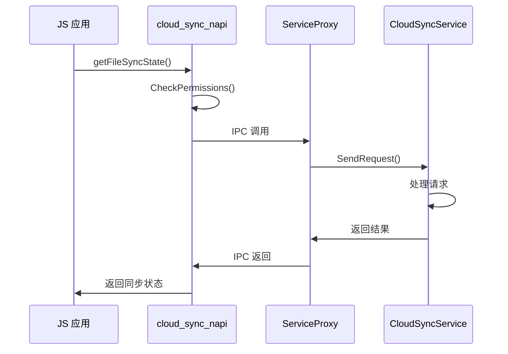

# 关键调用链

## 文档信息

| 项目 | 内容 |
|------|------|
| 目标读者 | 开发者、调试工程师 |
| 目的 | 理解关键功能的完整调用链路 |
| 格式 | Mermaid 时序图 + 文字描述 |

---

## 1. 文件云同步调用链

### JS 调用路径

```
┌──────────┐     ┌──────────────┐     ┌──────────────────┐     ┌─────────────────┐
│  JS 应用  │────▶│ file.cloudSync │────▶│ cloudsync.ndk.so │────▶│ CloudSyncService │
│          │     │   (N-API)      │     │  (框架层)         │     │     (SA 5204)   │
└──────────┘     └──────────────┘     └──────────────────┘     └─────────────────┘
```

### 关键代码路径

| 层级 | 文件 | 说明 |
|------|------|------|
| JS | `cloud_sync_napi.cpp` | N-API 入口 |
| 框架 | `cloud_sync_manager_impl.cpp` | 客户端实现 |
| IPC | `service_proxy.cpp` | IPC 代理 |
| 服务 | `cloud_sync_service.cpp` | 服务主类 |

### Mermaid 时序图



---

## 2. 云盘管理调用链

### NDK 调用路径

```
┌──────────┐     ┌───────────────────┐     ┌─────────────────┐
│ NDK 应用  │────▶│ oh_cloud_disk_     │────▶│ CloudDiskService │
│          │     │ manager.cpp        │     │     (SA 5207)   │
└──────────┘     └───────────────────┘     └─────────────────┘
```

### 关键代码路径

| 层级 | 文件 | 说明 |
|------|------|------|
| NDK | `oh_cloud_disk_manager.cpp` | NDK 接口实现 |
| 框架 | `cloud_disk_service_manager_impl.cpp` | 客户端实现 |
| IPC | `cloud_disk_service_stub.cpp` | IPC 存根 |
| 服务 | `cloud_disk_service.cpp` | 服务主类 |

---

## 3. 分布式文件操作调用链

### 调用路径

```
┌──────────┐     ┌───────────────────┐     ┌─────────────────┐
│  应用     │────▶│ distributed_file_ │────▶│ DistributedFile │
│          │     │   inner 框架       │     │ Daemon (SA 5201)│
└──────────┘     └───────────────────┘     └─────────────────┘
```

### 关键代码路径

| 层级 | 文件 | 说明 |
|------|------|------|
| 框架 | `distributed_file_daemon_proxy.cpp` | 代理实现 |
| 框架 | `file_copy_manager.cpp` | 文件复制管理 |
| IPC | `daemon_stub.cpp` | IPC 存根 |
| 服务 | `daemon.cpp` | 服务主类 |

---

## 4. 权限校验调用链

### 统一校验路径

```
┌──────────┐     ┌───────────────────┐     ┌─────────────────┐
│  调用方   │────▶│ CheckCallerPermission │────▶│ AccessTokenKit │
└──────────┘     └───────────────────┘     └─────────────────┘
```

### 关键代码路径

| 文件 | 说明 |
|------|------|
| `dfsu_access_token_helper.cpp` | 权限校验辅助类 |
| `IPCSkeleton::GetCallingTokenID()` | 获取调用者 Token |
| `AccessTokenKit::VerifyAccessToken()` | 验证权限 |

---

## 5. 设备上线触发链

### 调用路径

```
┌──────────┐     ┌───────────────────┐     ┌─────────────────┐
│ 软总线    │────▶│ DeviceManager     │────▶│ DistributedFile │
│ 事件      │     │ Agent             │     │ Daemon          │
└──────────┘     └───────────────────┘     └─────────────────┘
```

### 关键代码路径

| 文件 | 说明 |
|------|------|
| `device_manager_agent.cpp` | 设备管理代理 |
| `all_connect_manager.cpp` | 全连接管理 |
| `mount_manager.cpp` | 挂载点管理 |

---

## 6. 文件传输核心调用链

### 调用路径

```
┌──────────┐     ┌───────────────────┐     ┌─────────────────┐
│  发起方   │────▶│ FileCopyManager   │────▶│ SoftBus         │
└──────────┘     └───────────────────┘     └─────────────────┘
```

### 关键代码路径

| 文件 | 说明 |
|------|------|
| `file_copy_manager.cpp` | 文件复制管理 |
| `remote_file_copy_manager.cpp` | 远程文件复制 |
| `softbus_adapter.cpp` | SoftBus 适配 |

---

## 相关跳转

- 架构设计：[01_Architecture.md](../01_Architecture.md)
- 对外接口：[02_N-API.md](../02_N-API.md)
- 内部接口：[03_Inner-API.md](../03_Inner-API.md)
