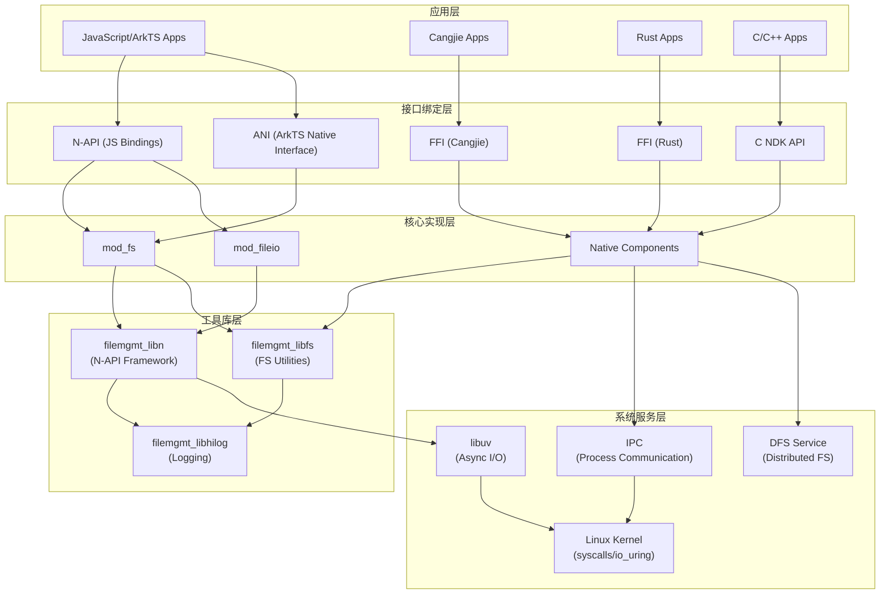
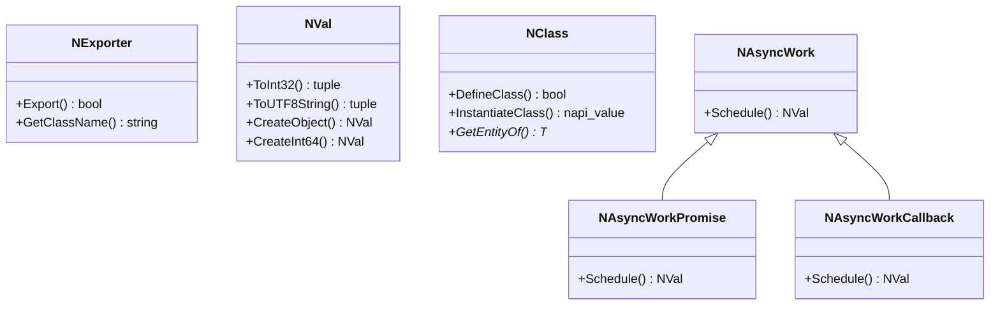
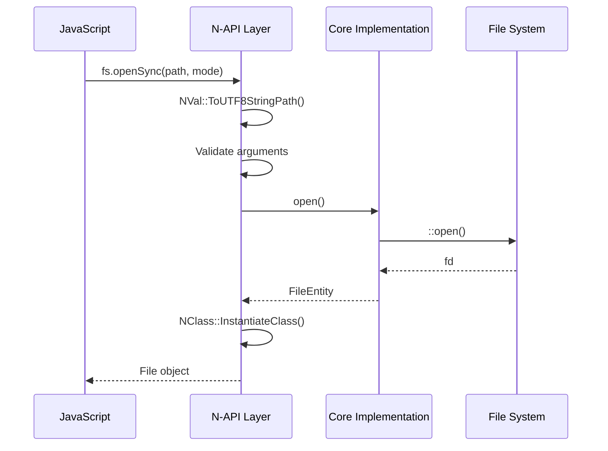
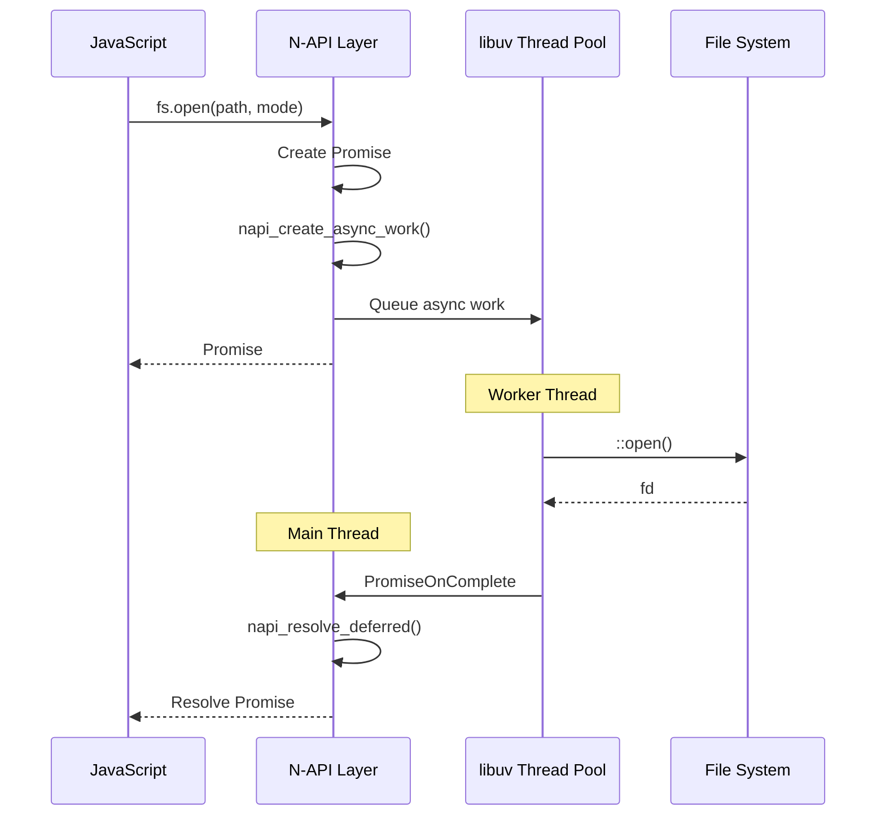
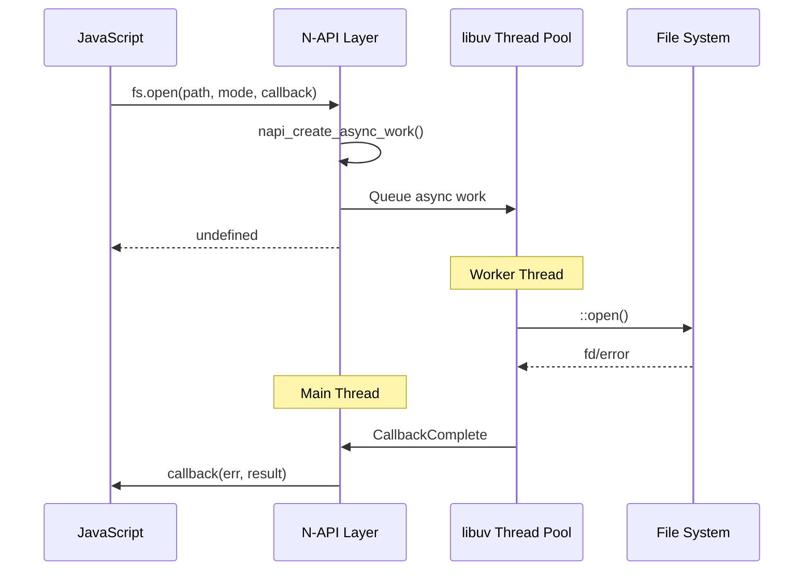
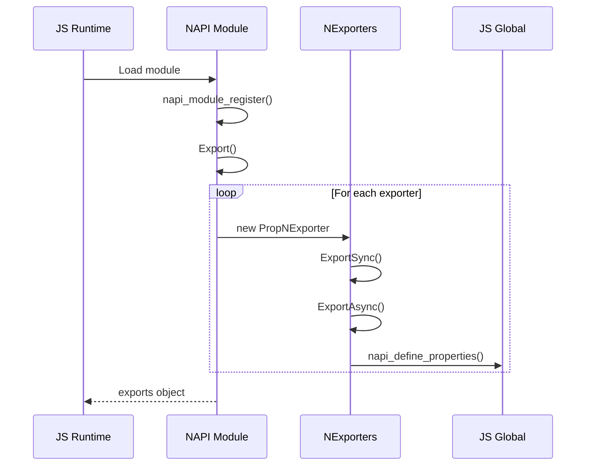
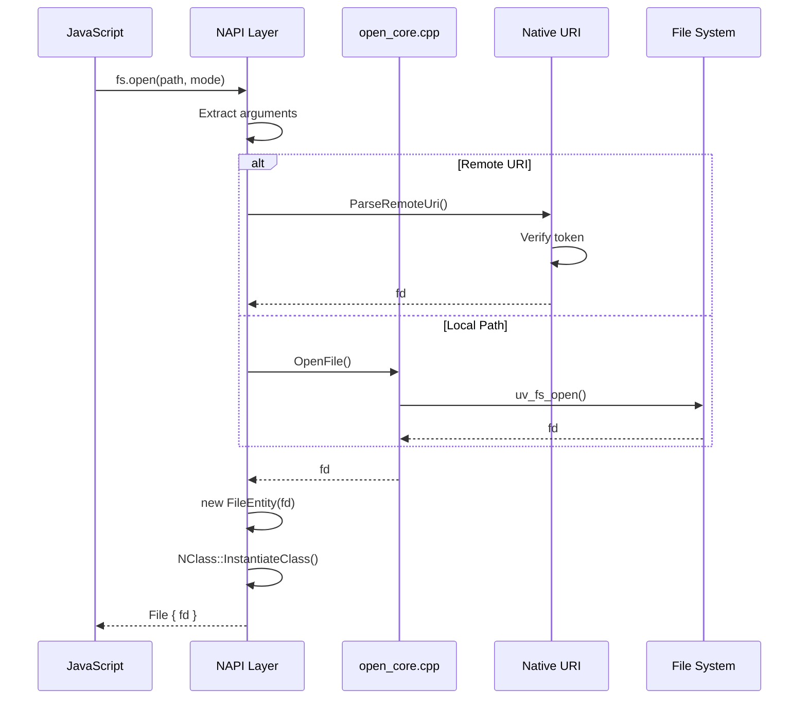
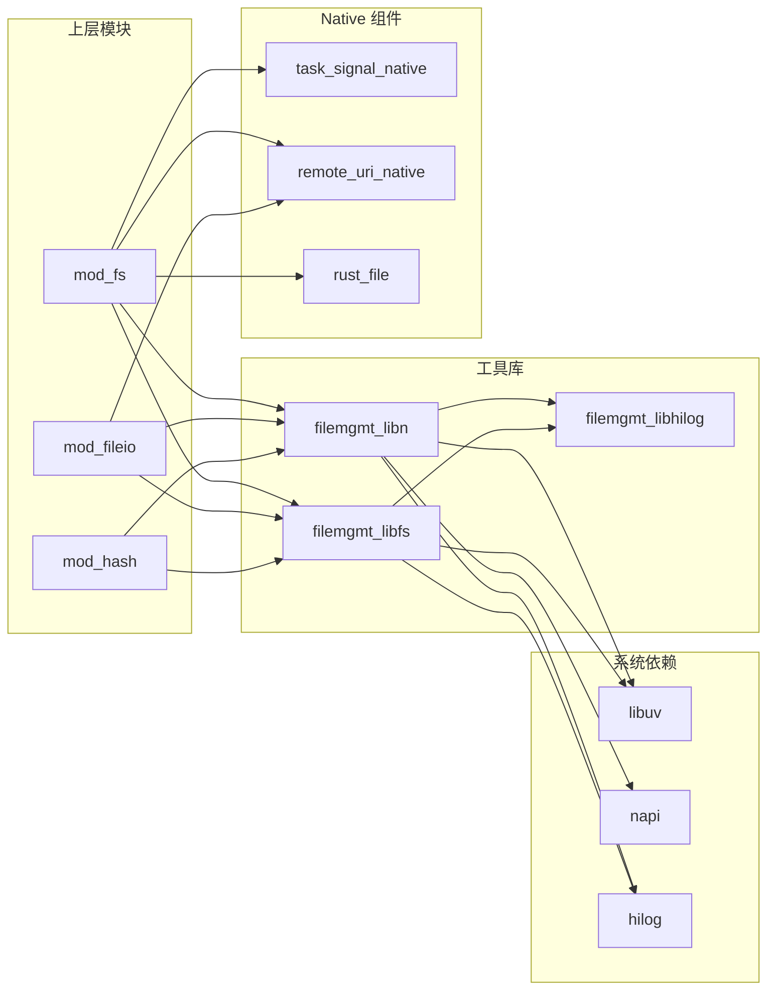

# 系统架构

## 架构总览

File API 采用分层架构设计，将多语言接口、核心功能实现和系统底层能力分离，确保可扩展性和可维护性。



## 组件详细说明

### 1. 接口绑定层

#### N-API (JavaScript 绑定)
- **位置**: `interfaces/kits/js/src/`
- **技术**: Node-API (N-API)
- **用途**: 将 C++ 实现暴露给 JavaScript 运行时
- **特点**: 
  - 稳定 ABI，跨版本兼容
  - 支持同步和异步调用
  - 使用 LibN 框架简化开发

#### ANI (ArkTS Native Interface)
- **位置**: `interfaces/kits/js/src/mod_fs/ani/`
- **技术**: ANI (新一代 JS 运行时绑定)
- **用途**: 为 ArkTS 提供更高性能的 Native 调用
- **特点**:
  - 直接方法调用，无需序列化
  - 更好的类型安全检查
  - 更低的调用开销

#### FFI (Cangjie/Rust)
- **位置**: `interfaces/kits/cj/src/`, `interfaces/kits/rust/src/`
- **技术**: FFI (Foreign Function Interface)
- **用途**: 支持 Cangjie 和 Rust 语言调用
- **特点**:
  - 零成本抽象
  - 内存安全保证（Rust）

### 2. 核心实现层

#### mod_fs (新版文件系统模块)
- **位置**: `interfaces/kits/js/src/mod_fs/`
- **JS 模块**: `@ohos.file.fs`
- **核心类**:
  - `FileEntity`: 文件实体封装
  - `StreamEntity`: 流实体封装
  - `WatcherEntity`: 文件监控实体
  - `TaskSignal`: 任务取消信号

#### mod_fileio (旧版模块)
- **位置**: `interfaces/kits/js/src/mod_fileio/`
- **JS 模块**: `@ohos.fileio`
- **状态**: 维护模式，新开发使用 mod_fs

#### Native 组件
- **位置**: `interfaces/kits/native/`
- **组件**:
  - `TaskSignal`: 跨模块任务取消机制
  - `RemoteUri`: URI 解析和远程文件支持
  - `Environment`: 系统目录访问

### 3. 工具库层 (LibN 框架)



**LibN 关键组件**:

| 类/文件 | 职责 | 位置 |
|---------|------|------|
| `NExporter` | 模块导出基类 | `utils/filemgmt_libn/include/n_exporter.h:29` |
| `NVal` | N-API 值封装 | `utils/filemgmt_libn/include/n_val.h` |
| `NClass` | JS 类定义 | `utils/filemgmt_libn/include/n_class.h` |
| `NAsyncWorkPromise` | Promise 异步模式 | `utils/filemgmt_libn/include/n_async/n_async_work_promise.h:24` |
| `NAsyncWorkCallback` | Callback 异步模式 | `utils/filemgmt_libn/include/n_async/n_async_work_callback.h:24` |

## 数据流

### 同步调用流程



### 异步调用流程 (Promise 模式)



### 异步调用流程 (Callback 模式)



## 线程模型

### 线程架构

```
┌─────────────────────────────────────────────────────────────┐
│                        主线程 (JS 线程)                       │
│  ┌──────────────┐  ┌──────────────┐  ┌──────────────┐      │
│  │  N-API 调用   │  │ Promise 回调  │  │ 事件循环      │      │
│  └──────────────┘  └──────────────┘  └──────────────┘      │
└─────────────────────────────────────────────────────────────┘
                              │
                              ▼
┌─────────────────────────────────────────────────────────────┐
│                   libuv 线程池 (可配置)                        │
│  ┌──────────┐ ┌──────────┐ ┌──────────┐ ┌──────────┐       │
│  │ Worker 1 │ │ Worker 2 │ │ Worker 3 │ │ Worker 4 │       │
│  │ 文件 IO  │ │ 文件 IO  │ │ 文件 IO  │ │ 文件 IO  │       │
│  └──────────┘ └──────────┘ └──────────┘ └──────────┘       │
└─────────────────────────────────────────────────────────────┘
                              │
                              ▼
┌─────────────────────────────────────────────────────────────┐
│                      专用后台线程                              │
│  ┌──────────────────┐  ┌──────────────────┐                 │
│  │ Watcher Thread   │  │ HyperAIO Thread  │                 │
│  │ (inotify 监听)    │  │ (io_uring 收割)   │                 │
│  └──────────────────┘  └──────────────────┘                 │
└─────────────────────────────────────────────────────────────┘
```

### 关键线程说明

| 线程 | 用途 | 实现位置 |
|------|------|----------|
| JS 主线程 | 执行 JavaScript，处理回调 | ArkTS 运行时 |
| libuv Worker | 执行异步文件 IO | `libuv:uv` |
| Watcher Thread | 监听文件系统事件 | `interfaces/kits/js/src/mod_fs/class_watcher/fs_file_watcher.h:70` |
| HyperAIO Thread | 收割 io_uring CQE | `interfaces/kits/hyperaio/include/hyperaio.h:96` |
| Copy Notify Thread | 发送复制进度通知 | `interfaces/kits/js/src/mod_fs/properties/copy_core.h:57` |

### 线程安全机制

1. **N-API 回调保证**: 所有 JS 回调在主线程执行
2. **原子操作**: 使用 `std::atomic` 保护共享状态
3. **互斥锁**: 关键数据结构使用 `std::mutex`
4. **Thread-Local Storage**: ANI 使用 TLS 管理线程环境

```cpp
// ANI TLS 示例 (interfaces/kits/js/src/common/ani_helper/ani_helper.h:169-171)
static ani_env *&GetThreadEnvStorage() {
    static thread_local ani_env *env { nullptr };
    return env;
}
```

## 关键时序

### 模块加载时序



### 文件打开时序



## 依赖关系

### 模块依赖图



## 架构设计原则

1. **分层隔离**: 接口层、核心层、工具库层、系统层清晰分离
2. **多语言支持**: 通过 FFI/ANI/N-API 支持多种编程语言
3. **异步优先**: 所有 IO 操作均支持异步模式，避免阻塞 JS 线程
4. **资源安全**: RAII 模式管理资源，自动释放文件描述符
5. **平台抽象**: LibN 和 LibFS 提供平台无关的抽象层
