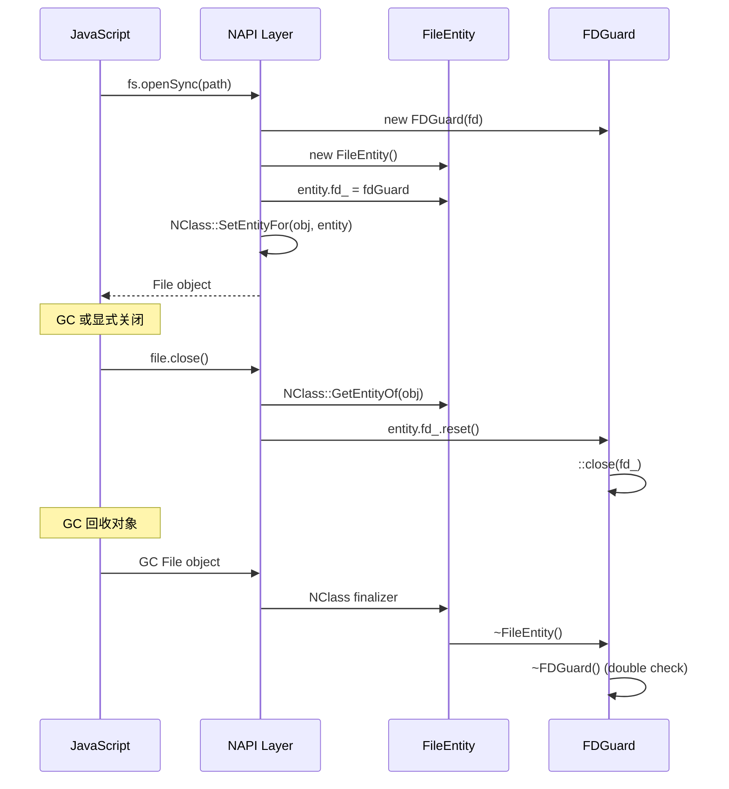

# LibN 框架详解

## 概述

**LibN** (Library for N-API) 是 File API 项目中封装 Node-API (N-API) 的 C++ 框架，提供面向对象的编程接口，简化 Native 模块开发。

**设计目标**:
1. 简化 N-API 复杂的使用模式
2. 提供类型安全的参数处理
3. 统一异步编程模型
4. 自动化资源生命周期管理

## 核心组件

### 1. NVal - N-API 值封装

**文件**: `utils/filemgmt_libn/include/n_val.h`

封装 `napi_value`，提供类型安全的值操作。

```cpp
class NVal {
public:
    // 创建值
    static NVal CreateObject(napi_env env);
    static NVal CreateInt64(napi_env env, int64_t value);
    static NVal CreateUndefined(napi_env env);
    
    // 类型检查
    bool TypeIs(napi_valuetype type) const;
    bool IsBuffer() const;
    
    // 类型转换
    std::tuple<bool, int64_t> ToInt64() const;
    std::tuple<bool, std::unique_ptr<char[]>, size_t> ToUTF8String() const;
    std::tuple<bool, void*, size_t> ToBuffer() const;
    
    // 属性操作
    NVal AddProp(const std::vector<napi_property_descriptor> &props);
    static napi_property_descriptor DeclareNapiProperty(const char *name, napi_value val);
    static napi_property_descriptor DeclareNapiFunction(const char *name, napi_callback func);
};
```

**使用示例**:
```cpp
// 创建对象
NVal obj = NVal::CreateObject(env);

// 添加属性
obj.AddProp({
    NVal::DeclareNapiProperty("name", NVal::CreateUTF8String(env, "value").val_),
    NVal::DeclareNapiFunction("method", Method),
});

// 参数转换
auto [succ, path, len] = NVal(env, argv[0]).ToUTF8String();
if (!succ) {
    // 处理错误
}
```

### 2. NFuncArg - 参数处理

**文件**: `utils/filemgmt_libn/include/n_func_arg.h`

简化函数参数解析。

```cpp
class NFuncArg {
public:
    NFuncArg(napi_env env, napi_callback_info info);
    
    // 初始化参数范围
    bool InitArgs(size_t minArgc, size_t maxArgc);
    
    // 访问参数
    napi_value operator[](size_t pos) const;
    size_t GetArgc() const;
    napi_value GetThisVar() const;
};
```

**使用示例**:
```cpp
napi_value MyFunction(napi_env env, napi_callback_info info) {
    NFuncArg funcArg(env, info);
    
    // 要求 1-3 个参数
    if (!funcArg.InitArgs(NARG_CNT::ONE, NARG_CNT::THREE)) {
        UniError(EINVAL).ThrowErr(env, "Invalid argument count");
        return nullptr;
    }
    
    // 访问参数
    auto [succ, path] = NVal(env, funcArg[NARG_POS::FIRST]).ToUTF8StringPath();
    if (funcArg.GetArgc() >= NARG_CNT::TWO) {
        auto [succ, mode] = NVal(env, funcArg[NARG_POS::SECOND]).ToInt32();
    }
    
    // ...
}
```

### 3. NClass - JS 类定义

**文件**: `utils/filemgmt_libn/include/n_class.h`

简化 JavaScript 类定义和实例化。

```cpp
class NClass {
public:
    // 定义类
    static bool DefineClass(napi_env env, 
                           const std::string &className,
                           const napi_callback constructor,
                           const std::vector<napi_property_descriptor> &props);
    
    // 实例化
    static napi_value InstantiateClass(napi_env env, 
                                       const std::string &className,
                                       std::initializer_list<napi_value> args);
    
    // 实体管理
    template <class T>
    static T *GetEntityOf(napi_env env, napi_value obj);
    
    template <class T>
    static bool SetEntityFor(napi_env env, napi_value obj, std::unique_ptr<T> entity);
};
```

**使用示例**:
```cpp
// 定义 File 类
bool RegisterFileClass(napi_env env) {
    vector<napi_property_descriptor> props = {
        NVal::DeclareNapiFunction("read", FileRead),
        NVal::DeclareNapiFunction("write", FileWrite),
        NVal::DeclareNapiFunction("close", FileClose),
    };
    
    return NClass::DefineClass(env, "File", FileConstructor, props);
}

// 实例化 File 对象
napi_value CreateFileObject(napi_env env, int fd) {
    auto entity = std::make_unique<FileEntity>();
    entity->fd_ = std::make_unique<FDGuard>(fd);
    
    napi_value obj = NClass::InstantiateClass(env, "File", { NVal::CreateInt64(env, fd).val_ });
    NClass::SetEntityFor<FileEntity>(env, obj, std::move(entity));
    
    return obj;
}

// 获取实体
napi_value FileRead(napi_env env, napi_callback_info info) {
    NFuncArg funcArg(env, info);
    funcArg.InitArgs(NARG_CNT::ONE);
    
    auto fileEntity = NClass::GetEntityOf<FileEntity>(env, funcArg.GetThisVar());
    int fd = fileEntity->fd_->GetFD();
    
    // 使用 fd 读取数据
    // ...
}
```

### 4. NExporter - 模块导出器

**文件**: `utils/filemgmt_libn/include/n_exporter.h`

基类，用于模块导出。

```cpp
class NExporter {
public:
    NExporter(napi_env env, napi_value exports);
    virtual ~NExporter() = default;
    
    // 导出方法/属性
    virtual bool Export() = 0;
    
    // 获取类名
    virtual std::string GetClassName() = 0;
    
protected:
    NVal exports_;
};
```

**典型实现**:
```cpp
class PropNExporter final : public NExporter {
public:
    PropNExporter(napi_env env, napi_value exports);
    
    bool Export() override;
    std::string GetClassName() override;
    
private:
    // 导出同步方法
    bool ExportSync();
    // 导出异步方法
    bool ExportAsync();
    
    // 方法实现
    static napi_value AccessSync(napi_env env, napi_callback_info info);
    static napi_value Access(napi_env env, napi_callback_info info);
    static napi_value MkdirSync(napi_env env, napi_callback_info info);
    // ... 更多方法
};

bool PropNExporter::Export() {
    return ExportSync() && ExportAsync();
}

bool PropNExporter::ExportSync() {
    return exports_.AddProp({
        NVal::DeclareNapiFunction("accessSync", AccessSync),
        NVal::DeclareNapiFunction("mkdirSync", MkdirSync),
        // ...
    });
}
```

### 5. 异步工作类

#### NAsyncWork - 基类

**文件**: `utils/filemgmt_libn/include/n_async/n_async_work.h`

```cpp
class NAsyncWork {
public:
    NAsyncWork(napi_env env, NVal thisVar);
    virtual ~NAsyncWork();
    
protected:
    napi_env env_;
    NVal thisVar_;
    std::unique_ptr<NAsyncContext> ctx_;
};
```

#### NAsyncWorkPromise - Promise 模式

**文件**: `utils/filemgmt_libn/include/n_async/n_async_work_promise.h`

```cpp
class NAsyncWorkPromise : public NAsyncWork {
public:
    NAsyncWorkPromise(napi_env env, NVal thisVar);
    
    // 调度异步工作
    NVal Schedule(const std::string &procedureName,
                  NContextCBExec cbExec,
                  NContextCBComplete cbComplete);
};
```

**执行流程**:
```cpp
napi_value AsyncOpen(napi_env env, napi_callback_info info) {
    // 1. 解析参数
    NFuncArg funcArg(env, info);
    auto [succ, path] = NVal(env, funcArg[NARG_POS::FIRST]).ToUTF8StringPath();
    
    // 2. 定义执行函数（在工作线程执行）
    auto cbExec = [path = string(path.get())](napi_env env) -> UniError {
        int fd = open(path.c_str(), O_RDONLY);
        if (fd < 0) {
            return UniError(errno);
        }
        return UniError(ERRNO_NOERR);
    };
    
    // 3. 定义完成函数（在主线程执行，转换结果）
    auto cbComplete = [](napi_env env, UniError err) -> NVal {
        if (err) {
            return { env, err.GetNapiErr(env) };
        }
        return NVal::CreateInt64(env, fd);
    };
    
    // 4. 调度异步工作
    NVal thisVar(env, funcArg.GetThisVar());
    return NAsyncWorkPromise(env, thisVar).Schedule("FileOpen", cbExec, cbComplete).val_;
}
```

**实现机制** (`utils/filemgmt_libn/src/n_async/n_async_work_promise.cpp:64-96`):
```cpp
NVal NAsyncWorkPromise::Schedule(string procedureName, 
                                  NContextCBExec cbExec, 
                                  NContextCBComplete cbComplete) {
    // 创建 Promise
    napi_value promise;
    napi_create_promise(env_, &ctx_->deferred_, &promise);
    
    // 创建异步工作
    napi_value resourceName;
    napi_create_string_utf8(env_, procedureName.c_str(), NAPI_AUTO_LENGTH, &resourceName);
    
    napi_create_async_work(env_, nullptr, resourceName,
                           PromiseOnExec,      // 执行函数
                           PromiseOnComplete,  // 完成函数
                           ctx_.get(), &ctx_->awork_);
    
    // 保存回调
    ctx_->cbExec = std::move(cbExec);
    ctx_->cbComplete = std::move(cbComplete);
    
    // 加入队列
    napi_queue_async_work(env_, ctx_->awork_);
    ctx_->release_ = false;
    
    return NVal(env_, promise);
}
```

#### NAsyncWorkCallback - Callback 模式

**文件**: `utils/filemgmt_libn/include/n_async/n_async_work_callback.h`

```cpp
class NAsyncWorkCallback : public NAsyncWork {
public:
    NAsyncWorkCallback(napi_env env, NVal thisVar, NVal cb);
    
    NVal Schedule(const std::string &procedureName,
                  NContextCBExec cbExec,
                  NContextCBComplete cbComplete);
};
```

**使用示例**:
```cpp
napi_value AsyncOpenWithCallback(napi_env env, napi_callback_info info) {
    NFuncArg funcArg(env, info);
    auto [succ, path] = NVal(env, funcArg[NARG_POS::FIRST]).ToUTF8StringPath();
    NVal cb(env, funcArg[NARG_POS::SECOND]);  // 回调函数
    
    auto cbExec = [path = string(path.get())](napi_env env) -> UniError {
        int fd = open(path.c_str(), O_RDONLY);
        return (fd < 0) ? UniError(errno) : UniError(ERRNO_NOERR);
    };
    
    auto cbComplete = [](napi_env env, UniError err) -> NVal {
        // 构造回调参数
        napi_value argv[2];
        if (err) {
            argv[0] = err.GetNapiErr(env);  // Error
            argv[1] = NVal::CreateUndefined(env).val_;  // Result
        } else {
            argv[0] = NVal::CreateUndefined(env).val_;  // Error
            argv[1] = NVal::CreateInt64(env, fd).val_;  // Result
        }
        return NVal(env, argv[1]);
    };
    
    NVal thisVar(env, funcArg.GetThisVar());
    return NAsyncWorkCallback(env, thisVar, cb).Schedule("FileOpen", cbExec, cbComplete).val_;
}
```

### 6. NRef - 引用管理

**文件**: `utils/filemgmt_libn/include/n_async/n_ref.h`

管理 N-API 引用，防止内存泄漏。

```cpp
class NRef {
public:
    NRef();
    NRef(napi_env env, napi_value val);
    ~NRef();
    
    // 创建引用
    void Create(napi_env env, napi_value val);
    
    // 解引用
    NVal Deref(napi_env env);
    
    // 删除引用
    void Delete(napi_env env);
    
    // 引用计数
    uint32_t Ref(napi_env env);
    uint32_t Unref(napi_env env);
};
```

**使用场景**:
```cpp
// 异步读取中保持 buffer 引用
struct AsyncReadArg {
    ssize_t lenRead { 0 };
    NRef refReadBuf;  // 保持对 JS buffer 的引用
    
    explicit AsyncReadArg(NVal jsReadBuf) : refReadBuf(jsReadBuf) {}
};

napi_value Read(napi_env env, napi_callback_info info) {
    // ...
    auto arg = make_shared<AsyncIOReadArg>(NVal(env, funcArg[NARG_POS::SECOND]));
    
    auto cbExec = [arg, ...](napi_env env) -> UniError {
        // 在工作线程可以安全访问 arg
        ssize_t actLen = read(fd, buf, len);
        arg->lenRead = actLen;
        return UniError(ERRNO_NOERR);
    };
    
    auto cbComplete = [arg](napi_env env, UniError err) -> NVal {
        // 解引用 buffer
        napi_value buf = arg->refReadBuf.Deref(env).val_;
        // ...
    };
    
    // ...
}
```

### 7. UniError - 统一错误处理

**文件**: `interfaces/kits/js/src/common/uni_error.h`

```cpp
class UniError {
public:
    explicit UniError(int32_t errno);
    
    // 抛出错误
    void ThrowErr(napi_env env, const std::string &msg = "");
    napi_value GetNapiErr(napi_env env);
    
    // 检查错误
    explicit operator bool() const;
};
```

**使用示例**:
```cpp
napi_value ReadSync(napi_env env, napi_callback_info info) {
    // ... 获取 fd 和 buffer
    
    ssize_t actLen = read(fd, buf, len);
    if (actLen == -1) {
        // 抛出异常
        UniError(errno).ThrowErr(env);
        return nullptr;
    }
    
    return NVal::CreateInt64(env, actLen).val_;
}

napi_value ReadAsync(napi_env env, napi_callback_info info) {
    auto cbExec = [...](napi_env env) -> UniError {
        ssize_t actLen = read(fd, buf, len);
        if (actLen == -1) {
            return UniError(errno);  // 返回错误
        }
        return UniError(ERRNO_NOERR);
    };
    
    auto cbComplete = [](napi_env env, UniError err) -> NVal {
        if (err) {
            return { env, err.GetNapiErr(env) };  // 传递错误
        }
        return NVal::CreateInt64(env, actLen);
    };
    
    // ...
}
```

## 资源生命周期管理

### FDGuard - 文件描述符 RAII

**文件**: `interfaces/kits/js/src/common/file_helper/fd_guard.h`

```cpp
class FDGuard final {
public:
    explicit FDGuard(int fd);
    FDGuard(FDGuard &&fdg);  // 移动语义
    ~FDGuard();  // 自动关闭 fd
    
    FDGuard(const FDGuard &fdg) = delete;  // 禁止拷贝
    FDGuard &operator=(const FDGuard &fdg) = delete;
    
    int GetFD() const;
    void ClearFD();  // 释放所有权
    
private:
    int fd_ = -1;
    bool autoClose_ = true;
};
```

**Entity 中使用**:
```cpp
struct FileEntity {
    std::unique_ptr<FDGuard> fd_;
    std::string path_;
    
    ~FileEntity() = default;  // fd_ 自动释放
};
```

### 完整生命周期流程



## 最佳实践

### 1. 参数验证

```cpp
napi_value SafeFunction(napi_env env, napi_callback_info info) {
    NFuncArg funcArg(env, info);
    
    // 验证参数数量
    if (!funcArg.InitArgs(NARG_CNT::ONE, NARG_CNT::TWO)) {
        UniError(EINVAL).ThrowErr(env, "Invalid argument count");
        return nullptr;
    }
    
    // 验证参数类型
    auto [succ, path] = NVal(env, funcArg[NARG_POS::FIRST]).ToUTF8StringPath();
    if (!succ) {
        UniError(EINVAL).ThrowErr(env, "Invalid path");
        return nullptr;
    }
    
    // 验证范围
    auto [succ, mode] = NVal(env, funcArg[NARG_POS::SECOND]).ToInt32();
    if (!succ || mode < 0) {
        UniError(EINVAL).ThrowErr(env, "Invalid mode");
        return nullptr;
    }
    
    // ...
}
```

### 2. 异常安全

```cpp
// 不好的做法
int fd = open(path, O_RDONLY);
NVal obj = NVal::CreateObject(env);  // 可能抛出异常，fd 泄漏

// 好的做法
FDGuard fdGuard(open(path, O_RDONLY));
if (fdGuard.GetFD() < 0) {
    UniError(errno).ThrowErr(env);
    return nullptr;
}
NVal obj = NVal::CreateObject(env);  // 即使异常，fdGuard 也会关闭 fd
```

### 3. 异步上下文捕获

```cpp
napi_value AsyncFunction(napi_env env, napi_callback_info info) {
    NFuncArg funcArg(env, info);
    auto [succ, path] = NVal(env, funcArg[NARG_POS::FIRST]).ToUTF8StringPath();
    
    // 正确：值拷贝到 lambda
    auto cbExec = [path = string(path.get())](napi_env env) -> UniError {
        // path 已拷贝，安全使用
        int fd = open(path.c_str(), O_RDONLY);
        // ...
    };
    
    // 错误：捕获指针
    auto cbExecBad = [path = path.get()](napi_env env) -> UniError {
        // path 可能已释放！
        int fd = open(path, O_RDONLY);
        // ...
    };
}
```

## 参考文档

| 文件 | 说明 | 行数 |
|------|------|------|
| `utils/filemgmt_libn/include/n_val.h` | NVal 定义 | ~200 |
| `utils/filemgmt_libn/include/n_class.h` | NClass 定义 | ~80 |
| `utils/filemgmt_libn/include/n_func_arg.h` | NFuncArg 定义 | ~50 |
| `utils/filemgmt_libn/include/n_exporter.h` | NExporter 定义 | ~50 |
| `utils/filemgmt_libn/include/n_async/n_async_work_promise.h` | Promise 异步 | ~40 |
| `utils/filemgmt_libn/include/n_async/n_async_work_callback.h` | Callback 异步 | ~45 |
| `utils/filemgmt_libn/include/n_async/n_ref.h` | NRef 定义 | ~60 |
| `interfaces/kits/js/src/common/uni_error.h` | UniError 定义 | ~80 |
