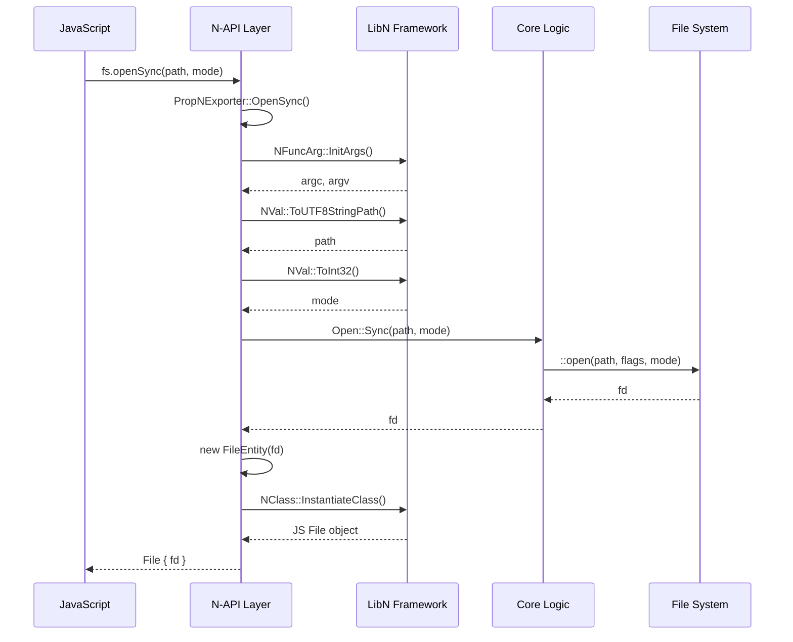

# N-API 接口总览

## 简介

File API 通过 N-API (Node-API) 向 JavaScript/ArkTS 应用暴露文件系统操作能力。本文档提供所有 N-API 模块的汇总信息。

## 模块清单

| JS 模块名 | C++ 模块名 | 注册文件 | 输出产物 | 说明 |
|-----------|-----------|----------|----------|------|
| `@ohos.file.fs` | `file.fs` | `mod_fs/module.cpp` | `libfs.z.so` | 新版文件系统 API（推荐） |
| `@ohos.fileio` | `fileio` | `mod_fileio/module.cpp` | `libfileio.z.so` | 旧版文件 IO |
| `@ohos.file.hash` | `hash` | `mod_hash/module.cpp` | `libhash.z.so` | 文件哈希计算 |
| `@ohos.file.statvfs` | `statvfs` | `mod_statvfs/statvfs_napi.cpp` | `libstatvfs.z.so` | 存储空间统计 |
| `@ohos.file.statfs` | `statfs` | `mod_statfs/statfs_napi.cpp` | `libstatfs.z.so` | 文件系统统计 |
| `@ohos.file.environment` | `environment` | `mod_environment/environment_napi.cpp` | `libenvironment.z.so` | 应用目录路径 |
| `@ohos.file.securityLabel` | `securitylabel` | `mod_securitylabel/securitylabel_napi.cpp` | `libsecuritylabel.z.so` | 文件安全标签 |
| `@ohos.file.document` | `document` | `mod_document/document_napi.cpp` | `libdocument.z.so` | 文档处理 |
| `@system.file` | `file` | `mod_file/module.cpp` | `libfile.z.so` | 系统文件 API |

## 模块注册方式

### 方式 1: NAPI_MODULE 宏（旧版）

**文件**: `interfaces/kits/js/src/mod_fileio/module.cpp:53`

```cpp
NAPI_MODULE(fileio, Export)
```

### 方式 2: napi_module_register（新版）

**文件**: `interfaces/kits/js/src/mod_fs/module.cpp:91-104`

```cpp
static napi_module _module = {
    .nm_version = 1,
    .nm_flags = 0,
    .nm_filename = nullptr,
    .nm_register_func = Export,
    .nm_modname = "file.fs",
    .nm_priv = ((void *)0),
    .reserved = {0}
};

extern "C" __attribute__((constructor)) void RegisterModule(void) {
    napi_module_register(&_module);
}
```

## 异步模式支持

所有模块均支持两种异步编程模型：

### Promise 模式

```javascript
import fs from '@ohos.file.fs';

// Promise 模式
fs.open('test.txt', fs.OpenMode.READ_ONLY)
  .then(file => {
    console.log('File opened:', file.fd);
    return file.close();
  })
  .catch(err => {
    console.error('Error:', err);
  });

// async/await 语法
async function readFile() {
  try {
    let file = await fs.open('test.txt', fs.OpenMode.READ_ONLY);
    let buffer = new ArrayBuffer(1024);
    let readLen = await fs.read(file.fd, buffer);
    await file.close();
  } catch (e) {
    console.error(e);
  }
}
```

### Callback 模式

```javascript
import fs from '@ohos.file.fs';

// Callback 模式
fs.open('test.txt', fs.OpenMode.READ_ONLY, (err, file) => {
  if (err) {
    console.error('Open failed:', err);
    return;
  }
  console.log('File opened:', file.fd);
  file.close((err) => {
    if (err) {
      console.error('Close failed:', err);
    }
  });
});
```

## 同步模式

所有异步 API 都有对应的同步版本，以 `Sync` 后缀标识：

```javascript
import fs from '@ohos.file.fs';

// 同步模式
try {
  let file = fs.openSync('test.txt', fs.OpenMode.READ_ONLY);
  let buffer = new ArrayBuffer(1024);
  let readLen = fs.readSync(file.fd, buffer);
  fs.closeSync(file);
} catch (e) {
  console.error(e);
}
```

## 错误处理

### 错误类型

| 错误类型 | 说明 |
|----------|------|
| `EINVAL` | 无效参数 |
| `ENOENT` | 文件不存在 |
| `EACCES` | 权限拒绝 |
| `EEXIST` | 文件已存在 |
| `ENOTDIR` | 不是目录 |
| `EISDIR` | 是目录 |
| `EBUSY` | 资源忙 |

### 错误抛出

**同步 API**: 直接抛出异常
```javascript
try {
  fs.openSync('/invalid/path', fs.OpenMode.READ_ONLY);
} catch (e) {
  console.log(e.code);  // "ENOENT"
  console.log(e.message);  // 错误描述
}
```

**异步 API**: 通过 Promise reject 或回调函数第一个参数传递
```javascript
// Promise 模式
fs.open('/invalid/path', fs.OpenMode.READ_ONLY)
  .catch(err => {
    console.log(err.code);  // "ENOENT"
  });

// Callback 模式
fs.open('/invalid/path', fs.OpenMode.READ_ONLY, (err, file) => {
  if (err) {
    console.log(err.code);  // "ENOENT"
    return;
  }
});
```

## 参数验证

### 路径参数

```cpp
// ToUTF8StringPath() 实现
auto [succ, path, len] = NVal(env, argv[0]).ToUTF8StringPath();
if (!succ) {
    UniError(EINVAL).ThrowErr(env, "Invalid path");
    return nullptr;
}
```

### 数值参数

```cpp
// ToInt32() 实现
tie(succ, mode) = NVal(env, argv[1]).ToInt32(mode);
if (!succ || mode < 0) {
    UniError(EINVAL).ThrowErr(env, "Invalid mode");
    return nullptr;
}
```

### 缓冲区参数

```cpp
// ToBuffer() 实现
tie(succ, buf, len) = NVal(env, argv[1]).ToBuffer();
if (!succ || buf == nullptr || len == 0) {
    UniError(EINVAL).ThrowErr(env, "Invalid buffer");
    return nullptr;
}
```

## 调用链示例

### JS → NAPI → Core → System



## Syscap 能力声明

| 模块 | Syscap |
|------|--------|
| `@ohos.file.fs` | `SystemCapability.FileManagement.File.FileIO` |
| `@ohos.file.hash` | `SystemCapability.FileManagement.File.FileIO` |
| `@ohos.file.statvfs` | `SystemCapability.FileManagement.File.FileIO` |
| `@ohos.file.environment` | `SystemCapability.FileManagement.File.Environment` |
| `@ohos.file.securityLabel` | `SystemCapability.FileManagement.File.FileIO` |

## 权限要求

| 模块 | 权限 | 说明 |
|------|------|------|
| `@ohos.file.fs` | 无 | 仅访问应用沙箱 |
| `@ohos.file.environment` | `ohos.permission.FILE_ACCESS_MANAGER` | 访问系统目录 |
| `@ohos.file.securityLabel` | `ohos.permission.FILE_ACCESS_MANAGER` | 修改安全标签 |
| HyperAIO | `ohos.permission.ALLOW_IOURING` | 使用 io_uring |

## 参考文档

| 文档 | 说明 |
|------|------|
| [05_NAPI_FileFS.md](05_NAPI_FileFS.md) | @ohos.file.fs 详细文档 |
| [06_NAPI_FileIO.md](06_NAPI_FileIO.md) | @ohos.fileio 详细文档 |
| [07_NAPI_Hash.md](07_NAPI_Hash.md) | @ohos.file.hash 详细文档 |
| [08_NAPI_StatVFS.md](08_NAPI_StatVFS.md) | @ohos.file.statvfs 详细文档 |
