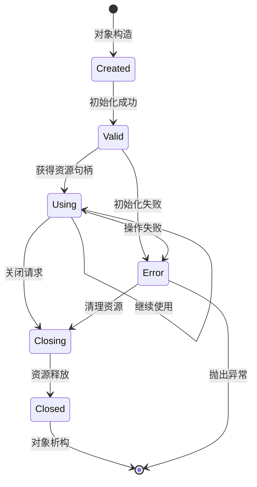
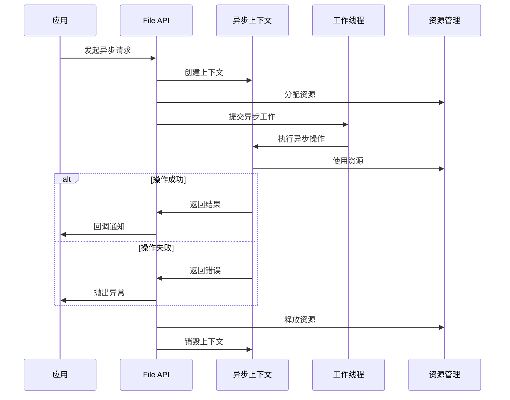
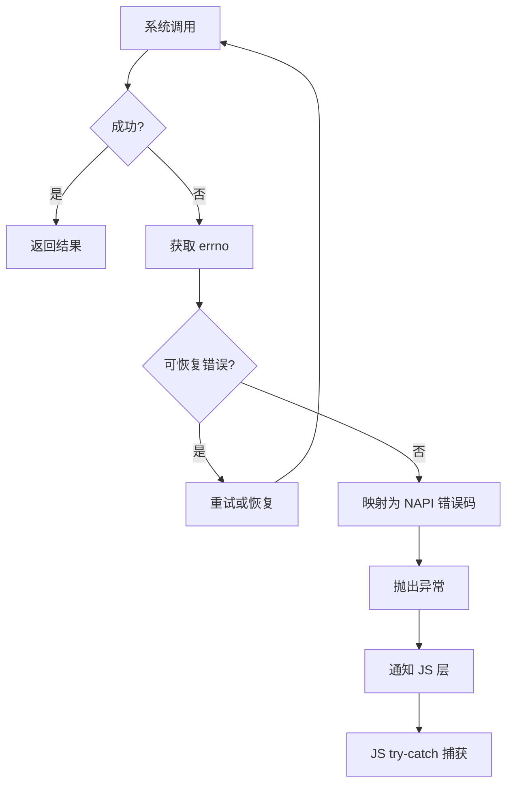

# File API 内部实现细节

本文档深入描述 File API 的内部实现细节，包括核心类与结构体职责、内部 API 契约和资源生命周期管理，帮助开发者理解实现原理和扩展系统。

## 1. 核心类与结构体

### 1.1 LibN 核心类

LibN 是 File API 的基础框架，提供 N-API 的常用封装：

**证据来源**：`utils/filemgmt_libn/include/` 目录

| 类名 | 头文件 | 职责 |
|------|--------|------|
| NClass | n_class.h | JS 对象类的创建、封装和解封 |
| NVal | n_val.h | JS 值与 C++ 类型的双向转换 |
| NError | n_error.h | 错误处理和异常抛出 |
| NExporter | n_exporter.h | N-API 模块的导出和注册 |
| NFuncArg | n_func_arg.h | 函数参数的解析和验证 |
| NAsyncWork | n_async/n_async_work.h | 异步工作的创建和管理 |
| NAsyncContext | n_async/n_async_context.h | 异步操作的上下文封装 |
| NRef | n_async/n_ref.h | 引用计数管理 |

#### 1.1.1 NClass 类详解

**职责**：管理 JS 对象与 C++ 对象的映射关系

**关键方法**：

| 方法 | 参数 | 返回值 | 说明 |
|------|------|--------|------|
| CreateJSObject | env, constructor, ... | napi_value | 创建 JS 对象 |
| WrapNativeObject | env, jsObject, native, finalizer | napi_status | 封装原生对象 |
| UnwrapNativeObject | env, jsObject, resultType | void* | 解封原生对象 |
| GetNativeBinding | env, jsObject | void* | 获取绑定的原生对象 |

**使用示例**：

```cpp
// 文件：utils/filemgmt_libn/include/n_class.h
class NClass {
public:
    template<typename T>
    static napi_value CreateJSObject(napi_env env, T* nativeObject) {
        napi_value jsObject;
        napi_create_object(env, &jsObject);
        
        // 封装原生对象
        WrapNativeObject(env, jsObject, nativeObject,
            [](napi_env env, void* data, void* hint) {
                delete static_cast<T*>(data);  // 自动释放
            });
        
        return jsObject;
    }
    
    template<typename T>
    static T* UnwrapNativeObject(napi_env env, napi_value jsObject) {
        void* result = nullptr;
        napi_unwrap(env, jsObject, &result);
        return static_cast<T*>(result);
    }
};
```

#### 1.1.2 NVal 类详解

**职责**：提供 JS 值与 C++ 类型的安全转换

**关键方法**：

| 方法 | 参数 | 返回值 | 说明 |
|------|------|--------|------|
| FromJSValue | env, jsValue | NVal | 从 JS 值创建 NVal |
| ToString | env, NVal | std::string | 转换为 C++ 字符串 |
| ToInt32 | env, NVal | int32_t | 转换为 32 位整数 |
| ToUint32 | env, NVal | uint32_t | 转换为无符号 32 位整数 |
| ToDouble | env, NVal | double | 转换为双精度浮点 |
| ToArrayBuffer | env, NVal | ArrayBufferInfo | 转换为 ArrayBuffer |
| CreateObject | env | NVal | 创建 JS 对象 |
| CreateArray | env, size_t | NVal | 创建 JS 数组 |
| CreateString | env, std::string | napi_value | 创建 JS 字符串 |

**使用示例**：

```cpp
// 文件：utils/filemgmt_libn/include/n_val.h
class NVal {
public:
    // 从 JS 值创建
    static NVal FromJSValue(napi_env env, napi_value value) {
        return NVal(env, value);
    }
    
    // 转换为字符串
    std::string ToString() const {
        size_t len;
        napi_get_value_string_utf8(env_, value_, nullptr, 0, &len);
        
        std::string result(len + 1, '\0');
        napi_get_value_string_utf8(env_, value_,
            const_cast<char*>(result.data()), len + 1, &len);
        
        return result;
    }
    
    // 转换为整数
    int32_t ToInt32() const {
        int32_t result;
        napi_get_value_int32(env_, value_, &result);
        return result;
    }
    
    // 转换为 ArrayBuffer
    struct ArrayBufferInfo {
        void* data;
        size_t length;
    };
    
    ArrayBufferInfo ToArrayBuffer() const {
        void* data;
        size_t length;
        napi_get_arraybuffer_info(env_, value_, &data, &length);
        return {data, length};
    }
};
```

#### 1.1.3 NAsyncWork 类详解

**职责**：管理异步工作的生命周期

**关键方法**：

| 方法 | 参数 | 返回值 | 说明 |
|------|------|--------|------|
| Create | env, resourceName, execute, complete | NAsyncWork* | 创建异步工作 |
| Queue | asyncWork | napi_status | 队列异步工作 |
| Cancel | asyncWork | napi_status | 取消异步工作 |
| Delete | asyncWork | void | 删除异步工作 |

**使用示例**：

```cpp
// 文件：utils/filemgmt_libn/include/n_async/n_async_work.h
class NAsyncWork {
public:
    struct Callbacks {
        napi_value (*execute)(napi_env, void*);
        napi_value (*complete)(napi_env, napi_status, void*);
    };
    
    static NAsyncWork* Create(
        napi_env env,
        const std::string& resourceName,
        Callbacks callbacks,
        void* data
    ) {
        NAsyncWork* work = new NAsyncWork(env);
        
        napi_value resource;
        napi_create_string_utf8(env, resourceName.c_str(),
            NAPI_AUTO_LENGTH, &resource);
        
        napi_create_async_work(env, nullptr, resource,
            callbacks.execute,
            callbacks.complete,
            data, &work->work_);
        
        return work;
    }
    
    napi_status Queue() {
        return napi_queue_async_work(env_, work_);
    }
    
    void Delete() {
        napi_delete_async_work(env_, work_);
        delete this;
    }
    
private:
    NAsyncWork(napi_env env) : env_(env), work_(nullptr) {}
    ~NAsyncWork() = delete;
    
    napi_env env_;
    napi_async_work work_;
};
```

### 1.2 文件操作核心类

**证据来源**：`interfaces/kits/js/src/mod_fs/` 目录

#### 1.2.1 文件实体类

| 类名 | 头文件 | 职责 |
|------|--------|------|
| FileEntity | class_file/file_entity.h | 封装文件描述符和文件状态 |
| StreamEntity | class_stream/stream_entity.h | 封装文件流对象 |
| DirEntity | class_dir/dir_entity.h | 封装目录句柄 |
| StatEntity | class_stat/stat_entity.h | 封装文件元数据 |
| WatcherEntity | class_watcher/watcher_entity.h | 封装文件监控句柄 |

#### 1.2.2 FileEntity 详解

```cpp
// 文件：interfaces/kits/js/src/mod_fs/class_file/file_entity.h
struct FileEntity {
    int fd;                    // 文件描述符
    std::string path;         // 文件路径
    struct stat st;           // 文件状态
    uint32_t flags;          // 打开标志
    bool isDirectory;         // 是否为目录
    
    FileEntity() : fd(-1), isDirectory(false), flags(0) {}
    
    ~FileEntity() {
        if (fd >= 0) {
            close(fd);  // 自动关闭
        }
    }
    
    bool IsValid() const {
        return fd >= 0;
    }
};
```

### 1.3 上下文类

| 类名 | 头文件 | 职责 |
|------|--------|------|
| OpenContext | properties/open_core.h | 文件打开上下文 |
| ReadContext | properties/read_core.h | 读取操作上下文 |
| WriteContext | properties/write_core.h | 写入操作上下文 |
| StatContext | properties/stat_core.h | 状态查询上下文 |

---

## 2. 内部 API 契约

### 2.1 稳定性分类

File API 的内部 API 按稳定性分为以下几类：

| 分类 | 标记 | 说明 |
|------|------|------|
| **稳定接口** | stable | 对外公开，长期维护 |
| **不稳定接口** | unstable | 可能变化，不推荐外部使用 |
| **内部接口** | internal | 仅限模块内部使用 |

### 2.2 LibN 稳定性承诺

| 接口 | 稳定性 | 变更策略 |
|------|--------|----------|
| NClass::CreateJSObject | stable | 向后兼容 |
| NClass::UnwrapNativeObject | stable | 向后兼容 |
| NVal::FromJSValue | stable | 向后兼容 |
| NVal::ToString | stable | 向后兼容 |
| NError::Throw | stable | 向后兼容 |
| NExporter::RegisterModule | stable | 向后兼容 |

### 2.3 文件系统操作契约

| 操作 | 前置条件 | 后置条件 | 错误处理 |
|------|----------|----------|----------|
| open | path 非空，flags 有效 | 返回有效 fd 或抛出异常 | 抛出 napi_error |
| close | fd 有效 | fd 关闭，返回 0 | 无（静默忽略） |
| read | fd 有效，buffer 有效 | 填充 buffer，返回读取长度 | 返回 -1，设置 errno |
| write | fd 有效，buffer 有效 | 写入 buffer，返回写入长度 | 返回 -1，设置 errno |
| stat | path 有效 | 填充 stat 结构 | 返回 -1，设置 errno |

### 2.4 URI 处理契约

```cpp
// URI 验证伪代码
class UriValidator {
public:
    // 检查 URI 是否有效
    static bool IsValid(const std::string& uri) {
        // 1. 必须有 internal:// 前缀
        if (!HasPrefix(uri, "internal://")) {
            return false;
        }
        
        // 2. 解析 URI 类型
        std::string type = ExtractType(uri);
        if (!IsAllowedType(type)) {
            return false;
        }
        
        // 3. 验证路径部分
        std::string path = ExtractPath(uri);
        return ValidatePath(path);
    }
    
    // URI 转路径
    static std::string UriToPath(const std::string& uri) {
        std::string type = ExtractType(uri);
        std::string path = ExtractPath(uri);
        
        // 根据类型获取基础路径
        std::string basePath = GetBasePath(type);
        
        // 拼接并规范化
        return NormalizePath(basePath + "/" + path);
    }
    
private:
    static constexpr const char* ALLOWED_TYPES[] = {
        "app", "cache", "share"
    };
};
```

---

## 3. 资源生命周期

### 3.1 资源类型

File API 管理的资源包括：

| 资源类型 | C++ 类型 | 创建方式 | 释放方式 |
|----------|----------|----------|----------|
| 文件描述符 | int | open() | close() |
| 文件流 | StreamEntity* | createStream() | close() |
| 目录句柄 | DIR* | opendir() | closedir() |
| 内存缓冲区 | void* | malloc/new | free/delete |
| JS 对象引用 | napi_ref | napi_create_reference | napi_delete_reference |
| 异步工作 | napi_async_work | napi_create_async_work | napi_delete_async_work |

### 3.2 生命周期管理



### 3.3 文件描述符生命周期

```cpp
// 文件描述符管理示例
class FdManager {
public:
    int Open(const std::string& path, int flags) {
        int fd = open(path.c_str(), flags);
        if (fd < 0) {
            throw FdError(errno, "Failed to open: " + path);
        }
        
        // 注册到管理器
        fdMap_[fd] = new FdContext(fd, path);
        return fd;
    }
    
    void Close(int fd) {
        auto it = fdMap_.find(fd);
        if (it != fdMap_.end()) {
            delete it->second;
            fdMap_.erase(it);
        }
        
        // 关闭文件描述符
        ::close(fd);
    }
    
    ~FdManager() {
        // 析构时清理所有资源
        for (auto& [fd, ctx] : fdMap_) {
            if (ctx->fd >= 0) {
                ::close(ctx->fd);
            }
            delete ctx;
        }
        fdMap_.clear();
    }
    
private:
    struct FdContext {
        int fd;
        std::string path;
        FdContext(int f, const std::string& p) : fd(f), path(p) {}
        ~FdContext() {
            if (fd >= 0) {
                ::close(fd);
            }
        }
    };
    
    std::unordered_map<int, FdContext*> fdMap_;
};
```

### 3.4 异步工作生命周期



### 3.5 JS 对象生命周期

```cpp
// JS 对象与原生对象的生命周期绑定
class NativeWrapper {
public:
    template<typename T>
    static napi_value Wrap(napi_env env, T* nativeObject) {
        napi_value jsObject;
        napi_create_object(env, &jsObject);
        
        // 绑定原生对象，指定析构函数
        napi_wrap(env, jsObject, nativeObject,
            [](napi_env env, void* data, void* hint) {
                // JS 对象被 GC 回收时调用
                T* obj = static_cast<T*>(data);
                delete obj;  // 自动释放原生对象
            },
            nullptr,  // 持有者引用
            nullptr);
        
        return jsObject;
    }
    
    template<typename T>
    static T* Unwrap(napi_env env, napi_value jsObject) {
        void* result;
        napi_unwrap(env, jsObject, &result);
        return static_cast<T*>(result);
    }
};
```

---

## 4. 内存管理

### 4.1 内存分配策略

| 分配类型 | 分配方式 | 释放方式 | 使用场景 |
|----------|----------|----------|----------|
| 栈分配 | 自动 | 自动 | 小型数据、结构体 |
| 堆分配（原生） | new/malloc | delete/free | 需要长期存活的对象 |
| 堆分配（智能） | std::make_unique | 自动 | RAII 管理 |
| JS 堆分配 | napi_* | JS GC | JS 对象、字符串 |
| 缓冲区 | malloc/posix_memalign | free | I/O 缓冲区 |

### 4.2 RAII 模式示例

```cpp
// RAII 文件描述符封装
class FileDescriptor {
public:
    explicit FileDescriptor(const std::string& path, int flags) {
        fd_ = open(path.c_str(), flags);
        if (fd_ < 0) {
            throw std::runtime_error(
                std::string("Failed to open: ") + strerror(errno));
        }
    }
    
    ~FileDescriptor() {
        if (fd_ >= 0) {
            close(fd_);
        }
    }
    
    // 禁止拷贝
    FileDescriptor(const FileDescriptor&) = delete;
    FileDescriptor& operator=(const FileDescriptor&) = delete;
    
    // 允许移动
    FileDescriptor(FileDescriptor&& other) noexcept {
        fd_ = other.fd_;
        other.fd_ = -1;
    }
    
    FileDescriptor& operator=(FileDescriptor&& other) noexcept {
        if (this != &other) {
            if (fd_ >= 0) close(fd_);
            fd_ = other.fd_;
            other.fd_ = -1;
        }
        return *this;
    }
    
    int Get() const { return fd_; }
    
private:
    int fd_;
};

// 使用示例
void ReadFile(const std::string& path) {
    FileDescriptor fd(path, O_RDONLY);
    char buffer[1024];
    ssize_t len = read(fd.Get(), buffer, sizeof(buffer));
    // fd 自动关闭，无需手动 close
}
```

---

## 5. 错误处理

### 5.1 错误码映射

**证据来源**：`interfaces/kits/js/src/common/uni_error.h`

| 系统错误码 | 常量名 | 说明 |
|------------|--------|------|
| 1 | EP |
| 2 | ENOENTERM | 操作不允许 | 文件或目录不存在 |
| 5 | EIO | I/O 错误 |
| 13 | EACCES | 权限不足 |
| 17 | EEXIST | 文件已存在 |
| 28 | ENOSPC | 设备无空间 |

### 5.2 错误处理流程



### 5.3 错误码转换

```cpp
// 文件：interfaces/kits/js/src/common/uni_error.cpp
int32_t MapErrnoToNapi(int sysErrno) {
    // 映射表：系统错误码 → N-API 错误码
    static const std::unordered_map<int, int32_t> errnoMap = {
        {ENOENT, 13900002},  // 文件不存在
        {EACCES, 13900013}, // 权限不足
        {EEXIST, 13900017}, // 文件已存在
        {ENOSPC, 13900028}, // 空间不足
        {EINVAL, 13900022}, // 参数无效
        {EBADF,  13900009}, // 描述符错误
        {EIO,    13900005}, // I/O 错误
        {ELOOP,  13900040}, // 符号链接过多
        {ENAMETOOLONG, 13900036}, // 文件名过长
        {ENOTDIR, 13900020}, // 不是目录
        {EISDIR,  13900021}, // 是目录
        {EROFS,   13900030}, // 只读文件系统
    };
    
    auto it = errnoMap.find(sysErrno);
    if (it != errnoMap.end()) {
        return it->second;
    }
    
    // 未知错误，使用通用错误码
    return 13900040;
}

void ThrowNapiError(napi_env env, int sysErrno) {
    int32_t napiCode = MapErrnoToNapi(sysErrno);
    std::string message = strerror(sysErrno);
    
    napi_value error;
    napi_create_object(env, &error);
    
    napi_value code;
    napi_create_int32(env, napiCode, &code);
    napi_set_named_property(env, error, "code", code);
    
    napi_value msg;
    napi_create_string_utf8(env, message.c_str(), NAPI_AUTO_LENGTH, &msg);
    napi_set_named_property(env, error, "message", msg);
    
    napi_throw(env, error);
}
```

---

## 相关文档

| 文档 | 说明 |
|------|------|
| [02_Architecture.md](02_Architecture.md) | 架构设计 |
| [04_Interface.md](04_Interface.md) | API 接口文档 |
| [05_AttackSurface.md](05_AttackSurface.md) | 攻击面分析 |

---

**最后更新**：2026-02-07

**版本**：1.0
