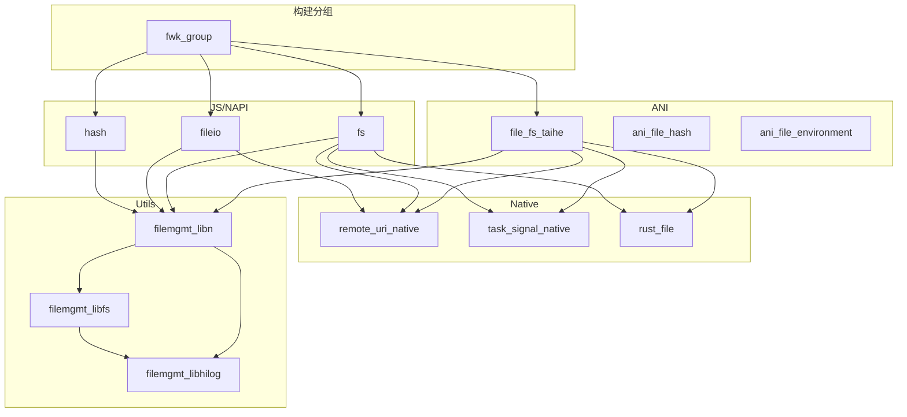

# GN 构建系统

## 简介

File API 使用 GN (Generate Ninja) 构建系统，这是 OpenHarmony 的标准构建工具。本文档详细说明项目的构建配置。

## 全局配置

### file_api.gni

**位置**: `/Volumes/lexar/code/d/work/oh/foundation/filemanagement/file_api/file_api.gni`

```gn
# 基础路径
file_api_path = "//foundation/filemanagement/file_api"
src_path = "${file_api_path}/interfaces/kits/js/src"
utils_path = "${file_api_path}/utils"

# 平台检测
use_mac = "${current_os}_${current_cpu}" == "mac_x64" ||
          "${current_os}_${current_cpu}" == "mac_arm64"
use_mingw_win = "${current_os}_${current_cpu}" == "mingw_x86_64"

# Feature Flags
declare_args() {
    file_api_read_optimize = false      # 读优化（穿戴设备）
    file_api_feature_hyperaio = false   # HyperAIO 高性能 IO
}
```

## Target 列表

### 1. Utils 层

| Target | 类型 | 输出 | 位置 |
|--------|------|------|------|
| `filemgmt_libhilog` | ohos_shared_library | `libfilemgmt_libhilog.so` | `utils/filemgmt_libhilog/BUILD.gn` |
| `filemgmt_libn` | ohos_shared_library | `libfilemgmt_libn.so` | `utils/filemgmt_libn/BUILD.gn` |
| `filemgmt_libfs` | ohos_shared_library | `libfilemgmt_libfs.so` | `utils/filemgmt_libfs/BUILD.gn` |

### 2. Native 层

| Target | 类型 | 输出 | 位置 |
|--------|------|------|------|
| `remote_uri_native` | ohos_shared_library | `libremote_uri_native.so` | `interfaces/kits/native/BUILD.gn` |
| `task_signal_native` | ohos_shared_library | `libtask_signal_native.so` | `interfaces/kits/native/BUILD.gn` |
| `environment_native` | ohos_shared_library | `libenvironment_native.so` | `interfaces/kits/native/BUILD.gn` |
| `fileio_native` | ohos_shared_library | `libfileio_native.so` | `interfaces/kits/native/BUILD.gn` |
| `build_kits_native` | group | - | `interfaces/kits/native/BUILD.gn` |

### 3. JS/NAPI 层

**位置**: `interfaces/kits/js/BUILD.gn` (1194 行)

| Target | 类型 | 输出 | 安装位置 |
|--------|------|------|----------|
| `fileio` | ohos_shared_library | `libfileio.z.so` | `module/` |
| `fs` | ohos_shared_library | `libfs.z.so` | `module/file/` |
| `hash` | ohos_shared_library | `libhash.z.so` | `module/file/` |
| `file` | ohos_shared_library | `libfile.z.so` | `module/` |
| `statfs` | ohos_shared_library | `libstatfs.z.so` | `module/` |
| `statvfs` | ohos_shared_library | `libstatvfs.z.so` | `module/file/` |
| `environment` | ohos_shared_library | `libenvironment.z.so` | `module/file/` |
| `securitylabel` | ohos_shared_library | `libsecuritylabel.z.so` | `module/file/` |
| `document` | ohos_shared_library | `libdocument.z.so` | `module/` |
| `build_kits_js` | group | - | - |

### 4. ANI 层 (ArkTS)

**位置**: `interfaces/kits/js/BUILD.gn` (第 683-888 行)

| Target | 类型 | 输出 | 说明 |
|--------|------|------|------|
| `file_fs_taihe` | taihe_shared_library | `libfile_fs_taihe.so` | FS ANI 实现 |
| `ani_file_hash` | ohos_shared_library | `libani_file_hash.so` | Hash ANI |
| `ani_file_securitylabel` | ohos_shared_library | `libani_file_securitylabel.so` | 安全标签 ANI |
| `ani_file_environment` | ohos_shared_library | `libani_file_environment.so` | 环境 ANI |
| `ani_file_statvfs` | ohos_shared_library | `libani_file_statvfs.so` | StatVfs ANI |
| `ohos_file_fs_abc` | generate_static_abc | `ohos_file_fs_abc.abc` | ABC 字节码 |
| `ohos_file_hash_abc` | generate_static_abc | `ohos_file_hash_abc.abc` | ABC 字节码 |
| `ohos_file_securityLabel_abc` | generate_static_abc | `ohos_file_securityLabel_abc.abc` | ABC 字节码 |
| `ohos_file_environment_abc` | generate_static_abc | `ohos_file_environment_abc.abc` | ABC 字节码 |
| `ohos_file_statvfs_abc` | generate_static_abc | `ohos_file_statvfs_abc.abc` | ABC 字节码 |
| `ani_file_api` | group | - | 聚合所有 ANI 目标 |

### 5. 其他层

| Target | 类型 | 输出 | 位置 |
|--------|------|------|------|
| `rust_file` | ohos_rust_shared_ffi | `librust_file.so` | `interfaces/kits/rust/BUILD.gn` |
| `cj_file_fs_ffi` | ohos_shared_library | `libcj_file_fs_ffi.so` | `interfaces/kits/cj/BUILD.gn` |
| `cj_statvfs_ffi` | ohos_shared_library | `libcj_statvfs_ffi.so` | `interfaces/kits/cj/BUILD.gn` |
| `ohfileio` | ohos_shared_library | `libohfileio.so` | `interfaces/kits/c/fileio/BUILD.gn` |
| `ohenvironment` | ohos_shared_library | `libohenvironment.so` | `interfaces/kits/c/environment/BUILD.gn` |
| `streamrw` | ohos_shared_library | `libstreamrw.z.so` | `interfaces/kits/ts/streamrw/BUILD.gn` |
| `streamhash` | ohos_shared_library | `libstreamhash.z.so` | `interfaces/kits/ts/streamhash/BUILD.gn` |
| `HyperAio` | ohos_shared_library | `libHyperAio.so` | `interfaces/kits/hyperaio/BUILD.gn` (条件编译) |

## 依赖关系

### 模块依赖图



### fs 模块详细依赖

**文件**: `interfaces/kits/js/BUILD.gn:176-274`

```gn
ohos_shared_library("fs") {
    # 基础依赖
    deps = [
        "${utils_path}/filemgmt_libhilog:filemgmt_libhilog",
        "${utils_path}/filemgmt_libn:filemgmt_libn",
    ]
    
    # 外部依赖（仅 OHOS 平台）
    if (!use_mingw_win && !use_mac) {
        external_deps = [
            "ability_base:zuri",
            "ability_runtime:ability_manager",
            "access_token:libtokenid_sdk",
            "app_file_service:fileuri_native",
            "bundle_framework:appexecfwk_core",
            "c_utils:utils",
            "data_share:datashare_consumer",
            "dfs_service:distributed_file_daemon_kit_inner",
            "hisysevent:libhisysevent",
            "hitrace:hitrace_meter",
            "ipc:ipc_single",
            "libuv:uv",
            "samgr:samgr_proxy",
        ]
        deps += [
            "${file_api_path}/interfaces/kits/native:remote_uri_native",
            "${file_api_path}/interfaces/kits/native:task_signal_native",
            "${file_api_path}/interfaces/kits/rust:rust_file",
        ]
    }
}
```

## Feature Flags

### 1. file_api_read_optimize

**用途**: 穿戴设备文件读优化

**配置位置**: `file_api.gni:23`

**使用位置**: `interfaces/kits/js/BUILD.gn:387-389`

```gn
if (file_api_read_optimize) {
    defines = [ "WEARABLE_PRODUCT" ]
}
```

**影响目标**: `file` (ohos_shared_library)

### 2. file_api_feature_hyperaio

**用途**: 启用基于 io_uring 的高性能异步 IO

**配置位置**: `file_api.gni:24`

**使用位置**: `interfaces/kits/hyperaio/BUILD.gn`

```gn
group("group_hyperaio") {
    deps = []
    if (file_api_feature_hyperaio) {
        deps += [ ":HyperAio" ]
    }
}

ohos_shared_library("HyperAio") {
    if (file_api_feature_hyperaio) {
        external_deps += [ "liburing:liburing" ]
        defines = [ "HYPERAIO_USE_LIBURING" ]
    }
}
```

## 编译配置

### 公共编译选项

**文件**: `interfaces/kits/js/BUILD.gn:38-57`

```gn
ohos_shared_library("fileio") {
    # 代码生成优化
    cflags = [
        "-fvisibility=hidden",     # 隐藏符号
        "-fdata-sections",          # 数据段分离
        "-ffunction-sections",      # 函数段分离
        "-Oz",                      # 最小化代码大小
    ]
    
    cflags_cc = [
        "-fvisibility-inlines-hidden",
        "-Oz",
    ]
    
    # 安全加固
    branch_protector_ret = "pac_ret"  # ARM64 指针认证
    
    sanitize = {
        integer_overflow = true    # 整数溢出检测
        ubsan = true               # 未定义行为检测
        boundary_sanitize = true   # 边界检测
        cfi = true                 # 控制流完整性
        cfi_cross_dso = true       # 跨 DSO CFI
        debug = false
    }
}
```

### 平台相关配置

| 平台 | Define | 条件 |
|------|--------|------|
| Windows (mingw) | `WIN_PLATFORM` | `use_mingw_win` |
| macOS/iOS | `IOS_PLATFORM` | `use_mac` |
| OpenHarmony | `FILE_API_TRACE` | `!use_mingw_win && !use_mac` |

## 构建命令

### 完整构建

```bash
# 构建整个项目
gn gen out --args='target_os="ohos" target_cpu="arm64"'
ninja -C out

# 构建特定目标
ninja -C out filemgmt_libn
ninja -C out fs
ninja -C out ani_file_api
```

### 使用 Feature Flags

```bash
# 启用读优化
gn gen out --args='target_os="ohos" file_api_read_optimize=true'

# 启用 HyperAIO
gn gen out --args='target_os="ohos" file_api_feature_hyperaio=true'
```

## 产物安装路径

| 产物类型 | 路径 | 示例 |
|----------|------|------|
| 共享库 (module) | `/system/lib/module/` | `libfs.z.so` |
| 共享库 (module/file) | `/system/lib/module/file/` | `libhash.z.so` |
| 共享库 (system/lib) | `/system/lib/` | `libfilemgmt_libn.so` |
| NDK 库 | `/system/lib/ndk/` | `libohfileio.so` |
| ABC 文件 | `/system/framework/` | `ohos_file_fs_abc.abc` |

## 构建配置检查清单

- [ ] `subsystem_name = "filemanagement"`
- [ ] `part_name = "file_api"`
- [ ] `relative_install_dir` 正确设置
- [ ] `use_exceptions = true` (C++ 异常支持)
- [ ] 安全加固选项启用
- [ ] 平台条件编译正确
- [ ] 依赖关系完整声明
