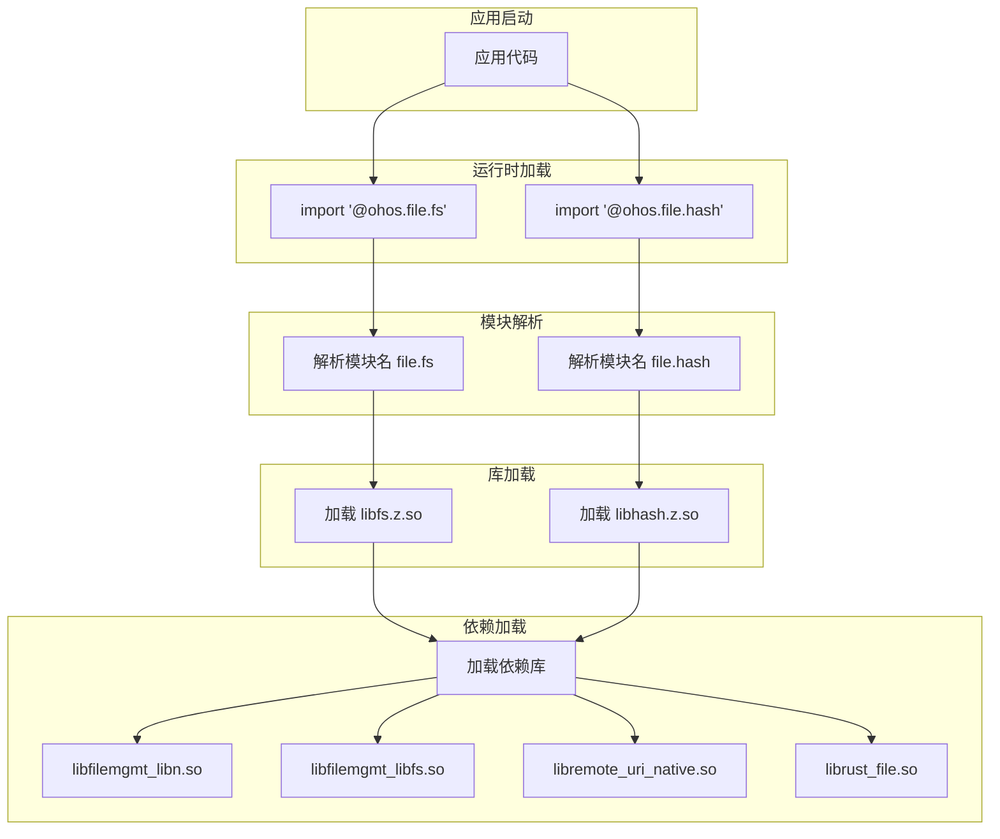

# 编译产物

## 产物清单

### 1. 共享库 (.so)

#### Utils 层

| 产物 | 路径 | 说明 |
|------|------|------|
| `libfilemgmt_libhilog.so` | `system/lib/` | 日志工具库 |
| `libfilemgmt_libn.so` | `system/lib/` | N-API 框架库 |
| `libfilemgmt_libfs.so` | `system/lib/` | 文件系统工具库 |

#### Native 层

| 产物 | 路径 | 说明 |
|------|------|------|
| `libremote_uri_native.so` | `system/lib/` | 远程 URI 处理 |
| `libtask_signal_native.so` | `system/lib/` | 任务信号 Native 实现 |
| `libenvironment_native.so` | `system/lib/` | 环境目录 Native 实现 |
| `libfileio_native.so` | `system/lib/` | FileIO Native 实现 |

#### JS/NAPI 层

| 产物 | 路径 | 说明 |
|------|------|------|
| `libfileio.z.so` | `system/lib/module/` | @ohos.fileio 模块 |
| `libfs.z.so` | `system/lib/module/file/` | @ohos.file.fs 模块 |
| `libhash.z.so` | `system/lib/module/file/` | @ohos.file.hash 模块 |
| `libfile.z.so` | `system/lib/module/` | @system.file 模块 |
| `libstatfs.z.so` | `system/lib/module/` | @ohos.file.statfs 模块 |
| `libstatvfs.z.so` | `system/lib/module/file/` | @ohos.file.statvfs 模块 |
| `libenvironment.z.so` | `system/lib/module/file/` | @ohos.file.environment 模块 |
| `libsecuritylabel.z.so` | `system/lib/module/file/` | @ohos.file.securityLabel 模块 |
| `libdocument.z.so` | `system/lib/module/` | @ohos.file.document 模块 |

#### ANI 层

| 产物 | 路径 | 说明 |
|------|------|------|
| `libfile_fs_taihe.so` | `system/lib/` | ANI FS 主模块 |
| `libani_file_hash.so` | `system/lib/` | ANI Hash 模块 |
| `libani_file_securitylabel.so` | `system/lib/` | ANI 安全标签模块 |
| `libani_file_environment.so` | `system/lib/` | ANI 环境模块 |
| `libani_file_statvfs.so` | `system/lib/` | ANI StatVfs 模块 |

#### 其他

| 产物 | 路径 | 说明 |
|------|------|------|
| `librust_file.so` | `system/lib/` | Rust FFI 库 |
| `libcj_file_fs_ffi.so` | `system/lib/` | Cangjie FS FFI |
| `libcj_statvfs_ffi.so` | `system/lib/` | Cangjie StatVfs FFI |
| `libohfileio.so` | `system/lib/ndk/` | NDK FileIO |
| `libohenvironment.so` | `system/lib/ndk/` | NDK Environment |
| `libstreamrw.z.so` | `system/lib/module/file/` | Stream 读写 |
| `libstreamhash.z.so` | `system/lib/module/file/` | Stream 哈希 |
| `libHyperAio.so` | `system/lib/` | HyperAIO（条件编译）|

### 2. ABC 文件 (ArkTS 字节码)

| 产物 | 路径 | 说明 |
|------|------|------|
| `ohos_file_fs_abc.abc` | `system/framework/` | FS 模块 ABC |
| `ohos_file_hash_abc.abc` | `system/framework/` | Hash 模块 ABC |
| `ohos_file_securityLabel_abc.abc` | `system/framework/` | 安全标签 ABC |
| `ohos_file_environment_abc.abc` | `system/framework/` | 环境 ABC |
| `ohos_file_statvfs_abc.abc` | `system/framework/` | StatVfs ABC |

### 3. TypeScript 定义文件

| 产物 | 路径 | 说明 |
|------|------|------|
| `@ohos.file.fs.d.ts` | `toolchain/node_modules/` | FS 模块类型定义 |
| `@ohos.file.hash.d.ts` | `toolchain/node_modules/` | Hash 模块类型定义 |
| `@ohos.file.statvfs.d.ts` | `toolchain/node_modules/` | StatVfs 模块类型定义 |
| 其他 `.d.ts` | `toolchain/node_modules/` | 其他模块类型定义 |

## 运行时加载关系

### JS 模块加载流程



### 依赖加载顺序

```
1. 应用 import '@ohos.file.fs'
   ↓
2. 运行时查找 module/file/libfs.z.so
   ↓
3. 加载 libfs.z.so
   ↓
4. 解析依赖：
   - libfilemgmt_libn.so (N-API 框架)
   - libfilemgmt_libhilog.so (日志)
   - libremote_uri_native.so (URI 处理)
   - libtask_signal_native.so (任务信号)
   - librust_file.so (Rust FFI)
   ↓
5. 递归加载依赖的依赖
   ↓
6. 执行 NAPI_MODULE 构造函数
   ↓
7. 导出 JS API
```

## 安装路径映射

### Target → 安装路径

| Target | 相对安装路径 | 完整路径 |
|--------|-------------|----------|
| `fileio` | `module/` | `/system/lib/module/libfileio.z.so` |
| `fs` | `module/file/` | `/system/lib/module/file/libfs.z.so` |
| `hash` | `module/file/` | `/system/lib/module/file/libhash.z.so` |
| `file` | `module/` | `/system/lib/module/libfile.z.so` |
| `filemgmt_libn` | - | `/system/lib/libfilemgmt_libn.so` |
| `filemgmt_libfs` | - | `/system/lib/libfilemgmt_libfs.so` |
| `ohfileio` | `ndk/` | `/system/lib/ndk/libohfileio.so` |

### BUILD.gn 配置示例

**文件**: `interfaces/kits/js/BUILD.gn:137-142`

```gn
ohos_shared_library("fs") {
    subsystem_name = "filemanagement"
    part_name = "file_api"
    relative_install_dir = "module/file"  # 安装到 module/file/ 目录
    # ...
}
```

## 产物验证

### 检查产物存在

```bash
# 检查 NAPI 模块
ls -la /system/lib/module/libfileio.z.so
ls -la /system/lib/module/file/libfs.z.so

# 检查工具库
ls -la /system/lib/libfilemgmt_libn.so
ls -la /system/lib/libfilemgmt_libfs.so

# 检查 ABC 文件
ls -la /system/framework/ohos_file_fs_abc.abc
```

### 检查依赖关系

```bash
# 查看库依赖
readelf -d /system/lib/module/file/libfs.z.so | grep NEEDED

# 预期输出示例：
# 0x0000000000000001 (NEEDED)             Shared library: [libfilemgmt_libn.so]
# 0x0000000000000001 (NEEDED)             Shared library: [libfilemgmt_libhilog.so]
# 0x0000000000000001 (NEEDED)             Shared library: [libhilog.so]
# 0x0000000000000001 (NEEDED)             Shared library: [libuv.so]
```

### 检查符号导出

```bash
# 查看 NAPI 注册符号
readelf -s /system/lib/module/file/libfs.z.so | grep RegisterModule

# 预期输出：
#     1: 0000000000000000     0 SECTION LOCAL  DEFAULT    1 
#    42: 0000000000012345    56 FUNC    GLOBAL DEFAULT   12 RegisterModule
```

## 故障排查

### 问题 1: 模块加载失败

**现象**: `Error: cannot find module '@ohos.file.fs'`

**排查步骤**:
1. 检查产物是否存在
   ```bash
   ls -la /system/lib/module/file/libfs.z.so
   ```
2. 检查文件权限
   ```bash
   ls -laZ /system/lib/module/file/libfs.z.so
   ```
3. 检查依赖库是否完整
   ```bash
   ldd /system/lib/module/file/libfs.z.so
   ```

### 问题 2: 符号未找到

**现象**: `Error: cannot find function 'open'`

**排查步骤**:
1. 检查符号是否导出
   ```bash
   nm -D /system/lib/module/file/libfs.z.so | grep open
   ```
2. 检查 NAPI_MODULE 注册
   ```bash
   strings /system/lib/module/file/libfs.z.so | grep "file.fs"
   ```

### 问题 3: 依赖库缺失

**现象**: 应用启动崩溃，日志显示 `linker error`

**排查步骤**:
1. 查看详细链接错误
   ```bash
   logcat | grep linker
   ```
2. 检查缺失的库
   ```bash
   readelf -d /system/lib/module/file/libfs.z.so | grep NEEDED
   find /system/lib -name "libmissing.so"
   ```

## 产物大小优化

### 当前优化措施

| 优化措施 | 配置 | 效果 |
|----------|------|------|
| 代码大小优化 | `-Oz` | 减小代码体积 |
| 死代码消除 | `-ffunction-sections -fdata-sections` | 移除未使用代码 |
| 符号隐藏 | `-fvisibility=hidden` | 减少符号表大小 |

### 产物大小估算

| 产物 | 估算大小 | 说明 |
|------|----------|------|
| libfs.z.so | ~500 KB | 包含完整文件系统功能 |
| libfileio.z.so | ~300 KB | 旧版文件 IO |
| libhash.z.so | ~100 KB | 哈希功能 |
| libfilemgmt_libn.so | ~200 KB | N-API 框架 |
| libfilemgmt_libfs.so | ~50 KB | FS 工具库 |
| ABC 文件 | ~50 KB | 每个模块 |

## 产物版本管理

### 版本信息

```bash
# 查看库版本信息
readelf -V /system/lib/module/file/libfs.z.so

# 查看编译信息
readelf -p .comment /system/lib/module/file/libfs.z.so
```

### 兼容性

| 版本 | 兼容说明 |
|------|----------|
| N-API 模块 | 使用 N-API ABI，跨版本兼容 |
| Native 库 | 需与应用同版本构建 |
| ABC 文件 | 与运行时版本匹配 |
