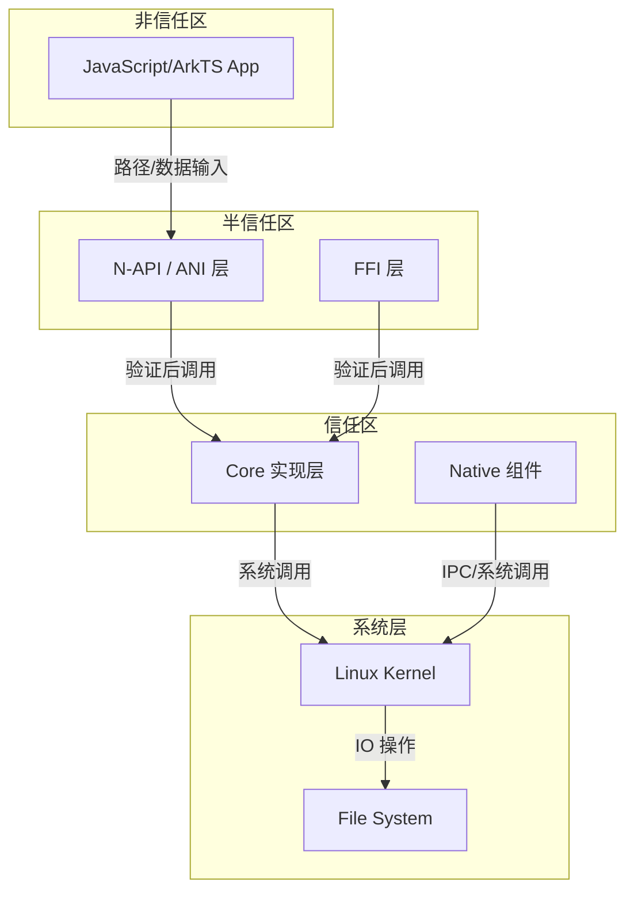

# 安全风险分析

## 威胁模型

### 信任边界



### 攻击面清单

| 攻击面 | 描述 | 风险等级 |
|--------|------|----------|
| **路径输入** | 应用提供的文件路径 | 高 |
| **URI 处理** | DataShare/Remote URI | 高 |
| **文件描述符** | 传递的 fd 值 | 中 |
| **缓冲区数据** | 读写缓冲区内容 | 中 |
| **IPC 通信** | 与系统服务交互 | 中 |
| **权限检查** | AccessToken 验证 | 高 |

## 权限检查机制

### 1. AccessToken 权限检查

**文件**: `interfaces/kits/js/src/mod_environment/environment_core.cpp:52-61`

```cpp
static bool CheckCallingPermission(const std::string &permission)
{
    Security::AccessToken::AccessTokenID tokenCaller = IPCSkeleton::GetCallingTokenID();
    int res = Security::AccessToken::AccessTokenKit::VerifyAccessToken(tokenCaller, permission);
    if (res != Security::AccessToken::PermissionState::PERMISSION_GRANTED) {
        HILOGE("CheckCallingPermission have no permission");
        return false;
    }
    return true;
}
```

**使用点**:
| 功能 | 所需权限 | 位置 |
|------|----------|------|
| HyperAIO | `ohos.permission.ALLOW_IOURING` | `hyperaio.cpp:40-51` |
| 系统目录访问 | `ohos.permission.FILE_ACCESS_MANAGER` | `environment_core.cpp:52-61` |
| 安全标签 | `ohos.permission.FILE_ACCESS_MANAGER` | `securitylabel_napi.cpp` |

### 2. 系统应用检查

**文件**: `interfaces/kits/js/src/mod_environment/environment_core.cpp:46-50`

```cpp
static bool IsSystemApp()
{
    uint64_t tokenId = IPCSkeleton::GetCallingFullTokenID();
    return TokenIdKit::IsSystemAppByFullTokenID(tokenId);
}
```

### 3. BundleName 验证

**文件**: `interfaces/kits/js/src/mod_fs/properties/access_core.cpp:84-90`

```cpp
static bool GetBundleName(const string &path, string &bundleName)
{
    // 解析路径中的 bundleName
    // 与调用者 bundleName 比较
    if (bundleName != callingBundleName) {
        return false;  // 拒绝访问其他应用目录
    }
}
```

## 路径安全分析

### 1. 路径遍历防护

#### 1.1 系统调用规范化

**文件**: `interfaces/kits/js/src/mod_file/class_file/file_n_exporter.cpp:140-148`

```cpp
string GetRealPath(const string &path)
{
    char realPath[PATH_MAX] = {0};
    if (realpath(path.c_str(), realPath) == nullptr) {
        return "";
    }
    return string(realPath);
}
```

**安全性**: ✅ 使用 `realpath()` 系统调用，正确处理符号链接

#### 1.2 手动路径规范化

**文件**: `interfaces/kits/cj/src/copy.cpp:140-154`

```cpp
std::string CopyImpl::GetRealPath(const std::string& path)
{
    fs::path tempPath(path);
    fs::path realPath{};
    for (const auto& component : tempPath) {
        if (component == ".") {
            continue;
        } else if (component == "..") {
            realPath = realPath.parent_path();
        } else {
            realPath /= component;
        }
    }
    return realPath.string();
}
```

**风险**: ⚠️ 自定义实现，可能未正确处理符号链接攻击

#### 1.3 URI 路径遍历防护

**文件**: `interfaces/kits/js/src/mod_file/class_file/file_n_exporter.cpp:150-179`

```cpp
string UriToAbsolute(string path)
{
    stack<string> uriResult;
    vector<string> uriSplit;
    // ... 分割路径 ...
    for (auto urisp : uriSplit) {
        if (urisp == "." || urisp == "") {
            continue;
        } else if (urisp == ".." && !uriResult.empty()) {
            uriResult.pop();  // 安全：检查栈非空
        } else {
            uriResult.push(urisp);
        }
    }
    // ...
}
```

**风险**: ⚠️ 仅处理 `..`，未检查最终路径是否在允许范围内

### 2. 可被利用点分析

#### 2.1 高风险 - 路径遍历绕过

| ID | RISK-001 |
|----|----------|
| **描述** | `copy.cpp` 使用自定义路径规范化，可能被符号链接绕过 |
| **证据** | `interfaces/kits/cj/src/copy.cpp:140-154` |
| **触发条件** | 复制包含恶意符号链接的目录 |
| **影响** | 可能访问沙箱外文件 |
| **修复建议** | 统一使用 `realpath()` 或 `canonicalize_file_name()` |

```cpp
// 建议修复
std::string CopyImpl::GetRealPath(const std::string& path)
{
    char resolved[PATH_MAX];
    if (realpath(path.c_str(), resolved) == nullptr) {
        return "";
    }
    return std::string(resolved);
}
```

#### 2.2 高风险 - TOCTOU 竞争条件

| ID | RISK-002 |
|----|----------|
| **描述** | `CheckOrCreatePath` 先检查存在性再创建，存在竞态 |
| **证据** | `interfaces/kits/cj/src/copy.cpp:205-216` |
| **触发条件** | 并发创建相同路径 |
| **影响** | 可能覆盖或错误处理文件 |
| **修复建议** | 使用 `O_EXCL` 原子创建或 `mkdir -p` 模式 |

```cpp
// 当前实现（有风险）
if (!CheckOrCreatePath(parentPath)) {
    return EIO;
}
// 竞态窗口：其他进程可能在此修改路径

// 建议修复
int ret = mkdir(path, mode);
if (ret != 0 && errno != EEXIST) {
    return errno;
}
```

#### 2.3 中风险 - FD 验证不足

| ID | RISK-003 |
|----|----------|
| **描述** | `IsRemoteUri` 接受任意 FD 值，仅验证是否为数字 |
| **证据** | `interfaces/kits/native/remote_uri/remote_uri.cpp:78-111` |
| **触发条件** | 传递异常 FD 值 |
| **影响** | 可能操作无效或敏感 fd |
| **修复建议** | 增加 FD 范围验证（如 0-1024）|

```cpp
// 建议增加
if (fd < 0 || fd >= 1024) {
    return false;
}
```

#### 2.4 中风险 - 符号链接跟随

| ID | RISK-004 |
|----|----------|
| **描述** | 复制目录时未禁用符号链接跟随 |
| **证据** | `interfaces/kits/cj/src/copy.cpp` |
| **触发条件** | 复制包含符号链接的目录 |
| **影响** | 可能读取/覆盖沙箱外文件 |
| **修复建议** | 使用 `O_NOFOLLOW` 或显式检查 `S_ISLNK` |

```cpp
// 建议修复
struct stat st;
if (lstat(path, &st) == 0 && S_ISLNK(st.st_mode)) {
    // 拒绝处理符号链接
    return ELOOP;
}
```

#### 2.5 低风险 - 日志敏感信息

| ID | RISK-005 |
|----|----------|
| **描述** | 部分日志打印完整路径或 URI |
| **证据** | 多个文件使用 `HILOGI/HILOGE` 打印路径 |
| **触发条件** | 正常操作 |
| **影响** | 可能泄露敏感路径信息 |
| **修复建议** | 审查日志输出，仅打印相对路径或哈希 |

## 输入验证机制

### 1. 参数类型验证

**文件**: `interfaces/kits/cj/src/file_fs_impl.cpp:863-893`

```cpp
static tuple<bool, int, int64_t, int64_t> CheckReadArgs(
    int32_t fd, 
    int64_t bufLen, 
    int64_t length, 
    int64_t offset)
{
    if (fd < 0) {
        HILOGE("Invalid fd");
        return { false, EINVAL, 0, 0 };
    }
    if (bufLen <= 0) {
        HILOGE("Invalid buffer length");
        return { false, EINVAL, 0, 0 };
    }
    if (length < 0 || length > bufLen) {
        HILOGE("Invalid length");
        return { false, EINVAL, 0, 0 };
    }
    if (offset < 0) {
        HILOGE("Invalid offset");
        return { false, EINVAL, 0, 0 };
    }
    return { true, 0, length, offset };
}
```

### 2. 打开模式验证

**文件**: `interfaces/kits/cj/src/file_impl.cpp:187-198`

```cpp
static int32_t GetCjFlags(int32_t mode)
{
    // 禁止同时设置 WRONLY 和 RDWR
    if ((mode & O_WRONLY) && (mode & O_RDWR)) {
        HILOGE("Invalid mode: cannot set WRONLY and RDWR");
        return -1;
    }
    return mode;
}
```

### 3. URI 格式验证

**文件**: `interfaces/kits/native/remote_uri/remote_uri.cpp:78-111`

```cpp
bool RemoteUri::IsRemoteUri(const string& path, int &fd, const int& flags)
{
    // 检查 URI 前缀
    if (path.find("datashare://") != 0) {
        return false;
    }
    
    // 解析 FD 部分
    string fdStr = path.substr(posFd + 1);
    if (!IsAllDigits(fdStr)) {
        return false;
    }
    
    // 验证 FD 范围
    if (fdStr.size() > DIGIT_LENGTH_LIMIT || fdStr.size() < 1) {
        return false;
    }
    
    // 仅允许只读
    if (fd < 0 || flags != O_RDONLY) {
        fd = -1;
    }
    
    return true;
}
```

## 安全加固措施

### 1. 编译时保护

| 保护机制 | 配置 | 说明 |
|----------|------|------|
| 整数溢出检测 | `integer_overflow = true` | 检测整数溢出 |
| 边界检测 | `boundary_sanitize = true` | 检测缓冲区溢出 |
| CFI | `cfi = true` | 控制流完整性保护 |
| PAC-RET | `branch_protector_ret = "pac_ret"` | ARM64 指针认证 |
| 符号隐藏 | `-fvisibility=hidden` | 减少攻击面 |

### 2. 运行时保护

| 保护机制 | 实现 | 说明 |
|----------|------|------|
| FDGuard | `fd_guard.h` | RAII 管理文件描述符 |
| 路径规范化 | `realpath()` | 防止路径遍历 |
| 权限检查 | `AccessTokenKit` | 细粒度权限控制 |
| BundleName 验证 | 路径解析 | 防止越权访问 |

## 修复建议优先级

### 高优先级

1. **RISK-001**: 统一使用系统 `realpath()` 替代自定义路径规范化
2. **RISK-002**: 修复 `CheckOrCreatePath` 中的 TOCTOU 竞争条件

### 中优先级

3. **RISK-003**: 对 RemoteUri 的 FD 值进行更严格范围验证
4. **RISK-004**: 在目录复制中禁用符号链接跟随

### 低优先级

5. **RISK-005**: 审查日志输出，避免泄露敏感路径

## 安全测试建议

### Fuzz 测试

建议增加以下场景的 Fuzz 测试：

| 测试场景 | 输入类型 | 预期行为 |
|----------|----------|----------|
| 路径遍历 | `../../../etc/passwd` | 拒绝访问 |
| 符号链接 | `/tmp/symlink_attack` | 拒绝跟随 |
| 超长路径 | 4096+ 字符路径 | 安全拒绝 |
| 空字节注入 | `/path\x00/etc/passwd` | 安全拒绝 |
| 异常 FD | -1, 999999 | 安全拒绝 |
| 竞争条件 | 并发创建相同路径 | 正确处理 |

### 静态分析

建议使用以下工具进行静态分析：

- **Coverity**: 检测内存安全、竞态条件
- **CodeQL**: 检测路径遍历、注入漏洞
- **Clang Static Analyzer**: 检测资源泄漏、空指针

## 参考文档

| 文件 | 行号 | 说明 |
|------|------|------|
| `interfaces/kits/js/src/mod_environment/environment_core.cpp` | 52-61 | 权限检查实现 |
| `interfaces/kits/native/remote_uri/remote_uri.cpp` | 78-111 | URI 验证实现 |
| `interfaces/kits/cj/src/copy.cpp` | 140-154 | 路径规范化实现 |
| `interfaces/kits/js/src/mod_file/class_file/file_n_exporter.cpp` | 140-179 | URI 路径处理 |
| `interfaces/kits/hyperaio/src/hyperaio.cpp` | 40-51 | io_uring 权限检查 |
