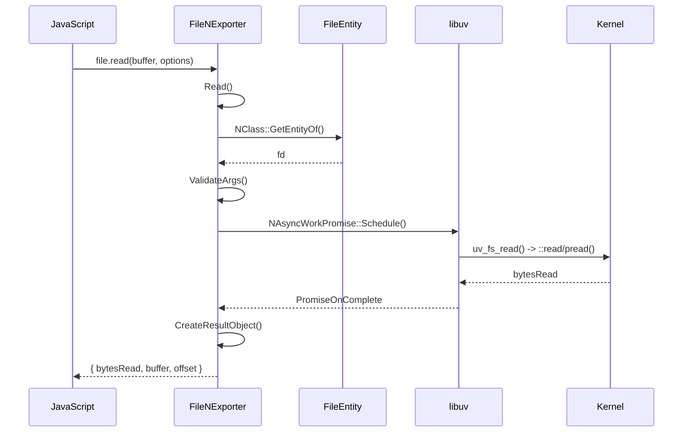
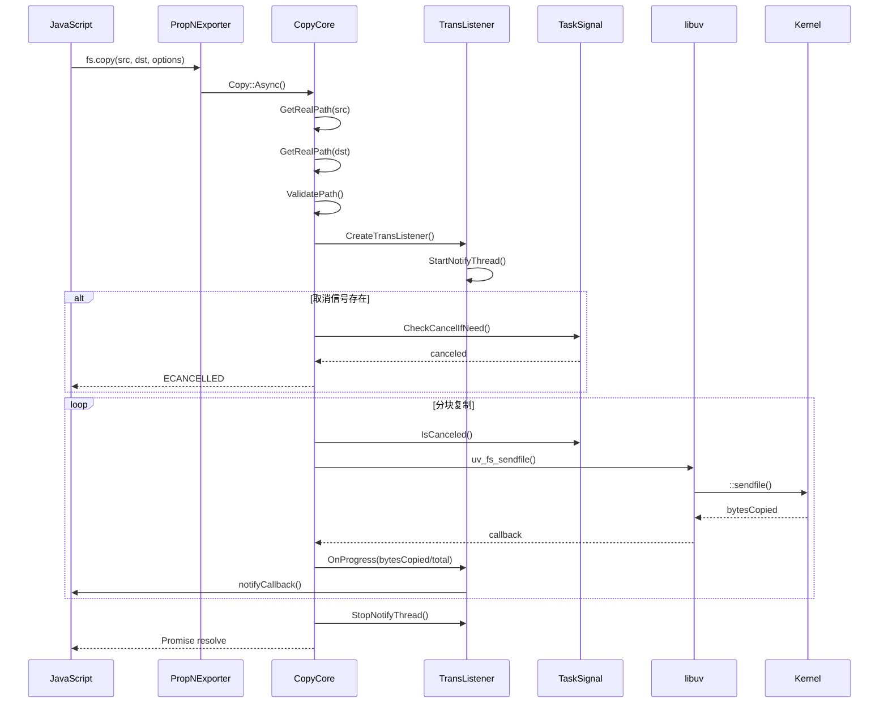
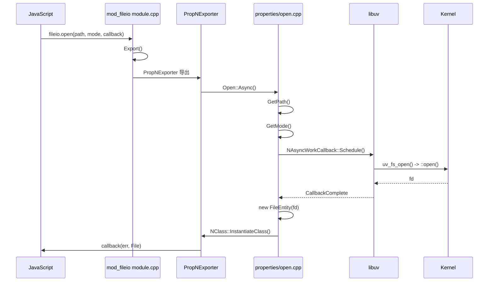
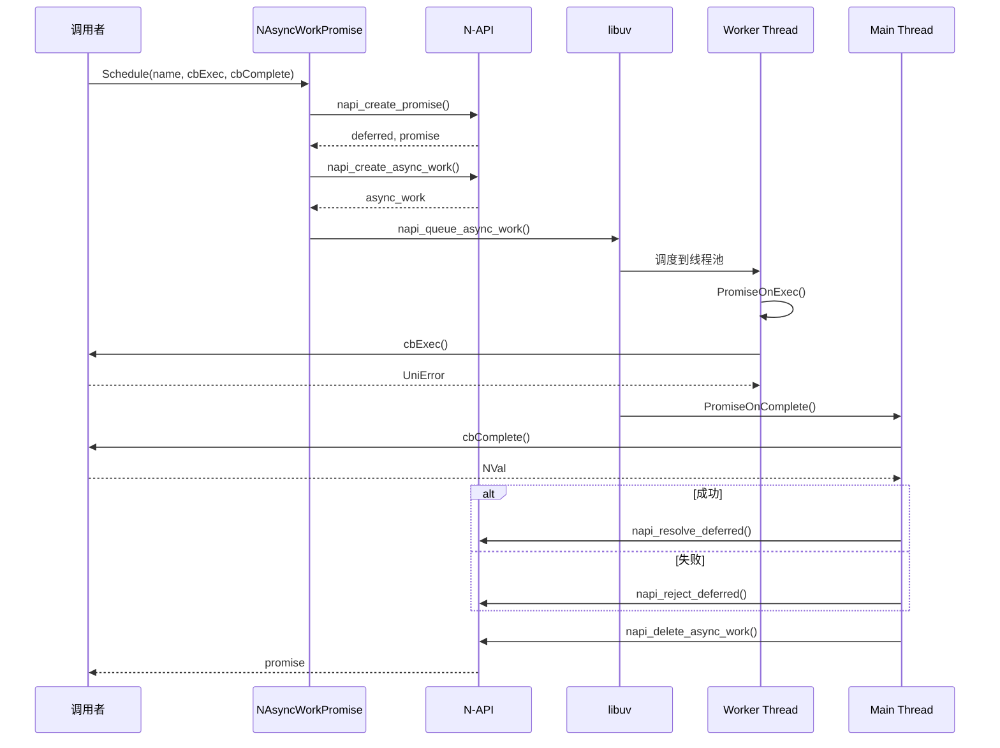
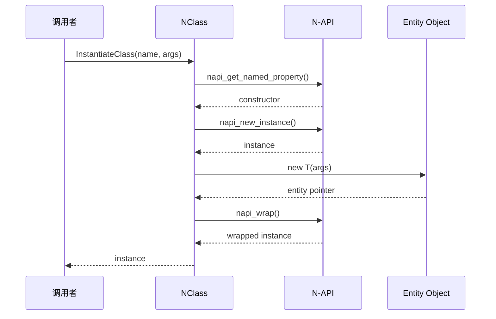
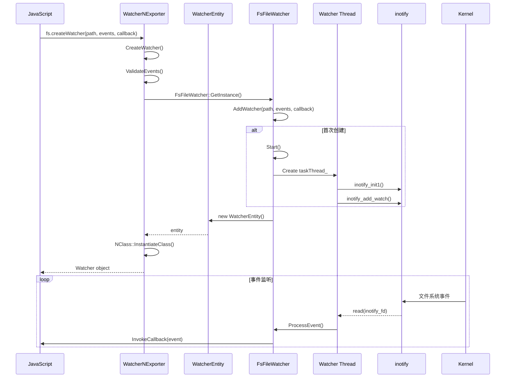
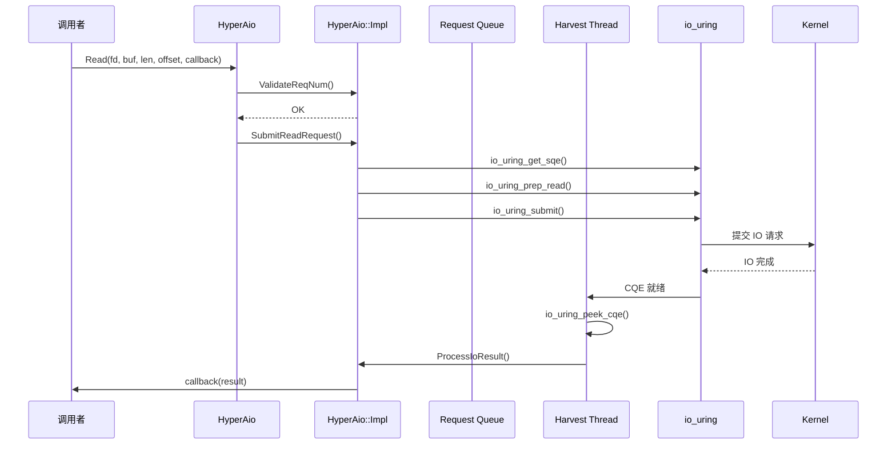

# 附录 A: 关键调用链

## @ohos.file.fs 调用链

### fs.open() - Promise 模式

**关键文件路径**:
1. `interfaces/kits/js/src/mod_fs/module.cpp:54-88` - 模块注册
2. `interfaces/kits/js/src/mod_fs/properties/prop_n_exporter.cpp` - 属性导出
3. `interfaces/kits/js/src/mod_fs/properties/open.cpp` - open 实现
4. `interfaces/kits/native/remote_uri/remote_uri.cpp` - URI 处理
5. `interfaces/kits/js/src/mod_fs/class_file/file_entity.h` - File 实体

### fs.read() - Promise 模式

**关键文件路径**:
1. `interfaces/kits/js/src/mod_fs/class_file/file_n_exporter.cpp` - File 类方法
2. `interfaces/kits/js/src/mod_fs/class_file/file_entity.h` - 实体定义
3. `utils/filemgmt_libn/src/n_async/n_async_work_promise.cpp` - Promise 实现

### fs.copy() - 带进度和取消

**关键文件路径**:
1. `interfaces/kits/js/src/mod_fs/properties/copy_core.cpp` - 复制核心
2. `interfaces/kits/js/src/mod_fs/properties/copy_listener/trans_listener.cpp` - 进度监听
3. `interfaces/kits/native/task_signal/task_signal.cpp` - 取消信号

## @ohos.fileio 调用链

### fileio.open() - Callback 模式

**关键文件路径**:
1. `interfaces/kits/js/src/mod_fileio/module.cpp:33-53`
2. `interfaces/kits/js/src/mod_fileio/properties/prop_n_exporter.cpp`
3. `interfaces/kits/js/src/mod_fileio/properties/open.cpp`

## LibN 框架调用链

### NAsyncWorkPromise::Schedule()

**关键文件路径**:
1. `utils/filemgmt_libn/include/n_async/n_async_work_promise.h`
2. `utils/filemgmt_libn/src/n_async/n_async_work_promise.cpp`

### NClass::InstantiateClass()

**关键文件路径**:
1. `utils/filemgmt_libn/include/n_class.h`
2. `utils/filemgmt_libn/src/n_class.cpp`

## 文件监控调用链 (Watcher)

### createWatcher()

**关键文件路径**:
1. `interfaces/kits/js/src/mod_fs/class_watcher/watcher_n_exporter.cpp`
2. `interfaces/kits/js/src/mod_fs/class_watcher/fs_file_watcher.cpp`
3. `interfaces/kits/js/src/mod_fs/class_watcher/watcher_entity.h`

## HyperAIO 调用链

### HyperAio::Read()

**关键文件路径**:
1. `interfaces/kits/hyperaio/include/hyperaio.h`
2. `interfaces/kits/hyperaio/src/hyperaio.cpp`

## 参考索引

| 调用链 | 入口文件 | 核心实现 | 辅助文件 |
|--------|----------|----------|----------|
| fs.open | `mod_fs/properties/open.cpp` | `open_core.cpp` | `remote_uri.cpp`, `file_entity.h` |
| fs.read | `mod_fs/class_file/file_n_exporter.cpp` | `Read()` | `n_async_work_promise.cpp` |
| fs.copy | `mod_fs/properties/copy.cpp` | `copy_core.cpp` | `trans_listener.cpp`, `task_signal.cpp` |
| fileio.open | `mod_fileio/properties/open.cpp` | `Open::Async()` | `prop_n_exporter.cpp` |
| Promise 异步 | `n_async_work_promise.cpp` | `Schedule()` | `n_async_context.h` |
| Watcher | `watcher_n_exporter.cpp` | `CreateWatcher()` | `fs_file_watcher.cpp` |
| HyperAIO | `hyperaio.cpp` | `Read/Write()` | `hyperaio.h` |
