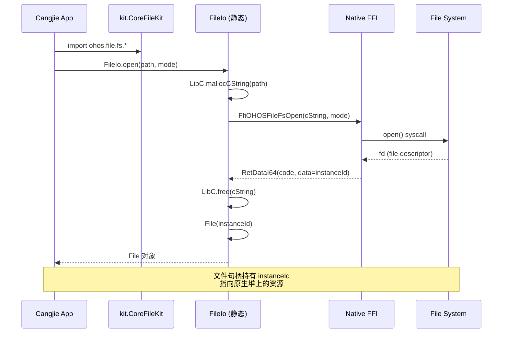
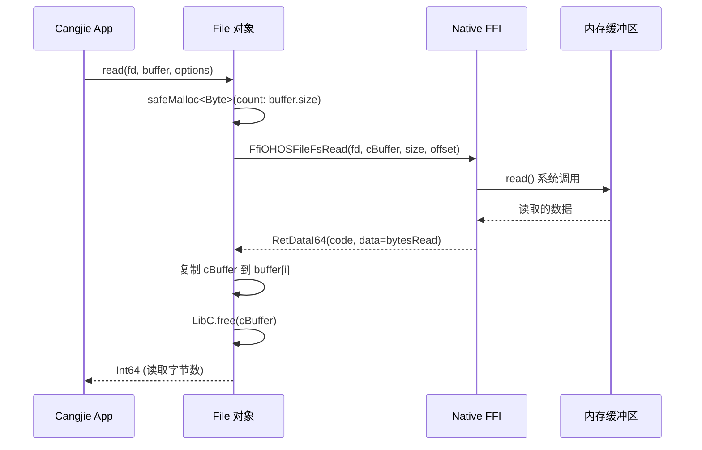
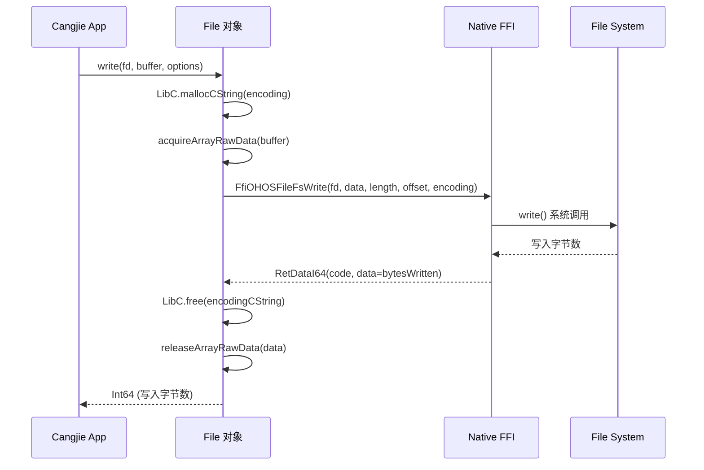
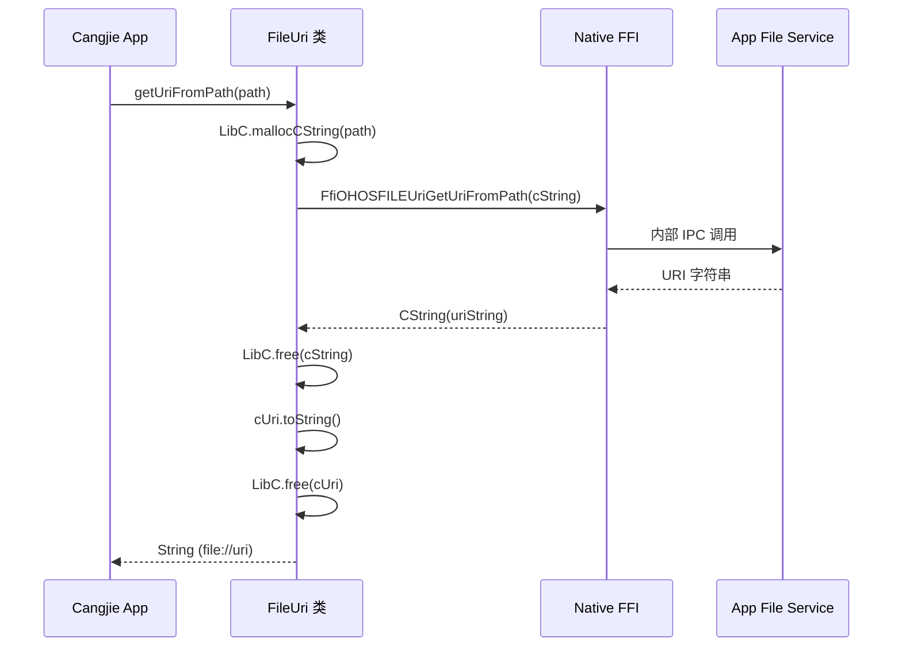
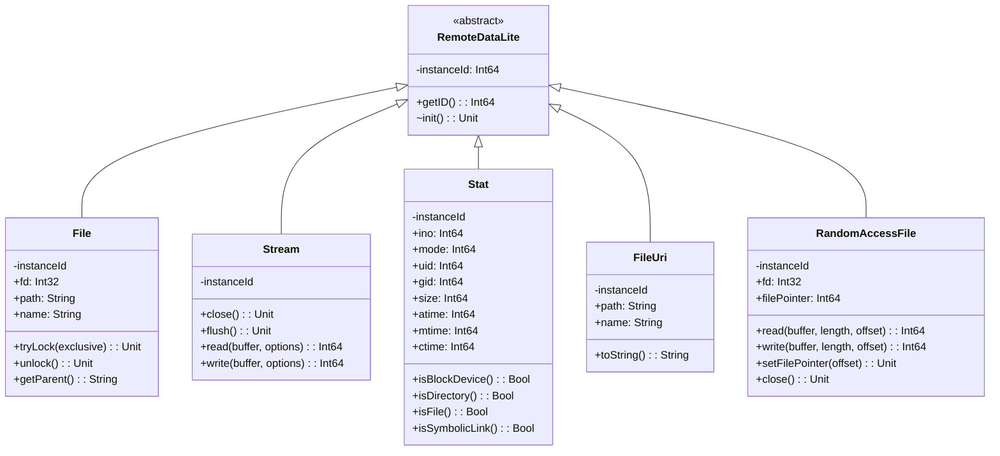
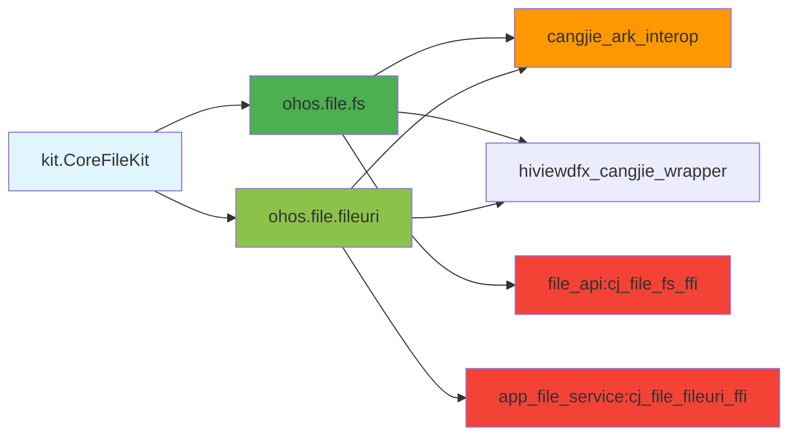
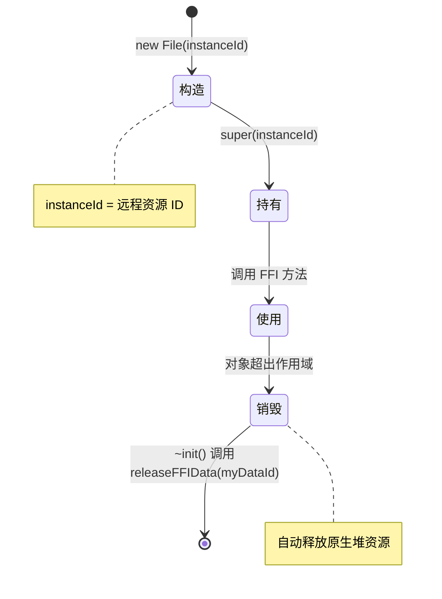
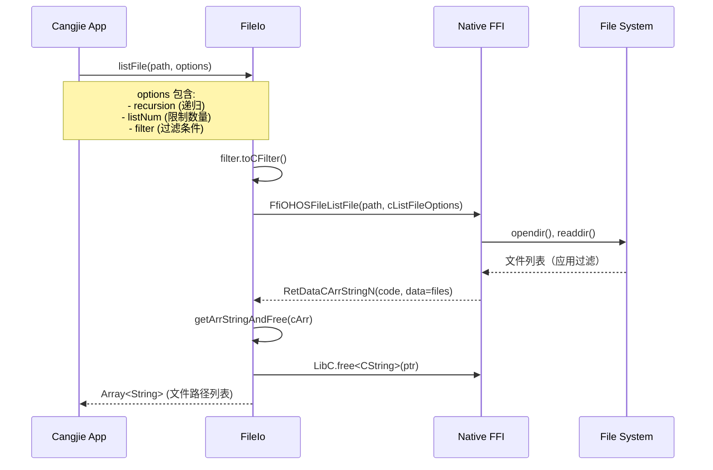
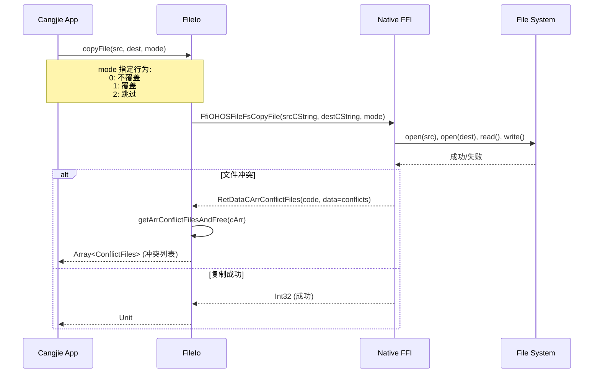

# 系统架构

> 目的：描述组件图、数据流、线程模型、关键时序
> 适用范围：架构师理解系统设计、开发者掌握调用链路、性能优化
> 最后更新：2026-02-06

## 架构层次

### 四层架构模型

```
┌─────────────────────────────────────────────────────────────┐
│  Layer 1: Interface Layer（接口层）                 │
│  kit.CoreFileKit                                            │
│  - 对外 API 聚合                                          │
│  - 导出控制（public import）                              │
└─────────────────────────────────────────────────────────────┘
                              │
                              ▼
┌─────────────────────────────────────────────────────────────┐
│  Layer 2: Framework Layer（框架层 - Cangjie 实现）        │
│  ohos.file.fs.* / ohos.file.fileuri.*                     │
│  - FileIo（静态工具类）                                   │
│  - File, Stream, Stat, RandomAccessFile（对象句柄）         │
│  - FileUri, Uri（URI 处理）                                  │
│  - OpenMode, Options, Enums（配置类型）                     │
└─────────────────────────────────────────────────────────────┘
                              │
                              ▼
┌─────────────────────────────────────────────────────────────┐
│  Layer 3: FFI Bridge Layer（FFI 桥接层）           │
│  ohos.file.fs.native（foreign function declarations）     │
│  - 70+ FFI 函数声明（FfiOHOS*）                        │
│  - RemoteDataLite 资源管理                                 │
│  - Cangjie ↔ C++ 类型转换                                 │
└─────────────────────────────────────────────────────────────┘
                              │
                              ▼
┌─────────────────────────────────────────────────────────────┐
│  Layer 4: Native Service Layer（原生服务层 - 外部依赖） │
│  - file_api:cj_file_fs_ffi（文件系统）                      │
│  - app_file_service:cj_file_fileuri_ffi（文件 URI）             │
│  - cangjie_ark_interop（C 互操作支持）                          │
│  - hiviewdfx_cangjie_wrapper（日志接口）                            │
│  - OpenHarmony Kernel/VFS（底层文件系统）                      │
└─────────────────────────────────────────────────────────────┘
```

### 层次职责

| 层次 | 主要文件 | 职责 | 关键类 |
|------|----------|------|--------|
| **接口层** | `kit/CoreFileKit/index.cj` | 对外 API 聚合、导出控制 | - |
| **框架层** | `ohos/file/fs/*.cj`, `ohos/file/fileuri/*.cj` | 业务逻辑实现、对象封装 | `FileIo`, `File`, `Stream`, `Stat`, `FileUri` |
| **FFI 层** | `ohos/file/fs/native.cj` | 外部函数声明、类型转换 | - |
| **服务层** | 外部仓库（file_api, app_file_service） | 实际文件系统操作、IPC 通信 | - |

---

## 数据流

### 1. 文件打开流程



**关键证据**：
- `FileIo.open()` 实现：`ohos/file/fs/cj_file_fs.cj:1270-1281`
- FFI 声明：`ohos/file/fs/native.cj:100` - `func FfiOHOSFileFsOpen`

### 2. 文件读取流程



**关键证据**：
- `FileIo.read()` 实现：`ohos/file/fs/cj_file_fs.cj:1339-1363`
- FFI 声明：`ohos/file/fs/native.cj:130` - `func FfiOHOSFileFsRead`

### 3. 文件写入流程



**关键证据**：
- `FileIo.write()` 实现：`ohos/file/fs/cj_file_fs.cj:1396-1426`
- FFI 声明：`ohos/file/fs/native.cj:134` - `func FfiOHOSFileFsWrite`

### 4. URI 获取流程



**关键证据**：
- `getUriFromPath()` 实现：`ohos/file/fileuri/file_uri.cj:96-209`
- FFI 声明：`ohos/file/fileuri/file_uri.cj:33` - `func FfiOHOSFILEUriGetUriFromPath`

---

## 线程模型

### WorkerThread（工作线程）机制

**定义**：标记 API 在后台线程执行，避免阻塞主线程

**证据**：多个文件中存在 `workerthread: true` 注解
- `FileIo.stat()`: `ohos/file/fs/cj_file_fs.cj:955`
- `FileIo.createStream()`: `ohos/file/fs/cj_file_fs.cj:1053`
- `FileIo.open()`: `ohos/file/fs/cj_file_fs.cj:1270`
- `Stream.read()`: `ohos/file/fs/stream.cj:239`
- `Stream.write()`: `ohos/file/fs/stream.cj:129`

**实现机制**（推断）：
```
┌─────────────────────────────────────────────────────────────┐
│  Main Thread (主线程 / UI 线程)                            │
│  - 处理用户交互                                             │
│  - 调用 API（同步返回）                                 │
│  - 不执行阻塞 I/O 操作                                    │
└─────────────────────────────────────────────────────────────┘
                              │
                              ▼
┌─────────────────────────────────────────────────────────────┐
│  Worker Thread Pool (工作线程池)                         │
│  - 执行标记 workerthread: true 的 API                       │
│  - 处理文件 I/O、系统调用                               │
│  - 完成后回调主线程（推测）                          │
└─────────────────────────────────────────────────────────────┘
```

### 线程安全

**资源管理**（RemoteDataLite 模式）：
- ✅ 每个对象持有唯一的 `instanceId`
- ✅ 对象销毁时自动释放资源（`~init()` 调用 `releaseFFIData()`）
- ✅ 防止跨线程资源竞争（单线程持有）

**证据**：
- `File` 类：`ohos/file/fs/file.cj:36-38`
- `Stream` 类：`ohos/file/fs/stream.cj:38-40`

---

## 组件关系图

### 类继承层次



### 模块依赖



---

## 资源生命周期

### RemoteDataLite 生命周期



**关键证据**：
- `File` 类：`ohos/file/fs/file.cj:32-34` - `init(instanceId)`
- `File` 类：`ohos/file/fs/file.cj:36-38` - `~init()` 释放资源

---

## 关键时序（关键操作）

### 1. 目录列表与过滤



**关键证据**：
- `FileIo.listFile()` 实现：`ohos/file/fs/cj_file_fs.cj`（需查找完整实现）
- FFI 声明：`ohos/file/fs/native.cj:152` - `func FfiOHOSFileListFile`

### 2. 文件复制（带冲突处理）



**关键证据**：
- `FileIo.copyDir()` 实现：`ohos/file/fs/cj_file_fs.cj:138` - `RetDataCArrConflictFiles`
- FFI 声明：`ohos/file/fs/native.cj:140` - `func FfiOHOSFileFsCopyFile`

---

## 关键结论

1. **四层架构**：接口层 → 框架层 → FFI 层 → 原生服务层，职责清晰分离
2. **WorkerThread 模式**：I/O 操作标记 `workerthread: true` 避免阻塞主线程
3. **RemoteDataLite 资源管理**：RAII 模式，自动释放原生堆资源
4. **FFI 桥接**：70+ 外部函数声明，类型安全的 C/C++ 调用
5. **错误传播**：通过 `RetData*` 结构封装返回值，统一错误处理

---

## 相关跳转

- [00_Overview.md](00_Overview.md) - 项目概览
- [01_Directories_and_Modules.md](01_Directories_and_Modules.md) - 目录结构
- [03_NAPI_FFI_Bindings.md](03_NAPI_FFI_Bindings.md) - FFI 详细说明
- [04_Public_API.md](04_Public_API.md) - 对外 API 列表
