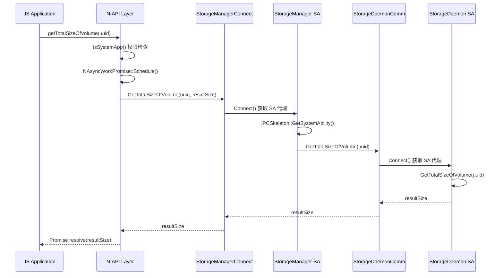

# N-API 接口文档

> 本文档描述 storage_service 对外暴露的 JavaScript API，包括 API 清单、绑定位置、参数校验和调用链。

## 概述

storage_service 提供 3 个 N-API 模块，通过 OpenHarmony 标准 N-API 框架注册：

| 模块名 | 产物 | 模块注册名 |
|--------|------|-----------|
| storageStatistics | `libstoragestatistics.so` | `file.storageStatistics` |
| volumeManager | `libvolumemanager.so` | `file.volumeManager` |
| keyManager | `libkeymanager.so` | `file.keyManager` |

**证据来源**：`interfaces/kits/js/storage_manager/BUILD.gn:17-206`

## N-API 注册模式

本项目使用 **OpenHarmony 标准 N-API 注册模式**：

```cpp
// 1. 定义模块结构体
static napi_module _module = {
    .nm_version = 1,
    .nm_flags = 0,
    .nm_filename = nullptr,
    .nm_register_func = ModuleExport,  // 导出函数
    .nm_modname = "file.moduleName",   // 模块名
    .nm_priv = ((void *)0),
    .reserved = {0}
};

// 2. 构造函数属性注册
extern "C" __attribute__((constructor)) void RegisterModule(void) {
    napi_module_register(&_module);
}
```

**证据来源**：`services/storage_manager/kits_impl/src/storage_statistics_napi.cpp:58`

## file.storageStatistics 模块

> 提供存储空间统计能力。

### API 清单

| JS API | 类型 | 参数 | 返回值 | C++ 实现 | 位置 |
|--------|------|------|--------|---------|------|
| `getTotalSizeOfVolume` | Async | uuid: string | number (Promise) | `GetTotalSizeOfVolume` | `storage_statistics_n_exporter.cpp:34` |
| `getFreeSizeOfVolume` | Async | uuid: string | number (Promise) | `GetFreeSizeOfVolume` | `storage_statistics_n_exporter.cpp:84` |
| `getBundleStats` | Async | bundleName: string, statFlag?: number | BundleStats | `GetBundleStats` | `storage_statistics_n_exporter.cpp:169` |
| `getCurrentBundleStats` | Async | statFlag?: number | BundleStats | `GetCurrentBundleStats` | `storage_statistics_n_exporter.cpp:260` |
| `getSystemSize` | Async | - | number | `GetSystemSize` | `storage_statistics_n_exporter.cpp:311` |
| `getUserStorageStats` | Async | userId: number | StorageStats | `GetUserStorageStats` | `storage_statistics_n_exporter.cpp:349` |
| `getTotalSize` | Async | - | number | `GetTotalSize` | `storage_statistics_n_exporter.cpp:417` |
| `getFreeSize` | Async | - | number | `GetFreeSize` | `storage_statistics_n_exporter.cpp:451` |
| `getTotalSizeSync` | Sync | - | number | `GetTotalSizeSync` | `storage_statistics_n_exporter.cpp:485` |
| `getFreeSizeSync` | Sync | - | number | `GetFreeSizeSync` | `storage_statistics_n_exporter.cpp:504` |
| `setExtBundleStats` | Async | bundleName: string, appIndex: number, bundleStats: [extBundleStats](#) | boolean | `SetExtBundleStats` | `storage_statistics_n_exporter.cpp:558` |
| `getExtBundleStats` | Async | bundleName: string, appIndex: number | [extBundleStats](#) | `GetExtBundleStats` | `storage_statistics_n_exporter.cpp:599` |
| `getAllExtBundleStats` | Async | userId: number, bundleNames: string[] | [extBundleStats](#)[] | `GetAllExtBundleStats` | `storage_statistics_n_exporter.cpp:644` |
| `listUserdataDirInfo` | Async | - | [UserdataDirInfo](#)[] | `ListUserdataDirInfo` | `storage_statistics_n_exporter.cpp:238` |

### 权限要求

> **重要**：storageStatistics 模块的所有 API 均要求调用者为**系统应用**。

```cpp
if (!IsSystemApp()) {
    NError(E_PERMISSION_SYS).ThrowErr(env);
    return nullptr;
}
```

**证据来源**：`storage_statistics_n_exporter.cpp:36-39`

### 异步模式

所有异步 API 均支持两种调用方式：

```javascript
// Promise 方式
storageStatistics.getTotalSizeOfVolume(uuid).then(size => {
    console.log(size);
});

// Callback 方式
storageStatistics.getTotalSizeOfVolume(uuid, (err, size) => {
    if (err) console.error(err);
    else console.log(size);
});
```

**证据来源**：`storage_statistics_n_exporter.cpp:72-80`

## file.volumeManager 模块

> 提供卷管理能力，包括挂载、卸载、格式化等。

### API 清单

| JS API | 类型 | 参数 | 返回值 | C++ 实现 | 位置 |
|--------|------|------|--------|---------|------|
| `getAllVolumes` | Async | - | [VolumeExternal](#)[] | `GetAllVolumes` | `volumemanager_n_exporter.cpp:45` |
| `mount` | Async | volumeId: string | void | `Mount` | `volumemanager_n_exporter.cpp:111` |
| `unmount` | Async | volumeId: string | void | `Unmount` | `volumemanager_n_exporter.cpp:152` |
| `getVolumeByUuid` | Async | uuid: string | [VolumeExternal](#) | `GetVolumeByUuid` | `volumemanager_n_exporter.cpp:194` |
| `getVolumeById` | Async | id: string | [VolumeExternal](#) | `GetVolumeById` | `volumemanager_n_exporter.cpp:248` |
| `setVolumeDescription` | Async | uuid: string, desc: string | void | `SetVolumeDescription` | `volumemanager_n_exporter.cpp:303` |
| `format` | Async | volumeId: string, fsType: string | void | `Format` | `volumemanager_n_exporter.cpp:358` |
| `partition` | Async | diskId: string, type: number | void | `Partition` | `volumemanager_n_exporter.cpp:412` |
| `isSameAccountDevice` | Async | - | boolean | `DfsService::IsSameAccountDevice` | `napi_module_dfs_service.cpp:132` |
| `getDfsSwitchStatus` | Async | - | number | `DfsService::GetDfsSwitchStatus` | `napi_module_dfs_service.cpp:163` |
| `updateDfsSwitchStatus` | Async | status: number | void | `DfsService::UpdateDfsSwitchStatus` | `napi_module_dfs_service.cpp:197` |
| `connectDfs` | Async | path: string | void | `DfsService::ConnectDfs` | `napi_module_dfs_service.cpp:233` |
| `disconnectDfs` | Async | path: string | void | `DfsService::DisconnectDfs` | `napi_module_dfs_service.cpp:272` |
| `getConnectedDeviceList` | Async | - | [DeviceInfo](#)[] | `DfsService::GetConnectedDeviceList` | `napi_module_dfs_service.cpp:311` |
| `on` | Sync | type: string, callback: Function | void | `DfsService::DeviceOnline` | `napi_module_dfs_service.cpp:335` |
| `off` | Sync | type: string, callback: Function | void | `DfsService::DeviceOffline` | `napi_module_dfs_service.cpp:374` |

### 权限要求

> **重要**：volumeManager 模块要求调用者为**系统应用**。

```cpp
if (!IsSystemApp()) {
    NError(E_PERMISSION_SYS).ThrowErr(env);
    return false;
}
```

**证据来源**：`volumemanager_n_exporter.cpp:34-37`

## file.keyManager 模块

> 提供用户密钥管理能力。

### API 清单

| JS API | 类型 | 参数 | 返回值 | C++ 实现 | 位置 |
|--------|------|------|--------|---------|------|
| `deactivateUserKey` | Async | userId: number | void | `DeactivateUserKey` | `keymanager_n_exporter.cpp:28` |

### 权限要求

> **重要**：keyManager 模块要求调用者为**系统应用**。

**证据来源**：`keymanager_n_exporter.cpp`

## 调用链分析

### 典型调用链：getTotalSizeOfVolume



**证据来源**：
- N-API: `storage_statistics_n_exporter.cpp:34-81`
- Connect: `storage_manager_connect.cpp:34-65`
- IPC: `services/storage_manager/storage_daemon_communication/`

### 关键代码路径

| 步骤 | 文件 | 行号 |
|------|------|------|
| N-API 注册 | `storage_statistics_napi.cpp` | 58 |
| 权限检查 | `storage_statistics_n_exporter.cpp` | 36 |
| 参数解析 | `storage_statistics_n_exporter.cpp` | 40-52 |
| 异步调度 | `storage_statistics_n_exporter.cpp` | 54-70 |
| IPC 连接 | `storage_manager_connect.cpp` | 34 |
| SA 调用 | `storage_manager_connect.cpp` | 67-79 |

## 错误码

### 错误码映射

| C++ 错误码 | JS 错误名 | 说明 |
|-----------|----------|------|
| `E_OK` | - | 成功 |
| `E_PERMISSION_SYS` | -1 | 系统权限不足 |
| `E_PARAMS` | -2 | 参数错误 |
| `E_SA_IS_NULLPTR` | -3 | SA 为空 |
| `E_REMOTE_IS_NULLPTR` | -4 | 远程对象为空 |
| `E_SERVICE_IS_NULLPTR` | -5 | 服务为空 |

**证据来源**：`interfaces/innerkits/storage_manager/native/storage_service_errno.h`

### 错误处理模式

```cpp
auto cbExec = [uuidString, resultSize]() -> NError {
    int32_t errNum = DelayedSingleton<StorageManagerConnect>::GetInstance()
        ->GetTotalSizeOfVolume(uuidString, *resultSize);
    if (errNum != E_OK) {
        return NError(Convert2JsErrNum(errNum));  // 转换为 JS 错误码
    }
    return NError(ERRNO_NOERR);
};
```

**证据来源**：`storage_statistics_n_exporter.cpp:56-63`

## 绑定位置速查

| 模块 | N-API 入口 | 实现文件 | 头文件 |
|------|-----------|---------|--------|
| storageStatistics | `storage_statistics_napi.cpp:58` | `storage_statistics_n_exporter.cpp` | `storage_statistics_n_exporter.h` |
| volumeManager | `volumemanager_napi.cpp:66` | `volumemanager_n_exporter.cpp` | `volumemanager_n_exporter.h` |
| keyManager | `keymanager_napi.cpp:45` | `keymanager_n_exporter.cpp` | `keymanager_n_exporter.h` |
| DFS Service | - | `napi_module_dfs_service.cpp` | `napi_module_dfs_service.h` |
