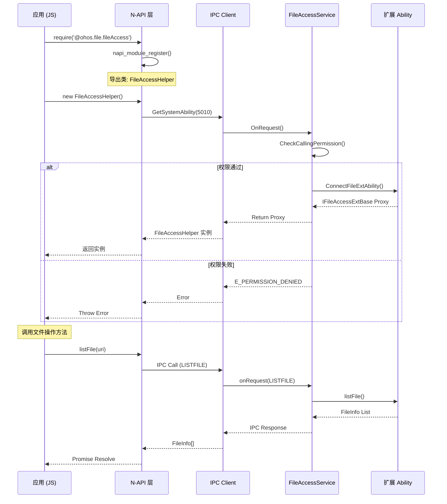

# User File Service - 架构说明

## 架构总览

### 系统架构图

```
┌─────────────────────────────────────────────────────────────────────────────┐
│                              应用层 (Stage Model)                            │
│  ┌─────────────────────┐  ┌─────────────────────┐  ┌─────────────────────┐ │
│  │    文件管理器       │  │    文件选择器       │  │    其他应用          │ │
│  │ (File Manager)     │  │ (File Picker)       │  │ (Other Apps)        │ │
│  └─────────┬───────────┘  └─────────┬───────────┘  └─────────┬───────────┘ │
│            │                        │                        │             │
│            └────────────────────────┼────────────────────────┘             │
└────────────────────────────────────┼──────────────────────────────────────┘
                                     │
                                     ▼
┌─────────────────────────────────────────────────────────────────────────────┐
│                         N-API 层 (frameworks/js/napi)                       │
│  ┌─────────────────────┐  ┌─────────────────────┐  ┌─────────────────────┐ │
│  │  file.fileAccess   │  │  file.picker        │  │  file.clouddisk     │ │
│  │  (文件访问核心)     │  │  (文件选择器)        │  │  (云盘管理)          │ │
│  └─────────┬───────────┘  └─────────┬───────────┘  └─────────┬───────────┘ │
│            │                        │                        │             │
│            └────────────────────────┼────────────────────────┘             │
└────────────────────────────────────┼──────────────────────────────────────┘
                                     │
                                     ▼
┌─────────────────────────────────────────────────────────────────────────────┐
│                         服务层 (services/native)                             │
│  ┌─────────────────────────────────────────────────────────────────────┐   │
│  │                    FileAccessService (SA 5010)                      │   │
│  │  ┌─────────────┐  ┌─────────────┐  ┌─────────────┐  ┌─────────────┐│   │
│  │  │ 权限校验    │  │ IPC 调度    │  │ 观察者管理  │  │ 云同步管理  ││   │
│  │  │ UfsAccess   │  │ ServiceStub │  │ ObserverMap │  │ CloudSync   ││   │
│  │  │ TokenHelper │  │             │  │             │  │             ││   │
│  │  └─────────────┘  └─────────────┘  └─────────────┘  └─────────────┘│   │
│  └─────────────────────────────────────────────────────────────────────┘   │
│                                                                             │
│  ┌─────────────────────┐  ┌─────────────────────┐                         │
│  │  CloudDiskService   │  │ NotifyWorkService   │                         │
│  │  (云盘服务)          │  │ (通知事件服务)       │                         │
│  └─────────────────────┘  └─────────────────────┘                         │
└─────────────────────────────────────────────────────────────────────────────┘
                                     │
                        ┌────────────┼────────────┐
                        ▼            ▼            ▼
┌─────────────────────────────────────────────────────────────────────────────┐
│                         底层服务 (外部子系统)                                 │
│  ┌─────────────────────┐  ┌─────────────────────┐  ┌─────────────────────┐ │
│  │    MediaLibrary     │  │  ExternalFileManager │  │    DfsService       │ │
│  │    (媒体库)         │  │   (外置存储管理)     │  │    (分布式文件系统)  │ │
│  └─────────────────────┘  └─────────────────────┘  └─────────────────────┘ │
└─────────────────────────────────────────────────────────────────────────────┘
```

**证据**：`README_zh.md:7`, `file_access_service.h:223`

---

## 组件说明

### 1. N-API 胶水层

| 组件 | 路径 | 职责 |
|------|------|------|
| `file.fileAccess` | `frameworks/js/napi/file_access_module/` | 文件访问核心能力 |
| `file.picker` | `interfaces/kits/picker/` | 文件选择 UI |
| `file.clouddisk` | `interfaces/kits/native/clouddiskmanager/` | 云盘管理 |

**证据**：`native_fileaccess_module.cpp:76-84`

```cpp
static napi_module _module = {
    .nm_version = 1,
    .nm_modname = "file.fileAccess",  // JS 模块名
    .nm_register_func = Init,
};
```

### 2. FileAccessService (系统服务)

| 特性 | 说明 |
|------|------|
| SA ID | 5010 |
| 进程 | 独立进程 (sa) |
| 继承 | SystemAbility, FileAccessServiceBaseStub |
| 配置 | `services/5010.json` |

**证据**：`file_access_service.h:223`

```cpp
class FileAccessService final : public SystemAbility, public FileAccessServiceBaseStub {
    DECLARE_SYSTEM_ABILITY(FileAccessService);
};
```

---

## 数据流

### 文件访问请求流程

```
┌──────────┐     ┌──────────┐     ┌──────────┐     ┌──────────┐     ┌──────────┐
│  应用    │────▶│  N-API   │────▶│  IPC     │────▶│  FileAccess│───▶│ 底层服务 │
│  (JS)    │     │ (C++)    │     │ Client   │     │ Service    │     │         │
└──────────┘     └──────────┘     └──────────┘     └──────────┘     └──────────┘
                   │                                      │
                   │                                ┌─────┴─────┐
                   │                                ▼           ▼
                   │                         ┌──────────┐  │ 权限校验  │
                   │                         │ 业务逻辑 │  │ Token    │
                   │                         └──────────┘  │ Check    │
                   │                                      │
                   ◀─────────────────────────────────────┘
                         │                         │
                         ▼                         ▼
                   ┌──────────┐            ┌──────────┐
                   │ Promise  │            │ 错误码   │
                   │ Resolve  │            │ E_XXX    │
                   └──────────┘            └──────────┘
```

---

## 线程模型

### 线程划分

```
┌─────────────────────────────────────────────────────────────────┐
│                         主线程 (UI Thread)                       │
│  ┌───────────────────────────────────────────────────────────┐  │
│  │ • N-API 调用入口                                            │  │
│  │ • JS ↔ C++ 转换                                            │  │
│  │ • Promise/Callback 回调                                    │  │
│  └───────────────────────────────────────────────────────────┘  │
│                              │                                   │
│                         异步任务提交                             │
│                              ▼                                   │
├─────────────────────────────────────────────────────────────────┤
│                       线程池 (Thread Pool)                      │
│  ┌───────────────────────────────────────────────────────────┐  │
│  │ • IPC 通信 (ipc_single)                                   │  │
│  │ • 阻塞式文件操作                                           │  │
│  │ • 观察者事件分发                                           │  │
│  └───────────────────────────────────────────────────────────┘  │
│                              │                                   │
│                        跨线程同步                                │
│                              ▼                                   │
├─────────────────────────────────────────────────────────────────┤
│                      FileAccessService (SA 进程)                │
│  ┌───────────────────────────────────────────────────────────┐  │
│  │ • SystemAbility 主线程                                     │  │
│  │ • IPC 接收 (onRequest)                                     │  │
│  │ • 业务处理                                                 │  │
│  │ • 观察者通知                                               │  │
│  └───────────────────────────────────────────────────────────┘  │
└─────────────────────────────────────────────────────────────────┘
```

### 关键线程约束

| 操作 | 线程 | 原因 |
|------|------|------|
| N-API 调用 | 主线程 | JS 运行时限制 |
| IPC 发送 | 任意 | 异步通信 |
| 回调执行 | 主线程 | JS 上下文恢复 |
| 文件操作 | 线程池 | 避免阻塞 SA |

---

## 观察者模式

### 文件变化通知

```
┌──────────┐     ┌──────────┐     ┌──────────┐
│  应用    │◀────│  Service │◀────│ 底层服务 │
│ (Observer)│     │          │     │ (Subject)│
└──────────┘     └──────────┘     └──────────┘
                      │
                 ┌────┴────┐
                 ▼         ▼
           ┌─────────┐  ┌─────────┐
           │ Observer│  │ Observer│
           │ Context │  │ Node    │
           └─────────┘  └─────────┘
```

**证据**：`file_access_service.h:46-121`

### NotifyType 枚举

| 类型 | 说明 | 触发时机 |
|------|------|----------|
| `BUF_MODIFIED` | 缓冲区修改 | 文件内容变更 |
| `CLOSE` | 文件关闭 | close() 调用 |
| `MOVE_SELF` | 移动自身 | rename() 自身 |
| `MOVE` | 移动到 | 移动到其他位置 |
| `DELETE` | 删除 | 文件删除 |
| `CREATE` | 创建 | 新文件创建 |

---

## 时序图

### 文件访问调用时序



---

## IPC 接口

### 接口代码定义

| Code | Interface | 说明 |
|------|-----------|------|
| 1 | LISTFILE | 列出文件 |
| 2 | CREATE | 创建文件/目录 |
| 3 | DELETE | 删除 |
| 4 | OPEN | 打开文件 |
| 5 | MOVE | 移动 |
| 6 | RENAME | 重命名 |
| 7 | ACCESS | 检查存在性 |
| 8 | GETFILEINFO | 获取文件信息 |
| 9 | FROMURI | 从 URI 获取信息 |
| 10 | GETROOTS | 获取根路径 |
| ... | ... | ... |

**证据**：`file_access_service_ipc_interface_code.h`

---

## 依赖方向

```
interfaces/kits/picker/
    ↓
frameworks/js/napi/file_access_module/
    ↓
services/native/file_access_service/
    ↓
interfaces/inner_api/file_access/
    ↓
external services (MediaLibrary, ExternalFileManager)
```

**依赖原则**：上层依赖下层，禁止反向依赖。

---

## 稳定性标注

| 组件 | 稳定性 | 理由 |
|------|--------|------|
| `file.fileAccess` | 稳定 | 对外 API，已冻结 |
| `file.picker` | 稳定 | 对外 API |
| `FileAccessService` | 稳定 | 系统服务 |
| `inner_api/*` | 半稳定 | 供系统组件使用 |
| `services/*` | 稳定 | 内部实现 |
