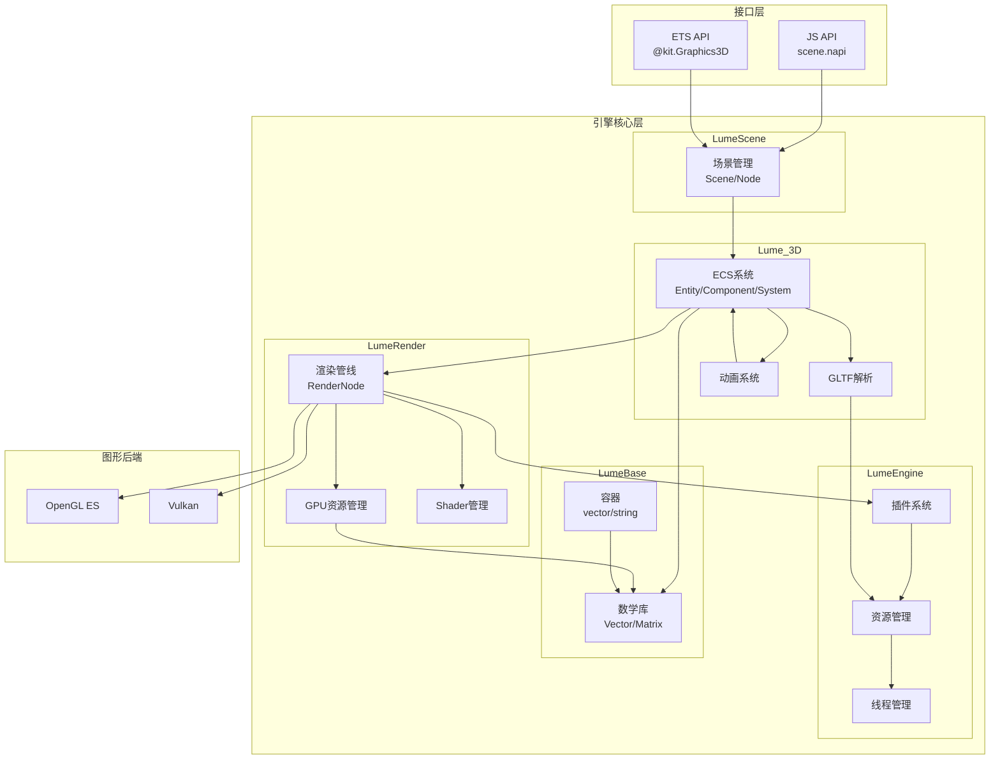
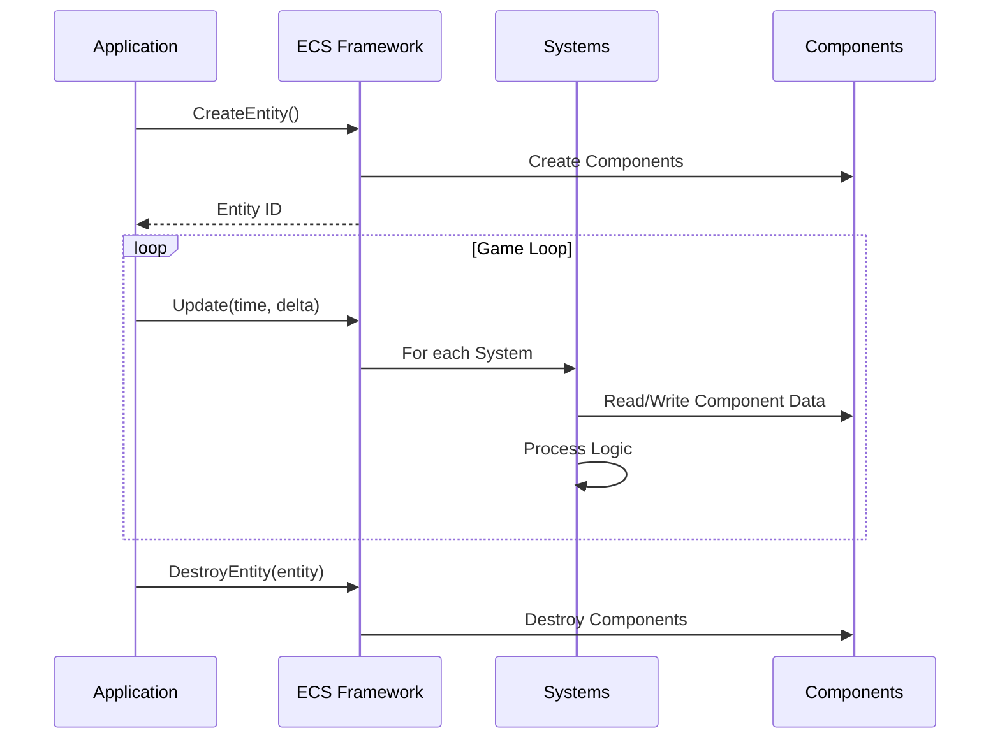
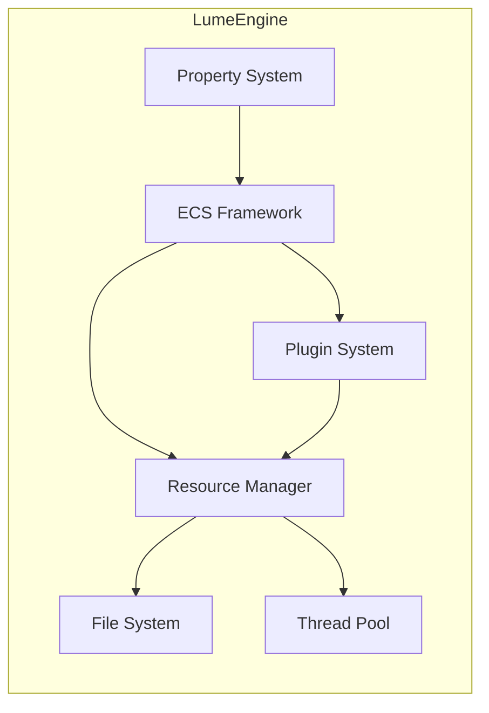
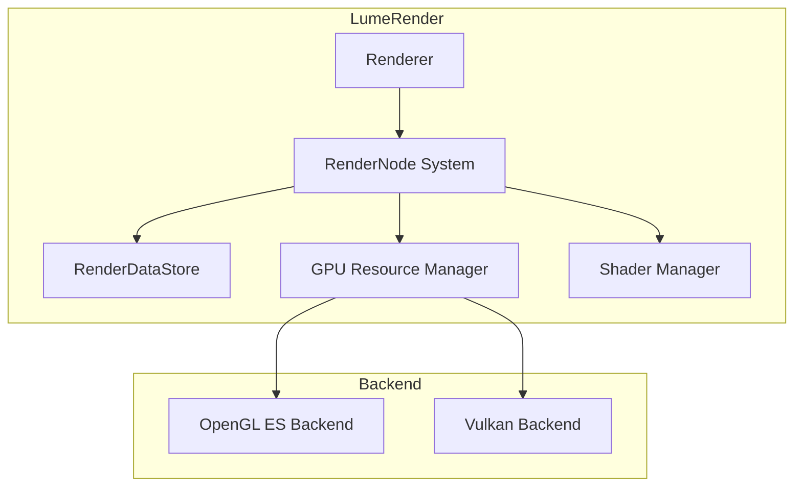
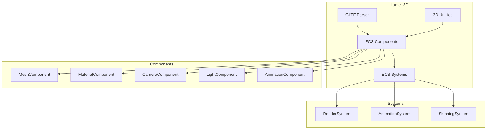
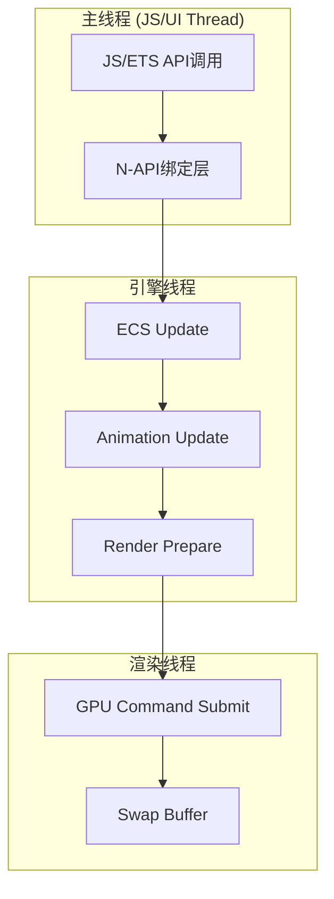
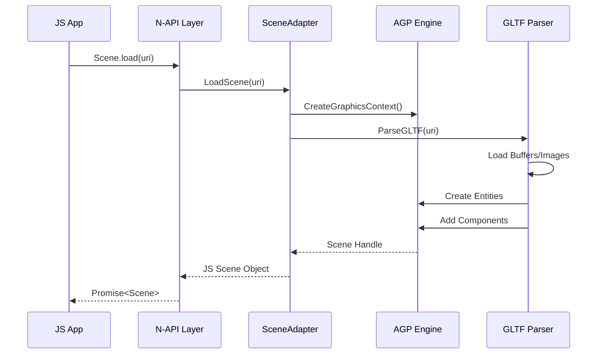
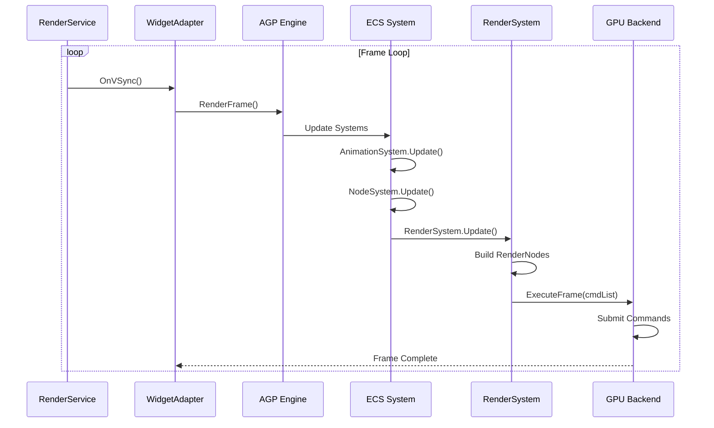

# 架构设计

## 整体架构

AGP引擎采用**分层架构 + ECS（Entity-Component-System）设计模式**，支持跨平台渲染（OpenGL ES/Vulkan）。



---

## ECS架构详解

### 核心概念

ECS（Entity-Component-System）是一种数据驱动的架构模式：

| 概念 | 说明 | 代码位置 |
|------|------|----------|
| **Entity** | 轻量级标识符（id + version），代表游戏对象 | `lume/LumeEngine/api/core/ecs/entity.h` |
| **Component** | 纯数据结构，存储实体属性 | `lume/Lume_3D/api/3d/ecs/components/` |
| **System** | 逻辑处理器，遍历处理组件 | `lume/Lume_3D/api/3d/ecs/systems/` |

### Entity（实体）

**定义** (`lume/LumeEngine/api/core/ecs/entity.h`):
```cpp
struct Entity {
    uint32_t id;        // 实体ID
    uint32_t version;   // 版本号（用于垃圾回收）
};
```

**管理接口** (`lume/LumeEngine/api/core/ecs/intf_entity_manager.h`):
```cpp
class IEntityManager {
    virtual Entity Create() = 0;                                    // 创建实体
    virtual EntityReference CreateReferenceCounted() = 0;          // 创建引用计数实体
    virtual void Destroy(const Entity entity) = 0;                  // 销毁实体
    virtual bool IsAlive(const Entity entity) const = 0;            // 检查存活
    virtual void SetActive(const Entity entity, bool state) = 0;    // 激活/停用
};
```

### Component（组件）

**管理接口** (`lume/LumeEngine/api/core/ecs/intf_component_manager.h`):
```cpp
class IComponentManager {
    virtual void Create(Entity entity) = 0;                         // 为实体创建组件
    virtual bool Destroy(Entity entity) = 0;                        // 销毁组件
    virtual IPropertyHandle* GetData(Entity entity) = 0;            // 获取可修改数据
    virtual const IPropertyHandle* GetData(Entity entity) const = 0; // 获取只读数据
    virtual BASE_NS::vector<Entity> GetAddedComponents() = 0;       // 获取新增组件
    virtual BASE_NS::vector<Entity> GetRemovedComponents() = 0;     // 获取移除组件
};
```

**核心3D组件** (`lume/Lume_3D/api/3d/ecs/components/`):

| 组件 | 文件 | 职责 |
|------|------|------|
| `NodeComponent` | `node_component.h` | 场景节点层次结构 |
| `TransformComponent` | `transform_component.h` | 位置/旋转/缩放变换 |
| `MeshComponent` | `mesh_component.h` | 网格几何数据 |
| `MaterialComponent` | `material_component.h` | PBR材质属性 |
| `CameraComponent` | `camera_component.h` | 相机投影/视图参数 |
| `LightComponent` | `light_component.h` | 光源类型/颜色/强度 |
| `SkinComponent` | `skin_component.h` | 骨骼蒙皮数据 |
| `AnimationComponent` | `animation_component.h` | 动画状态/轨道 |
| `EnvironmentComponent` | `environment_component.h` | 环境光照/天空盒 |
| `PostProcessComponent` | `post_process_component.h` | 后处理配置 |

### System（系统）

**接口定义** (`lume/LumeEngine/api/core/ecs/intf_system.h`):
```cpp
class ISystem {
    virtual void Initialize() = 0;                                  // 初始化
    virtual bool Update(bool isFrameRenderingQueued, 
                       uint64_t time, uint64_t delta) = 0;          // 每帧更新
    virtual void Uninitialize() = 0;                                // 反初始化
    virtual IPropertyHandle* GetProperties() = 0;                   // 获取系统属性
};
```

**核心3D系统** (`lume/Lume_3D/api/3d/ecs/systems/`):

| 系统 | 文件 | 职责 | 依赖组件 |
|------|------|------|----------|
| `NodeSystem` | `intf_node_system.h` | 场景图/节点层次更新 | NodeComponent, TransformComponent |
| `AnimationSystem` | `intf_animation_system.h` | 动画播放与混合 | AnimationComponent, AnimationStateComponent |
| `SkinningSystem` | `intf_skinning_system.h` | 骨骼蒙皮计算 | SkinComponent, SkinJointsComponent, SkinIbmComponent |
| `MorphingSystem` | `intf_morphing_system.h` | 形态动画（blend shapes） | MorphComponent |
| `RenderSystem` | `intf_render_system.h` | 3D渲染核心 | MeshComponent, MaterialComponent, CameraComponent, LightComponent |
| `RenderPreprocessorSystem` | `intf_render_preprocessor_system.h` | 渲染预处理 | 所有渲染相关组件 |

### ECS数据流



---

## 核心模块架构

### 1. LumeBase - 基础数据类型

**位置**: `lume/LumeBase/`

**职责**: 提供基础数学库、容器和工具函数，不依赖其他模块。

| 子模块 | 关键类/文件 | 说明 |
|--------|-------------|------|
| 数学库 | `math/vector.h` | Vector2/3/4, 支持SIMD优化 |
| | `math/matrix.h` | Matrix3X3, Matrix4X4 |
| | `math/quaternion.h` | 四元数旋转表示 |
| | `math/mathf.h` | 数学函数（sin/cos/lerp等） |
| 容器 | `containers/vector.h` | 动态数组 |
| | `containers/string.h` | 字符串 |
| | `containers/unordered_map.h` | 哈希表 |
| | `containers/unique_ptr.h` | 智能指针 |
| 工具 | `util/uid.h` | 唯一标识符生成 |
| | `util/hash.h` | 哈希函数 |
| | `util/color.h` | 颜色工具 |

### 2. LumeEngine - 引擎框架

**位置**: `lume/LumeEngine/`

**职责**: 提供ECS框架、资源管理、线程管理、插件系统、平台抽象。



#### 2.1 插件系统

**核心接口** (`lume/LumeEngine/api/core/plugin/`):

| 接口 | 文件 | 职责 |
|------|------|------|
| `IPluginRegister` | `intf_plugin_register.h` | 插件注册中心 |
| `IClassFactory` | `intf_class_factory.h` | 通过UID创建类实例 |
| `IPlugin` | `intf_plugin.h` | 插件定义（生命周期管理） |
| `IInterface` | `intf_interface.h` | 接口基类（引用计数） |

**插件生命周期**:
```cpp
// 1. 全局注册
registerInterfaces(IPluginRegister& registry) {
    registry.RegisterComponentManagerType(...);
    registry.RegisterSystemType(...);
}

// 2. 引擎实例化时
createPlugin(IEngine& engine) {
    // 创建插件实例
}

// 3. 引擎销毁时
destroyPlugin(PluginToken token) {
    // 销毁插件实例
}

// 4. 全局注销
unregisterInterfaces(IPluginRegister& registry) {
    // 反注册
}
```

#### 2.2 资源管理

**核心接口** (`lume/LumeEngine/api/core/resources/intf_resource_manager.h`):

```cpp
class IResourceManager {
    // 资源类型管理
    virtual bool AddResourceType(IResourceType::Ptr) = 0;
    virtual bool RemoveResourceType(const ResourceType& type) = 0;
    
    // 资源CRUD
    virtual IResource::Ptr GetResource(const ResourceId& id) = 0;
    virtual bool AddResource(const IResource::Ptr& resource) = 0;
    virtual bool RemoveResource(const ResourceId&) = 0;
    
    // 批量操作
    virtual Result Import(BASE_NS::string_view url) = 0;
    virtual Result Export(BASE_NS::string_view filePath, ...) = 0;
    
    // 缓存管理
    virtual bool PurgeResource(const ResourceId&) = 0;
    virtual size_t PurgeGroup(BASE_NS::string_view group) = 0;
};
```

#### 2.3 线程管理

**核心接口** (`lume/LumeEngine/api/core/threading/intf_thread_pool.h`):

| 接口 | 职责 |
|------|------|
| `IThreadPool` | 线程池（并行任务） |
| `ITaskQueue` | 任务队列（顺序/并行） |

### 3. LumeRender - 渲染后端

**位置**: `lume/LumeRender/`

**职责**: 渲染管线、GPU资源管理、Shader管理、多后端抽象。



#### 3.1 RenderNode（渲染节点）

**核心接口** (`lume/LumeRender/api/render/nodecontext/intf_render_node.h`):

```cpp
class IRenderNode {
    enum ClassType : uint32_t {
        CLASS_TYPE_NODE = 0,           // 基础渲染节点
        CLASS_TYPE_BACKEND_NODE = 1,   // 后端访问节点
    };
    
    // 节点生命周期
    virtual void InitNode(IRenderNodeContextManager& renderNodeContextMgr) = 0;
    virtual void PreExecuteFrame() = 0;
    virtual void ExecuteFrame(IRenderCommandList& cmdList) = 0;
    virtual ExecuteFlags GetExecuteFlags() const = 0;
};
```

**常用渲染节点**:

| 节点 | 说明 |
|------|------|
| `RenderNodeBackBuffer` | 后缓冲呈现 |
| `RenderNodeBloom` | Bloom后处理 |
| `RenderNodeShaderPassesGeneric` | 通用Shader Pass |
| `RenderNodeComputeGeneric` | 通用计算着色器 |
| `RenderNodeFullscreenGeneric` | 全屏效果（ToneMapping等） |

#### 3.2 RenderDataStore（渲染数据存储）

**核心接口** (`lume/LumeRender/api/render/datastore/intf_render_data_store.h`):

```cpp
class IRenderDataStore {
    virtual void PreRender() = 0;           // 渲染前处理
    virtual void PostRender() = 0;          // 渲染后清理
    virtual void Clear() = 0;               // 清空数据
};
```

**内置数据存储**:

| 数据存储 | 文件 | 存储内容 |
|----------|------|----------|
| `RenderDataStoreDefaultMaterial` | `intf_render_data_store_default_material.h` | 材质数据 |
| `RenderDataStoreDefaultScene` | `intf_render_data_store_default_scene.h` | 场景数据 |
| `RenderDataStoreDefaultLight` | `intf_render_data_store_default_light.h` | 光照数据 |
| `RenderDataStoreDefaultCamera` | `intf_render_data_store_default_camera.h` | 相机数据 |
| `RenderDataStorePostProcess` | `intf_render_data_store_post_process.h` | 后处理配置 |
| `RenderDataStoreShaderPasses` | `intf_render_data_store_shader_passes.h` | Shader Pass数据 |

#### 3.3 GPU资源管理

**核心接口** (`lume/LumeRender/api/render/device/intf_gpu_resource_manager.h`):

```cpp
class IRenderNodeGpuResourceManager {
    // 缓冲区
    virtual RenderHandle Create(const GpuBufferDesc& desc) = 0;
    virtual void Destroy(RenderHandle handle) = 0;
    virtual MappedGpuBufferData MapBuffer(RenderHandle handle) = 0;
    
    // 图像/纹理
    virtual RenderHandle Create(const GpuImageDesc& desc) = 0;
    virtual RenderHandleView GetImageView(RenderHandle handle, ...) = 0;
    
    // 采样器
    virtual RenderHandle Create(const SamplerDesc& desc) = 0;
};
```

### 4. Lume_3D - 3D功能实现

**位置**: `lume/Lume_3D/`

**职责**: 3D ECS组件、GLTF模型解析、动画系统、渲染系统实现。



#### 4.1 GLTF解析

**核心文件**: `lume/Lume_3D/src/gltf/gltf2_loader.cpp`

支持GLTF 2.0标准格式，包括：
- `.gltf` + `.bin` 分离格式
- `.glb` 二进制打包格式
- 嵌入Base64数据

**解析流程**:
```
GLTF/GLB文件 → GLTF2Parser → ECS组件 → 场景图
```

#### 4.2 动画系统

**组件**:
- `AnimationComponent` - 动画剪辑
- `AnimationStateComponent` - 播放状态
- `AnimationTrackComponent` - 动画轨道
- `AnimationInputComponent` - 输入控制
- `AnimationOutputComponent` - 输出目标

**系统**:
- `AnimationSystem` - 动画采样与混合
- `SkinningSystem` - 骨骼蒙皮计算
- `MorphingSystem` - 形态动画

---

## 线程模型

### 线程架构



### 线程安全机制

| 机制 | 文件 | 说明 |
|------|------|------|
| `ThreadSafeCallback` | `kits/js/include/AnimationJS.h` | 线程安全回调基类 |
| `napi_create_threadsafe_function` | `kits/js/src/AnimationJS.cpp` | N-API线程安全函数 |
| `NodeJSTaskQueue` | `kits/js/src/nodejstaskqueue.cpp` | JS任务队列 |
| `ITaskQueue` | `lume/LumeEngine/api/core/threading/intf_thread_pool.h` | 引擎任务队列接口 |

### 异步模式

| 操作 | 模式 | 实现 |
|------|------|------|
| `createCamera/createNode` 等 | Promise | `napi_create_async_work` + `Promise` 类 |
| 动画回调 | ThreadSafeFunction | `napi_create_threadsafe_function` |
| 引擎任务 | TaskQueue | `ITaskQueue::Submit` |

---

## 关键时序

### 场景加载时序



### 渲染帧时序



---

## 关键设计模式

| 设计模式 | 应用位置 | 代码示例 |
|---------|----------|----------|
| **工厂模式** | 类创建 | `IClassFactory::CreateInstance(uid)` |
| **依赖注入** | 系统依赖 | `SystemTypeInfo::componentDependencies` |
| **观察者模式** | ECS事件 | `IEcs::AddEntityListener()` |
| **插件架构** | 功能扩展 | `IPluginRegister::LoadPlugins()` |
| **命令模式** | 渲染命令 | `IRenderCommandList::Dispatch()` |
| **引用计数** | 内存管理 | `BASE_NS::refcnt_ptr<T>` |
| **单例模式** | 全局注册器 | `GetPluginRegister()` |
| **策略模式** | 渲染后端 | `IDevice` (GLES/Vulkan实现) |

---

## 下一步

- [查看N-API接口文档 →](03_NAPI_Reference.md)
- [查看内部API文档 →](04_Internal_API.md)
- [查看GN构建配置 →](05_GN_Build.md)
