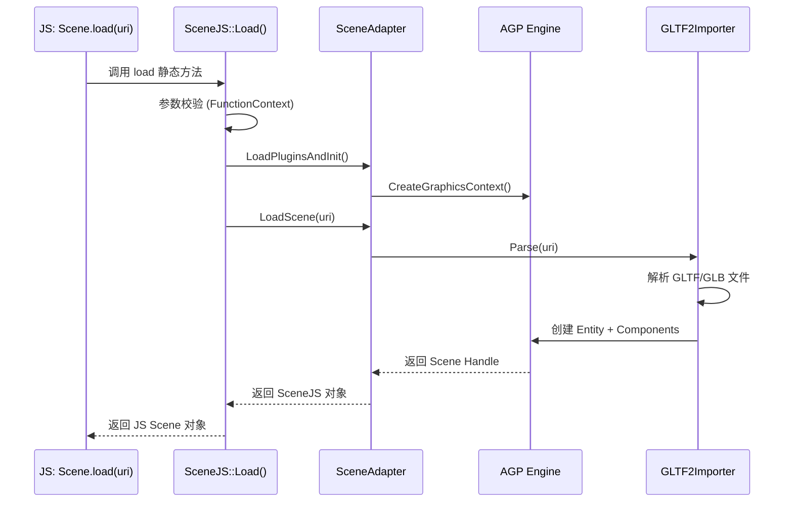
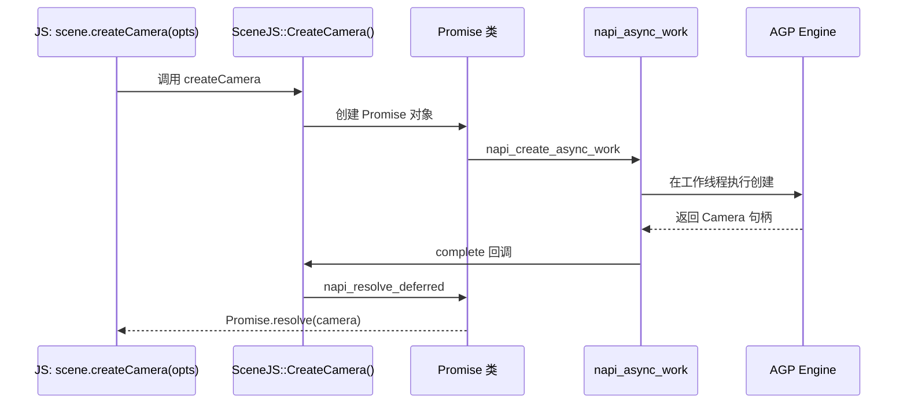

# 对外N-API接口

## 概述

AGP引擎提供两套API接口：

| 接口类型 | 技术方案 | 适用场景 | 产物文件 |
|---------|---------|---------|----------|
| **JS API** | N-API | JavaScript/ArkTS应用 | `libscene.z.so` |
| **ETS API** | Taihe (ANI) | ArkTS/ETS应用 | `scene_ani.z.so` + `.abc`文件 |

---

## JS API (N-API)

### 模块注册

**入口文件**: `kits/js/src/native_module_export.cpp`

```cpp
// 行 81-98
static napi_module g_module = {
    .nm_version = 1,
    .nm_flags = 0,
    .nm_filename = nullptr,
    .nm_register_func = Export,
    .nm_modname = "scene.napi",  // JS中使用的模块名
    .nm_priv = (reinterpret_cast<void *>(0)),
    .reserved = {0}
};

extern "C" __attribute__((constructor)) void Graphics3dKitRegisterModule(void) {
    napi_module_register(&g_module);
}
```

**使用方式**:
```javascript
import { Scene } from 'scene.napi';
// 或
const scene = require('scene.napi');
```

### 类注册

**文件**: `kits/js/src/register_module.cpp`

注册的核心类（行 52-195）：

| JS 类名 | C++ 注册函数 | 文件 |
|--------|-------------|------|
| Color | `napi_define_class` (内联) | register_module.cpp:78-82 |
| Vec2 | `napi_define_class` (内联) | register_module.cpp:94-98 |
| Vec3 | `napi_define_class` (内联) | register_module.cpp:108-113 |
| Vec4 | `napi_define_class` (内联) | register_module.cpp:125-128 |
| Quaternion | `napi_define_class` (内联) | register_module.cpp:141-144 |
| Scene | `SceneJS::Init` | SceneJS.cpp |
| Node | `NodeJS::Init` | NodeJS.cpp |
| Camera | `CameraJS::Init` | CameraJS.cpp |
| Environment | `EnvironmentJS::Init` | EnvironmentJS.cpp |
| PointLight | `PointLightJS::Init` | LightJS.cpp |
| DirectionalLight | `DirectionalLightJS::Init` | LightJS.cpp |
| SpotLight | `SpotLightJS::Init` | LightJS.cpp |
| Geometry | `GeometryJS::Init` | GeometryJS.cpp |
| Mesh | `MeshJS::Init` | MeshJS.cpp |
| Material | `MaterialJS::Init` | MaterialJS.cpp |
| Image | `ImageJS::Init` | ImageJS.cpp |
| Animation | `AnimationJS::Init` | AnimationJS.cpp |
| Shader | `ShaderJS::Init` | ShaderJS.cpp |
| Sampler | `SamplerJS::Init` | SamplerJS.cpp |
| PostProcess | `PostProcJS::Init` | PostProcJS.cpp |

### Scene 类 API 详情

**文件**: `kits/js/src/SceneJS.cpp` (行 80-155)

| JS 方法/属性名 | 类型 | C++ 实现函数 | 同步/异步 | 参数校验 |
|---------------|------|-------------|----------|----------|
| `load` | 静态方法 | `SceneJS::Load` | 同步 | `FunctionContext<>` |
| `getDefaultRenderContext` | 静态方法 | `RenderContextJS::GetDefaultContext` | 同步 | 无 |
| `renderMode` | 属性 (get/set) | `SceneJS::GetRenderMode` / `SetRenderMode` | 同步 | `uint32_t` 范围检查 |
| `environment` | 属性 (get/set) | `SceneJS::GetEnvironment` / `SetEnvironment` | 同步 | `NapiApi::Object` 类型检查 |
| `animations` | 属性 (get) | `SceneJS::GetAnimations` | 同步 | 无 |
| `root` | 属性 (get) | `SceneJS::GetRoot` | 同步 | 无 |
| `getNodeByPath` | 方法 | `SceneJS::GetNode` | 同步 | `FunctionContext<>` |
| `getResourceFactory` | 方法 | `SceneJS::GetResourceFactory` | 同步 | `FunctionContext<>` |
| `destroy` | 方法 | `SceneJS::Dispose` | 同步 | `FunctionContext<>` |
| `createCamera` | 方法 | `SceneJS::CreateCamera` | **异步 (Promise)** | `NapiApi::Object` |
| `createLight` | 方法 | `SceneJS::CreateLight` | **异步 (Promise)** | `NapiApi::Object, uint32_t` |
| `createNode` | 方法 | `SceneJS::CreateNode` | **异步 (Promise)** | `NapiApi::Object` |
| `createTextNode` | 方法 | `SceneJS::CreateTextNode` | **异步 (Promise)** | `NapiApi::Object` |
| `createMaterial` | 方法 | `SceneJS::CreateMaterial` | **异步 (Promise)** | `NapiApi::Object, uint32_t` |
| `createShader` | 方法 | `SceneJS::CreateShader` | **异步 (Promise)** | `NapiApi::Object` |
| `createImage` | 方法 | `SceneJS::CreateImage` | **异步 (Promise)** | `NapiApi::Object` |
| `createSampler` | 方法 | `SceneJS::CreateSampler` | **异步 (Promise)** | `NapiApi::Object` |
| `createEnvironment` | 方法 | `SceneJS::CreateEnvironment` | **异步 (Promise)** | `NapiApi::Object` |
| `createScene` | 方法 | `SceneJS::CreateScene` | **异步 (Promise)** | `FunctionContext<>` |
| `createEffect` | 方法 | `SceneJS::CreateEffect` | **异步 (Promise)** | `NapiApi::Object` |
| `importNode` | 方法 | `SceneJS::ImportNode` | **异步 (Promise)** | `BASE_NS::string, NapiApi::Object, NapiApi::Object` |
| `importScene` | 方法 | `SceneJS::ImportScene` | **异步 (Promise)** | `BASE_NS::string, NapiApi::Object, NapiApi::Object` |
| `cloneNode` | 方法 | `SceneJS::CloneNode` | **异步 (Promise)** | `NapiApi::Object, NapiApi::Object, BASE_NS::string` |
| `renderFrame` | 方法 | `SceneJS::RenderFrame` | 同步 | `FunctionContext<>` |
| `createMesh` | 方法 | `SceneJS::CreateMeshResource` | **异步 (Promise)** | `NapiApi::Object, NapiApi::Object` |
| `createGeometry` | 方法 | `SceneJS::CreateGeometry` | **异步 (Promise)** | `NapiApi::Object, NapiApi::Object` |
| `createComponent` | 方法 | `SceneJS::CreateComponent` | **异步 (Promise)** | `NapiApi::Object, BASE_NS::string` |
| `getComponent` | 方法 | `SceneJS::GetComponent` | **异步 (Promise)** | `NapiApi::Object, BASE_NS::string` |
| `getRenderContext` | 方法 | `SceneJS::GetRenderContext` | 同步 | `FunctionContext<>` |
| `renderConfiguration` | 属性 (get) | `SceneJS::GetRenderConfiguration` | 同步 | `NapiApi::Object` |

### 异步模式实现

#### Promise 异步

**文件**: `kits/js/src/Promise.cpp`

```cpp
// 创建Promise
napi_create_promise(env, &deferred, &promise);

// 创建异步工作
napi_create_async_work(env, resource, resourceName, execute, complete, data, &work);

// 提交到工作队列
napi_queue_async_work(env, work);

// 完成后resolve/reject
napi_resolve_deferred(env, deferred, result);
napi_reject_deferred(env, deferred, error);
```

**异步API列表**: 所有 `create*`、`import*`、`clone*` 方法都返回 Promise。

#### ThreadSafeFunction 回调

**文件**: `kits/js/include/AnimationJS.h` (行 23-110)

```cpp
// 动画回调支持
class ThreadSafeCallback {
    napi_threadsafe_function tsfn_;
    
    // 创建线程安全函数
    napi_create_threadsafe_function(env, jsCallback, ...,
        CallJs, data, &tsfn_);
};

// 使用位置
OnStartedCB_ onStarted;     // 动画开始回调
OnFinishedCB_ onFinished;   // 动画结束回调
```

### 参数校验逻辑

#### 函数上下文参数校验

**文件**: `kits/js/include/napi/function_context.h`

```cpp
// 行 61-72: 参数数量校验
template<ArgCount argMode = ArgCount::EXACT, typename... Args>
std::tuple<Args...> GetArguments() {
    const bool exactOk = argMode == ArgCount::EXACT && requestedArgCount_ == args_.size();
    const bool partialOk = argMode == ArgCount::PARTIAL && requestedArgCount_ <= args_.size();
    // ...
}

// 行 223-245: 类型校验模板
template<typename First, typename... Rest>
bool validate(size_t& index) {
    napi_valuetype jstype;
    status = napi_typeof(env_, args_[index], &jstype);
    bool ret = NapiApi::ValidateType<First>(jstype, isArray);
    // ...
}
```

#### URI/资源参数解析

**文件**: `kits/js/src/ParamParsing.cpp`

| 函数 | 行号 | 功能 |
|-----|------|------|
| `ExtractNodePath` | 18-25 | 提取节点路径 |
| `ExtractName` | 27-30 | 提取名称参数 |
| `ExtractUri` | 32-107 | URI参数提取与校验 |

#### 类型校验工具

**文件**: `kits/js/include/napi/utils.h`

| 功能 | 说明 |
|-----|------|
| `ValidateType<T>` | 模板类型验证 |
| `Value<T>` | 类型安全的值提取 |

### 错误码与异常

| 错误类型 | 处理方式 | 说明 |
|---------|---------|------|
| 参数类型错误 | `napi_throw_type_error` | 类型不匹配时抛出 |
| 参数数量错误 | 静默返回 `nullptr` | 通过 `FunctionContext` 处理 |
| 异步错误 | Promise reject | 通过 `napi_reject_deferred` |
| 资源加载失败 | Promise reject | GLTF解析错误等 |

---

## ETS API (Taihe/ANI)

### 模块注册

**入口文件**: `kits/ets/taihe/src/ani_constructor.cpp` (行 36-84)

```cpp
// ANI 构造函数入口
TH_EXPORT_CPP_API_CTOR(ANI_Constructor, OHOS::Plugin::Ani::ANI_Constructor)

void AniConstructor::ANI_Constructor() {
    // 注册各模块
    ScenePostProcessSettings::ANIRegister(aniEnv);
    SceneTH::ANIRegister(aniEnv);
    SceneTH::Transfer::ANIRegister(aniEnv);
    SceneResources::ANIRegister(aniEnv);
    SceneResources::Transfer::ANIRegister(aniEnv);
    SceneTypes::ANIRegister(aniEnv);
    SceneNodes::ANIRegister(aniEnv);
    SceneNodes::Transfer::ANIRegister(aniEnv);
}
```

### IDL 接口定义

**文件位置**: `kits/ets/taihe/idl/`

| IDL文件 | 定义的接口 |
|---------|-----------|
| `SceneTH.taihe` | Scene, RenderContext 等核心类 |
| `SceneNodes.taihe` | Node, Camera, Light, Mesh 等节点类 |
| `SceneResources.taihe` | Material, Image, Shader, Sampler 等资源类 |
| `SceneTypes.taihe` | 基础类型 (Vec2/3/4, Color, Quaternion) |
| `ScenePostProcessSettings.taihe` | 后处理配置类 |

### Taihe 生成产物

| 产物 | 路径 | 说明 |
|------|------|------|
| `SceneTH.ani.cpp` | `out/*/graphics3d/src/` | ANI C++实现 |
| `SceneTH.abi.c` | `out/*/graphics3d/src/` | ANI C绑定 |
| `Scene.ets` | `out/*/graphics3d/` | 生成的ETS接口 |
| `graphics3d_scene.abc` | `out/*/system/framework/` | ArkTS字节码 |

### 手写 ANI 实现

**文件位置**: `kits/ets/taihe/src/`

| 文件 | 实现的类 |
|------|---------|
| `SceneImpl.cpp` | Scene 接口实现 |
| `NodeImpl.cpp` | Node 接口实现 |
| `CameraImpl.cpp` | Camera 接口实现 |
| `MeshImpl.cpp` | Mesh 接口实现 |
| `MaterialImpl.cpp` | Material 接口实现 |
| `AnimationImpl.cpp` | Animation 接口实现 |
| `LightImpl.cpp` | Light 接口实现 |
| `ImageImpl.cpp` | Image 接口实现 |
| `GeometryImpl.cpp` | Geometry 接口实现 |
| `EnvironmentImpl.cpp` | Environment 接口实现 |
| `ANIUtils.cpp` | ANI 工具函数 |

---

## 关键调用链

### JS → Native 调用链示例

#### Scene.load() 调用链



#### createCamera() Promise 调用链



---

## API 清单汇总

### Scene 类

| 方法/属性 | 参数 | 返回值 | 同步/异步 | 权限 |
|----------|------|--------|----------|------|
| `Scene.load(uri)` | `string uri` | `Scene` | 同步 | 文件读取 |
| `scene.renderMode` | - | `RenderMode` | 同步 | - |
| `scene.environment` | `Environment` | `Environment` | 同步 | - |
| `scene.root` | - | `Node` | 同步 | - |
| `scene.createCamera(opts)` | `object opts` | `Promise<Camera>` | 异步 | - |
| `scene.createLight(type, opts)` | `number type, object opts` | `Promise<Light>` | 异步 | - |
| `scene.createNode(opts)` | `object opts` | `Promise<Node>` | 异步 | - |
| `scene.createMaterial(type, opts)` | `number type, object opts` | `Promise<Material>` | 异步 | - |
| `scene.createImage(opts)` | `object opts` | `Promise<Image>` | 异步 | - |
| `scene.importNode(uri, opts, parent)` | `string uri, object opts, Node parent` | `Promise<Node>` | 异步 | 文件读取 |
| `scene.importScene(uri, opts, parent)` | `string uri, object opts, Node parent` | `Promise<Scene>` | 异步 | 文件读取 |
| `scene.renderFrame()` | - | `void` | 同步 | - |
| `scene.destroy()` | - | `void` | 同步 | - |

### Node 类

| 方法/属性 | 参数 | 返回值 | 说明 |
|----------|------|--------|------|
| `node.position` | `Vec3` | `Vec3` | 位置 get/set |
| `node.rotation` | `Quaternion` | `Quaternion` | 旋转 get/set |
| `node.scale` | `Vec3` | `Vec3` | 缩放 get/set |
| `node.parent` | `Node` | `Node` | 父节点 get/set |
| `node.children` | - | `Node[]` | 子节点列表 |
| `node.addChild(child)` | `Node child` | `void` | 添加子节点 |
| `node.removeChild(child)` | `Node child` | `void` | 移除子节点 |
| `node.dispose()` | - | `void` | 销毁节点 |

### Camera 类

| 方法/属性 | 参数 | 返回值 | 说明 |
|----------|------|--------|------|
| `camera.fov` | `number` | `number` | 视场角 get/set |
| `camera.near` | `number` | `number` | 近裁剪面 get/set |
| `camera.far` | `number` | `number` | 远裁剪面 get/set |
| `camera.aspectRatio` | `number` | `number` | 宽高比 get/set |
| `camera.lookAt(target)` | `Vec3 target` | `void` | 看向目标点 |

### Material 类

| 方法/属性 | 参数 | 返回值 | 说明 |
|----------|------|--------|------|
| `material.type` | - | `MaterialType` | 材质类型（只读） |
| `material.color` | `Color` | `Color` | 基础颜色 get/set |
| `material.metallic` | `number` | `number` | 金属度 get/set |
| `material.roughness` | `number` | `number` | 粗糙度 get/set |

### Animation 类

| 方法/属性 | 参数 | 返回值 | 说明 |
|----------|------|--------|------|
| `animation.play()` | - | `void` | 播放动画 |
| `animation.pause()` | - | `void` | 暂停动画 |
| `animation.stop()` | - | `void` | 停止动画 |
| `animation.onFinished` | `function` | `function` | 完成回调 |
| `animation.duration` | - | `number` | 动画时长（秒） |

---

## 下一步

- [查看内部API文档 →](04_Internal_API.md)
- [查看架构设计 →](02_Architecture.md)
- [查看安全问题 →](06_Security.md)
