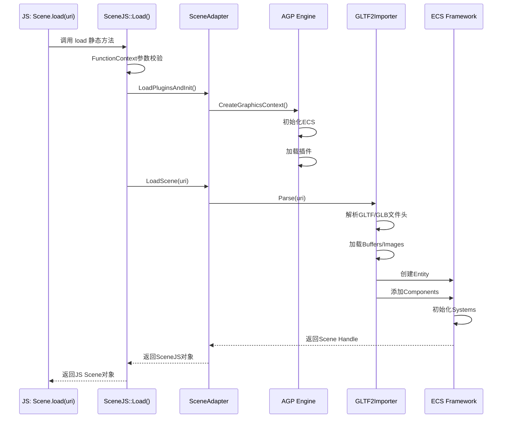
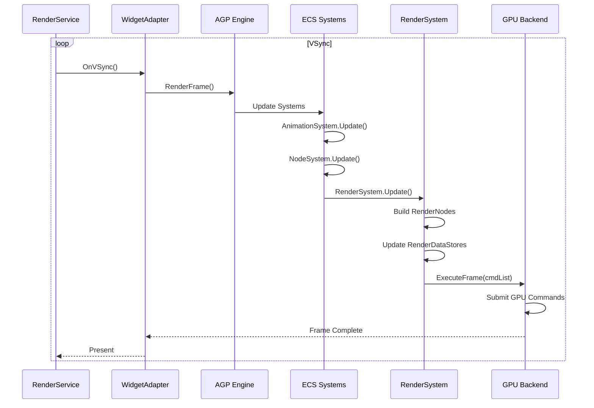
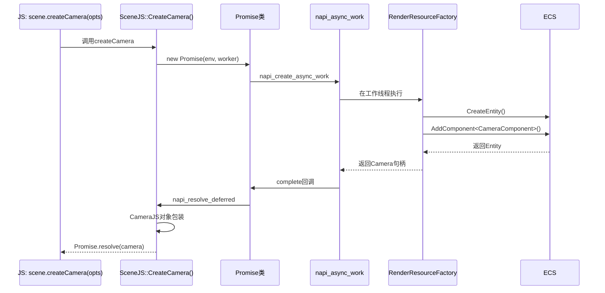
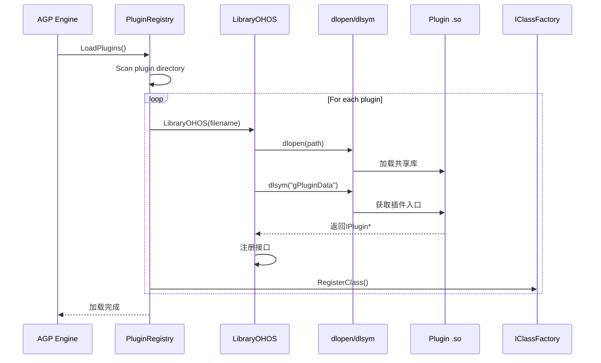
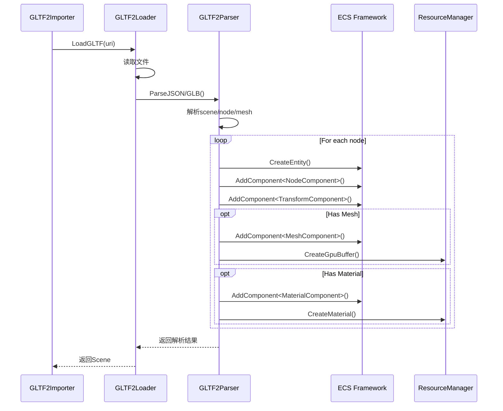
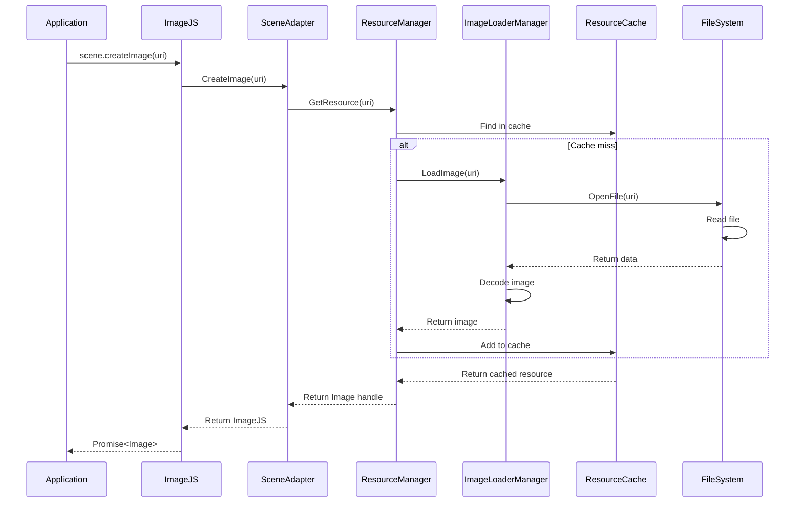
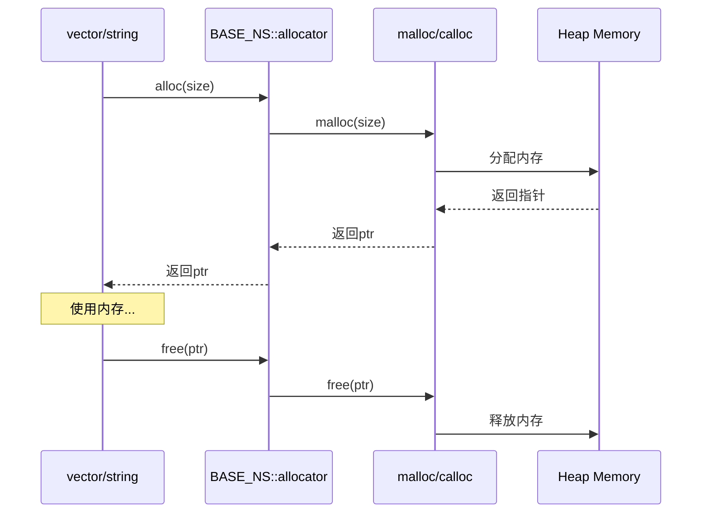
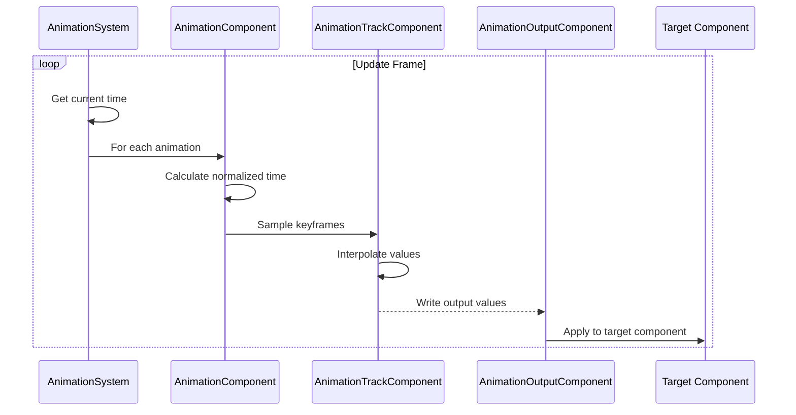

# 附录：关键调用链

## 1. 场景加载调用链

**关键代码路径**:
1. `kits/js/src/SceneJS.cpp:180-186` - SceneJS::Load()
2. `3d_scene_adapter/src/scene_adapter.cpp` - SceneAdapter::LoadScene()
3. `lume/Lume_3D/src/gltf/gltf2_importer.cpp` - GLTF2Importer::Import()
4. `lume/LumeEngine/src/ecs/ecs.cpp` - ECS初始化

---

## 2. 渲染帧调用链

**关键代码路径**:
1. `3d_widget_adapter/src/widget_adapter.cpp` - WidgetAdapter渲染入口
2. `lume/LumeEngine/src/ecs/ecs.cpp` - ECS系统更新
3. `lume/Lume_3D/src/ecs/systems/render_system.cpp` - 渲染系统
4. `lume/LumeRender/src/renderer.cpp` - 渲染器执行
5. `lume/LumeRender/src/gles/render_backend_gles.cpp` 或 `vulkan/render_backend_vk.cpp` - 后端提交

---

## 3. N-API调用链示例

### createCamera Promise调用链

**关键代码路径**:
1. `kits/js/src/SceneJS.cpp` - SceneJS::CreateCamera()
2. `kits/js/src/Promise.cpp` - Promise异步实现
3. `lume/Lume_3D/src/util/intf_scene_util.h` - 场景工具接口
4. `lume/LumeEngine/src/ecs/entity_manager.cpp` - 实体创建

---

## 4. 插件加载调用链

**关键代码路径**:
1. `lume/LumeEngine/src/plugin_registry.cpp:648-654` - 插件加载
2. `lume/LumeEngine/src/os/ohos/library_ohos.cpp:28-31` - dlopen
3. `lume/LumeEngine/api/core/plugin/intf_plugin_register.h` - 注册接口

---

## 5. GLTF解析调用链

**关键代码路径**:
1. `lume/Lume_3D/src/gltf/gltf2_importer.cpp` - GLTF导入器
2. `lume/Lume_3D/src/gltf/gltf2_loader.cpp` - GLTF加载器
3. `lume/Lume_3D/src/gltf/gltf2.cpp` - GLTF解析器
4. `lume/LumeEngine/src/ecs/entity_manager.cpp` - 实体管理

---

## 6. 资源加载调用链

**关键代码路径**:
1. `lume/LumeEngine/api/core/resources/intf_resource_manager.h` - 资源管理器接口
2. `lume/LumeEngine/src/image/image_loader_manager.cpp` - 图片加载管理
3. `lume/LumeEngine/src/io/file_manager.cpp` - 文件管理

---

## 7. 内存分配调用链

**关键代码路径**:
1. `lume/LumeBase/api/base/containers/vector.h` - 容器实现
2. `lume/LumeBase/api/base/containers/allocator.h` - 分配器

---

## 8. 动画更新调用链

**关键代码路径**:
1. `lume/Lume_3D/api/3d/ecs/systems/intf_animation_system.h` - 动画系统接口
2. `lume/Lume_3D/api/3d/ecs/components/animation_component.h` - 动画组件
3. `lume/Lume_3D/api/3d/ecs/components/animation_track_component.h` - 动画轨道

---

## 相关文档

- [架构设计 →](../02_Architecture.md)
- [N-API接口 →](../03_NAPI_Reference.md)
- [内部API →](../04_Internal_API.md)
