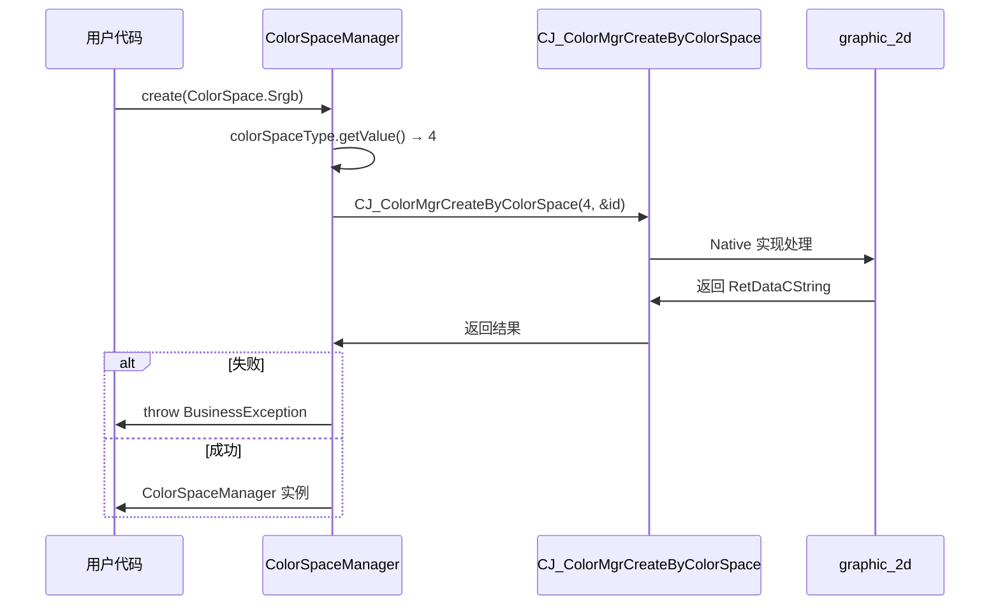
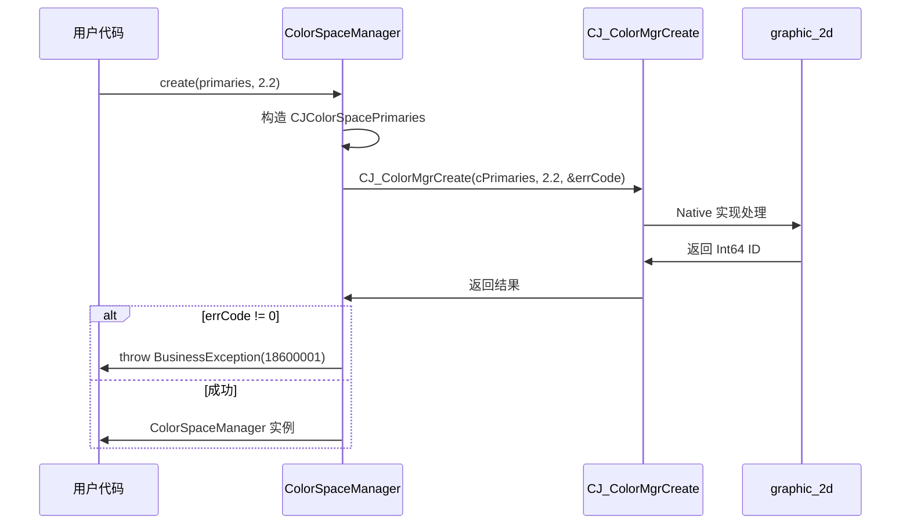

# 关键调用链 - graphic_cangjie_wrapper

## 调用链概览

```
用户 Cangjie 代码
        │
        ├──→ create(ColorSpace) ──→ CJ_ColorMgrCreateByColorSpace ──→ graphic_2d
        │        │
        ├──→ create(primaries, gamma) ──→ CJ_ColorMgrCreate ──→ graphic_2d
        │        │
        ├──→ getColorSpaceType() ──→ CJ_ColorMgrGetColorSpaceName ──→ graphic_2d
        │        │
        ├──→ getWhitePoint() ──→ CJ_ColorMgrGetWhitePoint ──→ graphic_2d
        │        │
        └──→ getGamma() ──→ CJ_ColorMgrGetGamma ──→ graphic_2d
```

---

## 调用链 1：按预设类型创建色域

```
┌─────────────────────────────────────────────────────────────┐
│ Cangjie 用户代码                                            │
└─────────────────────────────────────────────────────────────┘
                            │
                            ↓ 调用 create(ColorSpace.Srgb)
┌─────────────────────────────────────────────────────────────┐
│ color_space_manager.cj: create(colorSpaceType: ColorSpace) │
│ 1. 调用 colorSpaceType.getValue() 获取 UInt32 值            │
│ 2. 调用 CJ_ColorMgrCreateByColorSpace(colorSpaceName, id)   │
│ 3. 解析返回的 RetDataCString 获取错误信息                    │
│ 4. 调用 LibC.free() 释放返回数据内存                         │
│ 5. 检查 res.code != 0 → throw BusinessException            │
│ 6. 返回 ColorSpaceManager(id) 实例                          │
└─────────────────────────────────────────────────────────────┘
                            │
                            ↓ FFI 调用
┌─────────────────────────────────────────────────────────────┐
│ graphic_2d: CJ_ColorMgrCreateByColorSpace                   │
│ (Native C++ 实现)                                           │
└─────────────────────────────────────────────────────────────┘
```

> **证据**: `color_space_manager.cj:48-59`

**时序图**:



---

## 调用链 2：自定义创建色域

```
┌─────────────────────────────────────────────────────────────┐
│ Cangjie 用户代码                                            │
└─────────────────────────────────────────────────────────────┘
                            │
                            ↓ 调用 create(primaries, gamma)
┌─────────────────────────────────────────────────────────────┐
│ color_space_manager.cj: create(primaries, gamma)            │
│ 1. 创建 CJColorSpacePrimaries 结构体                        │
│ 2. 调用 CJ_ColorMgrCreate(cPrimaries, gamma, &errCode)     │
│ 3. 检查 errCode != 0 → throw BusinessException             │
│ 4. 返回 ColorSpaceManager(id) 实例                          │
└─────────────────────────────────────────────────────────────┘
                            │
                            ↓ FFI 调用
┌─────────────────────────────────────────────────────────────┐
│ graphic_2d: CJ_ColorMgrCreate                               │
│ (Native C++ 实现)                                           │
└─────────────────────────────────────────────────────────────┘
```

> **证据**: `color_space_manager.cj:74-87`

**时序图**:



---

## 调用链 3：获取色域类型

```
┌─────────────────────────────────────────────────────────────┐
│ Cangjie 用户代码                                            │
└─────────────────────────────────────────────────────────────┘
                            │
                            ↓ 调用 getColorSpaceType()
┌─────────────────────────────────────────────────────────────┐
│ color_space_manager.cj: getColorSpaceType()                │
│ 1. 调用 CJ_ColorMgrGetColorSpaceName(getID(), &errCode)    │
│ 2. 调用 checkRet(errCode, message) 校验                     │
│ 3. 调用 ColorSpace.parse(res) 解析为枚举                    │
│ 4. 返回 ColorSpace 枚举值                                   │
└─────────────────────────────────────────────────────────────┘
                            │
                            ↓ FFI 调用
┌─────────────────────────────────────────────────────────────┐
│ graphic_2d: CJ_ColorMgrGetColorSpaceName                    │
│ (Native C++ 实现)                                           │
└─────────────────────────────────────────────────────────────┘
```

> **证据**: `color_space_manager.cj:116-123`

---

## 调用链 4：获取白点坐标

```
┌─────────────────────────────────────────────────────────────┐
│ Cangjie 用户代码                                            │
└─────────────────────────────────────────────────────────────┘
                            │
                            ↓ 调用 getWhitePoint()
┌─────────────────────────────────────────────────────────────┐
│ color_space_manager.cj: getWhitePoint()                     │
│ 1. 调用 CJ_ColorMgrGetWhitePoint(getID(), &errCode)        │
│ 2. 调用 checkRet(errCode, message) 校验                     │
│ 3. 从指针读取 2 个 Float32 值构建数组                        │
│ 4. 调用 LibC.free(res) 释放 FFI 返回指针                    │
│ 5. 返回 Array<Float32>                                       │
└─────────────────────────────────────────────────────────────┘
                            │
                            ↓ FFI 调用
┌─────────────────────────────────────────────────────────────┐
│ graphic_2d: CJ_ColorMgrGetWhitePoint                         │
│ (Native C++ 实现)                                           │
└─────────────────────────────────────────────────────────────┘
```

> **证据**: `color_space_manager.cj:136-145`

**内存管理**:
```cangjie
let res = CJ_ColorMgrGetWhitePoint(getID(), inout errCode)
let arr = Array<Float32>(2, {i => res.read(i)})  // 从指针读取
LibC.free(res)  // 释放 FFI 返回的指针
```

---

## 调用链 5：获取伽马值

```
┌─────────────────────────────────────────────────────────────┐
│ Cangjie 用户代码                                            │
└─────────────────────────────────────────────────────────────┘
                            │
                            ↓ 调用 getGamma()
┌─────────────────────────────────────────────────────────────┐
│ color_space_manager.cj: getGamma()                          │
│ 1. 调用 CJ_ColorMgrGetGamma(getID(), &errCode)             │
│ 2. 调用 checkRet(errCode, message) 校验                     │
│ 3. 返回 Float32 值                                          │
└─────────────────────────────────────────────────────────────┘
                            │
                            ↓ FFI 调用
┌─────────────────────────────────────────────────────────────┐
│ graphic_2d: CJ_ColorMgrGetGamma                              │
│ (Native C++ 实现)                                           │
└─────────────────────────────────────────────────────────────┘
```

> **证据**: `color_space_manager.cj:158-165`

---

## 错误处理调用链

```
┌─────────────────────────────────────────────────────────────┐
│ FFI 返回非 0 错误码                                          │
└─────────────────────────────────────────────────────────────┘
                            │
                            ↓
┌─────────────────────────────────────────────────────────────┐
│ cj_color_manager_utils.cj: checkRet(errCode, message)       │
│ 1. 调用 getUniversalErrorMsg(errCode)                       │
│ 2. 匹配 ERROR_CODE_MAP (18600001 → "Parameter abnormal")    │
│ 3. 抛出 BusinessException(errCode, message)                │
└─────────────────────────────────────────────────────────────┘
                            │
                            ↓
┌─────────────────────────────────────────────────────────────┐
│ 用户代码捕获 BusinessException                               │
└─────────────────────────────────────────────────────────────┘
```

> **证据**: `cj_color_manager_utils.cj:26-40`

---

## 日志调用链

```
┌─────────────────────────────────────────────────────────────┐
│ color_space_manager.cj                                      │
└─────────────────────────────────────────────────────────────┘
                            │
                            ↓ 调用 HilogChannel
┌─────────────────────────────────────────────────────────────┐
│ cj_color_manager_log.cj: COLOR_MGR_LOG                      │
│ COLOR_MGR_LOG = HilogChannel(3, 0xD001400, "CJ-colorMgr")  │
└─────────────────────────────────────────────────────────────┘
                            │
                            ↓
┌─────────────────────────────────────────────────────────────┐
│ hiviewdfx_cangjie_wrapper: ohos.hilog                       │
│ (Native 日志系统)                                           │
└─────────────────────────────────────────────────────────────┘
```

> **证据**: `cj_color_manager_log.cj:22`

---

## 资源释放调用链

```
┌─────────────────────────────────────────────────────────────┐
│ ColorSpaceManager 实例超出作用域                              │
└─────────────────────────────────────────────────────────────┘
                            │
                            ↓ 调用析构函数
┌─────────────────────────────────────────────────────────────┐
│ color_space_manager.cj: ~init()                             │
│ ~init() {                                                   │
│     releaseFFIData(myDataId)  // 释放 FFI 数据              │
│ }                                                           │
└─────────────────────────────────────────────────────────────┘
                            │
                            ↓
┌─────────────────────────────────────────────────────────────┐
│ cangjie_ark_interop: ohos.ffi (RemoteDataLite)               │
│ FFI 资源释放                                                 │
└─────────────────────────────────────────────────────────────┘
```

> **证据**: `color_space_manager.cj:101-103`

---

## 相关文档

- [Architecture](02_Architecture.md)
- [N-API](03_N-API.md)
- [Security](06_Security.md)
