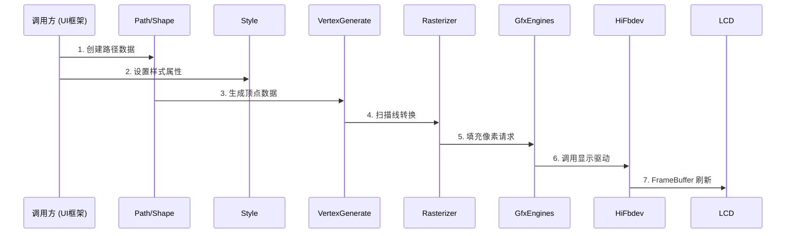
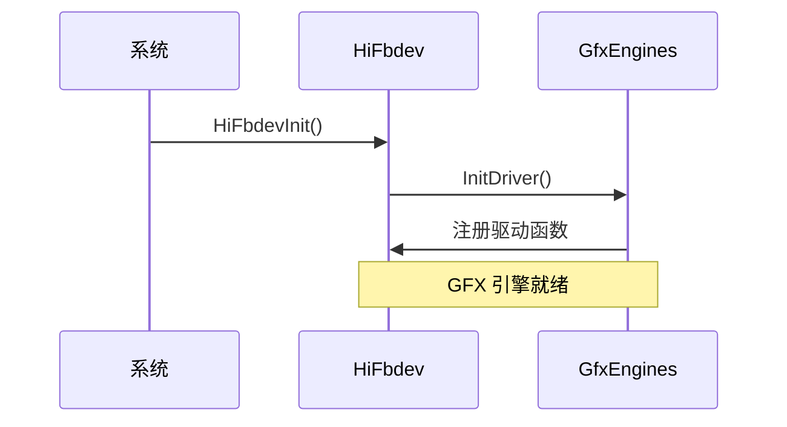

# 架构说明（Architecture）

本文档描述 `graphic_utils_lite` 的整体架构、模块划分、数据流与线程模型。

## 整体架构

### 组件图

```
┌─────────────────────────────────────────────────────────────────────────┐
│                         graphic_utils_lite 架构                           │
├─────────────────────────────────────────────────────────────────────────┤
│                                                                         │
│  ┌───────────────────────────┐    ┌───────────────────────────┐       │
│  │      interfaces/kits       │    │    interfaces/innerkits    │       │
│  │       (外部 C++ API)       │    │      (内部模块 API)        │       │
│  └─────────────┬─────────────┘    └─────────────┬─────────────┘       │
│                │                              │                      │
│                └──────────────┬───────────────┘                      │
│                               ↓                                       │
│  ┌─────────────────────────────────────────────────────────────────┐  │
│  │                        frameworks/                             │  │
│  │  ┌───────────────────────────────────────────────────────────┐  │  │
│  │  │                      diagram/                              │  │  │
│  │  │  ┌──────────┬──────────┬──────────┬──────────┐           │  │  │
│  │  │  │depiction │rasterizer│vertexgen │vertexprim│ common   │  │  │
│  │  │  │ 曲线绘制  │ 光栅化   │ 顶点生成  │ 图元处理  │ Paint   │  │  │
│  │  │  └──────────┴──────────┴──────────┴──────────┘           │  │  │
│  │  └───────────────────────────────────────────────────────────┘  │  │
│  │  ┌───────────────────────────────────────────────────────────┐  │  │
│  │  │                       hals/                               │  │  │
│  │  │  ┌──────────────────┬──────────────────┐                │  │  │
│  │  │  │   gfx_engines     │    hi_fbdev      │                │  │  │
│  │  │  │   GFX 加速引擎    │  FrameBuffer 适配 │                │  │  │
│  │  │  └──────────────────┴──────────────────┘                │  │  │
│  │  └───────────────────────────────────────────────────────────┘  │  │
│  │  ┌──────────┬──────────┬──────────┬──────────┬──────────┐       │  │
│  │  │  color   │ geometry │ transform│  style   │ mem_api  │       │  │
│  │  │ 颜色处理 │  2D 几何  │  变换    │  样式    │ 内存管理  │       │  │
│  │  └──────────┴──────────┴──────────┴──────────┴──────────┘       │  │
│  └─────────────────────────────────────────────────────────────────┘  │
│                                                                         │
│  ┌─────────────────────────────────────────────────────────────────┐  │
│  │                    外部依赖（驱动/系统）                          │  │
│  │  ┌────────────────┬────────────────┬────────────────┐          │  │
│  │  │  hdi_display   │   hilog_lite   │bounds_checking │          │  │
│  │  │  显示驱动接口   │    日志系统     │    内存安全    │          │  │
│  │  └────────────────┴────────────────┴────────────────┘          │  │
│  └─────────────────────────────────────────────────────────────────┘  │
│                                                                         │
└─────────────────────────────────────────────────────────────────────────┘
```

## 模块职责

### 1. Utils 模块

**证据位置**：`frameworks/` 目录下除 diagram、hals 外的文件

| 组件 | 头文件 | 实现 | 职责 |
|------|--------|------|------|
| Color | `color.h` | `color.cpp` | 颜色表示、混合算法 |
| Geometry2D | `geometry2d.h` | `geometry2d.cpp` | 2D 几何运算 |
| GraphicMath | `graphic_math.h` | `graphic_math.cpp` | 数学运算（三角、距离等） |
| Transform | `transform.h` | `transform.cpp` | 基础变换（旋转、缩放） |
| TransAffine | `trans_affine.h` | `trans_affine.cpp` | 仿射变换矩阵操作 |
| Style | `style.h` | `style.cpp` | 渲染样式（线宽、颜色等） |
| MemApi | `mem_api.h` | `mem_api.cpp` | 内存分配/释放 |
| PixelFormatUtils | `pixel_format_utils.h` | `pixel_format_utils.cpp` | 像素格式转换 |
| GraphicTimer | `graphic_timer.h` | `graphic_timer.cpp` | 定时器管理 |
| GraphicPerformance | `graphic_performance.h` | `graphic_performance.cpp` | 性能统计 |
| HalCpu | `hal_cpu.h` | `hal_cpu.cpp` | CPU 信息 |
| HalTick | `hal_tick.h` | `hal_tick.cpp` | 系统 tick |

### 2. Diagram 模块（2D 图形引擎）

**证据位置**：`frameworks/diagram/` 目录下文件

#### 2.1 depiction 子模块

**证据位置**：`frameworks/diagram/depiction/`、`interfaces/kits/gfx_utils/diagram/depiction/`

| 组件 | 功能 |
|------|------|
| `depict_curve.h/cpp` | 平滑曲线生成算法 |
| `depict_dash.h/cpp` | 虚线绘制 |
| `depict_stroke.h/cpp` | 描边处理 |
| `depict_transform.h/cpp` | 绘制变换 |
| `depict_adaptor_vertex_generate.h` | 顶点生成适配器 |

#### 2.2 rasterizer 子模块

**证据位置**：`frameworks/diagram/rasterizer/`、`interfaces/kits/gfx_utils/diagram/rasterizer/`

| 组件 | 功能 |
|------|------|
| `rasterizer_scanline_antialias.h/cpp` | 扫描线抗锯齿 |
| `rasterizer_cells_antialias.h/cpp` | 单元抗锯齿 |
| `rasterizer_scanline_clip.h/cpp` | 扫描线裁剪 |

#### 2.3 vertexgenerate 子模块

**证据位置**：`frameworks/diagram/vertexgenerate/`、`interfaces/kits/gfx_utils/diagram/vertexgenerate/`

| 组件 | 功能 |
|------|------|
| `vertex_generate_stroke.h/cpp` | 描边顶点生成 |
| `vertex_generate_dash.h/cpp` | 虚线顶点生成 |

#### 2.4 vertexprimitive 子模块

**证据位置**：`frameworks/diagram/vertexprimitive/`、`interfaces/kits/gfx_utils/diagram/vertexprimitive/`

| 组件 | 功能 |
|------|------|
| `geometry_curves.h/cpp` | 曲线几何 |
| `geometry_arc.h/cpp` | 弧线几何 |
| `geometry_bezier_arc.h/cpp` | 贝塞尔弧线 |
| `geometry_shorten_path.h/cpp` | 路径缩短 |
| `geometry_dda_line.h` | DDA 直线算法 |
| `geometry_path_storage.h` | 路径存储 |
| `geometry_plaindata_array.h` | 原始数据数组 |
| `geometry_vertex_sequence.h` | 顶点序列 |
| `geometry_range_adapter.h` | 范围适配器 |
| `geometry_math_stroke.h` | 描边数学 |

### 3. Hals 模块

**证据位置**：`frameworks/hals/`、`interfaces/innerkits/hals/`

| 组件 | 头文件 | 实现 | 职责 |
|------|--------|------|------|
| GfxEngines | `gfx_engines.h` | `gfx_engines.cpp` | GFX 加速引擎单例 |
| HiFbdev | `hi_fbdev.h` | `hi_fbdev.cpp` | FrameBuffer 设备接口 |

## 数据流

### 渲染数据流

```
┌──────────────┐     ┌──────────────┐     ┌──────────────┐     ┌──────────────┐
│  调用入口     │     │  图元构建     │     │  光栅化      │     │  显示输出    │
│              │     │              │     │              │     │              │
│ 1. 创建 Path  │ ──→ │2. 生成顶点    │ ──→ │3. 填充像素   │ ──→ │4. 写入显存  │
│ 2. 设置 Style│     │   (vertexgen) │     │   (rasterizer)│     │   (HAL/GFX) │
└──────────────┘     └──────────────┘     └──────────────┘     └──────────────┘
                            │                    │
                            └────────────────────┘
                                      ↓
                         ┌──────────────────────┐
                         │    像素格式转换      │
                         │  (PixelFormatUtils)  │
                         └──────────────────────┘
```

### 缓冲区数据流

```
┌──────────────┐     ┌──────────────┐     ┌──────────────┐
│  BufferInfo  │     │   GFX Blit   │     │  LCD Flush  │
│    准备       │ ──→ │    像素搬运   │ ──→ │   刷新显示  │
└──────────────┘     └──────────────┘     └──────────────┘
                              │
                              ↓
                    ┌──────────────────────┐
                    │  hi_fbdev (HAL)      │
                    │  FrameBuffer 写入    │
                    └──────────────────────┘
```

## 线程模型

### 主线程假设

本库设计假设在单线程环境下运行（UI 主线程），不包含内置的线程安全机制。

### 资源管理原则

| 资源 | 管理方式 | 证据位置 |
|------|----------|----------|
| 内存 | 手动分配/释放，通过 `MemApi` 接口 | `mem_api.h` |
| 定时器 | `GraphicTimer` 单例管理 | `graphic_timer.h` |
| 互斥锁 | `GraphicMutex`、`GraphicSemaphore` | `innerkits/` |
| 图形上下文 | `GfxEngines` 单例模式 | `gfx_engines.h` |

### 关键单例

**证据来源**：`interfaces/innerkits/hals/gfx_engines.h` 第 26-28 行

```cpp
class GfxEngines {
public:
    static GfxEngines* GetInstance();  // 单例获取
    // ...
};
```

## 关键时序

### 渲染时序图



### 初始化时序



## 依赖方向

### 模块间依赖（无环）

```
interfaces/kits/gfx_utils/  ───┐
                               │
interfaces/innerkits/      ──┼──→ frameworks/  ──→ 外部依赖
    (HAL 接口)                  │                   (hilog, hdi)
                               │
                         frameworks/hals/  ─────────┘
```

**依赖原则**：
- `interfaces` 定义接口，不依赖具体实现
- `frameworks` 实现接口，可相互依赖
- 禁止逆向依赖（实现依赖接口定义除外）

### 外部依赖注入点

| 依赖项 | 注入方式 | 配置位置 |
|--------|----------|----------|
| `hilog_lite` | `public_deps` | `BUILD.gn` 第 95-100 行 |
| `bounds_checking_function` | `deps` | `BUILD.gn` 第 94 行 |
| `hdi_display` | `deps` | `BUILD.gn` 第 149 行 |

## 稳定性标注

### 稳定接口（Stable）

以下接口经过充分测试，API 稳定：

| 接口 | 位置 | 说明 |
|------|------|------|
| `Color` 类 | `color.h` | 颜色处理核心类 |
| `Rect` 结构 | `rect.h` | 矩形运算 |
| `Point` 结构 | `graphic_types.h` | 基础类型 |
| `BufferInfo` 结构 | `graphic_buffer.h` | 缓冲区元数据 |
| `GfxEngines` 类 | `gfx_engines.h` | 硬件引擎单例 |

### 实验接口（Experimental）

以下接口可能发生变化：

| 接口 | 位置 | 说明 |
|------|------|------|
| `GraphicPerformance` | `graphic_performance.h` | 性能统计 API |
| `FilterBlur` | `diagram/imagefilter/` | 图像滤镜 |

---

*最后更新时间：2026-02-06*
