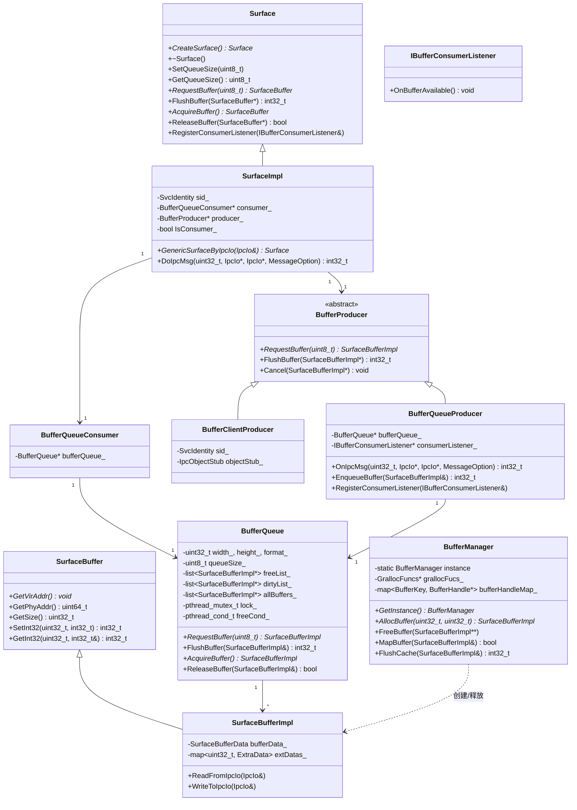
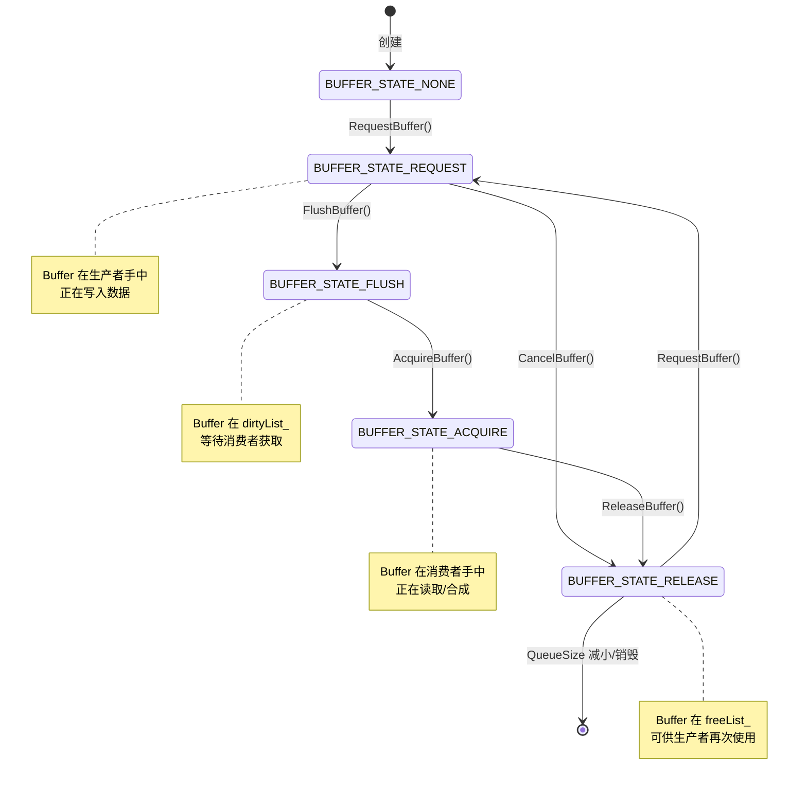

# 架构说明

> surface_lite 核心架构与实现细节

---

## 1. 架构概览

### 1.1 整体架构图

```
┌─────────────────────────────────────────────────────────────────────────────┐
│                              应用层 (Application)                             │
│  ┌─────────────┐    ┌─────────────┐    ┌─────────────┐                       │
│  │   UI 渲染    │    │  视频解码   │    │  相机预览   │                       │
│  │  (Producer) │    │  (Producer) │    │  (Producer) │                       │
│  └──────┬──────┘    └──────┬──────┘    └──────┬──────┘                       │
└─────────┼──────────────────┼──────────────────┼─────────────────────────────┘
          │                  │                  │
          └──────────────────┼──────────────────┘
                             │ 跨进程 IPC
┌────────────────────────────┼───────────────────────────────────────────────┐
│                         Surface 模块 (本模块)                                │
│  ┌───────────────────────┐ │ ┌───────────────────────┐                      │
│  │    Producer 端        │ │ │    Consumer 端        │                      │
│  │  ┌─────────────────┐  │ │ │  ┌─────────────────┐  │                      │
│  │  │BufferClientProducer│ │ │ │  │ BufferQueue     │  │                      │
│  │  │(IPC 代理)        │  │ │ │  │ Producer        │  │                      │
│  │  └────────┬────────┘  │ │ │  └────────┬────────┘  │                      │
│  │           │           │ │ │           │           │                      │
│  │  ┌────────▼────────┐  │ │ │  ┌────────▼────────┐  │                      │
│  │  │   BufferQueue   │◀─┼─┼─┼──┤ BufferQueue     │  │                      │
│  │  │   (远程代理)     │  │ │ │  │ Consumer        │  │                      │
│  │  └─────────────────┘  │ │ │  └─────────────────┘  │                      │
│  └───────────────────────┘ │ └───────────────────────┘                      │
│                            │                                                │
│  ┌─────────────────────────┴─────────────────────────┐                       │
│  │              BufferQueue 核心队列                  │                       │
│  │  ┌─────────────┐    ┌─────────────┐              │                       │
│  │  │  freeList_  │    │  dirtyList_ │              │                       │
│  │  │  (空闲队列)  │    │ (待消费队列) │              │                       │
│  │  └─────────────┘    └─────────────┘              │                       │
│  └───────────────────────────────────────────────────┘                       │
│                                                                              │
│  ┌───────────────────────────────────────────────────┐                       │
│  │           BufferManager (单例)                     │                       │
│  │  ┌─────────────┐    ┌──────────────────────────┐  │                       │
│  │  │ GrallocFuncs│───▶│    显示驱动 HAL           │  │                       │
│  │  │  (分配/释放) │    │  (物理/虚拟内存分配)       │  │                       │
│  │  └─────────────┘    └──────────────────────────┘  │                       │
│  └───────────────────────────────────────────────────┘                       │
└─────────────────────────────────────────────────────────────────────────────┘
```

### 1.2 类图



---

## 2. 数据流分析

### 2.1 单进程模式数据流

```
┌─────────────┐     RequestBuffer()      ┌─────────────┐
│   Producer   │ ───────────────────────▶ │  BufferQueue │
│   (UI渲染)   │                          │  (freeList_)  │
└─────────────┘                          └─────────────┘
       │                                          │
       │◀─────────────────────────────────────────┘
       │         返回 SurfaceBufferImpl*
       │
       ▼
┌──────────────────────────────────────────────────────┐
│  写入像素数据到 buffer->GetVirAddr()                   │
└──────────────────────────────────────────────────────┘
       │
       │ FlushBuffer(buffer)
       ▼
┌─────────────┐     EnqueueBuffer()      ┌─────────────┐
│BufferQueue   │ ───────────────────────▶ │  BufferQueue │
│Producer      │                          │  (dirtyList_) │
└─────────────┘                          └─────────────┘
       │                                          │
       │ OnBufferAvailable()                      │ AcquireBuffer()
       ▼                                          ▼
┌─────────────┐                          ┌─────────────┐
│ Consumer    │                          │  Consumer   │
│ Listener    │                          │  (WMS合成)   │
└─────────────┘                          └─────────────┘
                                                │
                                                │ ReleaseBuffer()
                                                ▼
                                          ┌─────────────┐
                                          │ BufferQueue  │
                                          │ (freeList_)  │
                                          └─────────────┘
```

### 2.2 跨进程模式数据流

```
┌─────────────────────────────────────────────────────────────────────┐
│                           进程 A (Consumer)                          │
│  ┌─────────────────┐                                               │
│  │ SurfaceImpl     │                                               │
│  │ (IsConsumer=true)│                                               │
│  └────────┬────────┘                                               │
│           │ 创建 BufferQueue + BufferQueueProducer                  │
│           ▼                                                        │
│  ┌─────────────────┐     Register Service     ┌──────────────┐    │
│  │ BufferQueue     │ ───────────────────────▶ │ IPC Service  │    │
│  │ Producer        │     sid_ (SvcIdentity)   │ Registry     │    │
│  └─────────────────┘                          └──────────────┘    │
└─────────────────────────────────────────────────────────────────────┘
                                    │
                                    │ IPC
                                    ▼
┌─────────────────────────────────────────────────────────────────────┐
│                           进程 B (Producer)                          │
│  ┌───────────────────────────────────────────────────────────────┐ │
│  │ SurfaceImpl::GenericSurfaceByIpcIo(io)                        │ │
│  │   - 从 IPC 获取 sid_                                          │ │
│  │   - 创建 BufferClientProducer(sid_)                            │ │
│  └────────────────────────┬──────────────────────────────────────┘ │
│                           │ SendRequest(REQUEST_BUFFER)            │
│                           ▼                                        │
│  ┌───────────────────────────────────────────────────────────────┐ │
│  │ BufferClientProducer::RequestBuffer()                         │ │
│  │   1. 发送 IPC 请求到进程 A                                     │ │
│  │   2. 接收 Buffer 元数据 (key, phyAddr, ...)                    │ │
│  │   3. 调用 BufferManager::MapBuffer() 映射共享内存              │ │
│  │   4. 返回 SurfaceBufferImpl (本地虚拟地址可用)                 │ │
│  └───────────────────────────────────────────────────────────────┘ │
└─────────────────────────────────────────────────────────────────────┘
```

---

## 3. 状态机设计

### 3.1 Buffer 状态机



### 3.2 Surface 生命周期状态机

```
┌────────────────────────────────────────────────────────────────┐
│                        Surface 生命周期                          │
├────────────────────────────────────────────────────────────────┤
│                                                                │
│   ┌──────────┐                                                 │
│   │  未初始化 │                                                 │
│   └────┬─────┘                                                 │
│        │ Surface::CreateSurface()                               │
│        ▼                                                        │
│   ┌──────────┐                                                 │
│   │ Consumer │◀── IsConsumer_ = true                           │
│   │  模式    │   - 创建 BufferQueue                             │
│   └────┬─────┘   - 创建 BufferQueueProducer                     │
│        │         - 创建 BufferQueueConsumer                     │
│        │         - 注册 IPC Service                             │
│        │                                                        │
│        │ GenericSurfaceByIpcIo(io)                              │
│        ▼                                                        │
│   ┌──────────┐                                                 │
│   │ Producer │◀── IsConsumer_ = false                          │
│   │  模式    │   - 创建 BufferClientProducer                    │
│   └────┬─────┘                                                 │
│        │                                                        │
│        │ ~SurfaceImpl()                                         │
│        ▼                                                        │
│   ┌──────────┐                                                 │
│   │  已销毁  │   - 释放所有 Buffer                              │
│   └──────────┘   - 关闭 IPC Service                             │
│                                                                │
└────────────────────────────────────────────────────────────────┘
```

---

## 4. 线程模型

### 4.1 线程安全设计

**单锁设计**:
```cpp
// BufferQueue 使用单一互斥锁保护所有状态
class BufferQueue {
private:
    pthread_mutex_t lock_;      // 保护所有 Buffer 列表
    pthread_cond_t freeCond_;   // 通知有新的 free Buffer
};
```

**锁范围**:
| 方法 | 锁持有范围 | 说明 |
|------|-----------|------|
| RequestBuffer() | 全程 | 从检查到弹出 |
| FlushBuffer() | 全程 | 压入 dirtyList |
| AcquireBuffer() | 全程 | 从检查到弹出 |
| ReleaseBuffer() | 全程 + signal | 压入 freeList |
| SetQueueSize() | 部分 | 释放多余 Buffer 时持有 |

### 4.2 并发场景

```
场景 1: 多线程 Producer
┌─────────┐    ┌─────────┐
│Thread P1│    │Thread P2│
└────┬────┘    └────┬────┘
     │ RequestBuffer │
     ├───────────────┤
     ▼               ▼
     ┌───────────────┐
     │  pthread_mutex_lock(&lock_)
     │     串行执行
     │  pthread_mutex_unlock(&lock_)
     └───────────────┘
     
场景 2: Producer + Consumer 并发
┌─────────┐              ┌─────────┐
│Producer │              │Consumer │
└────┬────┘              └────┬────┘
     │ FlushBuffer()          │ AcquireBuffer()
     │ (lock + signal)        │ (lock)
     ▼                        ▼
     ┌────────────────────────┐
     │ dirtyList_ (并发安全)   │
     └────────────────────────┘
     
场景 3: 等待/通知
┌─────────┐              ┌─────────┐
│Producer │              │Consumer │
└────┬────┘              └────┬────┘
     │                        │ ReleaseBuffer()
     │ RequestBuffer(1)       │ (lock)
     │ freeList_ 为空         │ push to freeList_
     ├───────────────────────▶│ pthread_cond_signal()
     │ pthread_cond_wait()    │
     │◀───────────────────────┤
     │ 被唤醒，继续执行        │
     ▼                        ▼
```

### 4.3 回调机制

```cpp
// BufferQueueProducer::EnqueueBuffer
int32_t BufferQueueProducer::EnqueueBuffer(SurfaceBufferImpl& buffer) {
    int32_t ret = bufferQueue_->FlushBuffer(buffer);
    if (ret == 0) {
        if (consumerListener_ != nullptr) {
            // ⚠️ 回调在锁外执行 (FlushBuffer 已释放锁)
            consumerListener_->OnBufferAvailable();
        }
    }
    return ret;
}
```

**重要**: `OnBufferAvailable()` 回调在锁外执行，避免死锁。

---

## 5. IPC 通信机制

### 5.1 IPC 消息处理

```cpp
// buffer_queue_producer.cpp
static IpcMsgHandle g_ipcMsgHandleList[] = {
    OnRequestBuffer,      // 0
    OnFlushBuffer,        // 1
    OnCancelBuffer,       // 2
    OnSetQueueSize,       // 3
    // ... 共 20 个
};

int32_t BufferQueueProducer::OnIpcMsg(uint32_t code, IpcIo *data, 
                                       IpcIo *reply, MessageOption option) {
    if (code >= MAX_REQUEST_CODE) {
        return SURFACE_ERROR_INVALID_REQUEST;
    }
    return g_ipcMsgHandleList[code](this, data, reply);
}
```

### 5.2 序列化/反序列化

```cpp
// SurfaceBufferImpl 的 IPC 传输格式
void SurfaceBufferImpl::WriteToIpcIo(IpcIo& io) {
    WriteInt32(&io, bufferData_.handle.key);
    WriteUint64(&io, bufferData_.handle.phyAddr);
    WriteUint32(&io, bufferData_.handle.reserveFds);
    WriteUint32(&io, bufferData_.handle.reserveInts);
    WriteUint32(&io, bufferData_.size);
    WriteUint32(&io, bufferData_.usage);
    WriteUint32(&io, len_);
    WriteUint32(&io, extDatas_.size());  // 额外数据数量
    // ... 写入额外数据
}
```

### 5.3 跨进程内存映射

```cpp
// BufferClientProducer::RequestBuffer
SurfaceBufferImpl* BufferClientProducer::RequestBuffer(uint8_t wait) {
    // 1. 发送 IPC 请求
    SendRequest(sid_, REQUEST_BUFFER, ...);
    
    // 2. 创建本地 Buffer 对象
    SurfaceBufferImpl* buffer = new SurfaceBufferImpl();
    buffer->ReadFromIpcIo(reply);  // 获取元数据
    
    // 3. 映射共享内存到本地地址空间
    BufferManager* manager = BufferManager::GetInstance();
    manager->MapBuffer(*buffer);   // 建立虚拟地址映射
    
    return buffer;
}
```

---

## 6. 内存管理

### 6.1 BufferManager 单例

```cpp
class BufferManager {
public:
    static BufferManager* GetInstance() {
        static BufferManager instance;  // C++11 线程安全单例
        return &instance;
    }
    
private:
    GrallocFuncs* grallocFucs_;  // 底层分配器函数指针
    map<BufferKey, BufferHandle*> bufferHandleMap_;  // 句柄映射
};
```

### 6.2 内存类型转换

```cpp
bool BufferManager::ConvertUsage(uint64_t& destUsage, uint32_t srcUsage) {
    switch (srcUsage) {
        case BUFFER_CONSUMER_USAGE_SORTWARE:
            destUsage = HBM_USE_MEM_SHARE;        // 共享虚拟内存
            break;
        case BUFFER_CONSUMER_USAGE_HARDWARE:
        case BUFFER_CONSUMER_USAGE_HARDWARE_PRODUCER_CACHE:
            destUsage = HBM_USE_MEM_MMZ;          // 连续物理内存
            break;
        case BUFFER_CONSUMER_USAGE_HARDWARE_CONSUMER_CACHE:
            destUsage = HBM_USE_MEM_MMZ_CACHE;    // 带 Cache 的物理内存
            break;
    }
}
```

### 6.3 缓存同步

```cpp
int32_t BufferManager::FlushCache(SurfaceBufferImpl& buffer) {
    BufferHandle* bufferHandle = AllocateBufferHandle(buffer);
    
    if (buffer.GetUsage() == BUFFER_CONSUMER_USAGE_HARDWARE_CONSUMER_CACHE) {
        // 消费者 cache → 物理内存
        grallocFucs_->FlushCache(bufferHandle);
    } else if (buffer.GetUsage() == BUFFER_CONSUMER_USAGE_HARDWARE_PRODUCER_CACHE) {
        // 生产者 cache → 物理内存
        grallocFucs_->FlushMCache(bufferHandle);
    }
}
```

---

## 7. 关键调用链

### 7.1 创建 Surface (Consumer)

```
Surface::CreateSurface()
  └── new SurfaceImpl() [IsConsumer_=true]
      └── Init()
          ├── BufferManager::GetInstance()->Init()
          │   └── GrallocInitialize(&grallocFucs_)
          ├── new BufferQueue() + Init()
          │   ├── pthread_mutex_init()
          │   └── pthread_cond_init()
          ├── new BufferQueueProducer(bufferQueue)
          ├── new BufferQueueConsumer(*bufferQueue)
          └── 设置 IPC Service (sid_)
              ├── objectStub_.func = IpcRequestHandler
              └── sid_.token = SERVICE_TYPE_ANONYMOUS
```

### 7.2 请求 Buffer (跨进程)

```
Producer 端:
SurfaceImpl::RequestBuffer(wait)
  └── BufferClientProducer::RequestBuffer(wait)
      ├── IpcIoInit(&requestIo, ...)
      ├── WriteUint8(&requestIo, wait)
      ├── SendRequest(sid_, REQUEST_BUFFER, &requestIo, &reply, ...)
      │   └── IPC 到 Consumer 进程
      ├── ReadInt32(&reply, &ret)
      ├── new SurfaceBufferImpl()
      ├── buffer->ReadFromIpcIo(reply)
      ├── BufferManager::GetInstance()->MapBuffer(*buffer)
      │   ├── AllocateBufferHandle(buffer)
      │   ├── grallocFucs_->Mmap(bufferHandle) / MmapCache()
      │   └── buffer->SetVirAddr(virAddr)
      └── FreeBuffer(ptr)

Consumer 端 (IPC Handler):
BufferQueueProducer::OnIpcMsg(REQUEST_BUFFER, ...)
  └── OnRequestBuffer(this, io, reply)
      ├── ReadUint8(io, &isWaiting)
      ├── buffer = producer->RequestBuffer(isWaiting)
      │   └── BufferQueue::RequestBuffer(isWaiting)
      │       ├── pthread_mutex_lock(&lock_)
      │       ├── CanRequest(wait) / pthread_cond_wait()
      │       ├── buffer = freeList_.front()
      │       ├── freeList_.pop_front()
      │       ├── buffer->SetState(BUFFER_STATE_REQUEST)
      │       └── pthread_mutex_unlock(&lock_)
      └── buffer->WriteToIpcIo(*reply)
```

---

## 8. 性能优化点

### 8.1 零拷贝设计

- **元数据**: IPC 传输 (少量数据拷贝)
- **像素数据**: 共享内存映射 (无拷贝)

### 8.2 缓存策略

| 使用类型 | 生产者 Cache | 消费者 Cache | 适用场景 |
|----------|-------------|-------------|----------|
| SOFTWARE | 无 | 无 | CPU 读写 |
| HARDWARE | 无 | 无 | 纯硬件处理 |
| HW_CONSUMER_CACHE | 无 | 有 | 生产者硬件+消费者CPU |
| HW_PRODUCER_CACHE | 有 | 无 | 生产者CPU+消费者硬件 |

### 8.3 队列大小

- **默认**: 1 (最小内存占用)
- **推荐**: 2-3 (平衡延迟和内存)
- **最大**: 10 (最小生产阻塞)

---

*文档版本: v1.0 | 更新日期: 2026-02-06*
