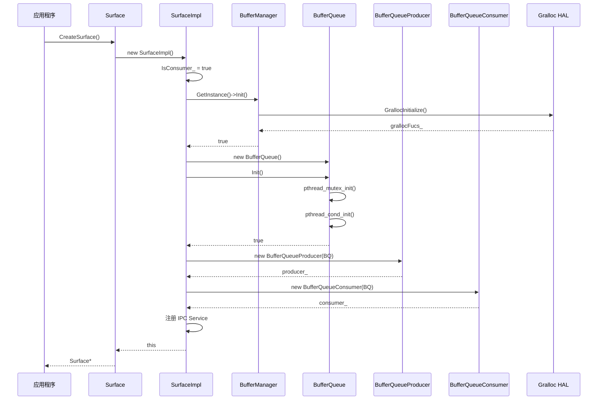
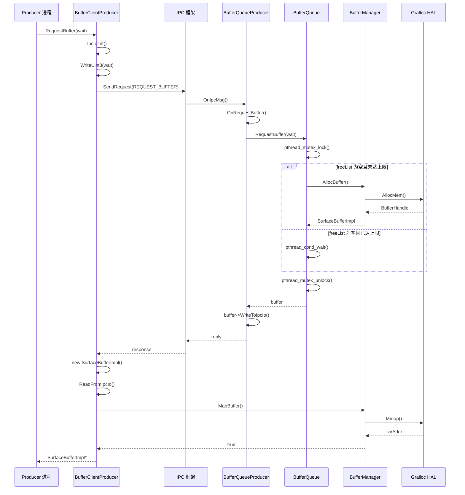
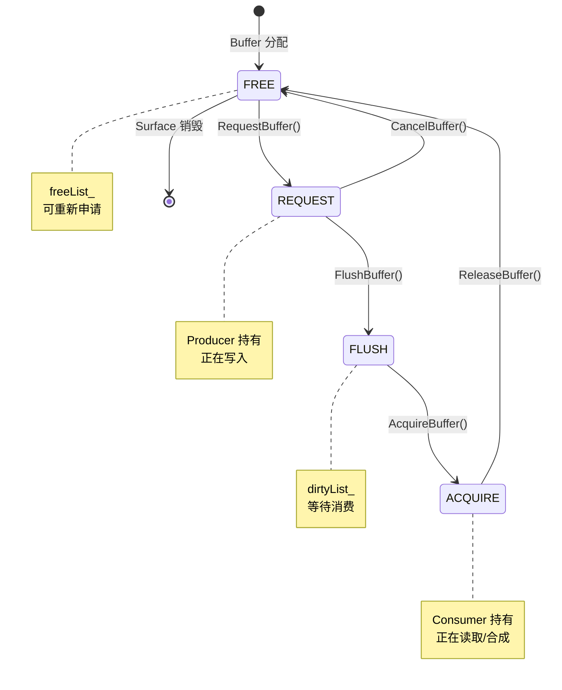

# 调用链附录

> surface_lite 关键调用流程与时序图

---

## 1. Surface 创建流程

### 1.1 Consumer 端创建 (单进程)

```
Surface::CreateSurface()
  └── new SurfaceImpl() [IsConsumer_ = true]
      └── SurfaceImpl::Init()
          ├── BufferManager::GetInstance()
          │   └── static BufferManager instance (C++11 线程安全单例)
          │
          ├── BufferManager::Init()
          │   └── GrallocInitialize(&grallocFucs_)
          │       └── 加载显示驱动 HAL
          │
          ├── new BufferQueue()
          │   └── BufferQueue::BufferQueue() (构造函数初始化默认值)
          │
          ├── BufferQueue::Init()
          │   ├── pthread_mutex_init(&lock_, NULL)
          │   └── pthread_cond_init(&freeCond_, NULL)
          │
          ├── new BufferQueueProducer(bufferQueue)
          │   └── 保存 bufferQueue 指针
          │
          ├── new BufferQueueConsumer(*bufferQueue)
          │   └── 保存 bufferQueue 引用
          │
          └── IPC 服务注册
              ├── objectStub_.func = IpcRequestHandler
              ├── objectStub_.args = producer_ (BufferQueueProducer*)
              ├── sid_.token = SERVICE_TYPE_ANONYMOUS
              └── sid_.cookie = &objectStub_
```

**时序图**:



---

### 1.2 Producer 端创建 (跨进程)

```
SurfaceImpl::GenericSurfaceByIpcIo(IpcIo& io)
  └── ReadRemoteObject(&io, &sid)
      └── 从 IPC 消息中提取 Consumer 的 SvcIdentity
  └── new SurfaceImpl(sid) [IsConsumer_ = false]
      └── SurfaceImpl::Init()
          └── new BufferClientProducer(sid_)
              └── 保存 sid_ (用于后续 IPC 通信)
```

---

## 2. Buffer 请求流程

### 2.1 本地请求 (单进程)

```
SurfaceImpl::RequestBuffer(wait)
  └── RETURN_VAL_IF_FAIL(producer_, nullptr)
  └── BufferQueueProducer::RequestBuffer(wait)
      └── RETURN_VAL_IF_FAIL(bufferQueue_, nullptr)
      └── BufferQueue::RequestBuffer(wait)
          ├── pthread_mutex_lock(&lock_)
          ├── CanRequest(wait)
          │   ├── if (!freeList_.empty())
          │   │   └── return true  // 有空闲 Buffer
          │   ├── if (attachCount_ < queueSize_)
          │   │   └── NeedAttach()  // 分配新 Buffer
          │   │       ├── BufferManager::GetInstance()
          │   │       ├── BufferManager::AllocBuffer(width, height, format, usage)
          │   │       │   ├── GrallocFuncs->AllocMem()
          │   │       │   └── new SurfaceBufferImpl()
          │   │       ├── freeList_.push_back(buffer)
          │   │       └── allBuffers_.push_back(buffer)
          │   └── if (wait)
          │       └── pthread_cond_wait(&freeCond_, &lock_)  // 阻塞等待
          ├── buffer = freeList_.front()
          ├── freeList_.pop_front()
          ├── buffer->SetState(BUFFER_STATE_REQUEST)
          └── pthread_mutex_unlock(&lock_)
```

### 2.2 跨进程请求

```
BufferClientProducer::RequestBuffer(wait)
  ├── IpcIoInit(&requestIo, requestIoData, DEFAULT_IPC_SIZE, 0)
  ├── WriteUint8(&requestIo, wait)
  ├── SendRequest(sid_, REQUEST_BUFFER, &requestIo, &reply, option, &ptr)
  │   └── [IPC 到 Consumer 进程]
  │       └── BufferQueueProducer::OnIpcMsg(REQUEST_BUFFER, ...)
  │           └── OnRequestBuffer(product, io, reply)
  │               ├── ReadUint8(io, &isWaiting)
  │               ├── product->RequestBuffer(isWaiting)  // 同 2.1
  │               └── buffer->WriteToIpcIo(*reply)
  ├── ReadInt32(&reply, &ret)
  ├── new SurfaceBufferImpl()
  ├── buffer->ReadFromIpcIo(reply)
  ├── BufferManager::MapBuffer(*buffer)
  │   ├── AllocateBufferHandle(buffer)
  │   └── GrallocFuncs->Mmap() / MmapCache()
  └── FreeBuffer(ptr)
```

**时序图**:



---

## 3. Buffer 提交与消费流程

### 3.1 完整轮转流程

```
[Producer 端]
SurfaceImpl::FlushBuffer(buffer)
  └── BufferQueueProducer::FlushBuffer(buffer)
      ├── BufferManager::FlushCache(*buffer) [if cache usage]
      │   └── GrallocFuncs->FlushCache() / FlushMCache()
      └── BufferQueueProducer::EnqueueBuffer(*buffer)
          ├── BufferQueue::FlushBuffer(buffer)
          │   ├── pthread_mutex_lock(&lock_)
          │   ├── dirtyList_.push_back(buffer)
          │   ├── buffer->SetState(BUFFER_STATE_FLUSH)
          │   └── pthread_mutex_unlock(&lock_)
          └── consumerListener_->OnBufferAvailable() [回调]

[Consumer 端 - 回调触发]
IBufferConsumerListener::OnBufferAvailable()
  └── Consumer 实现 (如 WMS)
      └── SurfaceImpl::AcquireBuffer()
          └── BufferQueueConsumer::AcquireBuffer()
              └── BufferQueue::AcquireBuffer()
                  ├── pthread_mutex_lock(&lock_)
                  ├── buffer = dirtyList_.front()
                  ├── dirtyList_.pop_front()
                  ├── buffer->SetState(BUFFER_STATE_ACQUIRE)
                  ├── pthread_mutex_unlock(&lock_)
                  └── return buffer
      
      [消费 Buffer 后]
      └── SurfaceImpl::ReleaseBuffer(buffer)
          └── BufferQueueConsumer::ReleaseBuffer(buffer)
              └── BufferQueue::ReleaseBuffer(buffer)
                  ├── pthread_mutex_lock(&lock_)
                  ├── freeList_.push_back(buffer)
                  ├── buffer->SetState(BUFFER_STATE_RELEASE)
                  ├── pthread_mutex_unlock(&lock_)
                  └── pthread_cond_signal(&freeCond_) [唤醒等待的 Producer]
```

**状态转换图**:



---

## 4. IPC 消息处理流程

```
[IPC 消息到达 Consumer 进程]
IpcRequestHandler(code, data, reply, option)
  └── option.args -> BufferQueueProducer*
  └── BufferQueueProducer::OnIpcMsg(code, data, reply, option)
      ├── if (code >= MAX_REQUEST_CODE)
      │   └── return SURFACE_ERROR_INVALID_REQUEST
      └── g_ipcMsgHandleList[code](this, data, reply)
          
          根据 code 分发:
          ├── 0 (REQUEST_BUFFER) -> OnRequestBuffer()
          ├── 1 (FLUSH_BUFFER)   -> OnFlushBuffer()
          ├── 2 (CANCEL_BUFFER)  -> OnCancelBuffer()
          ├── 3 (SET_QUEUE_SIZE) -> OnSetQueueSize()
          └── ... (共 20 个)
```

**处理函数表**:

| Code | 处理函数 | 操作 |
|------|----------|------|
| 0 | OnRequestBuffer | 请求 Buffer |
| 1 | OnFlushBuffer | 提交 Buffer |
| 2 | OnCancelBuffer | 取消 Buffer |
| 3 | OnSetQueueSize | 设置队列大小 |
| 4 | OnGetQueueSize | 获取队列大小 |
| 5 | OnSetWidthAndHeight | 设置宽高 |
| 6 | OnGetWidth | 获取宽度 |
| 7 | OnGetHeight | 获取高度 |
| 8 | OnSetFormat | 设置格式 |
| 9 | OnGetFormat | 获取格式 |
| 10 | OnSetStrideAlignment | 设置 stride 对齐 |
| 11 | GetStrideAlignment | 获取 stride 对齐 |
| 12 | OnGetStride | 获取 stride |
| 13 | OnSetSize | 设置大小 |
| 14 | OnGetSize | 获取大小 |
| 15 | OnSetUsage | 设置使用类型 |
| 16 | OnGetUsage | 获取使用类型 |
| 17 | OnSetUserData | 设置用户数据 |
| 18 | OnGetUserData | 获取用户数据 |

---

## 5. 内存管理流程

### 5.1 Buffer 分配

```
BufferManager::AllocBuffer(width, height, format, usage)
  ├── RETURN_VAL_IF_FAIL(grallocFucs_ != nullptr, nullptr)
  ├── ConvertUsage(info.usage, usage)
  ├── ConvertFormat(info.format, format)
  ├── GrallocFuncs->AllocMem(&info, &bufferHandle)
  │   └── [内核驱动] 分配物理/虚拟内存
  ├── new SurfaceBufferImpl()
  ├── buffer->SetMaxSize(bufferHandle->size)
  ├── buffer->SetVirAddr(bufferHandle->virAddr)
  ├── buffer->SetKey(bufferHandle->fd)
  ├── buffer->SetPhyAddr(bufferHandle->phyAddr)
  ├── buffer->SetStride(bufferHandle->stride)
  └── bufferHandleMap_.insert({key, bufferHandle})
```

### 5.2 Buffer 释放

```
BufferManager::FreeBuffer(SurfaceBufferImpl** buffer)
  ├── RETURN_IF_FAIL(grallocFucs_ != nullptr)
  ├── BufferKey key = {(*buffer)->GetKey(), (*buffer)->GetPhyAddr()}
  ├── auto iter = bufferHandleMap_.find(key)
  ├── BufferHandle* bufferHandle = iter->second
  ├── GrallocFuncs->FreeMem(bufferHandle)
  │   └── [内核驱动] 释放内存
  ├── bufferHandleMap_.erase(key)
  ├── delete *buffer
  └── *buffer = nullptr
```

### 5.3 跨进程内存映射

```
BufferManager::MapBuffer(SurfaceBufferImpl& buffer)
  ├── AllocateBufferHandle(buffer)  // 创建临时 BufferHandle
  ├── switch (buffer.GetUsage())
  │   ├── HARDWARE / HARDWARE_CONSUMER_CACHE / SORTWARE
  │   │   └── virAddr = GrallocFuncs->Mmap(bufferHandle)
  │   └── HARDWARE_PRODUCER_CACHE
  │       └── virAddr = GrallocFuncs->MmapCache(bufferHandle)
  ├── buffer.SetVirAddr(virAddr)
  └── free(bufferHandle)  // 释放临时句柄
```

---

## 6. 销毁流程

### 6.1 Surface 销毁

```
SurfaceImpl::~SurfaceImpl()
  ├── if (consumer_ != nullptr)
  │   └── delete consumer_
  │       └── BufferQueueConsumer::~BufferQueueConsumer()
  │           └── bufferQueue_ = nullptr  // 不删除 BQ
  ├── if (producer_ != nullptr)
  │   └── delete producer_
  │       └── BufferQueueProducer::~BufferQueueProducer()
  │           ├── consumerListener_ = nullptr
  │           └── delete bufferQueue_  // 删除 BufferQueue
  │               └── BufferQueue::~BufferQueue()
  │                   ├── pthread_mutex_lock(&lock_)
  │                   ├── freeList_.clear()
  │                   ├── dirtyList_.clear()
  │                   ├── for (allBuffers_)
  │                   │   └── BufferManager::FreeBuffer(&buffer)
  │                   ├── allBuffers_.clear()
  │                   ├── pthread_mutex_unlock(&lock_)
  │                   ├── pthread_cond_destroy(&freeCond_)
  │                   └── pthread_mutex_destroy(&lock_)
  └── if (sid_.handle != 0)
      └── ReleaseSvc(sid_)  // 注销 IPC 服务
```

---

*文档版本: v1.0 | 更新日期: 2026-02-06*
