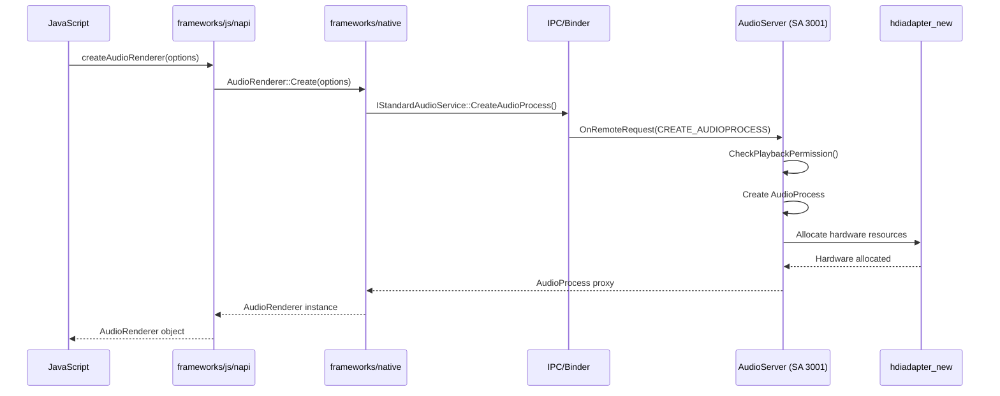
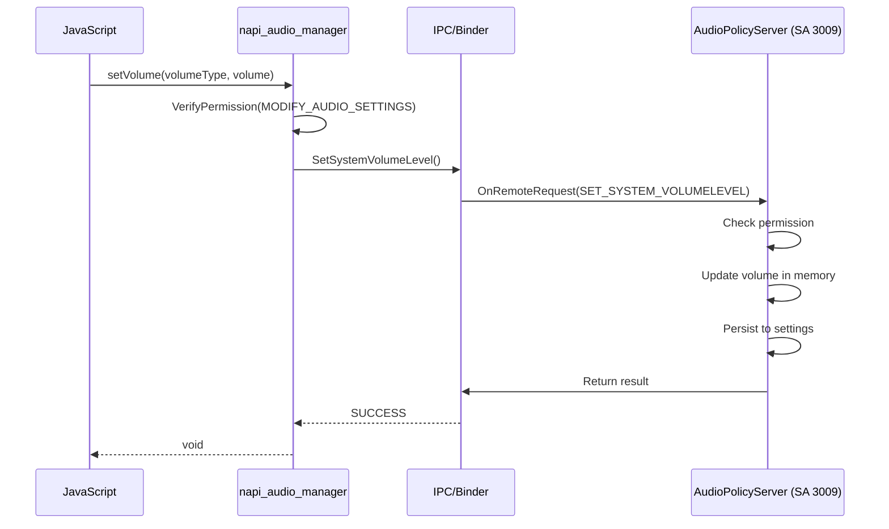
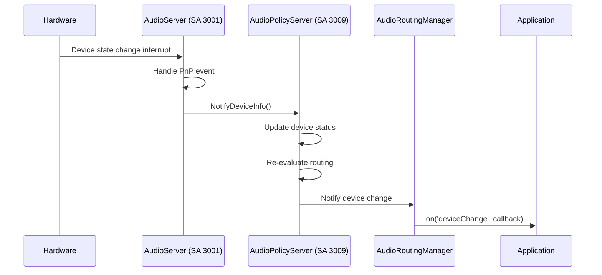
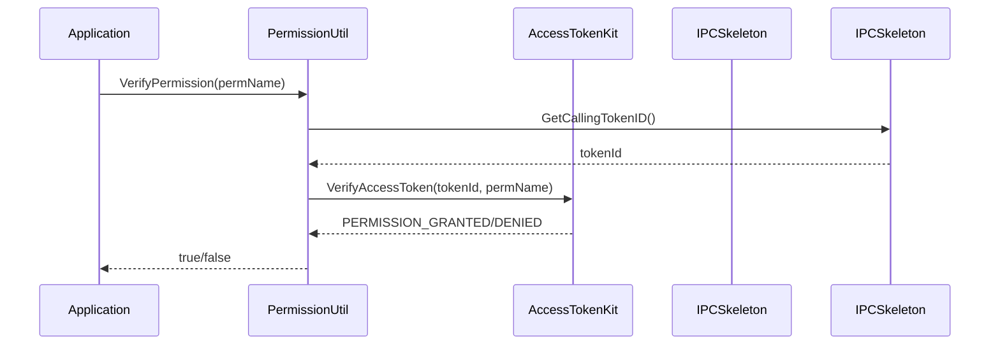
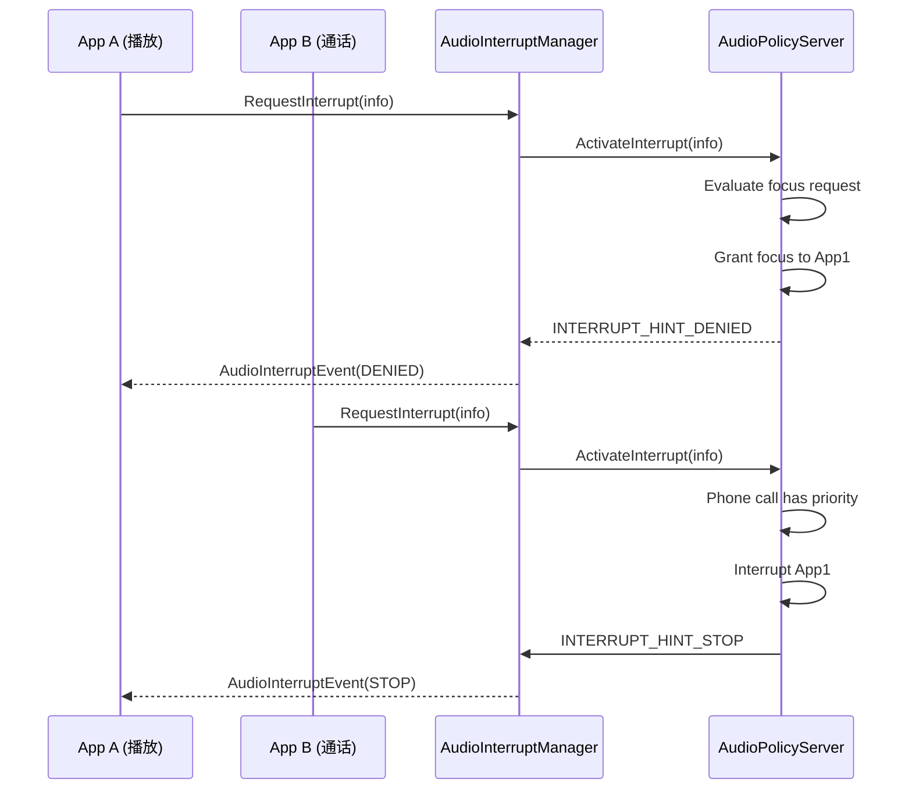

# Audio Framework - 关键调用链

## JS 创建 AudioRenderer

## JS 设置音量

## 设备插拔事件流

## 音频播放数据流

## 音频采集数据流

## 权限验证调用链

## 焦点/中断管理

## 相关文档

- [N-API 接口](../03_NAPI.md)
- [架构设计](../02_Architecture.md)
- [安全机制](../05_Security.md)
