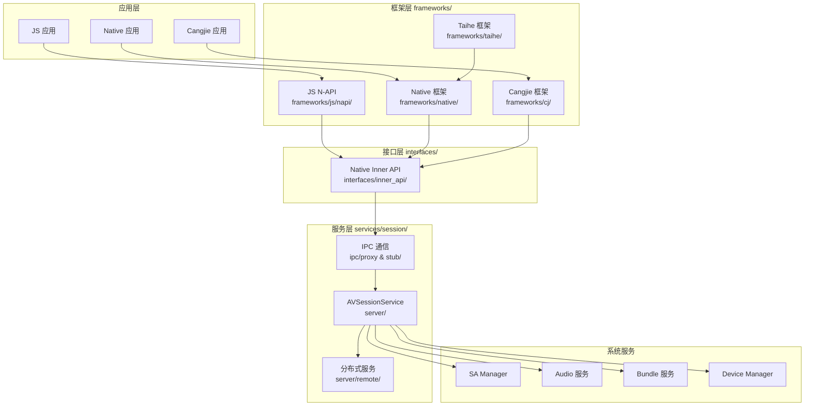
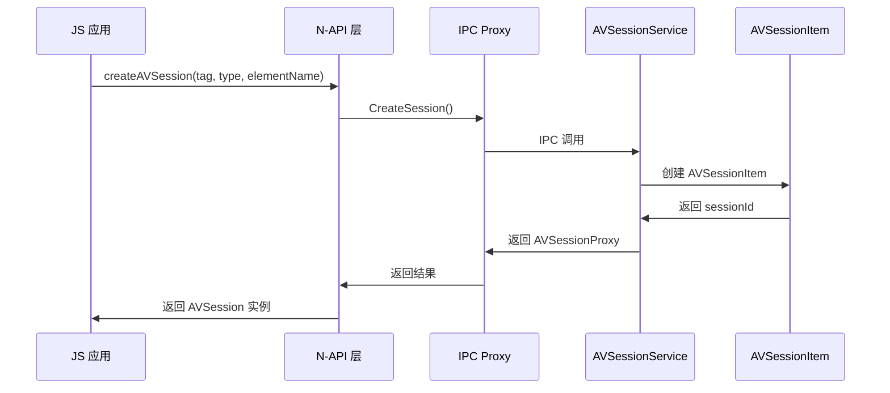
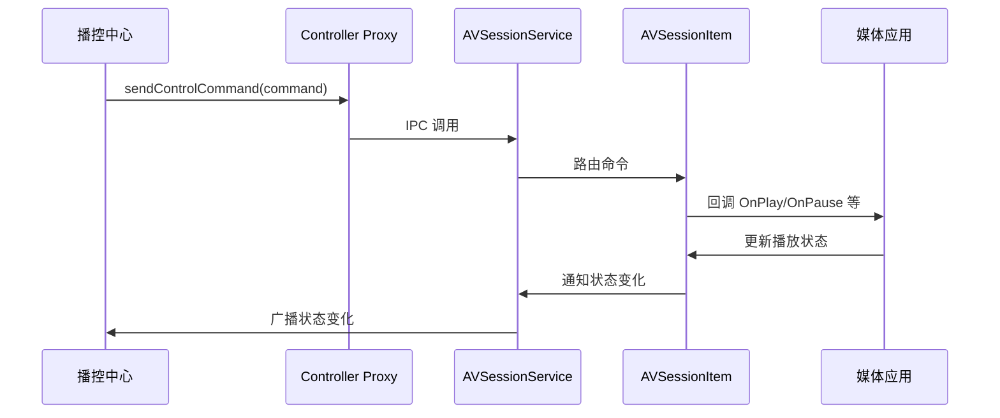
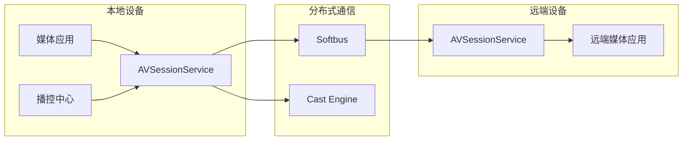

# AVSession 架构

## 逻辑架构图



---

## 组件职责

### 1. 应用层

| 组件 | 职责 |
|------|------|
| **JS 应用** | 通过 N-API 接口使用 AVSession |
| **Native 应用** | 通过 Native API 使用 AVSession |
| **Cangjie 应用** | 通过 FFI 使用 AVSession |

### 2. 框架层

| 组件 | 职责 | 关键文件 |
|------|------|----------|
| **JS N-API** | JS 到 Native 的桥接层 | `napi_module.cpp`, `napi_avsession*.cpp` |
| **Native 框架** | Native 客户端实现 | `avsession_manager_impl.cpp` |
| **Cangjie 框架** | Cangjie 语言绑定 | `cj_avsession*.cpp` |
| **Taihe 框架** | 跨语言框架 | `taihe_avsession*.cpp` |

### 3. 接口层

| 组件 | 职责 | 关键文件 |
|------|------|----------|
| **Inner API** | 定义 Native 接口契约 | `av_session.h`, `avsession_controller.h`, `avsession_manager.h` |

### 4. 服务层

| 组件 | 职责 | 关键文件 |
|------|------|----------|
| **IPC 通信** | 处理进程间通信 | `avsession_service_proxy/stub` |
| **AVSessionService** | 全局会话管理 SA 服务 | `avsession_service.h/cpp` |
| **分布式服务** | 跨设备会话同步 | `remote_session_*.cpp`, `migrate_*.cpp` |

---

## 数据流向

### 典型调用链: JS 创建会话



### 控制命令调用链



---

## 线程模型

### 关键线程

| 线程 | 职责 | 代码位置 |
|------|------|----------|
| **Main UI Thread** | 应用主线程，处理 JS 调用 | JS 运行环境 |
| **IPC Thread** | 处理 IPC 通信 | `ipc/proxy/*.cpp` |
| **Service Main Thread** | SA 服务主线程 | `server/avsession_service.cpp` |
| **Event Handler Thread** | 事件处理线程 | `utils/src/avsession_event_handler.cpp` |

### 线程间通信

```cpp
// 事件投递示例 (avsession_event_handler.cpp)
AVSessionEventHandler &handler = AVSessionEventHandler::GetInstance();
handler.AVSessionPostTask([callback]() {
    callback->OnPlay();
}, std::string(__FUNCTION__));
```

---

## IPC 接口定义

### SA 服务配置

```json
// sa_profile/av_session.json
{
    "id": 3010,
    "name": "avsession_service",
    "lib-path": "libavsession_service.z.so",
    "run-on-create": true,
    "distributed": true
}
```

### IPC 接口列表

| 接口 | 描述符 | 主要方法 |
|------|--------|----------|
| **IAVSessionService** | `ohos.avsession.IAVSessionService` | CreateSession, GetAllSessionDescriptors |
| **IAVSession** | `ohos.avsession.IAVSession` | SetAVMetaData, SetAVPlaybackState, Activate |
| **IAVSessionController** | `ohos.avsession.IAVSessionController` | SendControlCommand, GetAVPlaybackState |
| **IAVCastController** | `ohos.avsession.IAVCastController** | Start, Prepare, SendControlCommand |

---

## 分布式架构

### 组件分布



### 分布式能力

| 能力 | 实现组件 | 说明 |
|------|----------|------|
| **会话迁移** | `migrate_avsession_*` | 跨设备会话迁移 |
| **远端控制** | `remote_session_*` | 远端会话控制 |
| **音频投送** | `cast_audio_*` | 本地音频投送到远端 |
| **设备发现** | `cast_discovery_*` | 发现可投送设备 |
