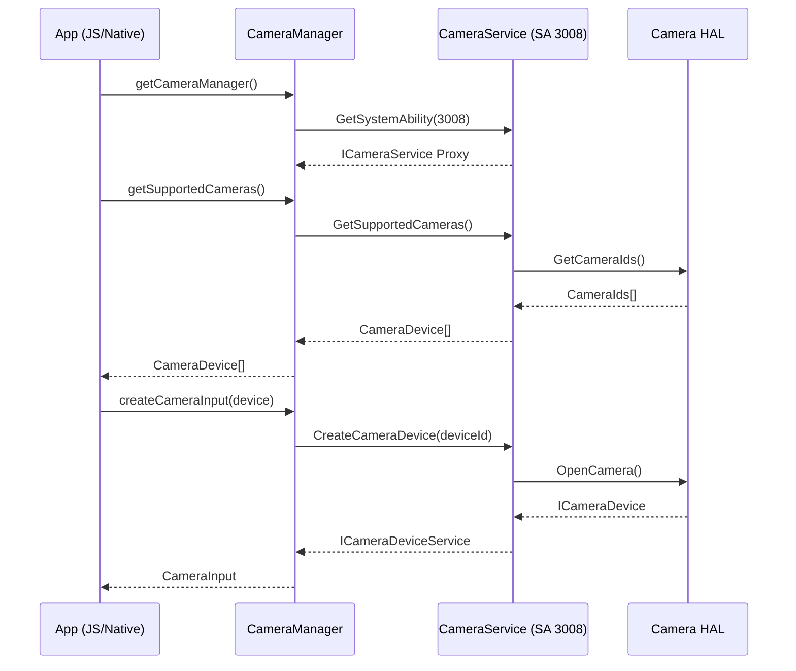
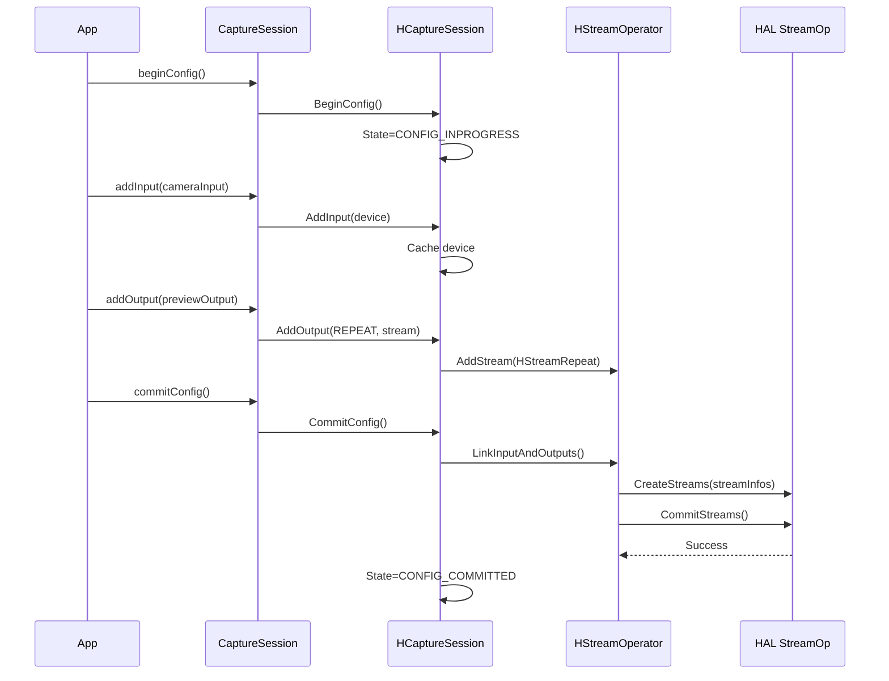
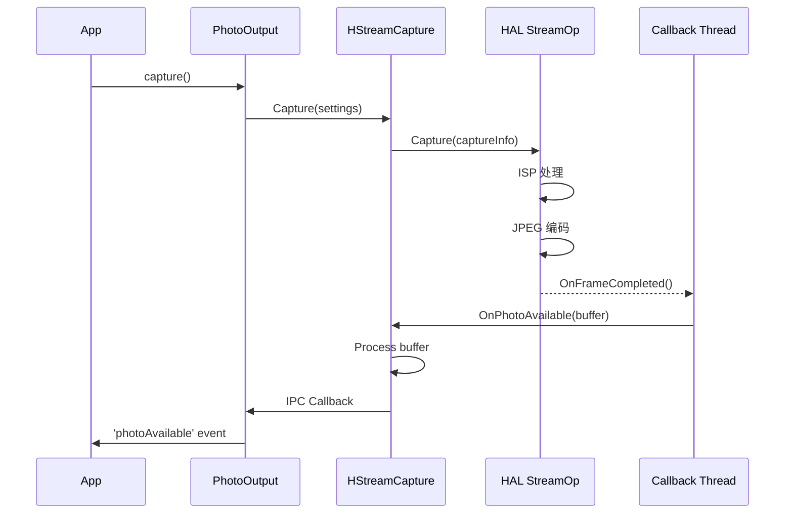

# 架构与数据流 (Architecture)

> OpenHarmony Camera Framework 分层架构设计

---

## 架构概览

Camera Framework 采用 **分层架构设计**，从应用层到硬件抽象层共经历 4 个主要层次：

```
┌─────────────────────────────────────────────────────────────────┐
│                        APP LAYER (应用层)                        │
│  JavaScript/TypeScript 应用  │  Native C++ 应用  │  Cangjie 应用 │
└─────────────────────────────────────────────────────────────────┘
                              │
                              ▼
┌─────────────────────────────────────────────────────────────────┐
│                     FRAMEWORK LAYER (框架层)                      │
│  ┌─────────────┐  ┌─────────────┐  ┌─────────────┐  ┌─────────┐ │
│  │   N-API     │  │   NDK API   │  │ CJ FFI API  │  │ Taihe   │ │
│  │  (JS绑定)    │  │  (C API)    │  │  (仓颉绑定)  │  │ (方舟)   │ │
│  └──────┬──────┘  └──────┬──────┘  └──────┬──────┘  └────┬────┘ │
│         └─────────────────┴─────────────────┴──────────────┘     │
│                              │                                   │
│  ┌───────────────────────────▼──────────────────────────────┐   │
│  │              Native Camera Framework                      │   │
│  │    (CameraManager, CaptureSession, Output classes)        │   │
│  └───────────────────────────┬──────────────────────────────┘   │
└──────────────────────────────┼──────────────────────────────────┘
                               │
                               ▼ IPC (Binder)
┌─────────────────────────────────────────────────────────────────┐
│                      SERVICE LAYER (服务层)                      │
│  ┌──────────────────────────────────────────────────────────┐   │
│  │                   Camera Service (SAID 3008)               │   │
│  │  ┌─────────────┐  ┌─────────────┐  ┌──────────────────┐  │   │
│  │  │ HCamera     │  │ HCapture    │  │ HStreamOperator  │  │   │
│  │  │ Service     │  │ Session     │  │ (Stream Manager) │  │   │
│  │  └──────┬──────┘  └──────┬──────┘  └────────┬─────────┘  │   │
│  │         │                 │                   │          │   │
│  │         └─────────────────┴───────────────────┘          │   │
│  └──────────────────────────────────────────────────────────┘   │
│                              │                                   │
│  ┌───────────────────────────▼──────────────────────────────┐   │
│  │           Deferred Processing Service (DPS)               │   │
│  │              (延迟照片/视频处理服务)                       │   │
│  └──────────────────────────────────────────────────────────┘   │
└──────────────────────────────┼──────────────────────────────────┘
                               │
                               ▼ HDI (Hardware Device Interface)
┌─────────────────────────────────────────────────────────────────┐
│                        HAL LAYER (硬件层)                        │
│  ┌─────────────────┐  ┌─────────────────┐  ┌─────────────────┐  │
│  │   Camera Host   │  │ Stream Operator │  │ Camera Device   │  │
│  │   (ICameraHost) │  │ (IStreamOp)     │  │ (ICameraDev)    │  │
│  └─────────────────┘  └─────────────────┘  └─────────────────┘  │
│                              │                                   │
│                    Camera Hardware Driver                        │
└─────────────────────────────────────────────────────────────────┘
```

---

## 组件职责

### 应用层 (App Layer)

| 组件 | 技术栈 | 用途 |
|------|--------|------|
| JavaScript 应用 | ArkUI/TypeScript | 前端相机应用 |
| Native 应用 | C++ | 系统相机、高性能应用 |
| Cangjie 应用 | Cangjie | 新一代编程语言应用 |

### 框架层 (Framework Layer)

| 组件 | 文件路径 | 职责 |
|------|----------|------|
| **N-API** | `interfaces/kits/js/camera_napi/` | JavaScript 到 Native 的绑定层 |
| **NDK** | `frameworks/native/ndk/` | C 语言标准接口 |
| **CJ FFI** | `frameworks/cj/` | Cangjie 语言绑定 |
| **Taihe** | `frameworks/taihe/` | 方舟运行时绑定 |
| **Camera Framework** | `frameworks/native/camera/` | 核心框架实现 |

### 服务层 (Service Layer)

| 组件 | 文件路径 | SAID | 职责 |
|------|----------|------|------|
| **camera_service** | `services/camera_service/` | 3008 | 核心相机服务，管理设备生命周期 |
| **deferred_processing_service** | `services/deferred_processing_service/` | 动态 | 延迟处理服务 |

### 硬件抽象层 (HAL Layer)

通过 HDI 接口与底层驱动通信：
- `ICameraHost` - 相机主机管理
- `IStreamOperator` - 流操作接口
- `ICameraDevice` - 设备控制接口

---

## 数据流详细路径

### 场景 1: 预览数据流 (Preview)

```
┌──────────┐     ┌──────────────┐     ┌─────────────┐
│  Camera  │────▶│  XComponent  │────▶│  App UI     │
│  HAL     │     │  (Surface)   │     │  Display    │
└────┬─────┘     └──────────────┘     └─────────────┘
     │
     │ Buffer (YCbCr_420_SP / RGBA)
     ▼
┌─────────────┐     ┌────────────────┐     ┌─────────────┐
│ HStreamRepeat│────▶│  Buffer Queue  │────▶│ PreviewOutput│
│ (Service)    │     │  (Consumer)    │     │ (Framework)  │
└─────────────┘     └────────────────┘     └─────────────┘
```

**关键代码路径**：
- HAL 层: `//drivers/interface/camera`
- Service 层: `services/camera_service/src/hstream_repeat.cpp`
- Framework 层: `frameworks/native/camera/src/output/preview_output.cpp`

### 场景 2: 拍照数据流 (Capture)

```
App: photoOutput.capture()
  │
  ▼ IPC
HStreamCapture::Capture()
  │
  ▼ HDI
Camera HAL → ISP → JPEG/RAW 处理
  │
  ▼ Callback
HStreamCapture::OnPhotoAvailable(buffer)
  │
  ▼ IPC
App: on('photoAvailable', callback)
  │
  ▼
Image Sink (文件系统/预览)
```

**关键代码路径**：
- Service 层: `services/camera_service/src/hstream_capture.cpp:Capture()`
- 回调处理: `services/camera_service/src/hstream_capture.cpp:OnPhotoAvailable()`

### 场景 3: 录像数据流 (Video Recording)

```
App: videoOutput.start()
  │
  ▼
HStreamRepeat (Video) + MediaRecorder
  │
  ▼ Buffer
AudioCapturer (音频采集)
  │
  ▼
MediaCodec (编码)
  │
  ▼
MPEG Muxer (封装)
  │
  ▼
输出文件 (.mp4)
```

---

## 线程模型

### 服务层线程结构

```
┌─────────────────────────────────────────────────────────────┐
│                    Camera Service Process                    │
│                                                              │
│  ┌─────────────────────────────────────────────────────┐   │
│  │              Main Thread (主线程)                    │   │
│  │  - HCameraService 事件处理                           │   │
│  │  - IPC 调用分发                                      │   │
│  └─────────────────────────────────────────────────────┘   │
│                          │                                   │
│  ┌───────────────────────▼───────────────────────────────┐   │
│  │           Task Manager Thread Pool                     │   │
│  │  (frameworks/native/camera/base/src/task_manager.cpp)  │   │
│  │                                                        │   │
│  │  ┌─────────┐  ┌─────────┐  ┌─────────┐  ┌─────────┐  │   │
│  │  │ Worker  │  │ Worker  │  │ Worker  │  │ Worker  │  │   │
│  │  │ Thread 1│  │ Thread 2│  │ Thread 3│  │ Thread N│  │   │
│  │  └─────────┘  └─────────┘  └─────────┘  └─────────┘  │   │
│  └───────────────────────────────────────────────────────┘   │
│                          │                                   │
│  ┌───────────────────────▼───────────────────────────────┐   │
│  │              Callback Threads (回调线程)               │   │
│  │  - 预览帧回调                                         │   │
│  │  - 拍照完成回调                                       │   │
│  │  - 元数据回调                                         │   │
│  └───────────────────────────────────────────────────────┘   │
│                                                              │
└─────────────────────────────────────────────────────────────┘
```

### 关键线程职责

| 线程类型 | 用途 | 代码位置 |
|----------|------|----------|
| **主线程** | IPC 请求处理、状态管理 | `services/camera_service/src/hcamera_service.cpp` |
| **任务线程** | 耗时操作（配置、启动） | `common/include/task_manager/task_manager.h` |
| **HAL 回调线程** | 接收 HAL 数据 | `services/camera_service/src/hstream_*.cpp` |

---

## 关键时序图

### 相机启动流程 (Camera Startup)



### 会话配置流程 (Session Configuration)



### 拍照触发流程 (Photo Capture)



---

## 信任边界

```
┌─────────────────────────────────────────────────────────────────┐
│                     UNTRUSTED ZONE                               │
│                    (应用进程空间)                                 │
│                                                                  │
│   ┌─────────────┐   ┌─────────────┐   ┌─────────────┐          │
│   │  App Code   │   │  JS Engine  │   │  Native Lib │          │
│   └──────┬──────┘   └──────┬──────┘   └──────┬──────┘          │
└─────────┼─────────────────┼─────────────────┼──────────────────┘
          │                 │                 │
          └─────────────────┴─────────────────┘
                            │
          ══════════════════╪══════════════════  IPC/Binder
                            │
┌───────────────────────────▼────────────────────────────────────┐
│                     TRUSTED ZONE                                │
│                  (Camera Service 进程)                           │
│                                                                  │
│   ┌─────────────────────────────────────────────────────────┐  │
│   │              Camera Service (SAID 3008)                  │  │
│   │  ┌──────────┐  ┌──────────┐  ┌──────────┐              │  │
│   │  │ Permission│  │  Input   │  │  Stream  │              │  │
│   │  │  Check   │  │ Validation│  │  Manager │              │  │
│   │  └────┬─────┘  └────┬─────┘  └────┬─────┘              │  │
│   │       └─────────────┴─────────────┘                    │  │
│   │                      │                                  │  │
│   └──────────────────────┼──────────────────────────────────┘  │
│                          │                                      │
│   ═══════════════════════╪══════════════════════  HDI Interface │
│                          │                                      │
│   ┌──────────────────────▼──────────────────────────────────┐  │
│   │              Camera HAL (Kernel Space)                   │  │
│   │                   (Trusted)                              │  │
│   └─────────────────────────────────────────────────────────┘  │
└─────────────────────────────────────────────────────────────────┘
```

### 安全关键边界

| 边界 | 左侧 | 右侧 | 安全机制 |
|------|------|------|----------|
| **App ↔ Service** | 应用进程 | CameraService | IPC鉴权、权限检查 |
| **Service ↔ HAL** | 用户态 | 内核态 | HDI接口、Capability |
| **Input Validation** | 外部输入 | 内部处理 | 参数校验、边界检查 |

---

## 核心类图

### CameraManager 类层次

```
RefBase
  └── CameraManager (Singleton)
        ├── CameraManagerGetter (内部基类)
        ├── CameraStatusListenerManager
        ├── TorchServiceListenerManager
        ├── CameraMuteListenerManager
        └── FoldStatusListenerManager
```

**代码位置**: `interfaces/inner_api/native/camera/include/input/camera_manager.h:160`

### CaptureSession 类层次

```
RefBase
  └── CaptureSession
        ├── PhotoSession
        ├── VideoSession
        ├── ScanSession
        ├── SecureCameraSession
        └── CaptureSessionForSys (扩展)
              ├── PhotoSessionForSys
              ├── VideoSessionForSys
              ├── NightSession
              ├── PortraitSession
              ├── SlowMotionSession
              ├── TimeLapsePhotoSession
              └── ... (20+ modes)
```

**代码位置**: `interfaces/inner_api/native/camera/include/session/capture_session.h:650`

### Stream 类层次 (Service 层)

```
RefBase
  └── HStreamCommon (abstract)
        ├── HStreamRepeat      - 连续流 (预览、录像)
        ├── HStreamCapture     - 拍照流
        ├── HStreamMetadata    - 元数据流
        └── HStreamDepthData   - 深度数据流
```

**代码位置**: `services/camera_service/include/hstream_common.h`

---

## 下一步阅读

- [攻击面分析](./05_AttackSurface.md) - 识别安全关键入口点
- [目录结构](./03_CodeMap.md) - 代码文件导航
- [对外接口](./04_Interface.md) - API 详细说明
