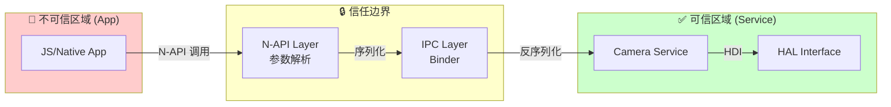

# 攻击面分析 (Attack Surface Analysis)

> OpenHarmony Camera Framework - 攻击面识别与信任边界

---

## 攻击面总览

```
                    ┌─────────────────────────────────────────┐
                    │           外部攻击者                      │
                    └─────────────────┬───────────────────────┘
                                      │
    ══════════════════════════════════╪══════════════════════════════
                    攻击面入口          │
    ══════════════════════════════════╪══════════════════════════════
                                      │
    ┌─────────────────────────────────▼─────────────────────────────┐
    │                      N-API 接口层                              │
    │  JS API 调用 → 参数解析 → C++ 对象转换                         │
    │  [camera_manager_napi.cpp, camera_session_napi.cpp]           │
    └─────────────────────────────────┬─────────────────────────────┘
                                      │
    ┌─────────────────────────────────▼─────────────────────────────┐
    │                      IPC 接口层                                │
    │  Binder 通信 → MessageParcel 序列化/反序列化                   │
    │  [ICameraService, ICaptureSession, IStream*]                  │
    └─────────────────────────────────┬─────────────────────────────┘
                                      │
    ┌─────────────────────────────────▼─────────────────────────────┐
    │                      文件/系统接口                             │
    │  配置文件读取、动态库加载、临时文件写入                          │
    │  [param_update, dynamic_libs]                                 │
    └─────────────────────────────────┬─────────────────────────────┘
                                      │
    ══════════════════════════════════╪══════════════════════════════
                                      │
                    ┌─────────────────▼───────────────────────┐
                    │           信任边界                        │
                    │      Camera Service (SAID 3008)          │
                    └─────────────────────────────────────────┘
```

---

## 1. 外部输入清单

### 1.1 N-API 参数输入 (高风险)

| 入口点 | 参数类型 | 文件位置 | 风险说明 |
|--------|----------|----------|----------|
| `camera.getCameraManager(context)` | Context 对象 | `camera_manager_napi.cpp:702` | JS Context 可能伪造 |
| `createCameraInput(cameraDevice)` | Device 对象 | `camera_manager_napi.cpp:717` | Device 对象可能非法 |
| `createPreviewOutput(profile, surfaceId)` | surfaceId (string) | `camera_manager_napi.cpp:720` | 字符串长度/内容 |
| `capture(settings)` | 配置对象 | `photo_output_napi.cpp:733` | 嵌套对象解析 |
| `setZoomRatio(ratio)` | 浮点数 | `camera_session_napi.cpp:185` | 数值范围校验 |
| `setMeteringPoint(point)` | 坐标对象 | `camera_session_napi.cpp:156` | X/Y 坐标边界 |

**关键代码证据**:
```cpp
// frameworks/js/camera_napi/src/input/camera_manager_napi.cpp:717
static napi_value CreateCameraInputInstance(napi_env env, napi_callback_info info) {
    // 参数解析，需要验证 cameraDevice 对象有效性
    CAMERA_NAPI_GET_JS_ARGS(env, info, argc, argv, asyncContext);
    // ... 对象解包
}
```

### 1.2 IPC 数据输入 (高风险)

| IPC 接口 | 方法 | 参数 | 风险点 |
|----------|------|------|--------|
| `ICameraService` | `CreateCameraDevice` | `cameraId` (string) | 字符串长度、特殊字符 |
| `ICameraService` | `CreateCaptureSession` | `modeName` (string) | 模式名有效性 |
| `ICaptureSession` | `AddOutput` | `streamType`, `stream` | 流类型枚举校验 |
| `IStreamCapture` | `Capture` | `captureSettings` (metadata) | 元数据解析 |
| `IStreamRepeat` | `SetFrameRate` | `minFps`, `maxFps` | 数值范围 |
| `IMovieFileOutput` | `Start` | `filePath` (string) | 路径遍历 |

**关键代码证据**:
```cpp
// services/camera_service/src/hcamera_device.cpp:2173
int32_t HCameraService::CreateCameraDevice(...) {
    // 路径长度检查
    CHECK_RETURN_RET(cameraId.length() > PATH_MAX, CAMERA_INVALID_ARG);
    // ...
}
```

### 1.3 配置文件输入 (中风险)

| 文件类型 | 路径/位置 | 用途 | 风险 |
|----------|-----------|------|------|
| 相机参数配置 | `/data/camera_param/` | 相机旋转参数 | 路径遍历、格式错误 |
| 动态库加载 | `system/lib/` | 动态库加载 | 库劫持 |
| SA 配置 | `sa_profile/3008.json` | 服务启动配置 | JSON 解析 |

**关键代码证据**:
```cpp
// services/camera_service/src/param_update/camera_rotate_param_reader.cpp:52
bool CameraRotateParamReader::ReadFile(const std::string& filePath) {
    // 使用 realpath 规范化路径
    char* canonicalPath = realpath(filePath.c_str(), nullptr);
    // ...
}
```

### 1.4 回调数据输入 (中风险)

| 回调类型 | 数据来源 | 处理方式 | 风险 |
|----------|----------|----------|------|
| `OnPhotoAvailable` | HAL 层 | Buffer 接收 | Buffer 大小、句柄有效性 |
| `OnFrameAvailable` | HAL 层 | 预览帧回调 | 帧数据完整性 |
| `OnMetadataAvailable` | HAL 层 | 元数据解析 | 元数据长度、类型 |

**关键代码证据**:
```cpp
// services/camera_service/binder/server/src/hstream_capture_photo_callback_stub.cpp:25
int HStreamCapturePhotoCallbackStub::OnRemoteRequest(...) {
    // IPC 反序列化
    MessageParcel data;
    // ... 读取 buffer 句柄
    surfaceBuffer->ReadFromMessageParcel(data);
}
```

---

## 2. 敏感操作清单

### 2.1 权限敏感操作

| 操作 | 所需权限 | 检查位置 | 代码证据 |
|------|----------|----------|----------|
| 打开相机 | `ohos.permission.CAMERA` | `camera_util.cpp:390` | `CheckPermission(token, CAMERA_PERMISSION)` |
| 录像 | `ohos.permission.MICROPHONE` | `hstream_capture.cpp:1622` | 麦克风权限检查 |
| 系统级操作 | SystemApp | 多处 | `CameraNapiSecurity::CheckSystemApp()` |

**关键代码证据**:
```cpp
// services/camera_service/src/camera_util.cpp:390-408
int32_t CheckPermission(uint32_t tokenId, const std::string& permissionName) {
    // Token 类型检查
    ATokenTypeEnum tokenType = AccessTokenKit::GetTokenType(tokenId);
    if (tokenType == TOKEN_NATIVE) {
        return CAMERA_OK;
    }
    // 权限验证
    int32_t ret = AccessTokenKit::VerifyAccessToken(tokenId, permissionName);
    if (ret != PERMISSION_GRANTED) {
        return CAMERA_NO_PERMISSION;
    }
}
```

### 2.2 内存敏感操作

| 操作 | 位置 | 风险 |
|------|------|------|
| `malloc`/`new` | `cj_camera/src/*.cpp`, `ndk/*.cpp` | 缺少 null 检查 |
| `memcpy_s` | 多处 | 目标 buffer 大小 |
| `SurfaceBuffer` | `hstream_*.cpp` | Buffer 句柄有效性 |
| `MessageParcel` | IPC 回调 | 反序列化安全 |

**高风险代码证据**:
```cpp
// frameworks/cj/camera_picker/src/camera_picker_impl.cpp:80
char *res = static_cast<char *>(malloc(sizeof(char) * len));
// ❌ 缺少 null 检查即使用 res

// frameworks/native/ndk/impl/camera_manager_impl.cpp:261-265
Camera_Device* outCameras = new Camera_Device[cameraSize];  // ❌ 无 null 检查
char* dst = new char[dstSize];  // ❌ 无 null 检查
```

### 2.3 文件系统操作

| 操作 | 位置 | 风险 |
|------|------|------|
| 配置文件读取 | `camera_rotate_param_reader.cpp` | 路径遍历、文件内容验证 |
| 临时文件创建 | `hstream_capture.cpp` | 竞争条件 |
| 动态库加载 | `dynamic_libs/` | 库劫持 |

### 2.4 系统服务调用

| 被调用服务 | 用途 | 风险 |
|------------|------|------|
| `access_token` | 权限检查 | 权限绕过 |
| `app_manager` | 应用状态监听 | 状态欺骗 |
| `window_manager` | Surface 管理 | Surface 劫持 |
| `media_library` | 照片保存 | 存储攻击 |

---

## 3. 信任边界图

### 3.1 分层信任模型

```
┌──────────────────────────────────────────────────────────────────────┐
│  Layer 0: 外部不可信层                                                │
│  - 第三方应用                                                          │
│  - 远程输入                                                            │
│  【零信任，所有输入需验证】                                             │
└────────────────────────────────┬─────────────────────────────────────┘
                                 │ IPC (Binder)
                                 │  - 权限检查 (CAMERA_PERMISSION)
                                 │  - Token 验证
                                 │  - 系统应用白名单
                                 ▼
┌──────────────────────────────────────────────────────────────────────┐
│  Layer 1: Camera Service (SAID 3008)                                  │
│  【高权限进程，需重点保护】                                             │
│  - 输入验证                                                           │
│  - 权限仲裁                                                           │
│  - 资源管理                                                           │
│  【攻击者目标：提权至此层】                                             │
└────────────────────────────────┬─────────────────────────────────────┘
                                 │ HDI Interface
                                 │  - Capability 检查
                                 ▼
┌──────────────────────────────────────────────────────────────────────┐
│  Layer 2: Camera HAL / Kernel                                         │
│  【内核空间，最高权限】                                                 │
│  - 直接硬件访问                                                        │
│  - 驱动程序                                                            │
│  【攻击者终极目标】                                                     │
└──────────────────────────────────────────────────────────────────────┘
```

### 3.2 数据流信任边界



### 3.3 关键边界检查点

| 边界 | 位置 | 检查机制 |
|------|------|----------|
| **App → Framework** | `camera_napi/*.cpp` | 参数类型、范围检查 |
| **Framework → Service** | `camera_service_proxy.cpp` | IPC 鉴权、Token 验证 |
| **Service → HAL** | `hcamera_device.cpp` | HDI Capability |
| **Callback → Service** | `*_callback_stub.cpp` | Buffer 验证 |

---

## 4. 攻击面矩阵

### 4.1 攻击向量评估

| 攻击向量 | 可达性 | 影响 | 风险等级 | 示例 |
|----------|--------|------|----------|------|
| **N-API 参数注入** | 高 | 中-高 | 🔴 高 | 构造非法 cameraDevice 对象 |
| **IPC 数据篡改** | 中 | 高 | 🔴 高 | 修改 Binder 数据包 |
| **路径遍历** | 中 | 中 | 🟡 中 | 配置文件路径绕过 |
| **内存破坏** | 低 | 高 | 🟡 中 | malloc 失败未检查 |
| **拒绝服务** | 高 | 中 | 🟡 中 | 资源耗尽攻击 |
| **权限提升** | 低 | 高 | 🟢 低 | 系统应用伪装 |

### 4.2 攻击路径示例

#### 路径 1: N-API 参数注入

```
攻击者构造恶意 JS 对象
  ↓
createCameraInput(malformedDevice)
  ↓
camera_manager_napi.cpp:717 (参数解析)
  ↓
解包失败或越界访问
  ↓
[崩溃/未定义行为]
```

#### 路径 2: IPC 数据篡改

```
攻击者获取 IPC 句柄
  ↓
伪造 MessageParcel
  ↓
ICameraService::CreateCameraDevice
  ↓
超长 cameraId 字符串
  ↓
hcamera_service.cpp:2173 (长度检查)
  ↓
[被拒绝/截断]
```

#### 路径 3: 内存破坏

```
系统内存不足
  ↓
camera_manager_impl.cpp:261
  ↓
new Camera_Device[cameraSize] 失败
  ↓
未检查 null 即使用
  ↓
[空指针解引用 → 崩溃]
```

---

## 5. 安全关键文件索引

### 5.1 输入验证相关

| 文件 | 职责 | 关键函数 |
|------|------|----------|
| `camera_manager_napi.cpp` | N-API 参数解析 | `CreateCameraInputInstance`, `CreateSessionInstance` |
| `camera_session_napi.cpp` | Session 参数解析 | `AddInput`, `AddOutput` |
| `camera_util.cpp` | 权限检查 | `CheckPermission`, `CheckSystemApp` |
| `hcamera_device.cpp` | 设备参数验证 | `Open`, `UpdateSetting` |

### 5.2 IPC 安全相关

| 文件 | 职责 | 风险点 |
|------|------|--------|
| `hcamera_service_stub.cpp` | 服务端 IPC 处理 | 反序列化 |
| `hstream_capture_photo_callback_stub.cpp` | 回调 IPC 处理 | Buffer 验证 |
| `camera_service_proxy.cpp` | 客户端 IPC | 数据构造 |

### 5.3 内存安全相关

| 文件 | 风险 | 行号 |
|------|------|------|
| `camera_picker_impl.cpp` | malloc 无 null 检查 | 80 |
| `video_output_impl.cpp` | malloc 无 null 检查 | 164 |
| `camera_manager_impl.cpp` | new[] 无 null 检查 | 261, 265, 813 |

---

## 6. 后续安全分析

详见 [06_SecurityReview.md](./06_SecurityReview.md) 获取详细的风险评估：

- **R1**: 输入验证缺陷
- **R2**: 内存安全问题
- **R3**: 权限与鉴权
- **R4**: 并发安全
- **R5**: 逻辑漏洞

---

## 附录: 关键代码路径速查

```
# N-API 入口
frameworks/js/camera_napi/src/native_module_ohos_camera.cpp

# 权限检查
services/camera_service/src/camera_util.cpp:390

# IPC 反序列化
services/camera_service/binder/server/src/*_stub.cpp

# 内存分配 (风险点)
frameworks/cj/*/src/*_impl.cpp
frameworks/native/ndk/impl/camera_manager_impl.cpp
```
