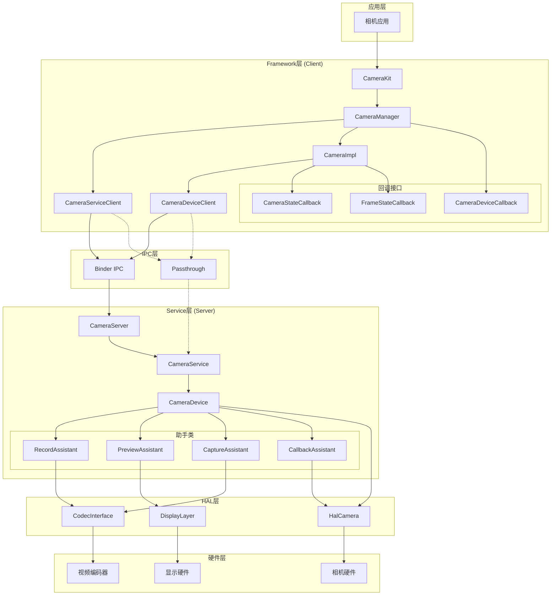
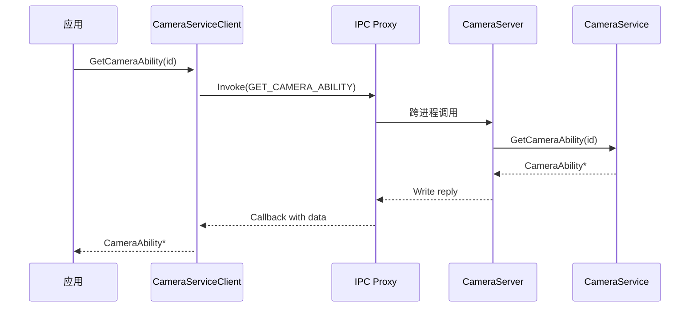
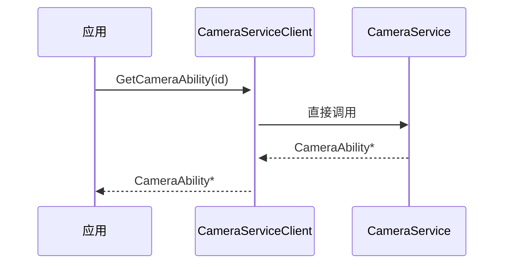
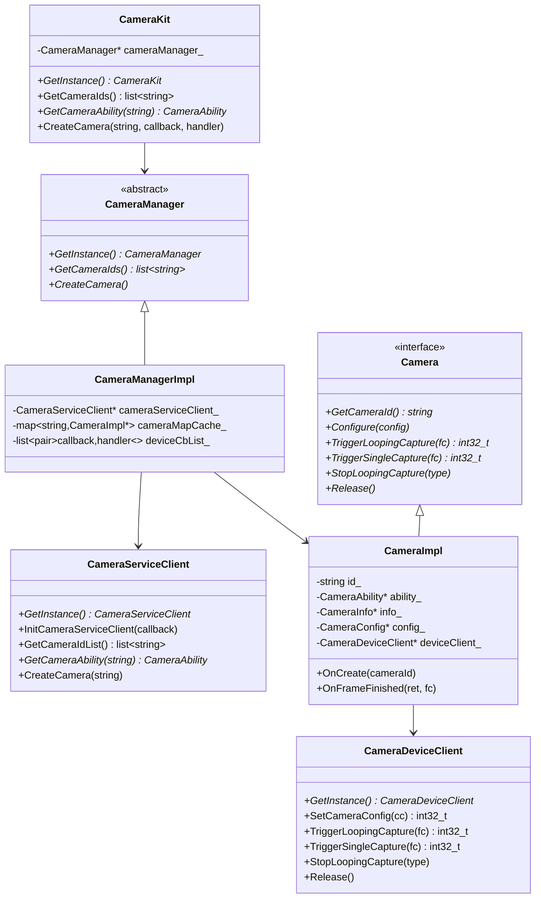
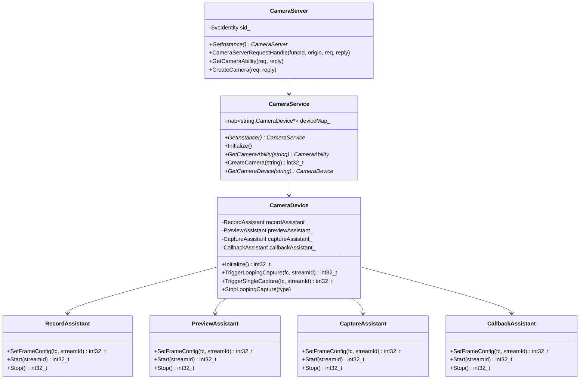
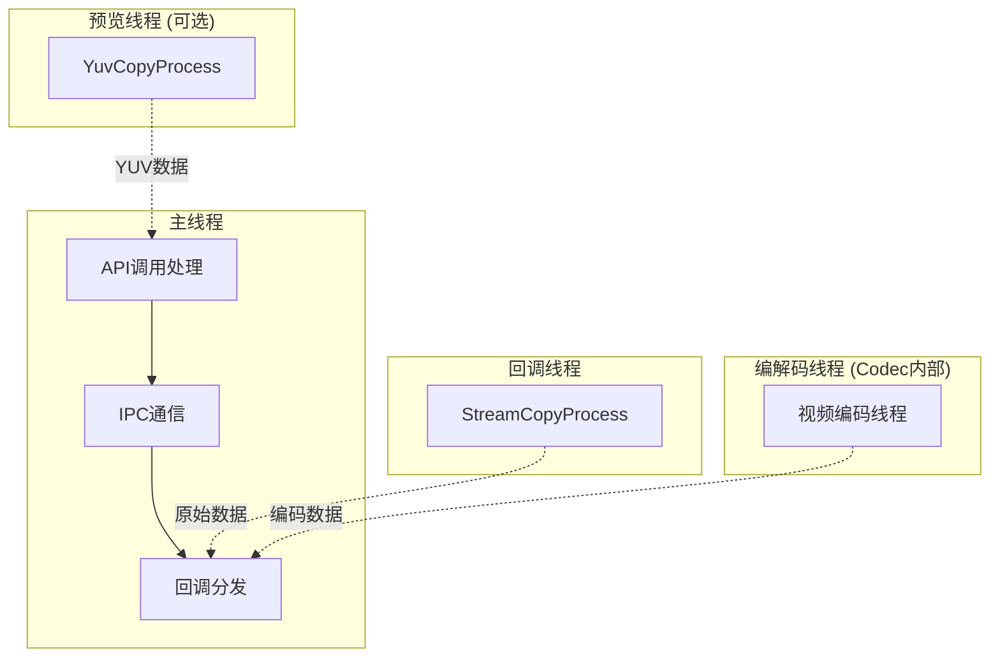
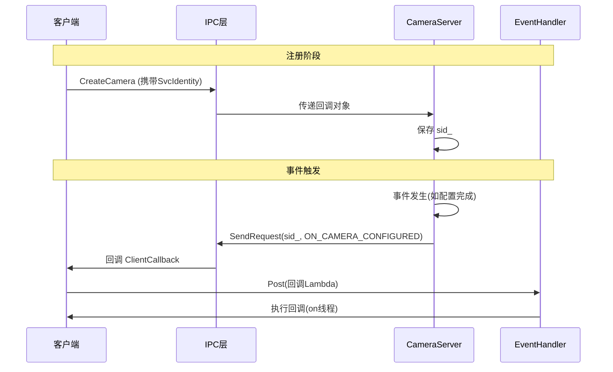
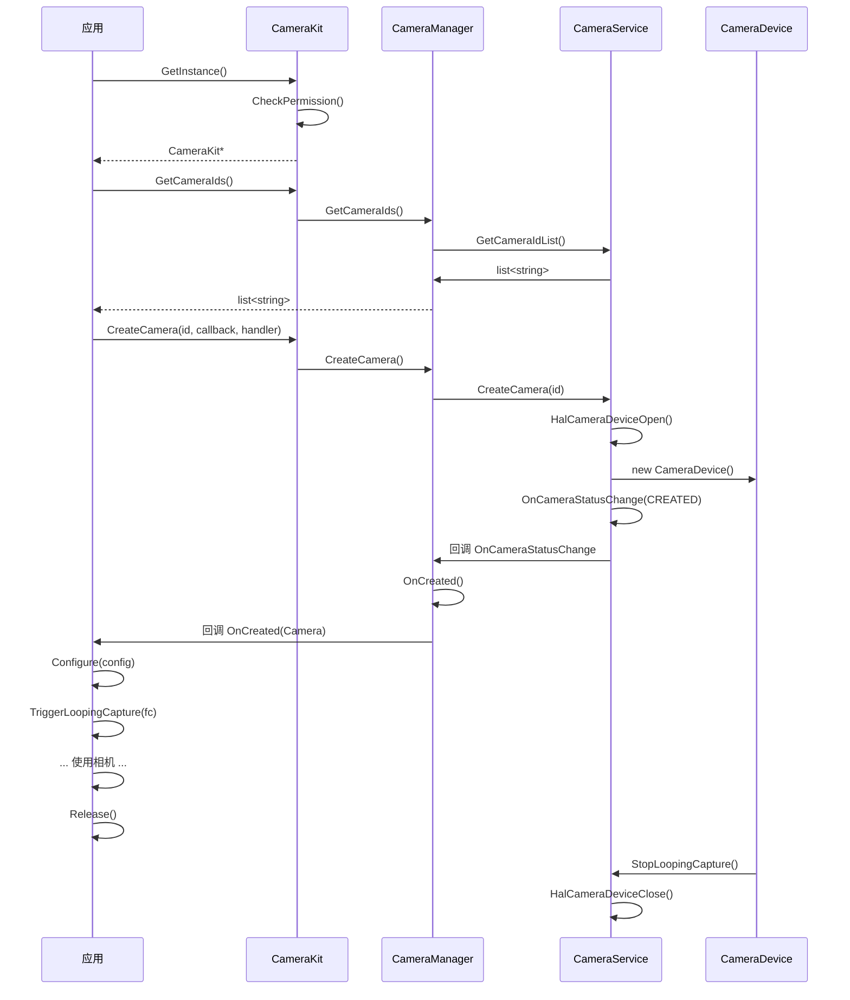

# 01 - 架构说明

> Camera_Lite 组件架构详解

---

## 系统架构图



---

## 运行模式

### Binder模式

**适用场景**: 多进程架构，客户端和服务端运行在不同进程

**工作流程**:



**关键代码**:
- 客户端: `frameworks/binder/src/camera_service_client.cpp`
- 服务端: `services/server/src/camera_server.cpp`
- IPC类型定义: `services/server/include/camera_type.h`

### Passthrough模式

**适用场景**: 单进程架构，追求更高性能

**工作流程**:



**编译切换**:

在 `frameworks/BUILD.gn` 中通过条件控制:

```gn
if (enable_media_passthrough_mode == true) {
  # Passthrough模式: 包含服务和passthrough客户端
  sources += [
    "../services/impl/src/camera_device.cpp",
    "../services/impl/src/camera_service.cpp",
    "passthrough/src/camera_device_client.cpp",
    "passthrough/src/camera_service_client.cpp",
  ]
  defines = [ "ENABLE_PASSTHROUGH_MODE" ]
} else {
  # Binder模式: 仅binder客户端
  sources += [
    "binder/src/camera_device_client.cpp",
    "binder/src/camera_service_client.cpp",
  ]
}
```

---

## 类关系图

### 客户端类层次



### 服务端类层次



---

## 数据流图

### 预览数据流 (Preview)


**代码位置**: `services/impl/src/camera_device.cpp` 的 PreviewAssistant

### 录像数据流 (Record)


**关键流程**:
1. `RecordAssistant::SetFrameConfig()` - 配置编码器
2. `RecordAssistant::Start()` - 启动编码
3. `OnVencBufferAvailble()` - 编码数据回调
4. `CopyCodecOutput()` - 数据拷贝到Surface

**代码位置**: `services/impl/src/camera_device.cpp` 第339-389行

### 拍照数据流 (Capture)


**代码位置**: `services/impl/src/camera_device.cpp` 的 CaptureAssistant::Start()

### 回调数据流 (Callback)


**关键流程**:
1. `StreamCopyProcess()` - 独立线程循环读取HAL buffer
2. `HalCameraDequeueBuf()` - 获取HAL层buffer
3. `FlushBuffer()` - 提交到Surface

**代码位置**: `services/impl/src/camera_device.cpp` 第753-805行

---

## 线程模型



### 线程职责

| 线程 | 职责 | 代码位置 |
|------|------|----------|
| 主线程 | API调用、IPC通信、回调处理 | 框架入口 |
| 预览线程 | YUV数据拷贝 (预留) | `camera_device.cpp:531` |
| 回调线程 | 原始帧数据拷贝 | `camera_device.cpp:753` |
| 编码线程 | 视频/图像编码 | Codec模块内部 |

**注意事项**:
- 回调通过 `EventHandler::Post()` 切换到主线程执行
- `StreamCopyProcess` 使用 `usleep(DELAY_TIME_ONE_FRAME)` 控制帧率

---

## 回调机制

### 异步回调流程



### 回调类型对照表

| 回调类型 | 触发时机 | 处理位置 |
|----------|----------|----------|
| OnCreated | 相机创建成功 | `CameraImpl::OnCreate()` |
| OnCreateFailed | 相机创建失败 | `CameraImpl::OnCreateFailed()` |
| OnConfigured | 相机配置成功 | `CameraImpl::OnConfigured()` |
| OnReleased | 相机已释放 | `CameraImpl::Release()` |
| OnFrameFinished | 帧捕获完成 | `CameraImpl::OnFrameFinished()` |
| OnFrameError | 帧捕获错误 | `CameraImpl::OnFrameFinished()` |
| OnCameraStatus | 设备状态变化 | `CameraManagerImpl::OnCameraStatusChange()` |

---

## 状态机

### 助手类状态 (DeviceAssistant)

```
LOOP_IDLE → LOOP_READY → LOOP_LOOPING → LOOP_STOP
                ↑___________________________|
```

| 状态 | 说明 |
|------|------|
| LOOP_IDLE | 初始状态 |
| LOOP_READY | 配置完成，可启动 |
| LOOP_LOOPING | 运行中 |
| LOOP_STOP | 已停止 |
| LOOP_ERROR | 错误状态 |

**状态检查**:
```cpp
if (assistant->state_ == LOOP_IDLE || 
    assistant->state_ == LOOP_LOOPING || 
    assistant->state_ == LOOP_ERROR) {
    MEDIA_ERR_LOG("Device state is %d, cannot start looping capture.", assistant->state_);
    return MEDIA_ERR;
}
```

**证据**: `services/impl/src/camera_device.cpp:877-880`

---

## 关键时序

### 相机生命周期



---

## 下一步

- [API参考](02_API_Reference.md) - 查看完整API定义
- [内部接口](03_Inner_API.md) - 了解模块内部设计
- [安全风险](05_Security.md) - 审查安全问题
