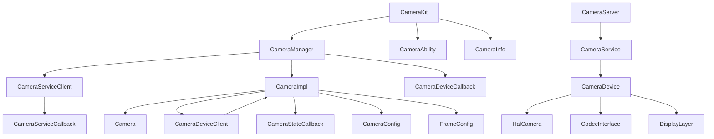
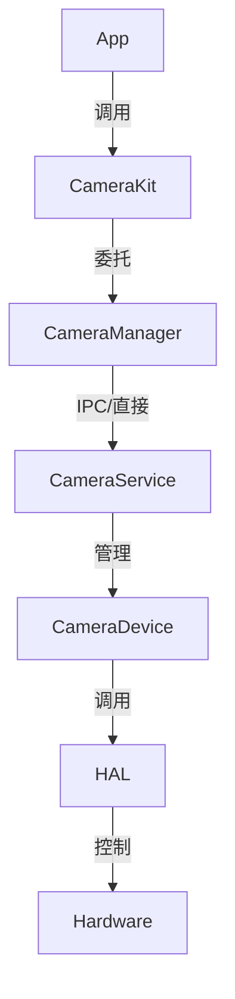

# 03 - 内部接口

> Camera_Lite 内部模块接口与实现细节

---

## 模块划分

Camera_Lite 内部由以下核心模块组成：

```
┌─────────────────────────────────────────────────────────────┐
│                    CameraKit (Application API)               │
├─────────────────────────────────────────────────────────────┤
│  Framework层 (Client)                                        │
│  ├── CameraManager     - 相机管理单例                        │
│  ├── CameraImpl        - Camera接口实现                      │
│  ├── CameraServiceClient   - 服务客户端 (IPC/直通)           │
│  └── CameraDeviceClient    - 设备客户端 (IPC/直通)           │
├─────────────────────────────────────────────────────────────┤
│  IPC层                                                       │
│  ├── Binder模式        - 跨进程通信                          │
│  └── Passthrough模式   - 直接链接                            │
├─────────────────────────────────────────────────────────────┤
│  Service层 (Server)                                          │
│  ├── CameraServer      - IPC请求处理                         │
│  ├── CameraService     - 相机服务逻辑                        │
│  └── CameraDevice      - 设备控制与流管理                     │
├─────────────────────────────────────────────────────────────┤
│  HAL层                                                       │
│  ├── HalCamera         - 相机硬件抽象                        │
│  ├── CodecInterface    - 编解码器接口                        │
│  └── DisplayLayer      - 显示层接口                          │
└─────────────────────────────────────────────────────────────┘
```

---

## Framework层内部接口

### CameraManager

**文件**: `frameworks/camera_manager.h`, `frameworks/camera_manager.cpp`

**职责**: 
- 管理相机实例缓存
- 设备状态监听
- 代理CameraServiceClient

**关键方法**:
```cpp
class CameraManager {
public:
    static CameraManager *GetInstance();
    virtual list<string> GetCameraIds() = 0;
    virtual const CameraAbility *GetCameraAbility(const string &cameraId) = 0;
    virtual void CreateCamera(const string &cameraId, 
                              CameraStateCallback &callback, 
                              EventHandler &handler) = 0;
    virtual void RegisterCameraDeviceCallback(CameraDeviceCallback &callback, 
                                              EventHandler &handler) = 0;
};
```

**实现类**: `CameraManagerImpl` (匿名内部类)

**成员变量**:
| 变量 | 类型 | 说明 |
|------|------|------|
| cameraServiceClient_ | CameraServiceClient* | 服务客户端 |
| cameraMapCache_ | map<string, CameraImpl*> | 相机实例缓存 |
| deviceCbList_ | list<pair<CameraDeviceCallback*, EventHandler*>> | 设备回调列表 |

**证据**: `frameworks/camera_manager.cpp:27-172`

---

### CameraImpl

**文件**: `frameworks/camera_impl.h`, `frameworks/camera_impl.cpp`

**职责**: Camera接口的实现，连接应用层与设备客户端

**成员变量**:
| 变量 | 类型 | 说明 |
|------|------|------|
| id_ | string | 相机ID |
| ability_ | const CameraAbility* | 能力对象 |
| info_ | const CameraInfo* | 信息对象 |
| config_ | CameraConfig* | 配置对象 |
| deviceClient_ | CameraDeviceClient* | 设备客户端 |
| stateCb_ | CameraStateCallback* | 状态回调 |
| handler_ | EventHandler* | 事件处理器 |
| frameConfigs_ | vector<FrameConfig*> | 帧配置列表 |

**关键方法**:
```cpp
class CameraImpl : public Camera {
public:
    // 来自CameraServiceClient的回调
    void OnCreate(string cameraId);
    void OnCreateFailed();
    void OnConfigured(int32_t ret, CameraConfig &config);
    void OnFrameFinished(int32_t ret, FrameConfig &fc);
    void RegistCb(CameraStateCallback &callback, EventHandler &handler);
};
```

**证据**: `frameworks/camera_impl.h`, `frameworks/camera_impl.cpp`

---

### CameraServiceClient (Binder模式)

**文件**: `frameworks/binder/include/camera_service_client.h`, 
        `frameworks/binder/src/camera_service_client.cpp`

**职责**: 通过IPC与服务端通信

**成员变量**:
| 变量 | 类型 | 说明 |
|------|------|------|
| proxy_ | IClientProxy* | IPC代理对象 |
| cameraClient_ | CameraClient* | 相机客户端基类 |
| cameraServiceCb_ | CameraServiceCallback* | 服务回调 |
| list_ | list<string> | 相机ID列表缓存 |
| deviceAbilityMap_ | map<string, CameraAbility*> | 能力缓存 |
| deviceInfoMap_ | map<string, CameraInfo*> | 信息缓存 |
| para_ | CallBackPara* | 回调参数 |
| sid_ | SvcIdentity | 服务身份标识 |

**IPC方法**:
```cpp
list<string> GetCameraIdList();
uint8_t GetCameraModeNum();
int32_t SetCameraMode(uint8_t modeIndex);
CameraAbility *GetCameraAbility(string &cameraId);
CameraInfo *GetCameraInfo(string &cameraId);
void CreateCamera(string cameraId);
```

**回调处理**:
```cpp
static int Callback(void* owner, int code, IpcIo *reply);
static int32_t ServiceClientCallback(uint32_t code, IpcIo *data, IpcIo *reply, MessageOption option);
```

**证据**: `frameworks/binder/src/camera_service_client.cpp:65-165`

---

### CameraDeviceClient (Binder模式)

**文件**: `frameworks/binder/include/camera_device_client.h`,
        `frameworks/binder/src/camera_device_client.cpp`

**职责**: 设备操作的IPC客户端

**成员变量**:
| 变量 | 类型 | 说明 |
|------|------|------|
| cameraId_ | string | 当前相机ID |
| cameraImpl_ | CameraImpl* | 关联的相机实现 |
| ret_ | int32_t | 操作结果 |

**IPC方法**:
```cpp
int32_t SetCameraConfig(CameraConfig &cc);
int32_t TriggerLoopingCapture(FrameConfig &fc);
int32_t TriggerSingleCapture(FrameConfig &fc);
void StopLoopingCapture(int32_t type);
void Release();
void SetCameraCallback();
```

**序列化方法**:
```cpp
int32_t SerilizeFrameConfig(IpcIo &io, FrameConfig &fc, uint32_t maxSurfaceNum);
```

**证据**: `frameworks/binder/src/camera_device_client.cpp:108-151`

---

### Passthrough模式客户端

**文件**: `frameworks/passthrough/src/camera_service_client.cpp`,
        `frameworks/passthrough/src/camera_device_client.cpp`

**特点**: 直接调用 `CameraService` 和 `CameraDevice`，无IPC开销

**实现差异**:
- Binder模式: 使用 `proxy_->Invoke()` 进行IPC调用
- Passthrough模式: 直接调用 `CameraService::GetInstance()->XXX()`

**证据**: `frameworks/passthrough/src/camera_service_client.cpp`

---

## Service层内部接口

### CameraServer

**文件**: `services/server/include/camera_server.h`,
        `services/server/src/camera_server.cpp`

**职责**: IPC请求分派和处理

**单例模式**:
```cpp
static CameraServer *GetInstance() {
    static CameraServer server;
    return &server;
}
```

**请求处理方法**:
```cpp
static void CameraServerRequestHandle(int funcId, void *origin, IpcIo *req, IpcIo *reply);
```

**功能方法**:
```cpp
void GetCameraAbility(IpcIo *req, IpcIo *reply);
void GetCameraInfo(IpcIo *req, IpcIo *reply);
void GetCameraIdList(IpcIo *req, IpcIo *reply);
void CreateCamera(IpcIo *req, IpcIo *reply);
void CloseCamera(IpcIo *req, IpcIo *reply);
void SetCameraConfig(IpcIo *req, IpcIo *reply);
void TriggerLoopingCapture(IpcIo *req, IpcIo *reply);
void StopLoopingCapture(IpcIo *req, IpcIo *reply);
void TriggerSingleCapture(IpcIo *req, IpcIo *reply);
void SetCameraCallback(IpcIo *req, IpcIo *reply);
```

**回调发送方法**:
```cpp
void OnCameraStatusChange(int32_t ret, SvcIdentity *sid);
void OnTriggerSingleCaptureFinished(int32_t ret);
void OnTriggerLoopingCaptureFinished(int32_t ret, int32_t streamId);
void OnCameraConfigured(int32_t ret);
```

**证据**: `services/server/include/camera_server.h`

---

### IPC命令定义

**文件**: `services/server/include/camera_type.h`

```cpp
typedef enum {
    CAMERA_SERVER_GET_CAMERA_ABILITY,
    CAMERA_SERVER_GET_CAMERA_INFO,
    CAMERA_SERVER_GET_CAMERAIDLIST,
    CAMERA_SERVER_CREATE_CAMERA,
    CAMERA_SERVER_CLOSE_CAMERA,
    CAMERA_SERVER_SET_CAMERA_CONFIG,
    CAMERA_SERVER_TRIGGER_SINGLE_CAPTURE,
    CAMERA_SERVER_TRIGGER_LOOPING_CAPTURE,
    CAMERA_SERVER_STOP_LOOPING_CAPTURE,
    CAMERA_SERVER_SET_CAMERA_CALLBACK,
    CAMERA_SERVER_GET_CAMERA_MODE_NUM,
    CAMERA_SERVER_SET_CAMERA_MODE_NUM,
} CameraServerCall;

typedef enum {
    ON_CAMERA_STATUS_CHANGE,
    ON_CAMERA_CONFIGURED,
    ON_TRIGGER_SINGLE_CAPTURE_FINISHED,
    ON_TRIGGER_LOOPING_CAPTURE_FINISHED
} CameraServerback;

struct CallBackPara {
    int funcId;
    std::string cameraId;
    void* data;
    void* frameConfig;
    void* cameraConfig;
};
```

**证据**: `services/server/include/camera_type.h:23-51`

---

### CameraService

**文件**: `services/impl/include/camera_service.h`,
        `services/impl/src/camera_service.cpp`

**职责**: 相机服务核心业务逻辑

**成员变量**:
| 变量 | 类型 | 说明 |
|------|------|------|
| deviceMap_ | map<string, CameraDevice*> | 设备实例映射 |
| deviceAbilityMap_ | map<string, CameraAbility*> | 能力缓存 |
| deviceInfoMap_ | map<string, CameraInfo*> | 信息缓存 |

**关键方法**:
```cpp
void Initialize();  // 初始化HAL层
CameraAbility *GetCameraAbility(std::string &cameraId);
CameraInfo *GetCameraInfo(std::string &cameraId);
CameraDevice *GetCameraDevice(std::string &cameraId);
list<string> GetCameraIdList();
int32_t CreateCamera(string cameraId);
int32_t CloseCamera(string cameraId);
```

**HAL调用**:
```cpp
HalCameraInit();
HalCameraGetDeviceNum(&camNum);
HalCameraGetDeviceList(cameraList, camNum);
HalCameraDeviceOpen(cameraId);
HalCameraGetAbility(cameraId, &deviceAbility);
```

**证据**: `services/impl/src/camera_service.cpp:52-103`

---

### CameraDevice

**文件**: `services/impl/include/camera_device.h`,
        `services/impl/src/camera_device.cpp`

**职责**: 相机设备控制，管理四种工作模式

**成员变量**:
| 变量 | 类型 | 说明 |
|------|------|------|
| cameraId | uint32_t | 相机设备ID |
| captureAssistant_ | CaptureAssistant | 拍照助手 |
| previewAssistant_ | PreviewAssistant | 预览助手 |
| recordAssistant_ | RecordAssistant | 录像助手 |
| callbackAssistant_ | CallbackAssistant | 回调助手 |

**关键方法**:
```cpp
int32_t Initialize();  // 初始化Codec
int32_t TriggerLoopingCapture(FrameConfig &fc, uint32_t *streamId);
int32_t TriggerSingleCapture(FrameConfig &fc, uint32_t *streamId);
void StopLoopingCapture(int32_t type);
int32_t SetCameraConfig();
```

**四种助手类**:

| 助手类 | 职责 | 关键方法 |
|--------|------|----------|
| RecordAssistant | 录像管理 | SetFrameConfig, Start, Stop |
| PreviewAssistant | 预览管理 | SetFrameConfig, Start, Stop |
| CaptureAssistant | 拍照管理 | SetFrameConfig, Start, Stop |
| CallbackAssistant | 回调管理 | SetFrameConfig, Start, Stop |

**证据**: `services/impl/src/camera_device.cpp:819-942`

---

## HAL层接口

Camera_Lite 通过以下HAL接口与底层硬件交互：

### HalCamera接口

```cpp
// 相机管理
int32_t HalCameraInit();
int32_t HalCameraDeinit();
int32_t HalCameraGetDeviceNum(uint8_t *camNum);
int32_t HalCameraGetDeviceList(uint32_t *cameraList, uint8_t camNum);
int32_t HalCameraGetModeNum(uint8_t *num);
int32_t HalCameraSetMode(uint8_t modeIndex);

// 能力查询
int32_t HalCameraGetStreamCapNum(int cameraId, uint32_t *streamCapNum);
int32_t HalCameraGetStreamCap(int cameraId, StreamCap *streamCap, uint32_t streamCapNum);
int32_t HalCameraGetAbility(uint32_t cameraId, AbilityInfo *ability);

// 设备操作
int32_t HalCameraDeviceOpen(uint32_t cameraId);
int32_t HalCameraDeviceClose(uint32_t cameraId);
int32_t HalCameraGetDeviceId(uint32_t cameraId, uint32_t streamId, uint32_t *deviceId);

// 流管理
int32_t HalCameraStreamCreate(uint32_t cameraId, StreamAttr *stream, uint32_t *streamId);
int32_t HalCameraStreamDestroy(uint32_t cameraId, uint32_t streamId);
int32_t HalCameraStreamOn(uint32_t cameraId, uint32_t streamId);
int32_t HalCameraStreamOff(uint32_t cameraId, uint32_t streamId);
int32_t HalCameraStreamSetInfo(uint32_t cameraId, uint32_t streamId, StreamInfo *info);

// Buffer管理
int32_t HalCameraDequeueBuf(uint32_t cameraId, uint32_t streamId, HalBuffer *buffer);
int32_t HalCameraQueueBuf(uint32_t cameraId, uint32_t streamId, HalBuffer *buffer);
```

**使用位置**: `services/impl/src/camera_service.cpp`, `services/impl/src/camera_device.cpp`

---

### Codec接口

```cpp
// 编解码器管理
int32_t CodecInit();
int32_t CodecDeinit();
int32_t CodecCreateByType(CodecType type, AvCodecMime mime, CODEC_HANDLETYPE *handle);
int32_t CodecDestroy(CODEC_HANDLETYPE handle);
int32_t CodecSetParameter(CODEC_HANDLETYPE handle, Param *param, uint32_t paramNum);
int32_t CodecSetCallback(CODEC_HANDLETYPE handle, CodecCallback *callback, UINTPTR userData);
int32_t CodecStart(CODEC_HANDLETYPE handle);
int32_t CodecStop(CODEC_HANDLETYPE handle);
int32_t CodecDequeueOutput(CODEC_HANDLETYPE handle, uint32_t timeoutMs, int32_t *acquireFd, CodecBuffer *outInfo);
int32_t CodecQueueOutput(CODEC_HANDLETYPE handle, CodecBuffer *outBuf, uint32_t timeoutMs, int32_t releaseFence);
```

**使用位置**: `services/impl/src/camera_device.cpp:96-275`

---

### Display接口

```cpp
// 显示层管理
int32_t DisplayLayerInit();
int32_t DisplayLayerDeinit();
int32_t DisplayLayerCreate(DisplayLayer *layer);
int32_t DisplayLayerDestroy(DisplayLayer layer);
int32_t DisplayLayerSetParam(DisplayLayer layer, LayerParam *param);
int32_t DisplayLayerFlip(DisplayLayer layer, SurfaceBuffer *buffer);
```

**使用位置**: `services/impl/src/camera_device.cpp` (PreviewAssistant)

---

## 模块依赖关系

### 编译时依赖



### 运行时依赖



---

## 接口稳定性

| 接口 | 稳定性 | 说明 |
|------|--------|------|
| CameraKit | ✅ 稳定 | 对外API，保持兼容 |
| Camera | ✅ 稳定 | 对外API，保持兼容 |
| CameraManager | ⚠️ 内部 | 可能随版本变化 |
| CameraServiceClient | ⚠️ 内部 | Binder/Passthrough实现可能变化 |
| CameraServer | ⚠️ 内部 | IPC协议可能扩展 |
| CameraService | ⚠️ 内部 | 实现细节可能变化 |
| HAL接口 | ⚠️ 硬件相关 | 随硬件平台变化 |

---

## 下一步

- [构建系统](04_Build_System.md) - 编译配置详解
- [安全风险](05_Security.md) - 安全问题分析
- [附录 - 调用链](appendix/Callgraphs.md) - 详细调用流程
