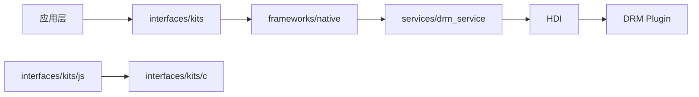

# 目录结构

> 本文档描述 DRM Framework 的代码组织方式，按模块职责分类。

## 顶层目录

```
drm_framework/
├── frameworks/           # 框架层代码
├── interfaces/           # 接口层代码
├── services/            # SA 服务代码
├── sa_profile/          # SA 能力配置
├── BUILD.gn             # 根构建文件
├── bundle.json          # 部件描述文件
├── config.gni           # 构建配置
├── LICENSE
├── README_zh.md
└── figures/             # 架构图资源
```

## frameworks/ - 框架层

### native/drm/ (Native 内部实现)
```
frameworks/native/drm/
├── media_key_system_impl.cpp      # MediaKeySystemImpl 实现
├── key_session_impl.cpp           # MediaKeySessionImpl 实现
└── media_key_system_factory_impl.cpp  # 工厂单例实现
```

**职责**: Native 框架内部实现，对应 Inner API 接口

### js/drm_napi/ (JS N-API 实现)
```
frameworks/js/drm_napi/
├── native_module_ohos_drm.cpp     # 模块注册入口
├── media_key_system_napi.cpp      # MediaKeySystem NAPI
├── key_session_napi.cpp           # MediaKeySession NAPI
├── drm_enum_napi.cpp              # 枚举类型导出
├── media_key_system_callback_napi.cpp  # 系统回调
├── key_session_callback_napi.cpp  # 会话回调
├── napi_param_utils.cpp           # 参数处理工具
├── napi_async_work.cpp            # 异步工作封装
└── napi_err_convertor.cpp        # 错误码转换
```

**职责**: JS/ArkTS API 的 Native 实现层

### c/drm_capi/ (C API 实现)
```
frameworks/c/drm_capi/
├── native_mediakeysystem.cpp      # MediaKeySystem C API
├── native_mediakeysession.cpp     # MediaKeySession C API
└── native_err_convertor.cpp       # 错误码转换
```

**职责**: Native C API 实现，导出 libnative_drm.so

### taihe/ (Taihe 框架)
```
frameworks/taihe/
├── src/
│   ├── media_key_system_taihe.cpp
│   ├── key_session_taihe.cpp
│   ├── media_key_system_callback_taihe.cpp
│   ├── key_session_callback_taihe.cpp
│   ├── ani_constructor.cpp
│   └── drm_taihe_utils.cpp
└── include/
    ├── media_key_system_taihe.h
    ├── key_session_taihe.h
    ├── media_key_system_callback_taihe.h
    ├── key_session_callback_taihe.h
    ├── drm_taihe_utils.h
    ├── drm_error_code_taihe.h
    └── drm_ani_common.h
```

**职责**: Taihe 框架集成

## interfaces/ - 接口层

### inner_api/native/drm/ (内部 Native 接口)
```
interfaces/inner_api/native/drm/
├── media_key_system_impl.h        # MediaKeySystemImpl 定义
├── key_session_impl.h             # MediaKeySessionImpl 定义
└── media_key_system_factory_impl.h # 工厂单例定义
```

**稳定性**: ⚠️ Inner API，仅限系统组件使用

### kits/js/drm_napi/include/ (JS N-API 头文件)
```
interfaces/kits/js/drm_napi/include/
├── native_module_ohos_drm.h       # 模块注册头文件
├── media_key_system_napi.h        # MediaKeySystem 类
├── key_session_napi.h            # MediaKeySession 类
├── media_key_system_callback_napi.h
├── key_session_callback_napi.h
├── drm_enum_napi.h               # 枚举类型
├── common_napi.h
├── drm_error_code_napi.h
└── napi_param_utils.h
```

**稳定性**: ✅ 公开 API，供应用使用

### kits/c/drm_capi/ (C API 头文件)
```
interfaces/kits/c/drm_capi/
├── include/
│   ├── native_mediakeysystem.h    # MediaKeySystem C API
│   └── native_mediakeysession.h   # MediaKeySession C API
└── common/
    ├── native_drm_common.h        # 公共数据结构
    ├── native_drm_err.h          # 错误码定义
    ├── native_drm_base.h         # 基类定义
    └── native_drm_object.h       # 内部对象定义
```

**稳定性**: ✅ 公开 API

## services/ - SA 服务

### drm_service/
```
services/drm_service/
├── server/
│   ├── include/
│   │   ├── mediakeysystemfactory_service.h   # 工厂服务
│   │   ├── mediakeysystem_service.h          # KeySystem 服务
│   │   ├── key_session_service.h             # KeySession 服务
│   │   ├── media_decrypt_module_service.h    # 解密模块
│   │   ├── drm_host_manager.h               # HDI 管理器
│   │   ├── drm_death_recipient.h            # 死亡监听
│   │   └── mediakeysystem_service_stub.h    # Stub 基类
│   └── src/
│       ├── mediakeysystemfactory_service.cpp
│       ├── mediakeysystem_service.cpp
│       ├── key_session_service.cpp
│       ├── media_decrypt_module_service.cpp
│       └── drm_host_manager.cpp
└── idls/                               # IDL 接口定义
    ├── IMediaKeySystemFactoryService.idl
    ├── IMediaKeySystemService.idl
    ├── IMediaKeySessionService.idl
    ├── IMediaDecryptModuleService.idl
    ├── IMediaKeySystemServiceCallback.idl
    ├── IMediaKeySessionServiceCallback.idl
    ├── IDrmListener.idl
    └── DrmTypes.idl
```

**职责**: DRM SA 服务实现 (进程: sandboxed_process3012)

### etc/ (服务配置)
```
services/etc/
├── BUILD.gn
├── resident/drm_service.cfg        # 常驻服务配置
└── lazy_loading/drm_service.cfg    # 懒加载服务配置
```

### utils/ (服务工具)
```
services/utils/
├── include/
│   ├── drm_log.h                  # 日志封装
│   ├── drm_dfx.h                  # DFX 统计
│   ├── drm_dfx_utils.h
│   ├── drm_error_code.h           # 错误码
│   ├── drm_trace.h                # 追踪
│   ├── drm_helper.h               # 工具函数
│   ├── drm_api_operation.h        # API 操作
│   ├── drm_common_utils.h
│   ├── hdi_err_convertor.h        # HDI 错误转换
│   ├── napi_param_utils.h
│   ├── napi_async_work.h
│   ├── drm_net_observer.h         # 网络观察
│   └── drm_service_config.h
└── src/
    ├── drm_log.cpp
    ├── drm_dfx.cpp
    ├── drm_dfx_utils.cpp
    ├── drm_error_code.cpp
    ├── drm_trace.cpp
    ├── drm_helper.cpp
    ├── drm_api_operation.cpp
    ├── drm_common_utils.cpp
    ├── hdi_err_convertor.cpp
    ├── napi_param_utils.cpp
    ├── napi_async_work.cpp
    └── drm_net_observer.cpp
```

## sa_profile/ - SA 能力配置

```
sa_profile/
├── resident/3012.json             # 常驻 SA 配置
└── lazy_loading/3012.json          # 懒加载 SA 配置
```

## 模块依赖关系



## 相关文档

- [项目概述](01_Project_Overview.md) - 模块职责
- [架构设计](05_Architecture.md) - 调用关系
- [JS N-API 参考](03_NAPI_Reference.md) - API 接口
