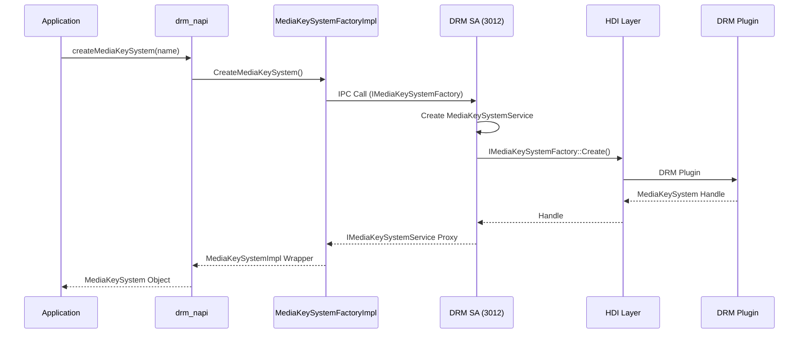

# JS N-API 参考

> 本文档描述 @ohos.multimedia.drm 模块的 JS API 接口。

## 模块概述

| 属性 | 值 |
|------|-----|
| **模块名** | @ohos.multimedia.drm |
| **实现文件** | frameworks/js/drm_napi/ |
| **注册入口** | native_module_ohos_drm.cpp:35-52 |
| **命名空间** | multimedia.drm |

## API 清单

### 命名空间方法 (静态方法)

| 方法 | 签名 | 返回值 | 说明 |
|------|------|--------|------|
| `createMediaKeySystem` | `(name: string): MediaKeySystem` | MediaKeySystem | 创建 DRM 实例 |
| `isMediaKeySystemSupported` | `(name?: string, mimeType?: string, securityLevel?: ContentProtectionLevel): boolean` | boolean | 检查 DRM 支持 |
| `getMediaKeySystems` | `(): Array<{name: string, uuid: string}>` | Array | 获取所有 DRM 系统 |
| `getMediaKeySystemUuid` | `(name: string): string` | string | 获取 DRM UUID |

### MediaKeySystem 实例方法

| 方法 | 签名 | 同步/异步 | 说明 |
|------|------|-----------|------|
| `setConfigurationString` | `(name: string, value: string): void` | 同步 | 设置字符串配置 |
| `getConfigurationString` | `(name: string): string` | 同步 | 获取字符串配置 |
| `setConfigurationByteArray` | `(name: string, value: Uint8Array): void` | 同步 | 设置字节数组配置 |
| `getConfigurationByteArray` | `(name: string): Uint8Array` | 同步 | 获取字节数组配置 |
| `getMaxContentProtectionLevel` | `(): ContentProtectionLevel` | 同步 | 获取最大保护级别 |
| `generateKeySystemRequest` | `(): Promise<ProvisionRequest>` | 异步 | 生成证书请求 |
| `processKeySystemResponse` | `(response: Uint8Array): Promise<void>` | 异步 | 处理证书响应 |
| `createMediaKeySession` | `(level?: ContentProtectionLevel): MediaKeySession` | 同步 | 创建密钥会话 |
| `getStatistics` | `(): Array<{name: string, value: string}>` | 同步 | 获取统计信息 |
| `getCertificateStatus` | `(): CertificateStatus` | 同步 | 获取证书状态 |
| `getOfflineMediaKeyIds` | `(): Uint8Array[]` | 同步 | 获取离线密钥 ID |
| `getOfflineMediaKeyStatus` | `(mediaKeyId: Uint8Array): OfflineMediaKeyStatus` | 同步 | 获取离线密钥状态 |
| `clearOfflineMediaKeys` | `(mediaKeyId: Uint8Array): void` | 同步 | 清除离线密钥 |
| `destroy` | `(): void` | 同步 | 销毁实例 |
| `on` | `(event: string, callback: Function): void` | 同步 | 注册事件监听 |
| `off` | `(event: string): void` | 同步 | 取消事件监听 |

### MediaKeySession 实例方法

| 方法 | 签名 | 同步/异步 | 说明 |
|------|------|-----------|------|
| `generateMediaKeyRequest` | `(mimeType: string, initData: Uint8Array, mediaKeyType: MediaKeyType, optionalData?: object): Promise<MediaKeyRequest>` | 异步 | 生成密钥请求 |
| `processMediaKeyResponse` | `(response: Uint8Array): Promise<Uint8Array>` | 异步 | 处理密钥响应 |
| `generateOfflineReleaseRequest` | `(mediaKeyId: Uint8Array): Promise<Uint8Array>` | 异步 | 生成离线释放请求 |
| `processOfflineReleaseResponse` | `(mediaKeyId: Uint8Array, response: Uint8Array): Promise<void>` | 异步 | 处理离线释放响应 |
| `checkMediaKeyStatus` | `(): Map<string, string>` | 同步 | 检查密钥状态 |
| `restoreOfflineMediaKeys` | `(mediaKeyId: Uint8Array): Promise<void>` | 异步 | 恢复离线密钥 |
| `clearMediaKeys` | `(): void` | 同步 | 清除密钥 |
| `getContentProtectionLevel` | `(): ContentProtectionLevel` | 同步 | 获取保护级别 |
| `requireSecureDecoderModule` | `(mimeType: string): boolean` | 同步 | 是否需要安全解码器 |
| `getDecryptModule` | `(): MediaDecryptModule` | 同步 | 获取解密模块 |
| `destroy` | `(): void` | 同步 | 销毁实例 |
| `on` | `(event: string, callback: Function): void` | 同步 | 注册事件监听 |
| `off` | `(event: string): void` | 同步 | 取消事件监听 |

## 枚举类型

### ContentProtectionLevel

| 值 | 说明 |
|---|------|
| `CONTENT_PROTECTION_LEVEL_UNKNOWN` | 未知级别 |
| `CONTENT_PROTECTION_LEVEL_SW_CRYPTO` | 软件加密 |
| `CONTENT_PROTECTION_LEVEL_HW_CRYPTO` | 硬件加密 |
| `CONTENT_PROTECTION_LEVEL_ENHANCED_HW` | 增强硬件加密 |

### MediaKeyType

| 值 | 说明 |
|---|------|
| `MEDIA_KEY_TYPE_OFFLINE` | 离线密钥 |
| `MEDIA_KEY_TYPE_ONLINE` | 在线密钥 |

### MediaKeyRequestType

| 值 | 说明 |
|---|------|
| `MEDIA_KEY_REQUEST_TYPE_UNKNOWN` | 未知 |
| `MEDIA_KEY_REQUEST_TYPE_INITIAL` | 初始请求 |
| `MEDIA_KEY_REQUEST_TYPE_RENEWAL` | 续期请求 |
| `MEDIA_KEY_REQUEST_TYPE_RELEASE` | 释放请求 |
| `MEDIA_KEY_REQUEST_TYPE_NONE` | 无需请求 |
| `MEDIA_KEY_REQUEST_TYPE_UPDATE` | 更新请求 |

### CertificateStatus

| 值 | 说明 |
|---|------|
| `CERT_STATUS_PROVISIONED` | 已 Provision |
| `CERT_STATUS_NOT_PROVISIONED` | 未 Provision |
| `CERT_STATUS_EXPIRED` | 已过期 |
| `CERT_STATUS_INVALID` | 无效 |

### OfflineMediaKeyStatus

| 值 | 说明 |
|---|------|
| `OFFLINE_MEDIA_KEY_STATUS_UNKNOWN` | 未知 |
| `OFFLINE_MEDIA_KEY_STATUS_USABLE` | 可用 |
| `OFFLINE_MEDIA_KEY_STATUS_INACTIVE` | 未激活 |

### DrmErrorCode

| 值 | 说明 |
|---|------|
| `ERROR_UNKNOWN` | 未知错误 |
| `MAX_SYSTEM_NUM_REACHED` | 达到最大系统数 |
| `MAX_SESSION_NUM_REACHED` | 达到最大会话数 |
| `SERVICE_FATAL_ERROR` | 服务严重错误 |

## 事件类型

### MediaKeySystem 事件

| 事件名 | 说明 |
|--------|------|
| `provisionRequired` | 需要证书 Provision |
| `keysChange` | 密钥状态变化 |
| `vendorDefined` | 厂商自定义事件 |

### MediaKeySession 事件

| 事件名 | 说明 |
|--------|------|
| `keysChange` | 密钥状态变化 |
| `expirationUpdate` | 过期时间更新 |

## API 调用链

## 相关文档

- [C API 参考](04_CAPI_Reference.md) - Native C API
- [架构设计](05_Architecture.md) - 完整调用链
- [安全评审](08_Security_Review.md) - API 安全考量
