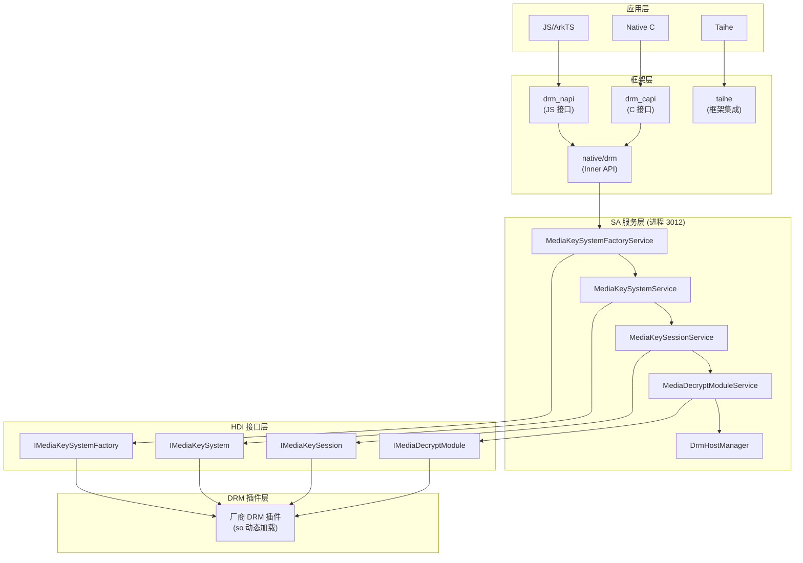
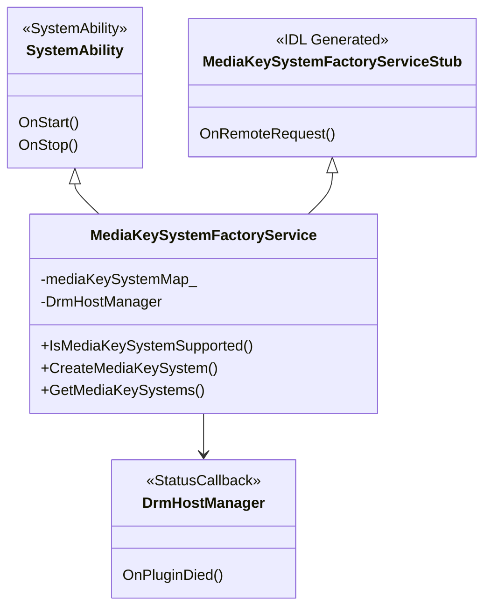
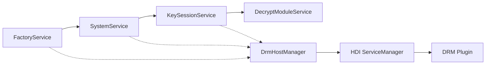
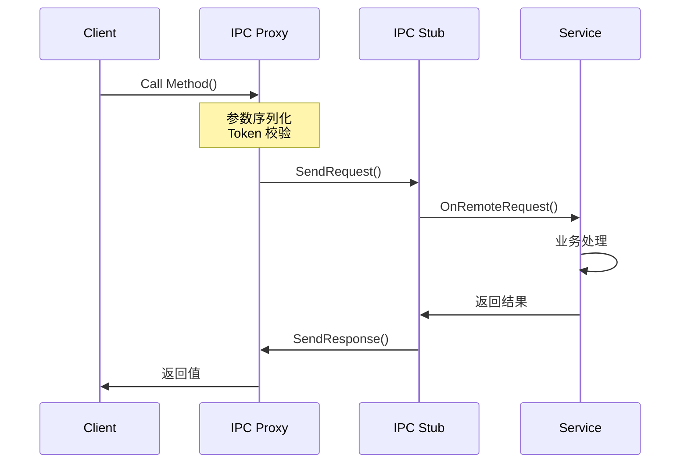
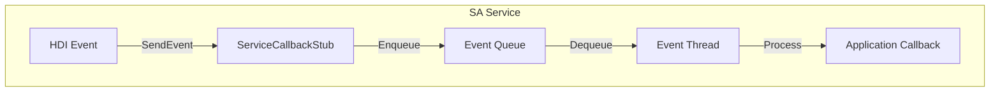
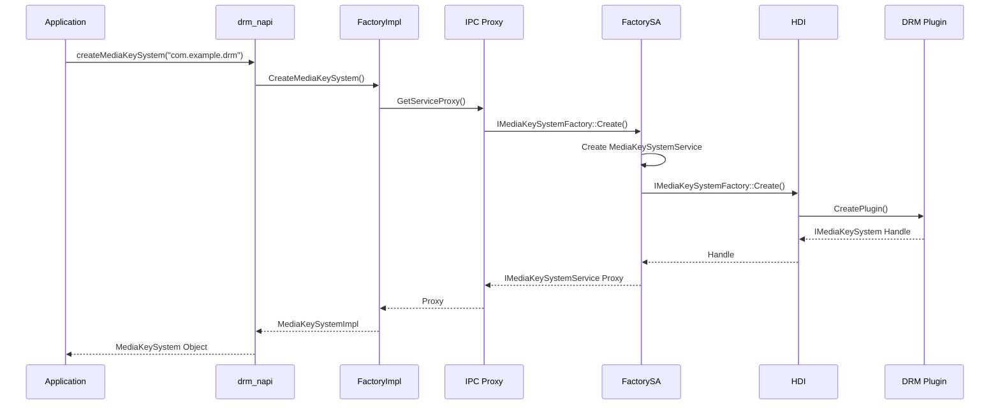

# 架构设计

> 本文档深入分析 DRM Framework 的分层架构、组件关系和调用流程。

## 整体架构

DRM Framework 采用典型的 OpenHarmony 分层架构：

## 分层说明

### 1. 应用层

| 组件 | 说明 |
|------|------|
| JS/ArkTS | 通过 @ohos.multimedia.drm 访问 DRM 功能 |
| Native C | 通过 libnative_drm.so 访问 DRM 功能 |
| Taihe | OpenHarmony 多媒体框架集成 |

### 2. 框架层

**drm_napi** (frameworks/js/drm_napi/)
- 实现 JS N-API 接口
- 参数校验与转换
- 异步操作封装 (Promise/Callback)

**drm_capi** (frameworks/c/drm_capi/)
- 实现 Native C API
- 提供 libnative_drm.so

**native/drm** (frameworks/native/drm/)
- Inner API 实现
- IPC Proxy 封装
- 事件回调处理

### 3. SA 服务层

**服务进程**: sandboxed_process3012

| 服务 | 职责 |
|------|------|
| MediaKeySystemFactoryService | DRM 方案枚举、实例创建 |
| MediaKeySystemService | 密钥系统管理、证书 Provision |
| MediaKeySessionService | 密钥会话管理、许可证处理 |
| MediaDecryptModuleService | 媒体数据解密 |
| DrmHostManager | HDI 服务管理、插件加载 |

### 4. HDI 接口层

定义在 `drivers/interface/drm/v1_0/`

| 接口 | 方法 |
|------|------|
| IMediaKeySystemFactory | CreateMediaKeySystem() |
| IMediaKeySystem | 配置、密钥会话、证书操作 |
| IMediaKeySession | 密钥请求、许可证、解密 |
| IMediaDecryptModule | DecryptMediaData() |

### 5. DRM 插件层

- 厂商实现的 DRM 方案插件
- 通过 HDI 接口被调用
- 负责实际的加密/解密操作

## SA 服务详细架构

### MediaKeySystemFactoryService

### 服务组件关系

## IPC 通信机制

### 接口令牌 (Token)

| 令牌 | 值 | 接口 |
|------|-----|------|
| MEDIA_KEY_SYSTEM_FACTORY_TOKEN | OHOS.DrmStandard.IMediaKeySystemFactoryService | 工厂服务 |
| MEDIA_KEY_SYSTEM_TOKEN | OHOS.DrmStandard.IMediaKeySystemService | 密钥系统服务 |
| MEDIA_KEY_SESSION_TOKEN | OHOS.DrmStandard.IMediaKeySessionService | 密钥会话服务 |
| MEDIA_DECRYPT_MODULE_TOKEN | OHOS.DrmStandard.IMediaDecryptModuleService | 解密模块服务 |

### 调用流程

## 线程模型

### 事件回调线程

每个 Callback 对象维护独立的事件处理线程：

**线程特点**:
- 每个 Client Callback 独立线程
- 100ms 超时等待
- 递归互斥锁保护队列

### 客户端线程

| 操作 | 线程 |
|------|------|
| 同步 API | 调用线程 |
| 异步 API | NAPI 异步工作线程 |
| 事件回调 | 主线程 (ArkTS) |

## 关键时序

### 创建 MediaKeySystem 时序

## 内存管理

### 引用计数

- 使用 `sptr<>` (Strong Pointer) 管理远程对象
- 继承自 `RefBase`
- 服务死亡自动清理

### 资源限制

| 资源 | 限制 | 说明 |
|------|------|------|
| MediaKeySystem 实例 | 64/插件 | 防止资源耗尽 |
| MediaKeySession 实例 | 受限 | 按需创建 |

## 相关文档

- [项目概述](01_Project_Overview.md) - 模块职责
- [目录结构](02_Directory_Structure.md) - 代码布局
- [JS N-API 参考](03_NAPI_Reference.md) - API 接口
- [安全评审](08_Security_Review.md) - 安全考量
