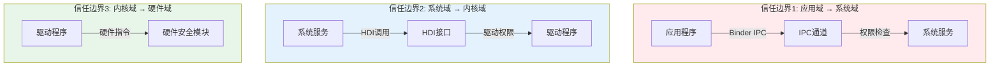

# 05 攻击面分析

## 目的与适用范围

本文档面向**安全研究员**，系统识别 OpenHarmony DRM 框架的所有外部输入入口、敏感操作和信任边界，帮助快速定位潜在攻击向量。

## 关键结论

| 攻击面类型 | 风险等级 | 数量 | 说明 |
|------------|----------|------|------|
| 外部输入 | 高 | 8类 | JS参数、IPC数据、HTTP响应、文件等 |
| 敏感操作 | 高 | 6类 | 解密、密钥管理、证书Provision等 |
| 信任边界跨越 | 中 | 3层 | 应用→服务→HDI→硬件 |

## 外部输入清单

### 1. JS N-API 参数输入

**攻击向量**: 应用通过 JS API 传入恶意构造的参数

| API | 参数类型 | 风险点 | 代码位置 |
|-----|----------|--------|----------|
| `createMediaKeySystem(name)` | string | 字符串长度、格式 | `media_key_system_napi.cpp:130` |
| `isMediaKeySystemSupported(name, mimeType, level)` | string×2, enum | 空指针、长度 | `media_key_system_napi.cpp:182` |
| `setConfigurationString(name, value)` | string×2 | 配置名注入 | `media_key_system_napi.cpp:386` |
| `setConfigurationByteArray(name, value)` | string, Uint8Array | 二进制数据长度 | `media_key_system_napi.cpp:483` |
| `generateMediaKeyRequest(mimeType, initData, type, options)` | string, Uint8Array, enum, Array | PSSH数据、选项注入 | `key_session_napi.cpp:238` |
| `processMediaKeyResponse(response)` | Uint8Array | 许可证响应数据 | `key_session_napi.cpp:287` |
| `processKeySystemResponse(response)` | Uint8Array | 证书响应数据 | `media_key_system_napi.cpp:679` |

**风险分析**:
```cpp
// 风险位置: media_key_system_napi.cpp:144
NAPI_CHECK_ARGS(keySystemNameParam == nullptr || 
    !NapiParamUtils::GetValueString(env, keySystemNameParam, name), 
    DRM_INVALID_PARAM, DRM_ERR_INVALID_VAL);
// 检查点: 空指针检查，但字符串内容未验证格式
```

### 2. C API 参数输入

**攻击向量**: Native 应用通过 C API 传入恶意参数

| API | 参数类型 | 风险点 | 代码位置 |
|-----|----------|--------|----------|
| `OH_MediaKeySystem_Create(name, **system)` | char* | 字符串长度、编码 | `native_mediakeysystem.cpp:130` |
| `OH_MediaKeySystem_SetConfigurationString(name, value)` | char*×2 | 配置注入 | `native_mediakeysystem.cpp:176` |
| `OH_MediaKeySystem_SetConfigurationByteArray(name, value, len)` | char*, uint8_t*, int32_t | 长度越界 | `native_mediakeysystem.cpp:230` |
| `OH_MediaKeySession_GenerateMediaKeyRequest(info, request)` | struct* | 结构体数据 | `native_mediakeysession.cpp:61` |
| `OH_MediaKeySession_ProcessMediaKeyResponse(response, len)` | uint8_t*, int32_t | 响应数据长度 | `native_mediakeysession.cpp:92` |

**安全校验代码**:
```cpp
// 位置: native_mediakeysystem.cpp:141
DRM_CHECK_AND_RETURN_RET_LOG(
    ((name != nullptr) && (mediaKeySystem != nullptr)), 
    DRM_ERR_INVALID_VAL, 
    "parameter is error!"
);
DRM_CHECK_AND_RETURN_RET_LOG(
    nameStr.size() != 0, 
    DRM_ERR_INVALID_VAL, 
    "the size of nameStr is zero"
);
```

### 3. IPC 数据输入

**攻击向量**: 通过 Binder IPC 发送恶意构造的数据包

| 接口 | 方法 | 风险数据 | 代码位置 |
|------|------|----------|----------|
| IMediaKeySystemFactoryService | CreateMediaKeySystem(name) | 字符串 | `IMediaKeySystemFactoryService.idl:27` |
| IMediaKeySystemService | ProcessKeySystemResponse(response) | byte[] | `IMediaKeySystemService.idl:23` |
| IMediaKeySystemService | SetConfigurationString(name, value) | string×2 | `IMediaKeySystemService.idl:24` |
| IMediaKeySessionService | ProcessMediaKeyResponse(licenseId, response) | byte[][] | `IMediaKeySessionService.idl:26` |
| IMediaKeySessionService | GenerateMediaKeyRequest(info) | struct | `IMediaKeySessionService.idl:25` |

**IPC 校验**:
```cpp
// 位置: mediakeysystem_service.cpp:157-173
if (configName == "bundleName" || configName == "apiTargetVersion") {
    DRM_ERR_LOG("SetConfigurationString prohibited");
    return DRM_ERR_OPERATION_NOT_PERMITTED;
}
```

### 4. HTTP 网络响应

**攻击向量**: 中间人攻击或恶意服务器返回构造的响应

| 场景 | 请求类型 | 响应数据风险 | 代码位置 |
|------|----------|--------------|----------|
| 证书Provision | HTTP POST | 证书响应伪造 | `mediakeysystem_service.cpp:206` |
| 许可证申请 | HTTP POST | 许可证响应伪造 | `key_session_service.cpp:187` |

**注意**: HTTP/HTTPS 通信由应用层实现，框架只提供请求数据，不直接处理网络通信。

### 5. 配置文件

**攻击向量**: 配置文件被篡改

| 文件 | 路径 | 内容风险 | 代码位置 |
|------|------|----------|----------|
| drm_api_operation.cfg | /system/etc/drm/ | 操作权限配置 | `drm_api_operation.cpp:39` |
| drm_plugin_lazyloding.cfg | /system/etc/drm/ | 插件加载配置 | `services/drm_service/BUILD.gn:112` |
| drm_service.cfg | /system/etc/ | 服务启动配置 | `services/etc/resident/` |

**文件读取代码**:
```cpp
// 位置: drm_api_operation.cpp:39-58
bool ConfigParser::LoadConfigurationFile(const std::string &configFile) {
    std::ifstream file(configFile);
    if (!file.is_open()) {
        return false;
    }
    // 读取并解析配置...
}
```

### 6. HDI 回调数据

**攻击向量**: 恶意 DRM 插件通过 HDI 回调注入数据

| 回调 | 数据类型 | 风险 | 代码位置 |
|------|----------|------|----------|
| SendEvent(eventType, extra, data) | enum, int32, byte[] | 事件伪造 | `mediakeysystem_service.cpp:345` |
| SendEventKeyChanged(keyStatus, hasNewGoodLicense) | map, bool | 密钥状态伪造 | `key_session_service.cpp:298` |

### 7. 环境变量

**攻击向量**: 通过环境变量影响框架行为

**分析结果**: 未发现使用 getenv() 读取环境变量的代码。

### 8. 回调函数指针

**攻击向量**: 传入恶意回调函数

| 回调类型 | 设置方式 | 风险 | 代码位置 |
|----------|----------|------|----------|
| MediaKeySystem_Callback | OH_MediaKeySystem_SetCallback() | 函数指针劫持 | `native_drm_object.h:52` |
| MediaKeySession_Callback | OH_MediaKeySession_SetCallback() | 函数指针劫持 | `native_drm_object.h:143` |

**防护措施**: 回调函数仅在事件发生时被调用，不直接处理输入数据。

## 敏感操作清单

### 1. 媒体数据解密

| 操作 | API | 风险 | 代码位置 |
|------|-----|------|----------|
| 解密数据包 | DecryptMediaData() | 密钥泄露、数据篡改 | `media_decrypt_module_service.cpp:45` |

**数据流**:
```
加密数据 → HDI → 安全环境(TEE) → 解密数据
```

### 2. 密钥管理

| 操作 | API | 风险 | 代码位置 |
|------|-----|------|----------|
| 加载密钥 | ProcessMediaKeyResponse() | 密钥注入 | `key_session_service.cpp:187` |
| 导出密钥 | GenerateOfflineReleaseRequest() | 密钥泄露 | `key_session_service.cpp:156` |
| 清除密钥 | ClearMediaKeys() | 拒绝服务 | `key_session_service.cpp:201` |

### 3. 证书管理

| 操作 | API | 风险 | 代码位置 |
|------|-----|------|----------|
| 生成证书请求 | GenerateKeySystemRequest() | 请求伪造 | `mediakeysystem_service.cpp:206` |
| 处理证书响应 | ProcessKeySystemResponse() | 证书注入 | `mediakeysystem_service.cpp:237` |

### 4. 配置管理

| 操作 | API | 风险 | 代码位置 |
|------|-----|------|----------|
| 设置配置 | SetConfigurationString() | 配置注入 | `mediakeysystem_service.cpp:140` |
| 获取统计 | GetStatistics() | 信息泄露 | `mediakeysystem_service.cpp:314` |

### 5. 实例创建

| 操作 | API | 风险 | 代码位置 |
|------|-----|------|----------|
| 创建 KeySystem | CreateMediaKeySystem() | 资源耗尽 | `mediakeysystemfactory_service.cpp:194` |
| 创建 Session | CreateMediaKeySession() | 资源耗尽 | `mediakeysystem_service.cpp:280` |

**资源限制**:
```cpp
// 位置: mediakeysystemfactory_service.cpp:256-259
if (currentMediaKeySystemNum_[name] >= MEDIA_KEY_SYSTEM_MAX_NUM) {
    return DRM_ERR_MAX_SYSTEM_NUM_REACHED;
}
```

### 6. 网络操作

| 操作 | API | 风险 | 代码位置 |
|------|-----|------|----------|
| 网络监听 | RegisterNetConnCallback() | 监听劫持 | `drm_net_observer.cpp:54` |
| 证书下载触发 | OnNetAvailable() | 中间人攻击 | `drm_net_observer.cpp:119` |

## 信任边界图



### 信任边界详细说明

| 边界 | 跨越机制 | 安全控制 | 风险等级 |
|------|----------|----------|----------|
| 应用→服务 | Binder IPC | 调用者PID检查 | 高 |
| 服务→HDI | HDI接口 | 进程权限 | 中 |
| HDI→插件 | 驱动加载 | 插件签名 | 中 |
| 插件→硬件 | 硬件指令 | 硬件保护 | 低 |

## 攻击向量汇总

### 高优先级攻击向量

1. **JS/C API 参数注入**
   - 目标: 应用层接口
   - 方法: 传入超长字符串、特殊字符、负数长度等
   - 影响: 缓冲区溢出、拒绝服务

2. **IPC 数据包伪造**
   - 目标: Binder 通信
   - 方法: 构造恶意 IPC 数据包
   - 影响: 权限绕过、数据泄露

3. **许可证响应篡改**
   - 目标: HTTP 通信
   - 方法: 中间人攻击
   - 影响: 密钥注入、未授权解密

4. **资源耗尽攻击**
   - 目标: 实例创建接口
   - 方法: 大量创建 KeySystem/Session
   - 影响: 拒绝服务

### 中优先级攻击向量

5. **配置文件篡改**
   - 目标: /system/etc/drm/*.cfg
   - 方法: 需要 root 权限修改
   - 影响: 服务行为改变

6. **HDI 回调伪造**
   - 目标: 恶意 DRM 插件
   - 方法: 构造虚假事件
   - 影响: 应用行为误导

7. **网络监听劫持**
   - 目标: 网络状态监听
   - 方法: 伪造网络状态
   - 影响: Provision 流程异常

## 防御机制现状

| 防御层 | 机制 | 状态 |
|--------|------|------|
| 输入验证 | 空指针检查 | ✅ 完整 |
| 输入验证 | 长度检查 | ✅ 完整 |
| 输入验证 | 范围检查 | ✅ 完整 |
| 内存安全 | 安全函数(memcpy_s) | ✅ 使用 |
| 内存安全 | Sanitize | ✅ 开启 |
| 权限控制 | PID检查 | ⚠️ 基础 |
| 权限控制 | AccessToken | ❌ 未找到 |
| 网络安全 | HTTPS | ⚠️ 应用层控制 |

## 相关链接

- [06_SecurityReview.md](06_SecurityReview.md) - 安全风险评估详细分析
- [02_Architecture.md](02_Architecture.md) - 架构设计与信任边界
- [04_Interface.md](04_Interface.md) - 接口文档
- [SUMMARY.md](SUMMARY.md) - 文档导航

---

*本文档基于代码审计生成，引用代码位置: `frameworks/js/drm_napi/media_key_system_napi.cpp`, `frameworks/c/drm_capi/native_mediakeysystem.cpp`, `services/drm_service/server/src/mediakeysystemfactory_service.cpp`*
