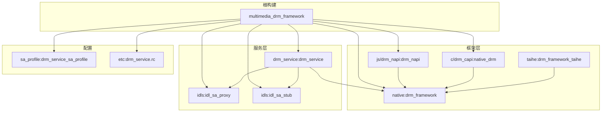

# GN Targets

> 本文档描述 DRM Framework 的构建目标及其依赖关系。

## 根构建文件

**文件**: `BUILD.gn`

```python
import("//build/ohos.gni")

group("multimedia_drm_framework") {
  deps = [
    "./frameworks/native:drm_framework",
    "./interfaces/kits/c/drm_capi:native_drm",
    "./interfaces/kits/js/drm_napi:drm_napi",
    "./services/drm_service:drm_service",
    "./services/drm_service/idls:idl_sa_proxy",
    "./services/drm_service/idls:idl_sa_stub",
  ]
}
```

## 框架层 Targets

### frameworks/native:drm_framework

**类型**: source_set
**输出**: 静态库 (ar 格式)

```python
# frameworks/native/BUILD.gn
ohos_source_set("drm_framework") {
  sources = [
    "drm/media_key_system_impl.cpp",
    "drm/key_session_impl.cpp",
    "drm/media_key_system_factory_impl.cpp",
  ]
  
  include_dirs = [
    ".",
    "utils/include",
    "interfaces/inner_api/native/drm",
  ]
  
  deps = [
    "//drivers/interface/drm/v1_0:hdidrm",
    "//foundation/systemabilitymgr/safwk:native",
    "//kernel/linux/linux_5_10/extensions/framebuffer_native_window:utils",
    "//third_party/bounds_checking_function:security_frame_param_check",
  ]
  
  public_deps = [
    "//foundation/multimedia/drm_framework/interfaces/inner_api/native/drm:drm_framework",
  ]
}
```

### frameworks/js/drm_napi:drm_napi

**类型**: shared_library
**输出**: libdrm_napi.z.so

```python
# interfaces/kits/js/drm_napi/BUILD.gn
ohos_shared_library("drm_napi") {
  sources = [
    "native_module_ohos_drm.cpp",
    "media_key_system_napi.cpp",
    "key_session_napi.cpp",
    "drm_enum_napi.cpp",
    "media_key_system_callback_napi.cpp",
    "key_session_callback_napi.cpp",
    "napi_param_utils.cpp",
    "napi_async_work.cpp",
    "napi_err_convertor.cpp",
  ]
  
  include_dirs = [
    "include",
    "../../../services/utils/include",
    "../../../frameworks/native/drm",
    "../../../interfaces/inner_api/native/drm",
  ]
  
  deps = [
    ":drm_napi_internal_headers",
    "//foundation/multimedia/drm_framework/frameworks/native:drm_framework",
    "//foundation/multimedia/drm_framework/interfaces/kits/c/drm_capi:native_drm",
    "//third_party/bounds_checking_function:security_frame_param_check",
  ]
  
  external_deps = [
    "hilog:hilog",
    "napi:native_common",
    "napi:native_node",
  ]
}
```

### frameworks/c/drm_capi:native_drm

**类型**: shared_library
**输出**: libnative_drm.so

```python
# interfaces/kits/c/drm_capi/BUILD.gn
ohos_shared_library("native_drm") {
  sources = [
    "native_mediakeysystem.cpp",
    "native_mediakeysession.cpp",
    "native_err_convertor.cpp",
  ]
  
  include_dirs = [
    "common",
    "include",
    "../../../services/utils/include",
    "../../../frameworks/native/drm",
  ]
  
  deps = [
    "//foundation/multimedia/drm_framework/frameworks/native:drm_framework",
    "//third_party/bounds_checking_function:security_frame_param_check",
  ]
  
  defines = [ "DRM_CAPI_IMPL" ]
}
```

### frameworks/taihe:drm_framework_taihe

**类型**: shared_library
**输出**: libdrm_framework_taihe.z.so

```python
# frameworks/taihe/BUILD.gn
ohos_shared_library("drm_framework_taihe") {
  sources = [
    "src/media_key_system_taihe.cpp",
    "src/key_session_taihe.cpp",
    "src/media_key_system_callback_taihe.cpp",
    "src/key_session_callback_taihe.cpp",
    "src/ani_constructor.cpp",
    "src/drm_taihe_utils.cpp",
  ]
  
  include_dirs = [ "include" ]
  
  deps = [
    "//foundation/multimedia/drm_framework/interfaces/inner_api/native/drm:drm_taihe",
    "//third_party/bounds_checking_function:security_frame_param_check",
  ]
}
```

## 服务层 Targets

### services/drm_service:drm_service

**类型**: executable
**输出**: drm_service

```python
# services/drm_service/BUILD.gn
ohos_executable("drm_service") {
  sources = [
    "server/src/mediakeysystemfactory_service.cpp",
    "server/src/mediakeysystem_service.cpp",
    "server/src/key_session_service.cpp",
    "server/src/media_decrypt_module_service.cpp",
    "server/src/drm_host_manager.cpp",
  ]
  
  include_dirs = [
    "server/include",
    "../utils/include",
    "../../../frameworks/native/drm",
  ]
  
  deps = [
    ":drm_service_inner_kits",
    ":idl_sa_stub",
    "//drivers/interface/drm/v1_0:hdidrm",
    "//drivers/interface/drm/v1_0:hdidrmproxy",
    "//foundation/systemabilitymgr/safwk:native",
    "//foundation/systemabilitymgr/samgr/interfaces/innerkits/samgr_proxy:samgr_proxy",
    "//foundation/systemabilitymgr/samgr/interfaces/innerkits/samgr_proxy:samgr_proxy_client",
    "//third_party/bounds_checking_function:security_frame_param_check",
  ]
  
  external_deps = [
    "hilog:static_templates",
  ]
}
```

### services/drm_service/idls:idl_sa_proxy

**类型**: source_set
**输出**: IDL 生成的 Proxy 代码

```python
# services/drm_service/idls/BUILD.gn
idl_library("idl_sa_proxy") {
  idl_options = [
    "--c++",
    "--proxy",
    "--out_dir",
    rebase_path("."),
    "--dep_libs",
    "//drivers/interface/drm/v1_0:idldl",
  ]
  
  sources = [
    "IMediaKeySystemFactoryService.idl",
    "IMediaKeySystemService.idl",
    "IMediaKeySessionService.idl",
    "IMediaDecryptModuleService.idl",
    "IMediaKeySystemServiceCallback.idl",
    "IMediaKeySessionServiceCallback.idl",
    "IDrmListener.idl",
    "DrmTypes.idl",
  ]
}
```

### services/drm_service/idls:idl_sa_stub

**类型**: source_set
**输出**: IDL 生成的 Stub 代码

```python
idl_library("idl_sa_stub") {
  idl_options = [
    "--c++",
    "--stub",
    "--out_dir",
    rebase_path("."),
    "--dep_libs",
    "//drivers/interface/drm/v1_0:idldl",
  ]
  
  sources = [ 复用同上 ]  # 复用 idl_sa_proxy 的 sources
}
```

## 配置文件 Targets

### sa_profile:drm_service_sa_profile

**类型**: dsoftbus_capability
**输出**: SA 能力配置文件

```python
# sa_profile/BUILD.gn
dsoftbus_capability("drm_service_sa_profile") {
  srcs = [
    "resident/3012.json",
    "lazy_loading/3012.json",
  ]
  capability = "drm_service"
}
```

### services/etc:drm_service.rc

**类型**: etc
**输出**: 服务配置文件

```python
# services/etc/BUILD.gn
etc("drm_service.rc") {
  sources = [
    "resident/drm_service.cfg",
    "lazy_loading/drm_service.cfg",
  ]
}
```

## Inner API Targets

### interfaces/inner_api/native/drm:drm_framework

**类型**: headers
**输出**: Inner API 头文件

```python
ohos_headers("drm_framework") {
  sources = [
    "media_key_system_impl.h",
    "key_session_impl.h",
    "media_key_system_factory_impl.h",
  ]
  
  visibility = [
    "//foundation/multimedia/drm_framework/...",
  ]
}
```

### interfaces/inner_api/native/drm:drm_taihe

**类型**: headers
**输出**: Taihe Inner API 头文件

```python
ohos_headers("drm_taihe") {
  sources = [
    "key_session_taihe.h",
  ]
  
  visibility = [
    "//foundation/multimedia/drm_framework/...",
  ]
}
```

## 依赖关系图



## 相关文档

- [编译产物](07_Build_Artifacts.md) - 产物说明
- [架构设计](05_Architecture.md) - 组件关系
- [安全评审](08_Security_Review.md) - 构建安全
