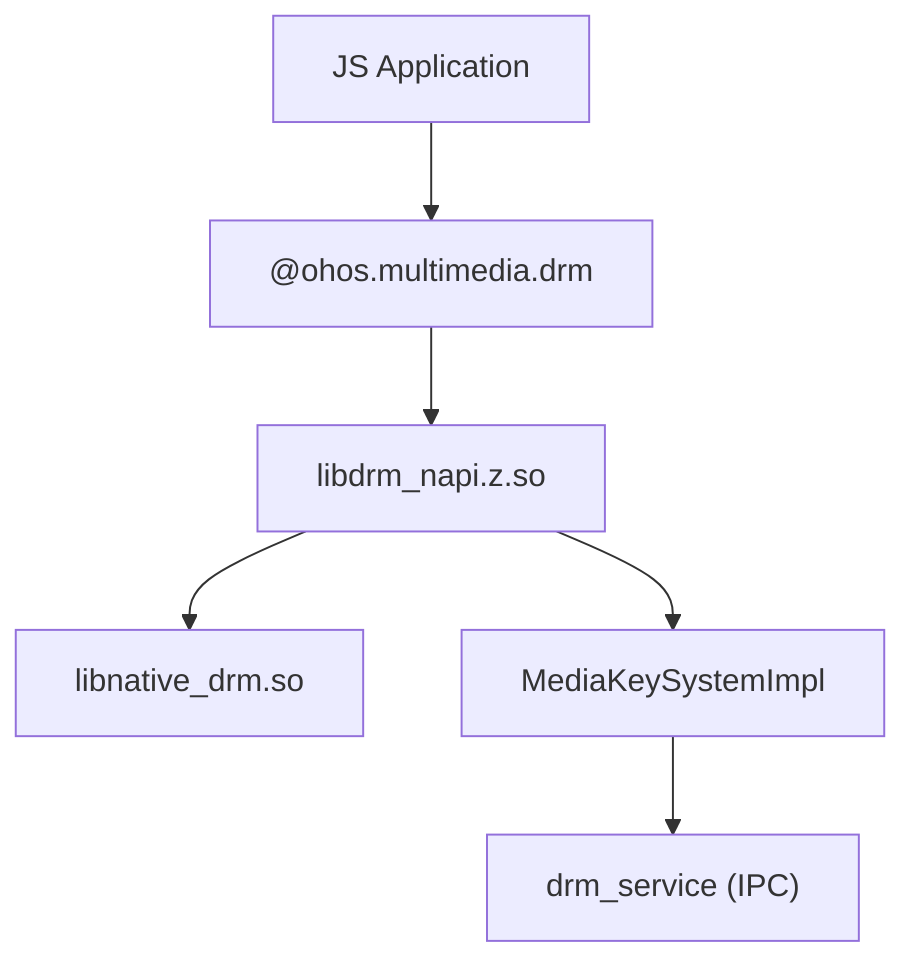
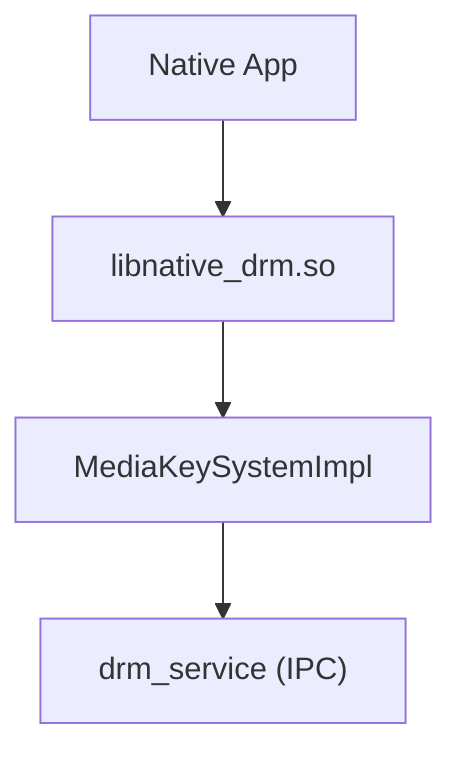
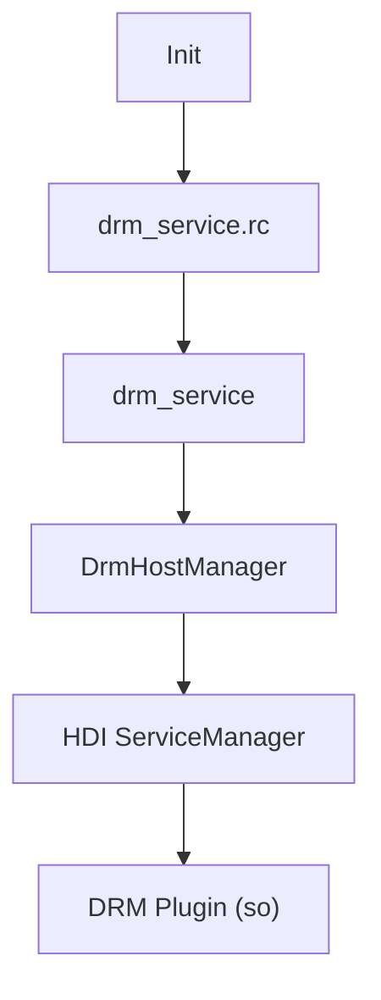

# 编译产物

> 本文档描述 DRM Framework 的编译产物、安装路径和运行时加载关系。

## 产物清单

### 动态库 (.so)

| 产物 | 路径 | 说明 |
|------|------|------|
| libdrm_napi.z.so | system/lib64/ohos.package/ | JS NAPI 实现 |
| libnative_drm.so | system/lib64/ | Native C API |
| libdrm_framework_taihe.z.so | system/lib64/ohos.package/ | Taihe 框架集成 |

### 可执行文件

| 产物 | 路径 | 说明 |
|------|------|------|
| drm_service | system/bin/ | DRM 系统能力服务 |

### 配置文件

| 产物 | 路径 | 说明 |
|------|------|------|
| drm_service.cfg | system/etc/drm/ | 服务配置 |
| drm_service.rc | system/etc/init/ | 启动配置 |

### SA 能力配置

| 产物 | 路径 | 说明 |
|------|------|------|
| 3012.json | system/profile/drm/ | SA 能力描述 |

## 安装路径

### 系统库

```
/system/lib64/
├── libnative_drm.so           # Native C API
└── ohos.package/
    ├── libdrm_napi.z.so      # JS NAPI
    └── libdrm_framework_taihe.z.so  # Taihe
```

### 系统服务

```
/system/bin/
└── drm_service               # DRM SA 进程
```

### 系统配置

```
/system/etc/
├── drm/
│   └── drm_service.cfg        # 服务权限配置
└── init/
    └── drm_service.rc        # 启动配置
```

### SA 能力配置

```
/system/profile/drm/
├── 3012.json                 # SA ID 3012 能力配置
└── lazy_loading/3012.json   # 懒加载配置
```

## 运行时加载关系

### JS 应用加载链



### Native C 应用加载链



### 服务启动链



## 产物与源码映射

| 产物 | BUILD.gn Target | 源文件 |
|------|-----------------|--------|
| libdrm_napi.z.so | interfaces/kits/js/drm_napi:drm_napi | frameworks/js/drm_napi/*.cpp |
| libnative_drm.so | interfaces/kits/c/drm_capi:native_drm | frameworks/c/drm_capi/*.cpp |
| libdrm_framework_taihe.z.so | frameworks/taihe:drm_framework_taihe | frameworks/taihe/src/*.cpp |
| drm_service | services/drm_service:drm_service | services/drm_service/server/src/*.cpp |
| IDL Proxy/Stub | services/drm_service/idls | services/drm_service/idls/*.idl |

## 运行时依赖

### DRM Service 依赖

```
drm_service
├── libhdi_drm.so              # HDI 接口实现
├── libsamgr_proxy.so          # SA Framework
├── libhilog.so                # 日志
└── libhitrace.so              # 追踪
```

### 动态库依赖

```
libdrm_napi.z.so
├── libnapi_native.so          # N-API 框架
├── libnative_drm.so           # C API
└── libhilog.so                # 日志

libnative_drm.so
├── libhdi_drm.so              # HDI 接口
└── libhilog.so                # 日志
```

## 调试信息

### 服务状态查看

```bash
# 查看 DRM 服务状态
hidumper -s 3012

# 查看服务注册信息
hidumper -sa
```

### 日志查看

```bash
# DRM 日志 (hilog)
hilog | grep -i drm

# DRM 追踪
hitrace --drm
```

## 相关文档

- [GN Targets](06_GN_Targets.md) - 构建目标
- [架构设计](05_Architecture.md) - 调用关系
- [安全评审](08_Security_Review.md) - 安全考量
