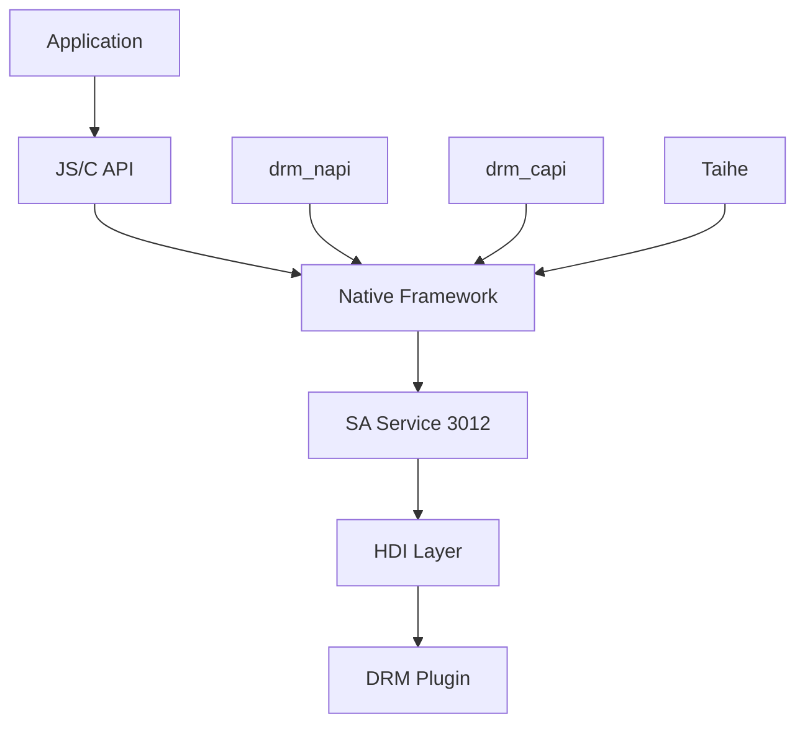

# DRM Framework 概览

> 预计阅读时间: 5 分钟

## 什么是 DRM Framework

DRM (Digital Rights Management) 框架是 OpenHarmony 多媒体子系统的核心安全组件，提供数字版权管理能力，保护音视频内容的版权。

## 核心能力

| 能力 | 描述 | 相关模块 |
|------|------|----------|
| **证书管理** | DRM 证书 Provision(下载)、更新、状态查询 | MediaKeySystem |
| **许可证管理** | 许可证请求/响应、离线许可证管理 | MediaKeySession |
| **内容授权** | 根据许可证对 DRM 节目进行授权 | MediaKeySession |
| **内容解密** | 对 DRM 加密媒体进行解密播放 | MediaDecryptModule |

## 架构简图



## 关键概念

### MediaKeySystem
- DRM 密钥系统的抽象表示
- 管理证书 Provision、配置属性、离线密钥
- 每个 DRM 方案对应一个 MediaKeySystem 实例

### MediaKeySession
- 密钥会话的抽象表示
- 处理许可证请求/响应、密钥状态
- 关联具体的媒体解密操作

### ContentProtectionLevel
| 级别 | 说明 | 适用场景 |
|------|------|----------|
| SW_CRYPTO | 软件加密 | 普通版权内容 |
| HW_CRYPTO | 硬件加密 | 高清版权内容 |
| ENHANCED_HW | 增强硬件加密 | 4K/HDR 等高安全内容 |

## 快速开始

```js
import drm from '@ohos.multimedia.drm';

// 1. 检查 DRM 支持
const isSupported = drm.isMediaKeySystemSupported('com.clearplay.drm');

// 2. 创建 MediaKeySystem
const keySystem = drm.createMediaKeySystem('com.clearplay.drm');

// 3. 创建密钥会话
const keySession = keySystem.createMediaKeySession(
    drm.ContentProtectionLevel.CONTENT_PROTECTION_LEVEL_SW_CRYPTO
);

// 4. 处理许可证
const request = await keySession.generateMediaKeyRequest('video/avc', initData, 1);
const response = await fetchLicenseServer(request.defaultUrl, request.data);
await keySession.processMediaKeyResponse(response);

// 5. 获取解密模块用于播放
const decryptModule = await keySession.getDecryptModule();
```

## 相关文档

- [项目概述](01_Project_Overview.md) - 详细功能说明
- [JS N-API 参考](03_NAPI_Reference.md) - API 完整清单
- [架构设计](05_Architecture.md) - 深入架构分析
