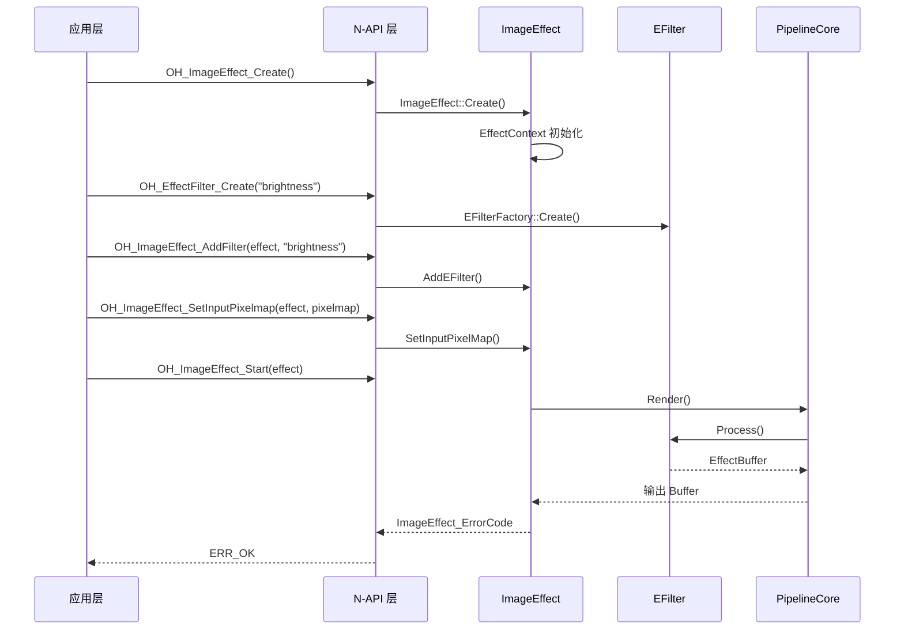
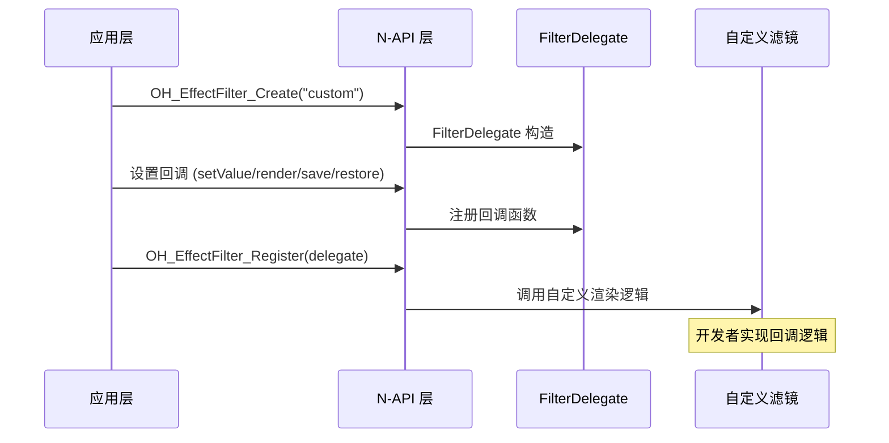

# N-API 接口参考

## 概述

ImageEffect 模块通过 OpenHarmony Native API（N-API）向应用层提供 C 语言接口。所有 API 函数以 `OH_` 前缀命名，使用 `EFFECT_EXPORT` 宏导出，符号可见性为 default。

**导出宏定义**：`frameworks/native/capi/native_common_utils.h:29`

```cpp
#define EFFECT_EXPORT __attribute__((visibility("default")))
```

## ImageEffect 主接口

### API 清单

| JS API 名称 | C API 函数 | 参数 | 返回值 | 同步/异步 | C++ 实现位置 |
|-------------|-----------|------|--------|-----------|--------------|
| create | `OH_ImageEffect_Create` | 无 | OH_ImageEffect* | 同步 | image_effect.cpp:367 |
| addFilter | `OH_ImageEffect_AddFilter` | OH_ImageEffect*, const char* | ImageEffect_ErrorCode | 同步 | image_effect.cpp:65 |
| setInputPixelmap | `OH_ImageEffect_SetInputPixelmap` | OH_ImageEffect*, OH_PixelmapNative* | ImageEffect_ErrorCode | 同步 | image_effect.cpp:367 |
| setInputNativeBuffer | `OH_ImageEffect_SetInputNativeBuffer` | OH_ImageEffect*, NativeBuffer* | ImageEffect_ErrorCode | 同步 | image_effect.cpp:407 |
| setInputUri | `OH_ImageEffect_SetInputUri` | OH_ImageEffect*, const char* | ImageEffect_ErrorCode | 同步 | image_effect.cpp:450 |
| setInputTexture | `OH_ImageEffect_SetInputTexture` | OH_ImageEffect*, TextureInfo | ImageEffect_ErrorCode | 同步 | image_effect.cpp:551 |
| start | `OH_ImageEffect_Start` | OH_ImageEffect* | ImageEffect_ErrorCode | 同步 | image_effect.cpp:374 |
| stop | `OH_ImageEffect_Stop` | OH_ImageEffect* | ImageEffect_ErrorCode | 同步 | - |
| release | `OH_ImageEffect_Release` | OH_ImageEffect** | ImageEffect_ErrorCode | 同步 | image_effect.cpp:396 |

### 关键 API 详解

#### OH_ImageEffect_Create

**功能**：创建 ImageEffect 实例。

**C 签名**：
```c
OH_ImageEffect* OH_ImageEffect_Create(void);
```

**返回值**：
- 成功：有效的 OH_ImageEffect* 指针
- 失败：nullptr

**参数校验**：无参数。

**错误码**：
- `ERR_OK`：成功
- `ERR_CREATE_FAILED`：创建失败

**调用链**：
```
JS层 → OH_ImageEffect_Create() 
    → ImageEffect::Create()
    → EffectContext 初始化
```

**证据**：`interfaces/kits/native/image_effect.h:66`

#### OH_ImageEffect_AddFilter

**功能**：添加滤镜到效果链。

**C 签名**：
```c
ImageEffect_ErrorCode OH_ImageEffect_AddFilter(OH_ImageEffect* effect, const char* filterName);
```

**参数**：
| 参数 | 类型 | 说明 | 校验 |
|------|------|------|------|
| effect | OH_ImageEffect* | ImageEffect 实例 | 非空检查 |
| filterName | const char* | 滤镜名称字符串 | 非空、长度≤1024 |

**返回值**：ImageEffect_ErrorCode

**错误码**：
| 错误码 | 说明 |
|--------|------|
| ERR_OK | 成功 |
| ERR_INPUT_NULL | 输入参数为空 |
| ERR_FILTER_NOT_FOUND | 滤镜不存在 |
| ERR_TOO_MANY_FILTERS | 超过最大滤镜数量（100） |

**参数校验证据**：`frameworks/native/capi/image_effect.cpp:65`（CHECK_AND_RETURN_RET_LOG）

#### OH_ImageEffect_SetInputPixelmap

**功能**：设置输入 PixelMap 图像。

**C 签名**：
```c
ImageEffect_ErrorCode OH_ImageEffect_SetInputPixelmap(
    OH_ImageEffect* effect, 
    OH_PixelmapNative* pixelmap
);
```

**参数**：
| 参数 | 类型 | 说明 | 校验 |
|------|------|------|------|
| effect | OH_ImageEffect* | ImageEffect 实例 | 非空检查 |
| pixelmap | OH_PixelmapNative* | PixelMap 对象 | 非空检查 |

**类型转换**：
```
OH_PixelmapNative → PixelMap
    → NativeCommonUtils::GetPixelMapFromOHPixelmap()
```

**证据**：`frameworks/native/capi/image_effect.cpp:367`

#### OH_ImageEffect_Start

**功能**：启动效果处理流水线。

**C 签名**：
```c
ImageEffect_ErrorCode OH_ImageEffect_Start(OH_ImageEffect* effect);
```

**处理流程**：
1. 初始化渲染环境
2. 执行滤镜链处理
3. 输出处理结果

**证据**：`interfaces/kits/native/image_effect.h:374`

#### OH_ImageEffect_Release

**功能**：释放 ImageEffect 实例。

**C 签名**：
```c
ImageEffect_ErrorCode OH_ImageEffect_Release(OH_ImageEffect** effect);
```

**资源释放**：
- 释放滤镜链
- 释放 EffectBuffer
- 释放 RenderEnvironment

**证据**：`interfaces/kits/native/image_effect.h:396`

## 滤镜接口

### API 清单

| JS API 名称 | C API 函数 | 参数 | 返回值 | 同步/异步 | C++ 实现位置 |
|-------------|-----------|------|--------|-----------|--------------|
| createFilter | `OH_EffectFilter_Create` | const char* | OH_EffectFilter* | 同步 | image_effect_filter.cpp |
| setValue | `OH_EffectFilter_SetValue` | OH_EffectFilter*, ImageEffect_Any* | ImageEffect_ErrorCode | 同步 | image_effect_filter.cpp:662 |
| render | `OH_EffectFilter_Render` | OH_EffectFilter*, EffectBuffer* | ImageEffect_ErrorCode | 同步 | image_effect_filter.cpp:605 |
| renderWithTextureId | `OH_EffectFilter_RenderWithTextureId` | OH_EffectFilter*, TextureInfo* | ImageEffect_ErrorCode | 同步 | image_effect_filter.cpp:653 |
| register | `OH_EffectFilter_Register` | ImageEffect_FilterDelegate* | ImageEffect_ErrorCode | 同步 | image_effect_filter.cpp:687 |

### OH_EffectFilter_Create

**功能**：创建滤镜实例。

**C 签名**：
```c
OH_EffectFilter* OH_EffectFilter_Create(const char* filterName);
```

**参数**：
| 参数 | 类型 | 说明 | 校验 |
|------|------|------|------|
| filterName | const char* | 预置滤镜名称 | 非空、长度≤1024 |

**预置滤镜**：
| 滤镜名称 | 功能 | 实现位置 |
|----------|------|----------|
| OH_EFFECT_BRIGHTNESS_FILTER | 亮度调节 | brightness_efilter.cpp |
| OH_EFFECT_CONTRAST_FILTER | 对比度调节 | contrast_efilter.cpp |
| OH_EFFECT_CROP_FILTER | 图像裁剪 | crop_efilter.cpp |

**证据**：`frameworks/native/capi/image_effect_filter.cpp:63`（滤镜名称宏定义）

### OH_EffectFilter_SetValue

**功能**：设置滤镜参数值。

**C 签名**：
```c
ImageEffect_ErrorCode OH_EffectFilter_SetValue(
    OH_EffectFilter* filter, 
    ImageEffect_Any* value
);
```

**参数类型**（ImageEffect_DataType）：
| 数据类型 | 说明 |
|----------|------|
| EFFECT_DATA_TYPE_INT32 | 32位整数 |
| EFFECT_DATA_TYPE_FLOAT | 单精度浮点 |
| EFFECT_DATA_TYPE_DOUBLE | 双精度浮点 |
| EFFECT_DATA_TYPE_BOOL | 布尔值 |
| EFFECT_DATA_TYPE_POINTER | 指针 |

**参数校验证据**：`frameworks/native/capi/image_effect_filter.cpp:116`（CHECK_AND_RETURN_RET_LOG）

### OH_EffectFilter_Register

**功能**：注册自定义滤镜回调。

**C 签名**：
```c
ImageEffect_ErrorCode OH_EffectFilter_Register(
    ImageEffect_FilterDelegate* delegate
);
```

**回调结构体**（`ImageEffect_FilterDelegate`）：

| 回调字段 | 类型 | 说明 |
|----------|------|------|
| setValue | OH_EffectFilterDelegate_SetValue | 参数设置回调 |
| render | OH_EffectFilterDelegate_Render | 渲染回调 |
| save | OH_EffectFilterDelegate_Save | 保存状态 |
| restore | OH_EffectFilterDelegate_Restore | 恢复状态 |

**证据**：`interfaces/kits/native/image_effect_filter.h:599`

## 数据类型

### ImageEffect_Any

**定义**：`interfaces/kits/native/image_effect_filter.h:156`

```c
typedef struct {
    ImageEffect_DataType type;
    union {
        int32_t int32Value;
        float floatValue;
        double doubleValue;
        bool boolValue;
        void* ptrValue;
    } value;
} ImageEffect_Any;
```

### ImageEffect_Region

**定义**：`interfaces/kits/native/image_effect_filter.h:616`

```c
typedef struct {
    int32_t x;
    int32_t y;
    int32_t width;
    int32_t height;
} ImageEffect_Region;
```

### ImageEffect_Size

**定义**：`interfaces/kits/native/image_effect_filter.h:633`

```c
typedef struct {
    int32_t width;
    int32_t height;
} ImageEffect_Size;
```

## 错误码

### 错误码定义

**定义位置**：`interfaces/kits/native/image_effect_errors.h:48`

| 错误码 | 值 | 说明 |
|--------|-----|------|
| ERR_OK | 0 | 成功 |
| ERR_INPUT_NULL | 1 | 输入参数为空 |
| ERR_PARAM_INVALID | 2 | 参数无效 |
| ERR_MEMCPY_FAIL | 3 | 内存拷贝失败 |
| ERR_ALLOC_MEMORY_FAIL | 4 | 内存分配失败 |
| ERR_FILTER_NOT_FOUND | 5 | 滤镜不存在 |
| ERR_CREATE_FAILED | 6 | 创建失败 |
| ERR_START_FAILED | 7 | 启动失败 |
| ERR_STOP_FAILED | 8 | 停止失败 |
| ERR_PERMISSION_DENIED | 9 | 权限拒绝 |

### 错误处理宏

**宏定义**：`interfaces/inner_api/native/common/error_code.h`

| 宏名称 | 功能 |
|--------|------|
| `CHECK_AND_RETURN_RET_LOG(cond, ret, msg)` | 条件检查，失败时记录日志并返回 |
| `FALSE_RETURN_E(cond, ret)` | 条件为假时返回错误码 |
| `FALSE_RETURN_MSG_E(cond, ret, msg)` | 条件为假时返回错误码并记录消息 |
| `FAIL_RETURN(err)` | 错误传播 |

## 调用链示例

### 创建并使用图像效果



### 自定义滤镜注册



## 使用示例

### 基本用法

```c
// 1. 创建 ImageEffect 实例
OH_ImageEffect* effect = OH_ImageEffect_Create();
if (effect == nullptr) {
    // 处理错误
}

// 2. 创建亮度滤镜
OH_EffectFilter* brightness = OH_EffectFilter_Create(OH_EFFECT_BRIGHTNESS_FILTER);
if (brightness != nullptr) {
    // 3. 设置滤镜参数
    ImageEffect_Any value;
    value.type = EFFECT_DATA_TYPE_FLOAT;
    value.value.floatValue = 0.5f;
    OH_EffectFilter_SetValue(brightness, &value);
    
    // 4. 添加滤镜
    OH_ImageEffect_AddFilter(effect, OH_EFFECT_BRIGHTNESS_FILTER);
}

// 5. 设置输入
OH_ImageEffect_SetInputPixelmap(effect, pixelmap);

// 6. 启动处理
ImageEffect_ErrorCode ret = OH_ImageEffect_Start(effect);

// 7. 释放资源
OH_ImageEffect_Release(&effect);
```

### 自定义滤镜

```c
// 1. 定义回调函数
ImageEffect_ErrorCode MyRender(OH_EffectFilter* filter, EffectBuffer* buffer) {
    // 自定义渲染逻辑
    return ERR_OK;
}

// 2. 创建委托
ImageEffect_FilterDelegate delegate = {
    .render = MyRender,
    .setValue = nullptr,
    .save = nullptr,
    .restore = nullptr
};

// 3. 注册自定义滤镜
OH_EffectFilter_Register(&delegate);
```

## 相关文档

| 文档 | 说明 |
|------|------|
| [00_Overview.md](./00_Overview.md) | 项目概览 |
| [02_Architecture.md](./02_Architecture.md) | 内部架构 |
| [04_Security_Review.md](./04_Security_Review.md) | 安全评估 |
