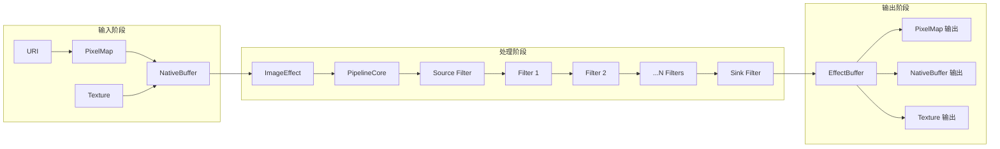

# 内部架构与 Inner API

## 架构概览

ImageEffect 采用分层架构设计，从上到下依次为：对外接口层、C API 封装层、核心引擎层、基础支撑层。各层之间通过明确定义的接口进行通信，遵循依赖倒置原则。

### 架构分层

```
┌─────────────────────────────────────────────────────────────────┐
│                    应用层 (Applications)                         │
│                  @ohos.multimedia.imageEffect                    │
└─────────────────────────────────────────────────────────────────┘
                              │
                              ▼
┌─────────────────────────────────────────────────────────────────┐
│                  对外接口层 (kits/native)                         │
│   image_effect.h / image_effect_filter.h / image_effect_errors.h │
│              导出 OH_* 系列 C API 函数                            │
└─────────────────────────────────────────────────────────────────┘
                              │
                              ▼
┌─────────────────────────────────────────────────────────────────┐
│                 C API 封装层 (capi/)                              │
│   native_effect_base.h / native_common_utils.cpp                 │
│              EFFECT_EXPORT 导出符号                                │
└─────────────────────────────────────────────────────────────────┘
                              │
        ┌─────────────────────┼─────────────────────┐
        ▼                     ▼                     ▼
┌──────────────┐      ┌──────────────┐      ┌──────────────┐
│   effect     │◄────►│   efilter    │◄────►│   custom     │
│  图像效果核心 │      │   滤镜基类    │      │  自定义滤镜   │
└──────────────┘      └──────────────┘      └──────────────┘
        │                     │                     │
        ▼                     ▼                     ▼
┌─────────────────────────────────────────────────────────────────┐
│                    核心功能层                                      │
│   pipeline/core │ memory │ colorspace │ render_environment       │
└─────────────────────────────────────────────────────────────────┘
                              │
                              ▼
┌─────────────────────────────────────────────────────────────────┐
│                    基础支撑层 (base/common)                       │
│   EffectBuffer │ EffectContext │ ErrorCode │ Any │ type_cast     │
└─────────────────────────────────────────────────────────────────┘
```

## 核心模块详解

### 1. effect 模块

**职责**：图像效果处理的核心引擎，管理滤镜链和输入输出。

**关键类**：`ImageEffect`

**定义**：`interfaces/inner_api/native/effect/image_effect_inner.h`

**核心方法**：
| 方法 | 功能 | 调用链 |
|------|------|--------|
| `Create()` | 创建 ImageEffect 实例 | → EffectContext 初始化 |
| `AddEFilter()` | 添加滤镜到链中 | → EFilterFactory::Create |
| `SetInputPixelMap()` | 设置 PixelMap 输入 | → Buffer 绑定 |
| `SetInputSurfaceBuffer()` | 设置 NativeBuffer 输入 | → SurfaceBuffer 绑定 |
| `SetInputTexture()` | 设置 Texture 输入 | → GPU Buffer 绑定 |
| `Start()` | 启动处理流水线 | → PipelineCore::Render |
| `Stop()` | 停止处理流水线 | → 资源清理 |
| `Release()` | 释放实例资源 | → 析构所有组件 |

**EffectContext 结构**：
```cpp
// 定义：interfaces/inner_api/native/base/effect_context.h
struct EffectContext {
    EffectMemoryManager* memoryMgr;      // 内存管理器
    RenderStrategy* renderStrategy;      // 渲染策略
    std::vector<EFilter*> filterChain;   // 滤镜链
    // ...
};
```

**证据**：`bundle.json:55-63`（inner_kits header 配置）

### 2. pipeline 模块

**职责**：流水线处理框架，负责滤镜的串联调度和渲染协调。

**关键类**：`PipelineCore`

**定义**：`frameworks/native/effect/pipeline/include/core/pipeline_core.h`

**流水线结构**：
```
┌─────────────────────────────────────────────────────────────┐
│                      PipelineCore                             │
├─────────────────────────────────────────────────────────────┤
│  ┌──────────┐    ┌──────────┐    ┌──────────┐               │
│  │  Source  │───►│ Filter 1 │───►│ Filter 2 │───► ...    │
│  │  Filter  │    │          │    │          │               │
│  └──────────┘    └──────────┘    └──────────┘               │
│       │               │               │                      │
│       ▼               ▼               ▼                      │
│  ┌─────────────────────────────────────────────────────────┐ │
│  │              CapabilityNegotiate                          │ │
│  │   - 格式协商                                              │ │
│  │   - 内存协商                                              │ │
│  │   - 滤镜缓存协商                                           │ │
│  └─────────────────────────────────────────────────────────┘ │
└─────────────────────────────────────────────────────────────┘
```

**核心组件**：

| 组件 | 职责 | 定义位置 |
|------|------|----------|
| `Filter` | 滤镜接口基类 | pipeline/include/core/filter.h |
| `FilterBase` | 滤镜基类实现 | pipeline/include/core/filter_base.h |
| `Port` | 端口连接器 | pipeline/include/core/port.h |
| `InPort` | 输入端口 | pipeline/include/core/port.h |
| `OutPort` | 输出端口 | pipeline/include/core/port.h |
| `Capability` | 能力描述 | pipeline/include/core/capability.h |
| `CapabilityNegotiate` | 能力协商器 | pipeline/include/core/capability_negotiate.h |

**证据**：`frameworks/native/effect/pipeline/core/pipeline_core.cpp`

### 3. efilter 模块

**职责**：滤镜的抽象基类和工厂模式实现。

**关键类**：`EFilter`

**定义**：`interfaces/inner_api/native/efilter/efilter.h`

**预置滤镜**：
| 滤镜 | 功能 | 实现文件 |
|------|------|----------|
| BrightnessEFilter | 亮度调节 | brightness/brightness_efilter.cpp |
| ContrastEFilter | 对比度调节 | contrast/contrast_efilter.cpp |
| CropEFilter | 图像裁剪 | crop/crop_efilter.cpp |

**滤镜注册机制**：
```cpp
// 注册宏：interfaces/inner_api/native/efilter/efilter_factory.h
#define REGISTER_EFILTER_FACTORY(FilterClass) \
    static AutoRegisterEFilter g_##FilterClass##Register(#FilterClass, []() { \
        return new FilterClass(); \
    });
```

**证据**：`efilter/filterimpl/brightness/brightness_efilter.cpp`

### 4. colorspace 模块

**职责**：色彩空间管理，支持 HDR/SDR 转换。

**关键类**：`ColorSpaceManager`

**定义**：`interfaces/inner_api/native/colorspace/colorspace_manager.h`

**子组件**：
| 组件 | 职责 | 定义位置 |
|------|------|----------|
| `ColorSpaceHelper` | 静态转换工具 | colorspace_helper.h |
| `ColorSpaceProcessor` | HDR 合成/分解 | colorspace_processor.h |
| `MetadataProcessor` | HDR 元数据处理 | metadata_processor.h |
| `ColorSpaceStrategy` | 转换策略 | colorspace_strategy.h |

**证据**：`frameworks/native/effect/manager/colorspace_manager/colorspace_strategy.h`

### 5. memory 模块

**职责**：内存分配管理，支持多种内存策略。

**关键类**：`EffectMemoryManager`

**定义**：`interfaces/inner_api/native/memory/effect_memory_manager.h`

**内存类型**：
| 类型 | 说明 | 使用场景 |
|------|------|----------|
| `HeapMemory` | 堆内存分配 | 常规数据 |
| `DmaMemory` | DMA 内存 | 设备间共享 |
| `SharedMemory` | 共享内存 | 进程间通信 |

**内存大小限制**：
```cpp
// 证据：frameworks/native/effect/manager/memory_manager/effect_memory.cpp:52
const size_t MAX_RAM_SIZE = 256 * 1024 * 1024;  // 256MB
```

### 6. render_environment 模块

**职责**：GPU 渲染环境管理，支持 OpenGL 加速。

**关键类**：`RenderEnvironment`

**定义**：`render_environment/render_environment.h`

**功能**：
- EGL 上下文创建和管理
- OpenGL 纹理绑定
- GPU 渲染参数配置

**渲染状态**：
```cpp
enum EGLStatus {
    EGL_STATUS_UNINITIALIZED,
    EGL_STATUS_INITIALIZED,
    EGL_STATUS_ERROR
};
```

### 7. custom 模块

**职责**：自定义滤镜的委托实现。

**关键接口**：`IFilterDelegate`

**定义**：`interfaces/inner_api/native/custom/delegate.h`

**实现类**：`FilterDelegate`

**定义**：`interfaces/inner_api/native/custom/filter_delegate.h`

**回调函数指针**：
| 回调 | 类型 | 说明 |
|------|------|------|
| `setValue` | OH_EffectFilterDelegate_SetValue | 参数设置 |
| `render` | OH_EffectFilterDelegate_Render | 渲染处理 |
| `save` | OH_EffectFilterDelegate_Save | 状态保存 |
| `restore` | OH_EffectFilterDelegate_Restore | 状态恢复 |

**证据**：`frameworks/native/efilter/custom/filter_delegate.cpp`

## 数据流

### 图像处理数据流



### Buffer 转换

```
┌─────────────────────────────────────────────────────────────────┐
│                        EffectBuffer                               │
├─────────────────────────────────────────────────────────────────┤
│  ┌─────────────┐    ┌─────────────┐    ┌─────────────┐          │
│  │  BufferInfo │    │  ExtraInfo  │    │  DataType   │          │
│  │ - width     │    │ - colorspace│    │ - pixelFmt  │          │
│  │ - height    │    │ - hdrMeta   │    │ - dataPtr   │          │
│  │ - format    │    │ - timestamp │    │ - stride    │          │
│  └─────────────┘    └─────────────┘    └─────────────┘          │
└─────────────────────────────────────────────────────────────────┘
```

**类型转换工具**：`NativeCommonUtils`

| 方法 | 功能 | 证据 |
|------|------|------|
| `ParseOHAny()` | JS Any → C++ Any | native_common_utils.cpp:79 |
| `SwitchToOHAny()` | C++ Any → JS Any | native_common_utils.cpp:110 |
| `GetPixelMapFromOHPixelmap()` | OH_PixelmapNative → PixelMap | native_common_utils.cpp:191 |
| `GetPictureFromNativePicture()` | OH_PictureNative → Picture | native_common_utils.cpp:201 |

## 线程模型

### 线程角色

| 线程 | 职责 | 绑定组件 |
|------|------|----------|
| **主线程** | API 调用、状态管理 | ImageEffect, EFilter |
| **渲染线程** | GPU 操作、流水线执行 | RenderEnvironment, PipelineCore |
| **内存管理线程** | 大内存分配/释放 | EffectMemoryManager |

### 同步机制

**线程安全设计**：
1. **引用计数**：EffectBuffer 使用智能指针管理生命周期
2. **互斥锁**：PipelineCore 在多滤镜切换时加锁保护
3. **原子操作**：内存分配状态使用原子标记

**证据**：`effect/pipeline/core/port.cpp`（Port 同步逻辑）

## 模块依赖关系

### 依赖矩阵

| 模块 | 依赖模块 | 依赖方向 |
|------|----------|----------|
| effect | common, base, efilter, colorspace, memory | 消费方 |
| efilter | common, base, pipeline, utils | 消费方 |
| colorspace | common, base, memory | 消费方 |
| memory | common, base, effect_buffer | 消费方 |
| pipeline | common, base, capability | 消费方 |
| render_environment | common, base, colorspace | 消费方 |
| custom | common, base, efilter | 消费方 |
| capi | effect, efilter | 消费方 |
| base | 无 | 提供方 |
| common | base | 提供方 |

### 依赖方向图

```
                    ┌─────────────────────┐
                    │      kits/native    │
                    │    (对外接口层)       │
                    └──────────▲──────────┘
                               │
                    ┌──────────┬──────────┐
                    │         capi         │
                    │    (C API 封装)      │
                    └──────────┬──────────┘
                               │
          ┌────────────────────┼────────────────────┐
          │                    │                    │
          ▼                    ▼                    ▼
   ┌─────────────┐      ┌─────────────┐      ┌─────────────┐
   │   effect    │◄────►│   efilter   │◄────►│   custom    │
   └──────┬──────┘      └──────┬──────┘      └──────┬──────┘
          │                   │                    │
    ┌─────┼─────┐       ┌─────┼─────┐              │
    ▼     ▼     ▼       ▼     ▼     ▼              │
┌──────┐┌──────┐┌──────┐┌──────┐┌──────┐           │
│pipeline││memory ││color ││base  ││utils │           │
└───────┘└───────┘└──────┘└──────┘└──────┘           │
          │                   │                    │
          └────────────────────┴────────────────────┘
                               │
                    ┌──────────┴──────────┐
                    │   base / common     │
                    │   (基础支撑层)       │
                    └─────────────────────┘
```

## 稳定性标注

### 稳定接口（对外发布）

| 接口 | 稳定性 | 说明 |
|------|--------|------|
| kits/native/* | 稳定 | NDK 接口，版本兼容 |
| EFFECT_EXPORT 函数 | 稳定 | 符号导出，ABI 稳定 |

### 半稳定接口

| 接口 | 稳定性 | 说明 |
|------|--------|------|
| inner_api/base/* | 半稳定 | 内部模块使用，版本间可能变化 |
| inner_api/common/* | 半稳定 | 通用工具，可能扩展 |

### 不稳定接口

| 接口 | 稳定性 | 说明 |
|------|--------|------|
| frameworks/native/* | 不稳定 | 实现细节，随时可能变更 |
| custom 回调 | 不稳定 | 开发者实现，框架不保证 |

## 相关文档

| 文档 | 说明 |
|------|------|
| [00_Overview.md](./00_Overview.md) | 项目概览 |
| [01_N-API_Reference.md](./01_N-API_Reference.md) | N-API 接口 |
| [03_Build_and_Targets.md](./03_Build_and_Targets.md) | 构建配置 |
| [appendix/Callgraphs.md](./appendix/Callgraphs.md) | 关键调用链 |
