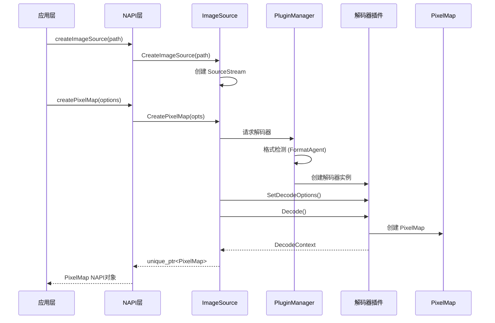
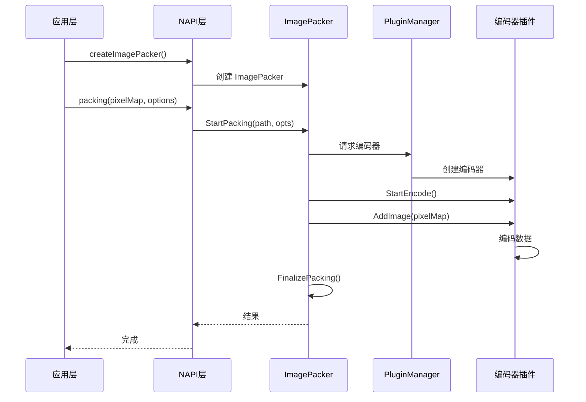
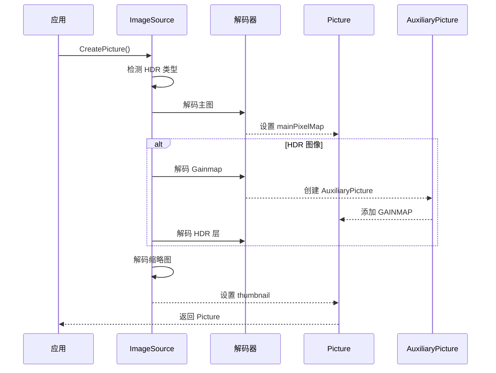
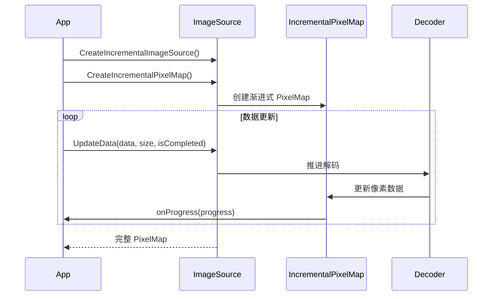

# 架构说明

## 目的

本文档描述 Image Framework 的架构设计，包括组件关系、数据流、线程模型和关键时序。

## 架构分层

```
┌─────────────────────────────────────────────────────────────────┐
│ Layer 4: Application (JS/TS/C/C++)                              │
├─────────────────────────────────────────────────────────────────┤
│ Layer 3: API Binding (NAPI/NDK/ANI/Cangjie)                     │
├─────────────────────────────────────────────────────────────────┤
│ Layer 2: Framework Core (ImageSource/ImagePacker/PixelMap)      │
├─────────────────────────────────────────────────────────────────┤
│ Layer 1: Plugin System (PluginManager + Codecs)                 │
├─────────────────────────────────────────────────────────────────┤
│ Layer 0: Platform (Skia/GPU/Drivers)                            │
└─────────────────────────────────────────────────────────────────┘
```

## 核心组件

### 1. ImageSource - 图像解码入口

**位置**: `interfaces/innerkits/include/image_source.h`

职责：
- 管理图像数据源（文件、FD、内存、流）
- 协调格式检测与解码器选择
- 提供同步/异步解码接口
- 支持渐进式解码

```cpp
class ImageSource {
    static std::unique_ptr<ImageSource> CreateImageSource(...);
    std::unique_ptr<PixelMap> CreatePixelMap(const DecodeOptions &opts, ...);
    std::unique_ptr<Picture> CreatePicture(const DecodingOptionsForPicture &opts, ...);
    
private:
    std::unique_ptr<SourceStream> sourceStreamPtr_;
    std::unique_ptr<ImagePlugin::AbsImageDecoder> mainDecoder_;
    static MultimediaPlugin::PluginServer &pluginServer_;
};
```

### 2. ImagePacker - 图像编码入口

**位置**: `interfaces/innerkits/include/image_packer.h`

职责：
- 管理编码输出目标
- 协调编码器选择
- 支持多帧图像（GIF）
- 支持 HDR 编码

```cpp
class ImagePacker {
    uint32_t StartPacking(const std::string &filePath, const PackOption &option);
    uint32_t AddImage(PixelMap &pixelMap);
    uint32_t FinalizePacking();
    
private:
    std::unique_ptr<PackerStream> packerStream_;
    std::unique_ptr<ImagePlugin::AbsImageEncoder> encoder_;
};
```

### 3. PixelMap - 像素数据容器

**位置**: `interfaces/innerkits/include/pixel_map.h`

职责：
- 存储像素数据（支持多种格式）
- 提供像素操作（读/写/变换）
- 支持多种内存分配器
- 实现 Parcelable 用于 IPC

```cpp
class PixelMap : public Parcelable {
    NATIVEEXPORT uint32_t ReadPixels(const RWPixelsOptions &opts);
    NATIVEEXPORT uint32_t WritePixels(const RWPixelsOptions &opts);
    NATIVEEXPORT void scale(float xAxis, float yAxis);
    NATIVEEXPORT void rotate(float degrees);
    
private:
    uint8_t *data_ = nullptr;
    AllocatorType allocatorType_;
    ImageInfo imageInfo_;
};
```

### 4. PluginServer - 插件系统

**位置**: `plugins/manager/include/plugin_server.h`

职责：
- 单例管理所有插件
- 动态加载编解码器
- 根据格式/能力选择插件

```cpp
class PluginServer : public RefBase, public NoCopyable {
    uint32_t Register(vector<string> &&pluginPaths);
    SvcIdentity CreateObject(const ClassBase &cls, ...);
    
    template <typename Interface>
    static inline PluginServer &GetInstance() {
        static PluginServer instance;
        return instance;
    }
};
```

## 数据流

### 解码流程



### 编码流程



### HDR Picture 流程



## 线程模型

### N-API 异步模式

**Promise 模式**:
```cpp
// 1. 创建 Promise 和 Deferred
napi_create_promise(env, &deferred, &result);

// 2. 创建异步工作
napi_create_async_work(env, nullptr, resource,
    [](napi_env env, void *data) {
        // 执行线程：耗时操作（解码）
    },
    [](napi_env env, napi_status status, void *data) {
        // 主线程：回调 JS
        napi_resolve_deferred(env, deferred, result);
    },
    context, &work);

// 3. 入队执行
napi_queue_async_work(env, work);
```

**回调模式**:
```cpp
// 保存回调引用
napi_create_reference(env, callback, 1, &callbackRef);

// 异步完成后调用
napi_call_function(env, nullptr, callback, argc, argv, &result);
```

### 线程安全

| 组件 | 线程安全机制 |
|------|--------------|
| PixelMap | `shared_mutex` 用于 transform 操作，`mutex` 用于 unmap |
| ImageSource | `listenerMutex_`, `decodingMutex_`, `fileMutex_` |
| PluginServer | 单例模式，插件创建非线程安全（调用方保证） |

### 状态机

**解码状态** (`interfaces/innerkits/include/image_source.h:94-114`):

```cpp
enum class ImageDecodingState : int32_t {
    UNRESOLVED = 0,        // 初始状态
    BASE_INFO_ERROR = 1,   // 头部解析失败
    BASE_INFO_PARSED = 2,  // 头部已解析
    IMAGE_DECODING = 3,    // 正在解码
    IMAGE_ERROR = 4,       // 解码错误
    PARTIAL_IMAGE = 5,     // 部分数据可用
    IMAGE_DECODED = 6      // 解码完成
};

enum class SourceDecodingState : int32_t {
    UNRESOLVED = 0,
    SOURCE_ERROR = 1,
    UNKNOWN_FORMAT = 2,
    FORMAT_RECOGNIZED = 3,
    UNSUPPORTED_FORMAT = 4,
    // ...
};
```

## 内存管理

### 分配器类型

```cpp
enum class AllocatorType : int32_t {
    DEFAULT = 0,         // 自动选择
    HEAP_ALLOC = 1,      // 堆内存 (max 1500MB)
    SHARE_MEM_ALLOC = 2, // 共享内存 (Ashmem)
    DMA_ALLOC = 4,       // DMA 零拷贝 (SurfaceBuffer)
};
```

### 内存生命周期

```
ImageSource/ImagePacker
        │
        ▼
   SourceStream/PackerStream
        │
        ▼
   DecodeContext/EncodeContext
        │
        ▼
   PixelMap {data_, allocatorType_}
        │
        ▼
   自动释放或 CustomFreePixelMap
```

### 关键限制

| 限制 | 值 | 说明 |
|------|-----|------|
| MAX_SOURCE_SIZE | 300 MB | 源文件大小上限 |
| MAX_IMAGEDATA_SIZE | 128 MB | 像素数据上限 |
| PIXEL_MAP_MAX_RAM_SIZE | 600 MB | 堆内存分配上限 |
| MAX_DIMENSION | INT32_MAX >> 2 | 图像维度上限 |

## 插件架构

### 插件加载流程

```
PluginServer::Register()
    │
    ├── 扫描插件路径
    ├── 加载 .pluginmeta 元数据
    ├── dlopen() 加载 .so
    ├── 创建 PluginFw 或 GstPluginFw
    └── 注册到 capability 系统
```

### 插件接口

```cpp
// 解码器接口
class AbsImageDecoder : public PluginClassBase {
    virtual void SetSource(InputDataStream &source) = 0;
    virtual void SetDecodeOptions(...) = 0;
    virtual uint32_t Decode(...) = 0;
};

// 编码器接口
class AbsImageEncoder : public PluginClassBase {
    virtual void SetOutput(PackerStream &stream) = 0;
    virtual void SetEncodeOptions(...) = 0;
    virtual uint32_t Encode(...) = 0;
};

// 格式检测接口
class AbsImageFormatAgent : public PluginClassBase {
    virtual bool CheckFormat(const void *header, int32_t headerSize) = 0;
    virtual string GetFormatType() = 0;
};
```

### 插件元数据示例

```json
{
  "pluginType": "default",
  "className": "OHOS::ImagePlugin::JpegDecoder",
  "serviceType": 0,
  "priority": 1,
  "name": "jpegplugin",
  "description": "jpeg decoder plugin"
}
```

## 关键时序

### 渐进式解码时序



## 相关文档

- [目录结构](01_Directory_Structure.md) - 代码组织
- [内部 API](04_Inner_API.md) - 接口详情
- [GN 构建](05_GN_Targets.md) - 构建系统
