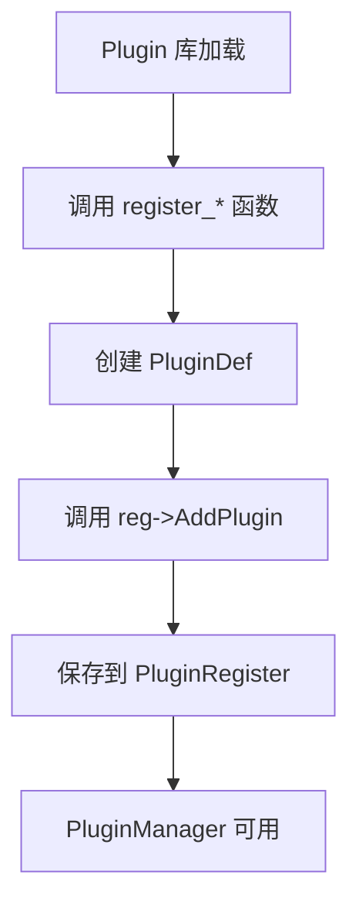

# 架构设计

## 整体架构图

```
┌─────────────────────────────────────────────────────────────────────┐
│                        应用层                                        │
│  ┌─────────────────────────────────────────────────────────────┐   │
│  │                   HiPlayer / HiRecorder                      │   │
│  │              (engine/scene/player & recorder)                │   │
│  └─────────────────────────────────────────────────────────────┘   │
├─────────────────────────────────────────────────────────────────────┤
│                      Pipeline 框架层                                │
│  ┌──────────┐  ┌──────────┐  ┌──────────┐  ┌──────────┐          │
│  │Pipeline  │  │  Filter  │  │  Port    │  │Filter    │          │
│  │  Core    │──│  Base    │──│(In/Out)  │──│ Factory  │          │
│  └──────────┘  └──────────┘  └──────────┘  └──────────┘          │
├─────────────────────────────────────────────────────────────────────┤
│                        插件层                                       │
│  ┌──────────┐  ┌──────────┐  ┌──────────┐  ┌──────────┐          │
│  │  Source  │  │ Demuxer  │  │  Codec   │  │   Sink   │          │
│  │  Plugin  │  │  Plugin  │  │  Plugin  │  │  Plugin  │          │
│  └──────────┘  └──────────┘  └──────────┘  └──────────┘          │
│         ↘            ↘            ↘            ↘                     │
│  ┌─────────────────────────────────────────────────────────────┐   │
│  │                 Plugin Framework (core)                      │   │
│  │     PluginManager, PluginRegister, PluginCapability        │   │
│  └─────────────────────────────────────────────────────────────┘   │
└─────────────────────────────────────────────────────────────────────┘
```

## 三层职责详解

### 1. 应用场景封装层

**职责**: 提供面向场景的高层 API

**核心模块**:

| 模块 | 文件路径 | 职责 |
|------|----------|------|
| HiPlayer | `engine/scene/player/standard/hiplayer_impl.h` | 播放主接口 |
| HiRecorder | `engine/scene/recorder/standard/hirecorder_impl.h` | 录制主接口 |
| PlayExecutor | `engine/scene/player/play_executor.h` | 播放执行抽象 |

**关键流程**:


### 2. Pipeline 框架层

**职责**: 管理 Filter 生命周期、编排数据流

**核心组件**:

| 组件 | 头文件路径 | 职责 |
|------|------------|------|
| PipelineCore | `engine/include/pipeline/core/pipeline_core.h` | Pipeline 编排器 |
| FilterBase | `engine/pipeline/core/filter_base.h` | Filter 基类 |
| Filter | `engine/include/pipeline/core/filter.h` | Filter 接口 |
| InPort/OutPort | `engine/include/pipeline/core/port.h` | 端口连接 |
| FilterFactory | `engine/include/pipeline/factory/filter_factory.h` | Filter 工厂 |

**Filter 类型**:

| Filter 类型 | 对应插件 | 用途 |
|-------------|----------|------|
| MEDIA_SOURCE | Source Plugin | 数据源 |
| DEMUXER | Demuxer Plugin | 解封装 |
| AUDIO_DECODER | Audio Decoder Plugin | 音频解码 |
| VIDEO_DECODER | Video Decoder Plugin | 视频解码 |
| AUDIO_ENCODER | Audio Encoder Plugin | 音频编码 |
| VIDEO_ENCODER | Video Encoder Plugin | 视频编码 |
| AUDIO_SINK | Audio Sink Plugin | 音频输出 |
| VIDEO_SINK | Video Sink Plugin | 视频输出 |
| OUTPUT_SINK | Output Sink Plugin | 输出目标 |

### 3. 插件层

**职责**: 提供具体的媒体处理能力

**插件类型** (`plugin_types.h`):

| 插件类型 | 命名空间 | 核心接口 |
|----------|----------|----------|
| SOURCE | `SourcePlugin` | Read(), Seek() |
| DEMUXER | `DemuxerPlugin` | GetNextChunk(), SeekToTime() |
| CODEC | `CodecPlugin` | Process(), GetInputInfo() |
| AUDIO_SINK | `AudioSinkPlugin` | Write(), GetLatency() |
| VIDEO_SINK | `VideoSinkPlugin` | Write(), SetSurface() |
| MUXER | `MuxerPlugin` | AddTrack(), WriteHeader() |

**插件适配器**:

| 适配器 | 路径 | 说明 |
|--------|------|------|
| FFmpeg Adapter | `engine/plugin/plugins/ffmpeg_adapter/` | FFmpeg 封装/解封装、编解码 |
| HDI Codec Adapter | `engine/plugin/plugins/codec_adapter/` | 硬件编解码器 HDI 接口 |
| HDI Audio Adapter | `engine/plugin/plugins/hdi_adapter/` | 音频 HDI 输出 |
| Minimp3 Adapter | `engine/plugin/plugins/minimp3_adapter/` | 轻量 MP3 解码 |

## 数据流模型

### Port 连接模型

```
┌──────────────────────┐              ┌──────────────────────┐
│      Filter A        │              │      Filter B        │
│  ┌────────────────┐  │   OutPort    │  ┌────────────────┐  │
│  │    OutPort     │──┼──────────────┼─▶│    InPort      │  │
│  └────────────────┘  │              │  └────────────────┘  │
│  ┌────────────────┐  │   InPort     │  ┌────────────────┐  │
│  │    InPort      │◀─┼──────────────┼──│    OutPort     │  │
│  └────────────────┘  │              │  └────────────────┘  │
└──────────────────────┘              └──────────────────────┘
```

### 数据传输模式

| 模式 | 说明 | 适用场景 |
|------|------|----------|
| **PUSH** | 上游 Filter 主动调用 `PushData()` 推送数据 | 大多数场景 |
| **PULL** | 下游 Filter 主动调用 `PullData()` 拉取数据 | 需按需读取（如文件 Seek） |

## 插件注册机制

### 静态注册 vs 动态注册

| 类型 | 说明 | 加载时机 |
|------|------|----------|
| 静态注册 | 代码静态链接 | 系统启动 |
| 动态注册 | dlopen 动态加载 | 按需加载 |

### 注册流程



### 注册宏定义 (`plugin_definition.h:191`)

```cpp
#define PLUGIN_DEFINITION(name, license, registerFunc, unregisterFunc) \
    PLUGIN_EXPORT Status register_##name(...) { ... } \
    PLUGIN_EXPORT void unregister_##name() { ... }
```

## 能力协商 (Capability Negotiation)

### Capability 结构

| 字段 | 类型 | 说明 |
|------|------|------|
| mime | string | MIME 类型（如 "audio/mpeg"） |
| keys | KeyMap | 能力键值对（码率、采样率等） |

### 能力类型

| 类型 | 说明 | 示例 |
|------|------|------|
| FixedCapability | 固定值 | sampleRate = 44100 |
| IntervalCapability | 区间值 | bitrate = [64, 320] kbps |
| DiscreteCapability | 离散值 | channels = [1, 2, 6] |
