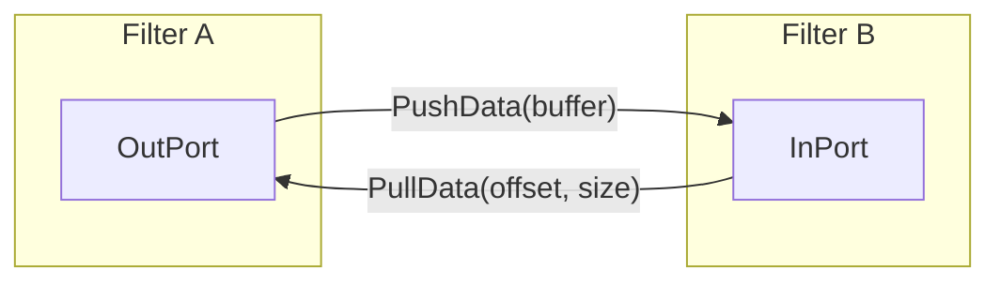
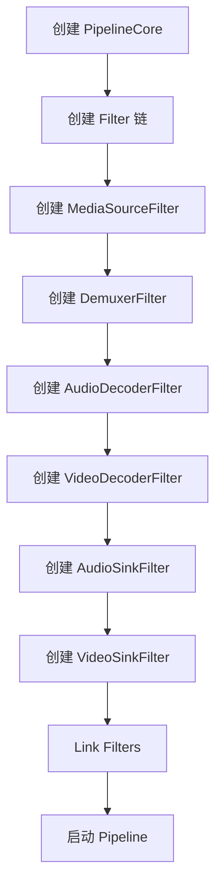

# Pipeline 框架详解

## 概述

Pipeline 框架是 HiStreamer 的**核心编排层**，负责管理媒体处理 Filter 的生命周期、连接关系和数据流。

## 核心组件

### PipelineCore

**头文件**: `engine/include/pipeline/core/pipeline_core.h`

**职责**: Pipeline 的核心编排器，管理 Filter 的创建、连接、启动、停止等。

### Filter 基类体系

```
┌─────────────────────────────────────────────────────┐
│                    Filter                          │
│            (engine/include/pipeline/core/filter.h) │
└─────────────────────────────────────────────────────┘
                         ↑
                         │
┌─────────────────────────────────────────────────────┐
│                  FilterBase                          │
│           (engine/pipeline/core/filter_base.h)      │
│  - 状态管理 (CREATED → RUNNING → PAUSED)            │
│  - 端口管理 (InPort/OutPort)                         │
│  - 插件封装 (PluginWrapper)                          │
└─────────────────────────────────────────────────────┘
```

### Filter 状态机

```
┌─────────┐    Init()     ┌─────────────┐   Prepare()   ┌─────────┐
│ CREATED │──────────────▶│ INITIALIZED │──────────────▶│PREPARING│
└─────────┘               └─────────────┘               └─────────┘
     ▲                         │                              │
     │                         │                              │
     │                         │                              │ Reset()
     │                         ▼                              │
     │                  ┌──────────┐                         │
     │                  │  READY    │◀────────────────────────┘
     │                  └──────────┘
     │                       │
     │                       │ Start()
     │                       ▼
     │                  ┌──────────┐    Pause()    ┌─────────┐
     └──────────────────│ RUNNING  │──────────────▶│ PAUSED  │
                        └──────────┘               └─────────┘
```

| 状态 | 说明 | 有效操作 |
|------|------|----------|
| CREATED | Filter 已创建 | Init |
| INITIALIZED | 初始化完成 | Prepare |
| PREPARING | 准备中 | - |
| READY | 准备就绪 | Start |
| RUNNING | 运行中 | Pause/Stop/Flush |
| PAUSED | 暂停 | Resume/Stop |

### Port 连接

**头文件**: `engine/include/pipeline/core/port.h`

每个 Filter 包含：
- **InPort**: 接收上游数据
- **OutPort**: 发送数据到下游



### FilterFactory

**头文件**: `engine/include/pipeline/factory/filter_factory.h`

Filter 创建工厂，使用**自动注册**模式：

```cpp
// 注册 Filter
FilterFactory::Instance().RegisterFilter<MediaSourceFilter>("builtin.player.mediasource");

// 创建 Filter
auto source = FilterFactory::Instance().CreateFilterWithType<MediaSourceFilter>(
    "builtin.player.mediasource", "mediaSource");
```

## Filter 类型详解

### 1. Source Filters

| Filter | 头文件 | 用途 |
|--------|--------|------|
| MediaSourceFilter | `engine/include/pipeline/filters/source/media_source/` | 媒体数据源 |
| AudioCaptureFilter | `engine/pipeline/filters/source/audio_capture/` | 音频采集 |
| VideoCaptureFilter | `engine/pipeline/filters/source/video_capture/` | 视频采集 |

### 2. Demuxer Filter

| Filter | 头文件 | 用途 |
|--------|--------|------|
| DemuxerFilter | `engine/include/pipeline/filters/demux/demuxer_filter.h` | 媒体解封装 |

### 3. Codec Filters

| Filter | 头文件 | 用途 |
|--------|--------|------|
| AudioDecoderFilter | `engine/pipeline/filters/codec/audio_decoder/` | 音频解码 |
| VideoDecoderFilter | `engine/pipeline/filters/codec/video_decoder/` | 视频解码 |
| AudioEncoderFilter | `engine/pipeline/filters/codec/audio_encoder/` | 音频编码 |
| VideoEncoderFilter | `engine/pipeline/filters/codec/video_encoder/` | 视频编码 |

### 4. Sink Filters

| Filter | 头文件 | 用途 |
|--------|--------|------|
| AudioSinkFilter | `engine/include/pipeline/filters/sink/audio_sink/` | 音频输出 |
| VideoSinkFilter | `engine/pipeline/filters/sink/video_sink/` | 视频渲染 |
| OutputSinkFilter | `engine/pipeline/filters/sink/output_sink/` | 文件输出 |

### 5. Muxer Filter

| Filter | 头文件 | 用途 |
|--------|--------|------|
| MuxerFilter | `engine/include/pipeline/filters/muxer/muffer_filter.h` | 媒体封装 |

## 数据流机制

### Push 模式（默认）

上游 Filter 主动推送数据到下游：

```cpp
// Filter A 调用
void FilterA::OnOutputBufferAvailable(Buffer& buffer) {
    // 推送到下游
    outPort_[0].PushData(buffer, 0);  // port.h
}

// Filter B 实现
Status FilterB::PushData(const std::shared_ptr<Buffer>& buffer, int32_t offset) {
    // 处理数据
    return ProcessBuffer(buffer);
}
```

### Pull 模式

下游 Filter 按需从上游拉取数据：

```cpp
// Filter B 调用
Status FilterB::OnNeedData() {
    Buffer buffer;
    // 从上游拉取
    inPort_[0].PullData(offset, size, buffer);
    return ProcessBuffer(buffer);
}
```

### 数据 Buffer

Filter 间传递的数据单元：

| 属性 | 类型 | 说明 |
|------|------|------|
| pts | int64_t | 显示时间戳（微秒） |
| size | int32_t | 数据大小 |
| offset | int32_t | 数据偏移 |
| flags | uint32_t | 标志（EOS、关键帧等） |
| meta | AVFormat | 元数据 |

## Pipeline 构建流程

### 播放 Pipeline 构建



### 录制 Pipeline 构建

```
MediaSourceFilter → AudioCaptureFilter → AudioEncoderFilter
                                        ↓
                              MuxerFilter ← VideoEncoderFilter ← VideoCaptureFilter
                                        ↓
                                   OutputSinkFilter
```

## 事件系统

**头文件**: `engine/include/pipeline/core/event.h`

### 事件类型

| 事件 | 说明 | 用途 |
|------|------|------|
| EVENT_READY | Filter 就绪 | 初始化完成 |
| EVENT_AUDIO_PROGRESS | 音频进度 | 播放进度 |
| EVENT_VIDEO_PROGRESS | 视频进度 | 播放进度 |
| EVENT_COMPLETE | 播放完成 | 结束通知 |
| EVENT_ERROR | 错误 | 错误上报 |
| EVENT_PLUGIN_ERROR | 插件错误 | 插件异常 |
| EVENT_BUFFERING | 缓冲中 | 缓冲状态 |
| EVENT_RESOLUTION_CHANGE | 分辨率变化 | 视频变化 |

## 插件与 Filter 的关系

```
┌─────────────────────────────────────────────────────────┐
│                    FilterLayer                          │
│  ┌─────────────────────────────────────────────────┐   │
│  │ Filter (FilterBase)                              │   │
│  │  - 管理 Filter 状态                              │   │
│  │  - 端口连接                                      │   │
│  │  - 事件传递                                      │   │
│  └─────────────────────────────────────────────────┘   │
│                          ↓                              │
│  ┌─────────────────────────────────────────────────┐   │
│  │ PluginWrapper (src/plugin/plugin_*.h)           │   │
│  │  - 封装插件实例                                  │   │
│  │  - 调用插件 API                                  │   │
│  │  - 转换数据格式                                  │   │
│  └─────────────────────────────────────────────────┘   │
│                          ↓                              │
│  ┌─────────────────────────────────────────────────┐   │
│  │ Plugin (engine/plugin/plugins/*/)                │   │
│  │  - 实际处理逻辑                                  │   │
│  │  - Source/Demuxer/Codec/Sink                    │   │
│  └─────────────────────────────────────────────────┘   │
└─────────────────────────────────────────────────────────┘
```

## 关键代码路径

| 组件 | 路径 | 说明 |
|------|------|------|
| PipelineCore | `engine/pipeline/core/pipeline_core.cpp` | Pipeline 编排 |
| FilterBase | `engine/pipeline/core/filter_base.cpp` | Filter 基类 |
| FilterFactory | `engine/pipeline/factory/filter_factory.cpp` | Filter 工厂 |
| Port | `engine/pipeline/core/port.cpp` | 端口实现 |
