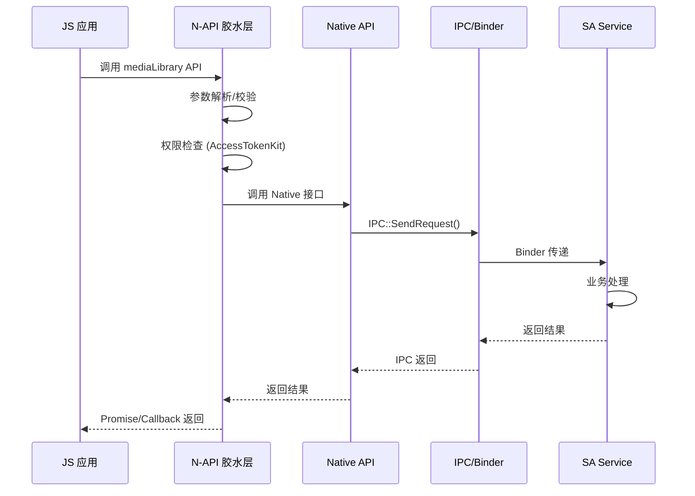
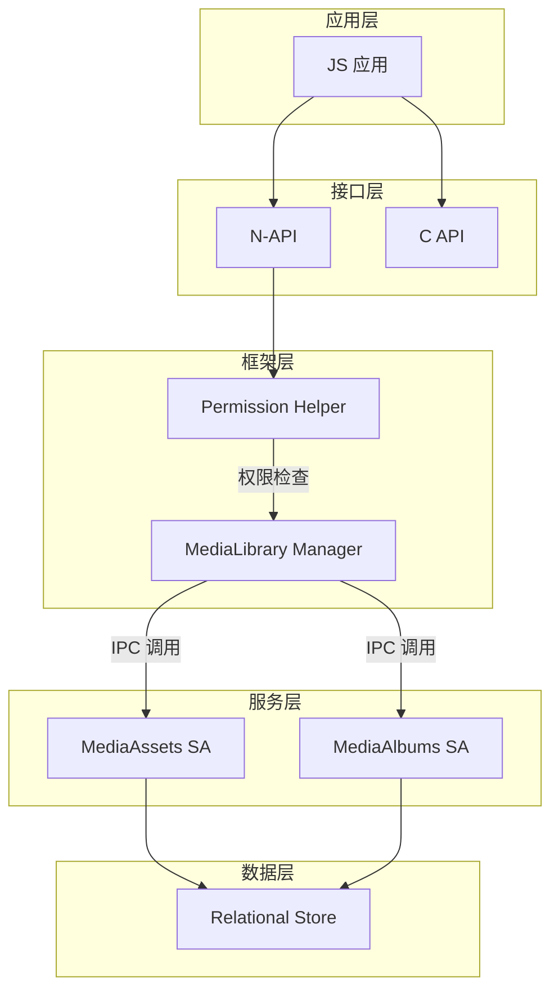
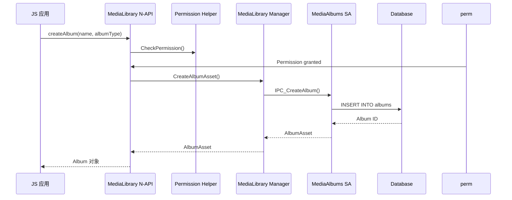

# MediaLibrary 架构设计

## 整体架构

### 架构分层

```
┌─────────────────────────────────────────────────────────────────────┐
│                         应用层 (Application)                          │
│   JS 应用/C 应用                                                     │
├─────────────────────────────────────────────────────────────────────┤
│                      接口层 (Interfaces)                              │
│  ┌─────────────────────┐ ┌─────────────────┐ ┌─────────────────┐  │
│  │    JS N-API         │ │     C API       │ │  Native API     │  │
│  │  multimedia.       │ │  @ohos.         │ │  inner_api/     │  │
│  │  mediaLibrary      │ │  mediaLibrary   │ │                 │  │
│  └─────────────────────┘ └─────────────────┘ └─────────────────┘  │
├─────────────────────────────────────────────────────────────────────┤
│                     框架层 (Frameworks)                              │
│  ┌─────────────────────────────────────────────────────────────┐   │
│  │                     N-API 胶水层                              │   │
│  │    native_module_ohos_medialibrary.cpp                        │   │
│  └─────────────────────────────────────────────────────────────┘   │
│  ┌─────────────────────────────────────────────────────────────┐   │
│  │                     Native 实现层                             │   │
│  │    frameworks/native/ + innerkitsimpl/                       │   │
│  └─────────────────────────────────────────────────────────────┘   │
├─────────────────────────────────────────────────────────────────────┤
│                      服务层 (Services)                               │
│  ┌──────────────────────┐ ┌──────────────────────┐              │
│  │ MediaAssetsManager   │ │ MediaAlbumsManager   │              │
│  │      Service         │ │      Service         │              │
│  └──────────────────────┘ └──────────────────────┘              │
│  ┌───────────────────────────────────────────────────────────┐   │
│  │              IPC/Binder 通信层                             │   │
│  └───────────────────────────────────────────────────────────┘   │
├─────────────────────────────────────────────────────────────────────┤
│                      数据层 (Data)                                   │
│  ┌─────────────────────────────────────────────────────────────┐   │
│  │              Relational Store (RDB)                         │   │
│  │              媒体文件元数据存储                              │   │
│  └─────────────────────────────────────────────────────────────┘   │
└─────────────────────────────────────────────────────────────────────┘
```

---

## N-API 数据流

### JS → N-API → Native → Service 调用链



---

## 组件交互图

### 媒体查询流程



---

## 线程模型

### 线程职责划分

| 线程/线程池 | 职责 | 代码位置 |
|-------------|------|---------|
| **主线程** | JS 回调、分发 | napi_event_loop |
| **Binder 线程池** | IPC 响应 | IPC skeleton |
| **业务线程池** | 耗时操作 | ffrt/thread_pool |
| **数据库线程** | RDB 操作 | relational_store |

### 异步操作模式

```cpp
// 典型 N-API 异步操作模式
napi_value AsyncOperation(napi_env env, napi_callback_info info) {
    // 1. 解析参数
    auto asyncContext = std::make_unique<AsyncContext>();
    napi_get_cb_info(env, info, &argc, argv, &thisVar, &data);
    
    // 2. 创建 Promise
    napi_create_promise(env, &asyncContext->deferred, &result);
    
    // 3. 异步执行
    napi_create_async_work(env, nullptr, execute,
        complete, asyncContext.get(), &asyncContext->work);
    napi_queue_async_work(env, asyncContext->work);
    
    return result;
}
```

---

## IPC 通信机制

### Binder 通信模式

**调用者身份获取**:
```cpp
// 文件: frameworks/js/src/media_library_napi.cpp:3972
AccessTokenID tokenCaller = IPCSkeleton::GetSelfTokenID();
int32_t uid = IPCSkeleton::GetCallingUid();
```

**远程请求处理**:
```cpp
// 文件: services/media_assets_manager/include/controller/...
int32_t OnRemoteRequest(uint32_t code, MessageParcel &data, 
                        MessageParcel &reply, MessageOption &option) {
    // 解析请求码
    switch (code) {
        case ASSET_OPERATION_CREATE:
            return CreateAsset(data, reply);
        case ASSET_OPERATION_MODIFY:
            return ModifyAsset(data, reply);
        // ...
    }
}
```

### IPC 数据序列化

| 数据类型 | 序列化方式 |
|---------|-----------|
| 基础类型 | MessageParcel::WriteInt32/WriteString |
| 数组/向量 | MessageParcel::WriteUInt32Vector |
| 对象 | 自定义 marshall/unmarshall |

---

## 关键时序图

### 创建相册流程



---

## 数据流总结

### 信任边界

```
┌──────────────────────────────────────────────────────────────────┐
│                        不可信区域                                 │
│   ┌──────────────────────────────────────────────────────────┐   │
│   │                    用户应用                               │   │
│   │     (JS 输入、参数、URI、文件路径)                        │   │
│   └──────────────────────────────────────────────────────────┘   │
│                              │                                   │
│                              ▼ 权限检查                          │
├──────────────────────────────────────────────────────────────────┤
│                        信任边界                                   │
│   ┌──────────────────────────────────────────────────────────┐   │
│   │               MediaLibrary 服务                           │   │
│   │     (参数校验、业务逻辑、数据库操作)                       │   │
│   └──────────────────────────────────────────────────────────┘   │
│                              │                                   │
│                              ▼ 安全操作                          │
├──────────────────────────────────────────────────────────────────┤
│                        受控资源                                   │
│   ┌──────────────────────────────────────────────────────────┐   │
│   │              文件系统、数据库、网络                         │   │
│   └──────────────────────────────────────────────────────────┘   │
└──────────────────────────────────────────────────────────────────┘
```

### 关键信任边界点

| 边界 | 检查点 | 代码位置 |
|-----|-------|---------|
| JS → N-API | 参数校验、类型检查 | napi_get_cb_info |
| N-API → Native | 权限验证 | AccessTokenKit |
| Native → SA | TokenID 传递 | IPCSkeleton |
| SA → RDB | SQL 注入防护 | ParameterizedQuery |

---

## 架构约束

### 线程约束

| 操作 | 允许线程 | 禁止线程 |
|-----|---------|---------|
| N-API 调用 | 主线程 | - |
| 异步回调 | 主线程 | - |
| IPC 调用 | Binder 线程 | 主线程 |
| Native 方法 | 任意线程 | - |

### 内存约束

- **禁止**: 跨线程传递原始指针
- **必须**: 使用 shared_ptr/unique_ptr
- **建议**: 使用 Move 语义转移所有权

---

## 相关文档

| 文档 | 描述 |
|-----|------|
| [00_Overview](00_Overview.md) | 项目概览 |
| [01_Directory_Structure](01_Directory_Structure.md) | 目录结构 |
| [03_N-API_Reference](03_N-API_Reference.md) | N-API 接口 |
| [06_Security_Review](06_Security_Review.md) | 安全评审 |
