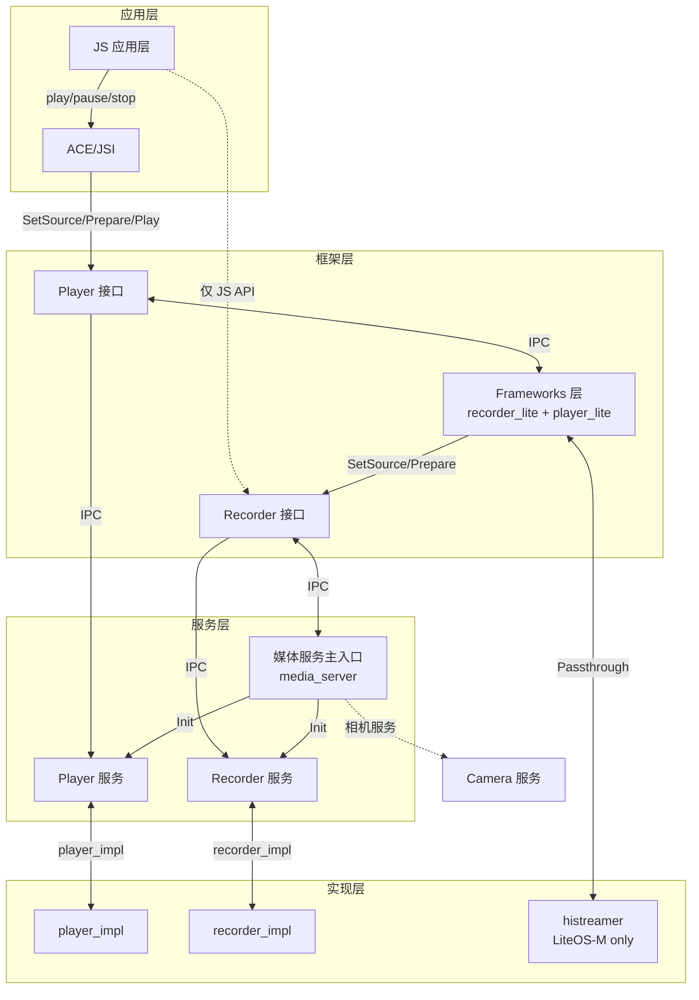
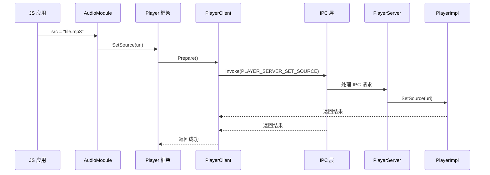
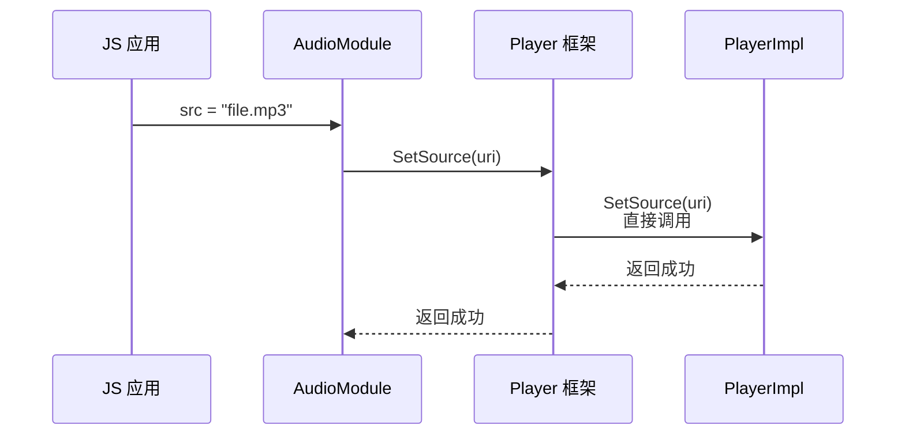
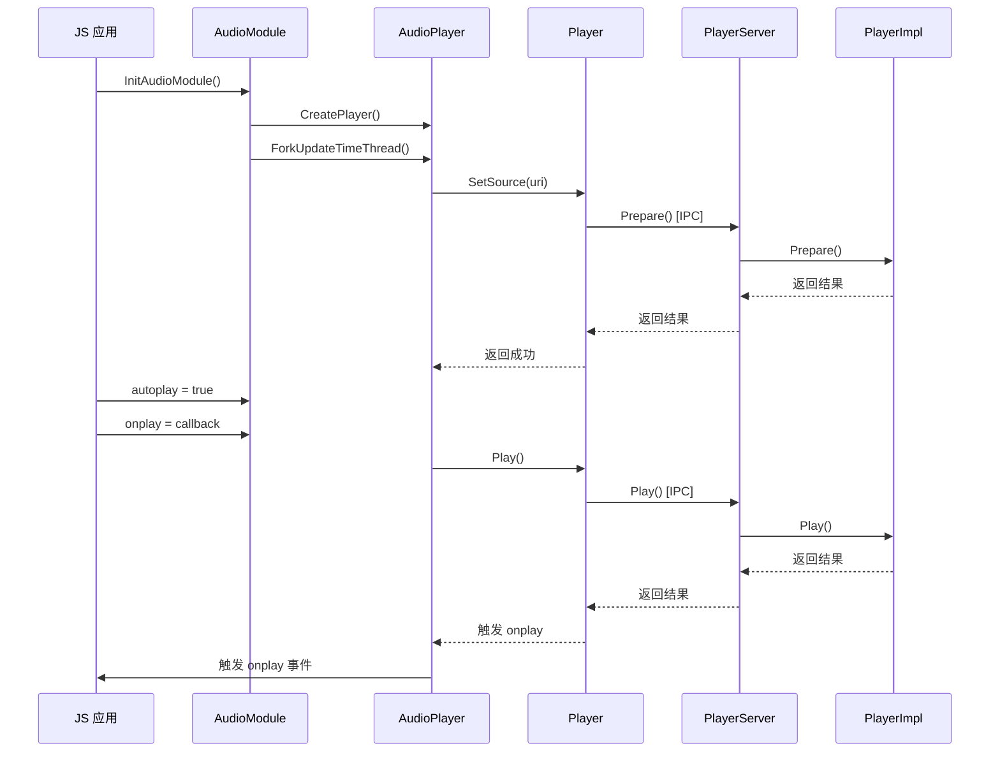
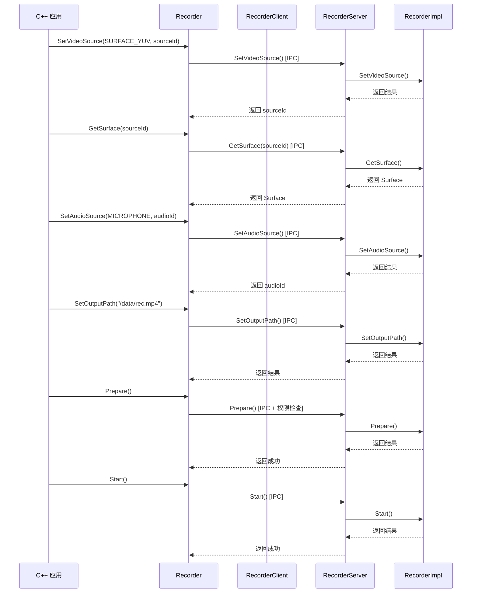

# 架构说明

## 目的

本文档介绍 media_lite 项目的整体架构，包括组件图、数据流、线程模型和关键时序。

## 适用范围

- 适用于理解系统架构的设计者
- 适用于进行架构优化的开发者
- 适用于安全审计人员

---

## 组件架构图

### 整体架构

### 模式对比

#### Binder 模式 (enable_media_passthrough_mode = false)

#### Passthrough 模式 (enable_media_passthrough_mode = true)

---

## 数据流

### 播放数据流

**流程**：JS 应用 → AudioModule → Player → PlayerImpl → 解码器 → 音频驱动

1. **URI 解析**：JSI 将字符串 URI 解析为路径或网络地址
2. **资源定位**：Player 根据定位文件描述符或打开文件
3. **解封装**：解码器解析媒体容器格式（MP4、TS 等）
4. **解码**：视频/音频解码器解码压缩数据
5. **渲染**：
   - 音频：通过 audio_lite 播放
   - 视频：通过 surface_lite 渲染到 Surface

### 录制数据流

**流程**：Camera/Surface → Recorder → encoder → 文件系统

1. **视频输入**：camera_lite 或 Surface 提供视频帧
2. **音频输入**：audio_lite 提供音频数据
3. **编码**：硬件编码器编码视频/音频
4. **封装**：recorder_impl 将编码数据封装为 MP4/TS
5. **写入**：将封装数据写入文件系统

---

## 线程模型

### AudioPlayer 线程

**位置**：`interfaces/kits/player_lite/js/builtin/src/audio_player.cpp`

**线程**：
1. **主线程**：JSI 调用线程
2. **更新时间线程**：`UpdateTimeHandler` - 定期触发 `ontimeupdate` 事件
   - 文件：audio_player.cpp:181-228
   - 创建：audio_player.cpp:171-179
   - 周期：每 1 秒触发一次
3. **播放完成线程**：`PlaybackCompleteHandler` - 处理播放完成
   - 文件：audio_player.cpp:79-94
   - 分离线程：`PTHREAD_CREATE_DETACHED`

**线程安全**：
- 使用 `pthread_mutex_t lock_` 保护共享状态
- 使用 `pthread_cond_t condition_` 进行线程同步
- 临界区：`status_`, `isRunning_`, `src_` 等

### PlayerImpl 线程

**位置**：`services/player_lite/impl/src/player_impl.cpp`

**线程**：
- 由外部播放引擎（histreamer）管理
- 使用回调机制通知上层状态变化
- 状态机管理：IDLE → PREPARING → PREPARED → STARTED → PAUSED/STOPPED

### RecorderImpl 线程

**位置**：`services/recorder_lite/impl/src/recorder_impl.cpp`

**线程**：
- 录制线程：处理视频/音频源输入
- 编码线程：硬件编码器可能使用独立线程
- 写入线程：将编码数据写入文件
- 状态机管理：IDLE → PREPARING → PREPARED → RECORDING → PAUSED/STOPPED

---

## 关键时序

### 播放器启动时序

### 录音器启动时序

---

## 关键常量

### 播放器状态

| 状态 | 值 | 说明 |
|------|-----|------|
| PLAYER_STATE_ERROR | 0 | 错误状态 |
| PLAYER_IDLE | 1 << 0 (1) | 空闲状态 |
| PLAYER_INITIALIZED | 1 << 1 (2) | 已初始化 |
| PLAYER_PREPARING | 1 << 2 (4) | 准备中 |
| PLAYER_PREPARED | 1 << 3 (8) | 已准备 |
| PLAYER_STARTED | 1 << 4 (16) | 已开始 |
| PLAYER_PAUSED | 1 << 5 (32) | 已暂停 |
| PLAYER_STOPPED | 1 << 6 (64) | 已停止 |
| PLAYER_PLAYBACK_COMPLETE | 1 << 7 (128) | 播放完成 |

### 录音器信息类型

| 类型 | 值 | 说明 |
|------|-----|------|
| RECORDER_INFO_MAX_DURATION_APPROACHING | 0 | 达到最大时长阈值 |
| RECORDER_INFO_MAX_FILESIZE_APPROACHING | 1 | 达到最大文件大小阈值 |
| RECORDER_INFO_MAX_DURATION_REACHED | 2 | 达到最大时长 |
| RECORDER_INFO_MAX_FILESIZE_REACHED | 3 | 达到最大文件大小 |
| RECORDER_INFO_NEXT_OUTPUT_FILE_STARTED | 4 | 下一个输出文件开始 |
| RECORDER_INFO_FILE_SPLIT_FINISHED | 5 | 文件分割完成 |
| RECORDER_INFO_FILE_START_TIME_MS | 6 | 文件开始时间 |
| RECORDER_INFO_NEXT_FILE_FD_NOT_SET | 7 | 需要下一个文件 FD |
| RECORDER_INFO_NO_FRAME_DATA | 8 | 无帧数据 |

### 录音器错误类型

| 类型 | 值 | 说明 |
|------|-----|------|
| RECORDER_ERROR_CREATE_FILE_FAIL | 0 | 创建文件失败 |
| RECORDER_ERROR_WRITE_FILE_FAIL | 1 | 写入文件失败 |
| RECORDER_ERROR_CLOSE_FILE_FAIL | 2 | 关闭文件失败 |
| RECORDER_ERROR_READ_DATA_ERROR | 3 | 读取数据失败或超时 |
| RECORDER_ERROR_INTERNAL_OPERATION_FAIL | 4 | 内部操作失败 |
| RECORDER_ERROR_UNKNOWN | 5 | 未知错误 |

---

## 相关跳转

- [项目概览](00_Overview.md)
- [目录结构与模块职责](01_Directory_Structure.md)
- [对外 JSI 接口](03_JSI_Interfaces.md)
- [内部 API](04_Inner_API.md)
- [安全风险评审](07_Security_Audit.md)
