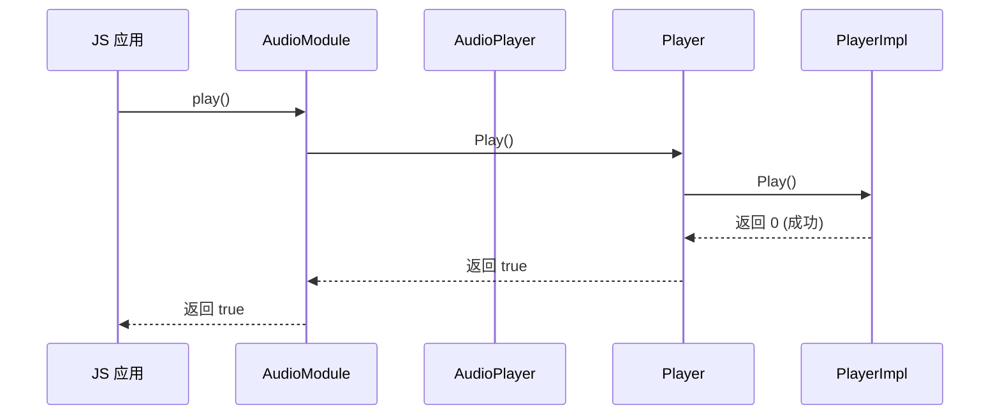
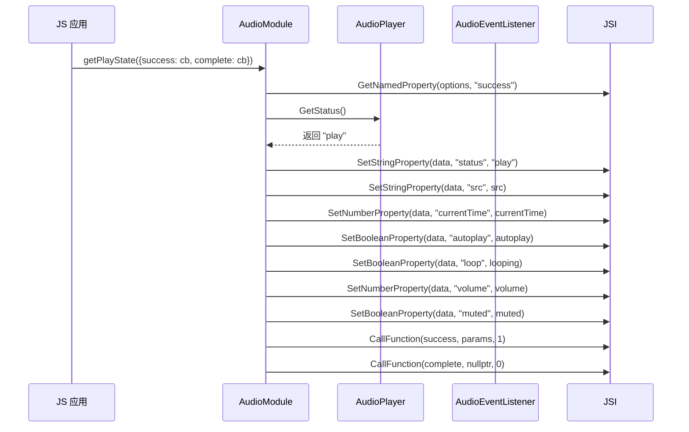
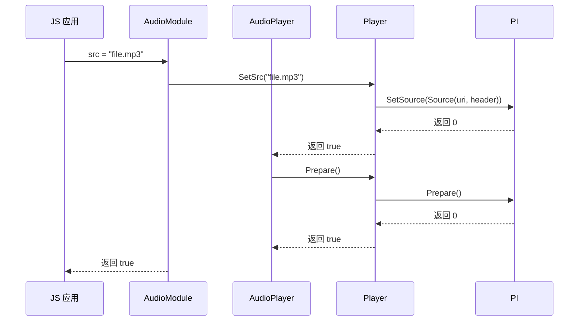

# 对外 JSI（JavaScript Interface）接口

## 目的

本文档介绍 media_lite 项目暴露的 JSI 接口，包括 API 清单表、参数校验、调用链和错误处理。

## 适用范围

- 适用于 JS/应用开发者
- 适用于理解 JS 绑定机制的框架开发者
- 仅涵盖 Player 模块（Recorder 无 JS 绑定）

---

## API 清单表

### 方法列表

| JS API 名称 | C++ 实现函数 | 所在文件:行 | 类型 | 参数 | 返回值 | 说明 |
|-------------|-------------|------------|------|------|--------|------|
| `play()` | `AudioModule::Play` | audio_module.cpp:46 | 同步 | 无 | boolean | 开始或恢复播放 |
| `pause()` | `AudioModule::Pause` | audio_module.cpp:51 | 同步 | 无 | boolean | 暂停播放 |
| `stop()` | `AudioModule::Stop` | audio_module.cpp:56 | 同步 | 无 | boolean | 停止播放 |
| `getPlayState()` | `AudioModule::GetPlayState` | audio_module.cpp:61 | 异步（callback） | options 对象 | undefined | 获取播放状态 |

### 属性列表

| JS API 名称 | C++ 实现函数 | 所在文件:行 | 类型 | 读写 | 参数类型 | 返回值类型 | 说明 |
|-------------|-------------|------------|------|------|----------|--------|------|
| `src` | `AudioModule::SrcGetter` / `SrcSetter` | audio_module.cpp:99 / 105 | 属性 | 读写 | string / string | string / boolean | 播放源 URI |
| `currentTime` | `AudioModule::CurrentTimeGetter` / `CurrentTimeSetter` | audio_module.cpp:115 / 120 | 属性 | 读写 | number / number | number / boolean | 当前播放位置（秒） |
| `duration` | `AudioModule::DurationGetter` / `DurationSetter` | audio_module.cpp:131 / 137 | 属性 | 只读 | - / string | number | 媒体总时长（秒），只读 |
| `autoplay` | `AudioModule::AutoPlayGetter` / `AutoPlaySetter` | audio_module.cpp:142 / 147 | 属性 | 读写 | boolean / boolean | boolean / boolean | 自动播放 |
| `loop` | `AudioModule::LoopGetter` / `LoopSetter` | audio_module.cpp:157 / 162 | 属性 | 读写 | boolean / boolean | boolean / boolean | 循环播放 |
| `volume` | `AudioModule::VolumeGetter` / `VolumeSetter` | audio_module.cpp:173 / 178 | 属性 | 读写 | number / number | number / boolean | 音量（0-1） |
| `muted` | `AudioModule::MutedGetter` / `MutedSetter` | audio_module.cpp:188 / 193 | 属性 | 读写 | boolean / boolean | boolean / boolean | 静音 |

### 事件回调列表

| JS API 名称 | C++ 实现函数 | 所在文件:行 | 类型 | 参数类型 | 触发时机 |
|-------------|-------------|------------|------|----------|----------|
| `onplay` | `AudioModule::OnPlayGetter` / `OnPlaySetter` | audio_module.cpp:203 / 208 | 事件 | function | 播放开始时触发 |
| `onpause` | `AudioModule::OnPauseGetter` / `OnPauseSetter` | audio_module.cpp:218 / 223 | 事件 | function | 暂停时触发 |
| `onstop` | `AudioModule::OnStopGetter` / `OnStopSetter` | audio_module.cpp:233 / 238 | 事件 | function | 停止时触发 |
| `onloadeddata` | `AudioModule::OnLoadedDataGetter` / `OnLoadedDataSetter` | audio_module.cpp:248 / 253 | 事件 | function | 媒体数据加载完成时触发 |
| `onended` | `AudioModule::OnEndedGetter` / `OnEndedSetter` | audio_module.cpp:263 / 268 | 事件 | function | 播放完成时触发 |
| `onerror` | `AudioModule::OnErrorGetter` / `OnErrorSetter` | audio_module.cpp:278 / 283 | 事件 | function | 错误发生时触发 |
| `ontimeupdate` | `AudioModule::OnTimeUpdateGetter` / `OnTimeUpdateSetter` | audio_module.cpp:293 / 298 | 事件 | function | 播放时间更新时触发（每秒） |

---

## 参数校验与错误码

### 参数数量检查

**位置**：`audio_module.cpp:64-65, 108-109, 122-125, 149-154, 168-172, 184-191, 200-207, 215-230, 242-256, 270-284, 294-307`

**机制**：
```cpp
if (argsSize < 1) {
    MEDIA_ERR_LOG("1 argument is required.");
    return JSI::CreateBoolean(false);
}
```

### 对象类型检查

**位置**：`audio_module.cpp:69-71, 74-75, 84-86, 95-97, 118-119`

**机制**：
```cpp
JSIValue options = args[0];
if (!JSI::ValueIsObject(options)) {
    MEDIA_ERR_LOG("invalid parameter.");
    return JSI::CreateBoolean(false);
}
```

### 函数类型检查

**位置**：`audio_module.cpp:111, 127, 143, 158, 169, 184, 199, 214, 229, 244, 259, 274, 289, 304`

**机制**：
```cpp
JSIValue callback = args[0];
if (!JSI::ValueIsFunction(callback)) {
    MEDIA_ERR_LOG("a function is required.");
    return nullptr;
}
```

### 值范围检查

**位置**：`audio_module.cpp:463-465, 496-500, 512`

**currentTime 范围检查**：
```cpp
if (currentTime < 0) {
    MEDIA_ERR_LOG("currentTime must be larger than or equals 0.");
    return false;
}
```

**volume 范围检查**：
```cpp
if (volume < 0 || volume > 1) {
    MEDIA_ERR_LOG("invalid parameter.");
    return false;
}
```

### 错误码与异常封装

**错误日志宏**：
- `MEDIA_ERR_LOG()` - 记录错误
- `MEDIA_WARNING_LOG()` - 记录警告
- `MEDIA_DEBUG_LOG()` - 记录调试信息

**返回值类型**：
- `JSI::CreateBoolean(false)` - 方法失败
- `JSI::CreateError(JsiErrorType::JSI_ERROR_COMMON, "...")` - 创建错误对象
- `JSI::CreateUndefined()` - 无返回值

**duration 只读属性**：
```cpp
JSIValue AudioModule::DurationSetter(const JSIValue thisVal, const JSIValue *args, uint8_t argsSize)
{
    return JSI::CreateError(JsiErrorType::JSI_ERROR_COMMON, "duration is readonly.");
}
```

---

## 调用链示例

### 播放器调用链

#### 同步调用：play()



#### 异步调用：getPlayState()



#### 属性设置：src



---

## 权限与前置条件

### 权限要求

| API | 所需权限 | 位置 |
|-----|----------|--------|
| `play()` | `ohos.permission.MODIFY_AUDIO_SETTINGS`, `ohos.permission.READ_MEDIA` | frameworks/player_lite/binder/player.cpp:58-71 |
| `pause()` | `ohos.permission.MODIFY_AUDIO_SETTINGS` | 同上 |
| `stop()` | `ohos.permission.MODIFY_AUDIO_SETTINGS` | 同上 |
| `src` (setter) | `ohos.permission.READ_MEDIA` | 同上 |
| `currentTime` (setter) | `ohos.permission.MODIFY_AUDIO_SETTINGS` | 同上 |
| `volume` (setter) | `ohos.permission.MODIFY_AUDIO_SETTINGS` | 同上 |
| `muted` (setter) | `ohos.permission.MODIFY_AUDIO_SETTINGS` | 同上 |

### 前置条件

- **播放前**：必须先调用 `src` 属性设置播放源
- **pause 前**：播放器必须处于播放状态
- **stop 前**：无前置条件
- **属性读取**：无前置条件

---

## 稳定性与可替换性

### 稳定接口

| 接口 | 稳定性 | 证据 |
|------|--------|------|
| JSI 导出方法 | 稳定 | `InitAudioModule()` 函数签名固定 |
| Player C++ 接口 | 稳定 | 定义在 `interfaces/kits/player_lite/player.h` |
| PlayerCallback | 稳定 | 虚基类，用于回调 |

### 不稳定接口（内部实现细节）

| 模块 | 说明 | 原因 |
|------|------|------|
| PlayerImpl | 内部实现类，可能随版本变化 | 直接链接 histreamer 或通过 IPC 调用服务 |
| RecorderImpl | 内部实现类 | 服务端实现，可能随硬件 SDK 变化 |
| AudioPlayer | JSI 封装类，管理事件监听器 | 内部线程模型可能调整 |

---

## 相关跳转

- [项目概览](00_Overview.md)
- [目录结构与模块职责](01_Directory_Structure.md)
- [架构说明](02_Architecture.md)
- [内部 API](04_Inner_API.md)
- [常见问题](08_FAQ.md)
