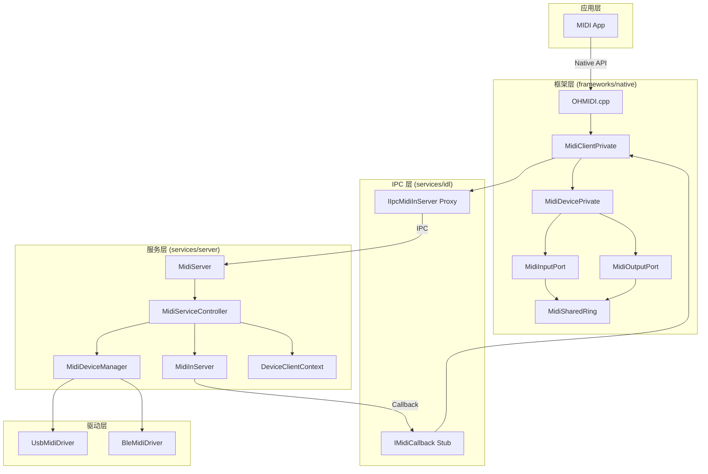
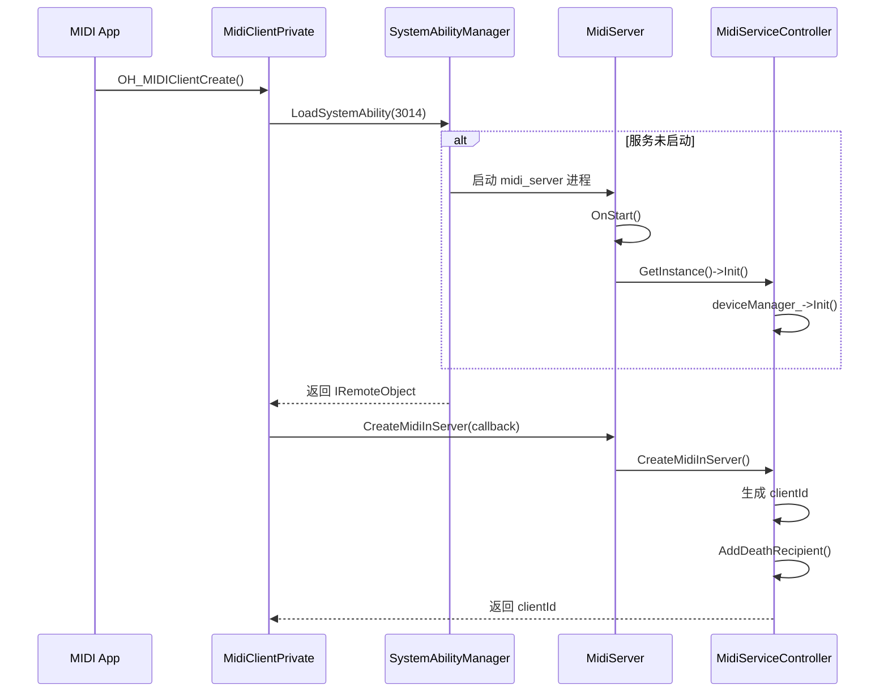
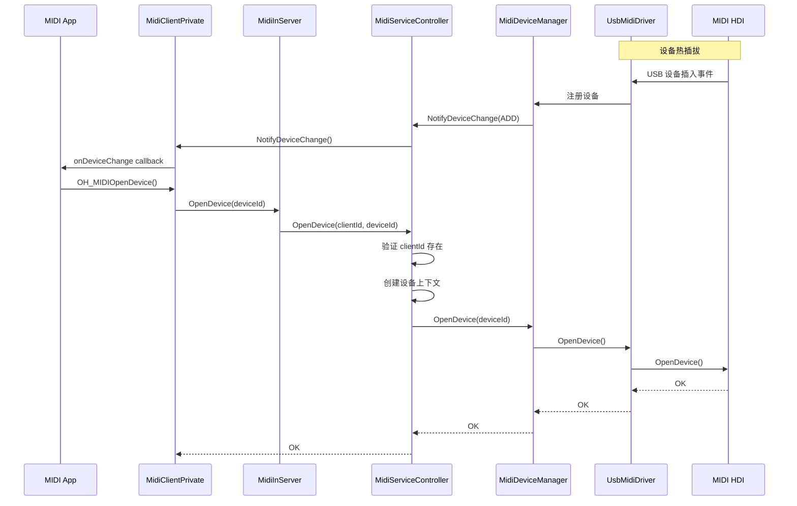
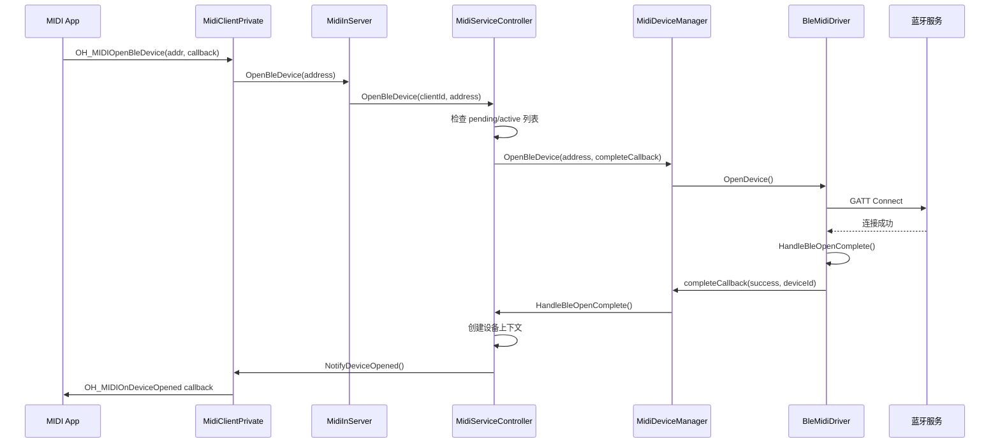
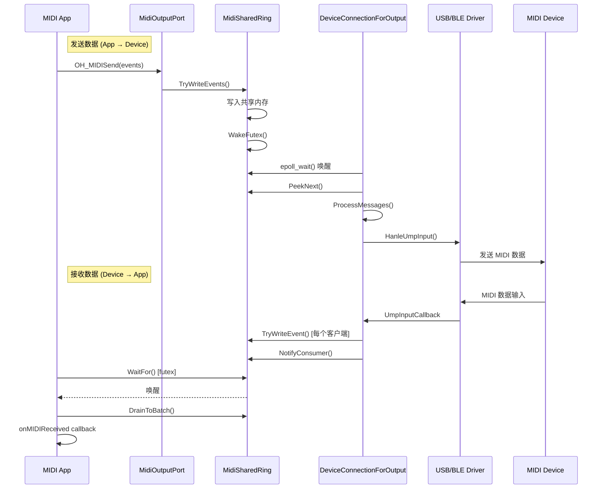

# 架构与数据流 (Architecture)

## 1. 组件架构图



---

## 2. 关键交互流程

### 2.1 服务按需启动与生命周期



**代码位置:**
- `services/server/src/midi_service_controller.cpp:127-159`
- `services/server/src/midi_service_controller.cpp:98-125`

---

### 2.2 USB 设备发现与打开



**代码位置:**
- `services/server/src/midi_service_controller.cpp:185-213`
- `services/server/src/midi_device_mananger.cpp`

---

### 2.3 BLE 设备异步打开



**代码位置:**
- `services/server/src/midi_service_controller.cpp:215-321`

---

### 2.4 端口数据收发 (共享内存)



**代码位置:**
- `services/common/include/midi_shared_ring.h`
- `services/server/include/midi_device_connection.h`

---

## 3. 线程模型

### 3.1 客户端线程

| 线程 | 来源 | 职责 |
|------|------|------|
| **主线程** | App | API 调用、事件处理 |
| **ReceiverThread** | `MidiInputPort` | futex 等待，接收服务端数据 |
| **CallbackThread** | `MidiDevicePrivate` | 分发设备热插拔回调 |

### 3.2 服务端线程

| 线程 | 来源 | 职责 |
|------|------|------|
| **主线程** | `midi_server` | IPC 请求处理 |
| **OutputWorker** | `DeviceConnectionForOutput` | epoll 事件循环，发送数据到设备 |
| **UnloadThread** | `MidiServiceController` | 延迟卸载定时器 |
| **DeathNotify** | IPC 框架 | 客户端死亡通知处理 |

### 3.3 同步机制

```
共享内存同步:
┌─────────────────────────────────────┐
│  ControlHeader (64 bytes)           │
│  ├─ readPosition: atomic<uint32>   │
│  ├─ writePosition: atomic<uint32>  │
│  ├─ capacity: uint32                │
│  └─ futexObj: atomic<uint32>       │
├─────────────────────────────────────┤
│  Ring Buffer Data                   │
│  [ShmMidiEventHeader + payload]...  │
└─────────────────────────────────────┘

写入方: 更新 writePosition → WakeFutex()
读取方: WaitFor(futex) → 读取 → 更新 readPosition
```

**代码位置:** `services/common/include/midi_shared_ring.h:34-52`

---

## 4. 信任边界

```
┌─────────────────────────────────────────────────────────────┐
│                    应用进程 (低权限)                          │
│  ┌─────────────┐  ┌─────────────────────────────────────┐   │
│  │  MIDI App   │  │  libohmidi.so (Native Framework)    │   │
│  │  (Sandbox)  │  │  - MidiClientPrivate                │   │
│  └──────┬──────┘  │  - MidiDevicePrivate                │   │
│         │         │  - MidiSharedRing (Client View)     │   │
└─────────┼─────────┴─────────────────────────────────────┘───┘
          │ IPC (Binder)
┌─────────▼───────────────────────────────────────────────────┐
│                  服务进程 (system 权限)                       │
│  ┌──────────────────────────────────────────────────────┐   │
│  │  midi_server                                          │   │
│  │  - MidiServiceController (全局状态管理)                │   │
│  │  - MidiDeviceManager (设备枚举和驱动管理)              │   │
│  │  - MidiSharedRing (Server View, 内存分配)             │   │
│  │  - 访问 USB/BLE 驱动、/dev/snd/* 设备节点             │   │
│  └──────────────────────────────────────────────────────┘   │
└─────────────────────────────────────────────────────────────┘
          │ HDI / HAL
┌─────────▼───────────────────────────────────────────────────┐
│                     内核/驱动层                              │
│  ┌──────────────┐  ┌──────────────┐  ┌──────────────┐      │
│  │  USB Driver  │  │  BLE Driver  │  │  ALSA/HDI    │      │
│  └──────────────┘  └──────────────┘  └──────────────┘      │
└─────────────────────────────────────────────────────────────┘
```

**关键边界:**
1. **App ↔ Framework**: Native API 调用
2. **Framework ↔ Service**: IPC Binder 通信
3. **Service ↔ Driver**: HDI 接口 / 蓝牙服务

---

## 5. 关键数据结构

### 5.1 设备信息

```cpp
// interfaces/kits/c/midi/native_midi_base.h:241-274
struct OH_MIDIDeviceInformation {
    int64_t midiDeviceId;           // 设备唯一ID
    OH_MIDIDeviceType deviceType;   // USB=0, BLE=1
    OH_MIDIProtocol nativeProtocol; // PROTOCOL_1_0 / PROTOCOL_2_0
    char productName[256];          // 产品名称
    char vendorName[256];           // 厂商名称
    char deviceAddress[64];         // 物理地址
};
```

### 5.2 MIDI 事件

```cpp
// interfaces/kits/c/midi/native_midi_base.h:215-234
struct OH_MIDIEvent {
    uint64_t timestamp;  // 纳秒级时间戳
    size_t length;       // UMP 字数 (1-4)
    uint32_t *data;      // UMP 数据指针
};
```

### 5.3 共享内存事件头

```cpp
// services/common/include/midi_shared_ring.h:47-51
struct ShmMidiEventHeader {
    uint64_t timestamp;
    uint32_t length;     // payload 长度
    uint32_t flags;      // SHM_EVENT_FLAG_WRAP 等
};
```

---

*下一章: [03_CodeMap.md](03_CodeMap.md) - 目录结构与代码地图*
